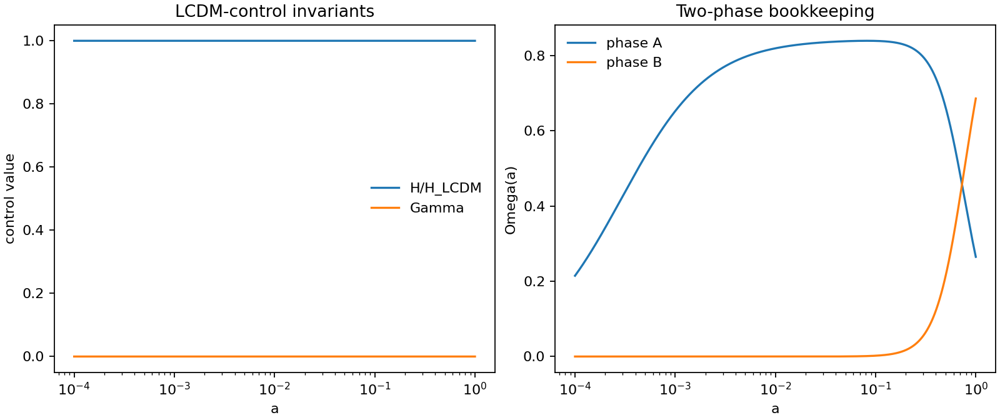

# Result 000: Zero-Transfer LCDM Baseline

Date: 2026-06-08

## Question

Does the implemented two-phase QFUDS background reduce to the LCDM control case when phase transfer is turned off?

## Scope

This is a background-only control run. It does not test perturbations, CMB spectra, matter power, survey likelihoods, novelty, or foam microphysics.

## Command

```bash
python3 scripts/run_minimal_model.py --gamma0 0 --beta 0
```

The same path is covered by `tests/test_gamma_v03.py`.

## Parameters

```text
gamma_model = powerlaw
gamma0 = 0
beta = 0
H0 = 67.4
Omega_b0 = 0.0493
Omega_r0 = 9.2e-5
Omega_A0 = 0.2649
Omega_Bfoam0 = 0.6858
```

## Outputs

- `outputs/qfuds_gamma0_beta0.csv`
- `outputs/qfuds_gamma0_beta0.png`
- `outputs/figures/result000_lcdm_baseline.png`
- `outputs/figures/result000_lcdm_baseline.svg`

## Figure



This figure records the null-limit check visually. The left panel shows the two
invariants that must hold for the control run: `H/H_LCDM = 1` and
`Gamma(a) = 0`. The right panel shows the intended bookkeeping split: phase A
behaves like pressureless matter while phase B remains the vacuum-like
component. The figure is not evidence for QFUDS novelty; it is evidence that
later nonzero-transfer runs have a clean LCDM baseline.

The original full diagnostic plot is also retained:


## Result

The zero-transfer path is the exact LCDM-limit control case for this background toy model.

With `Gamma(a)=0`, phase A scales as pressureless matter and phase B remains constant. This confirms that the implementation has the intended null limit.

## Decision

Keep this run as the regression baseline for every later background, growth, perturbation, and Boltzmann-code comparison.

This is not a new QFUDS prediction. It is useful precisely because it shows that the model collapses to LCDM when the transfer law is removed.

## Next Test

Every nonzero transfer law must be compared against this baseline and must state which test it has actually passed. Passing this baseline does not establish CMB viability or matter-power viability.
