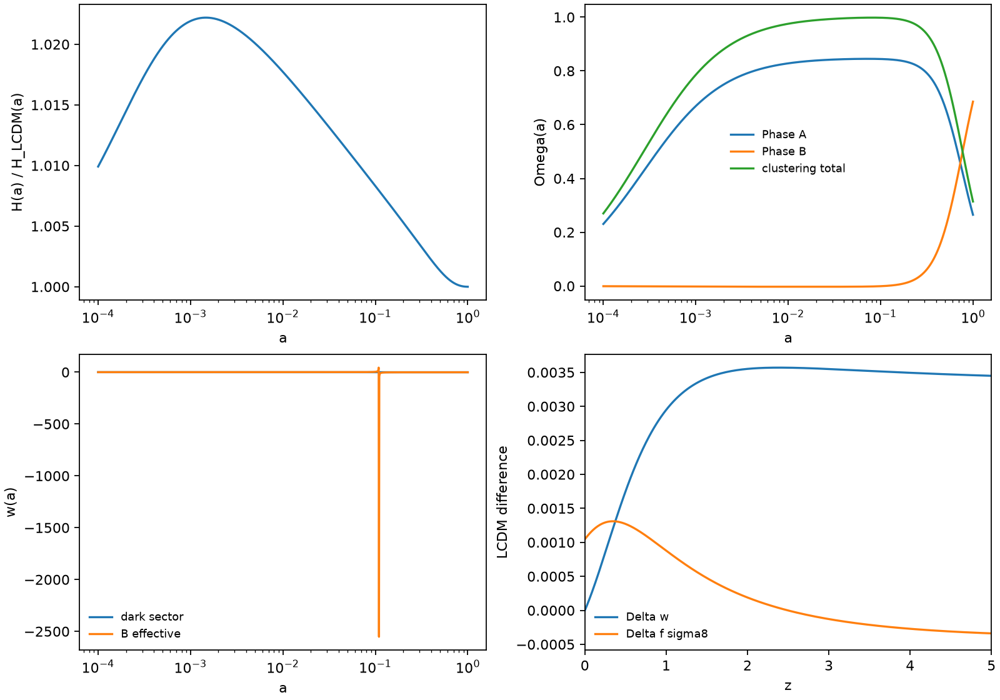
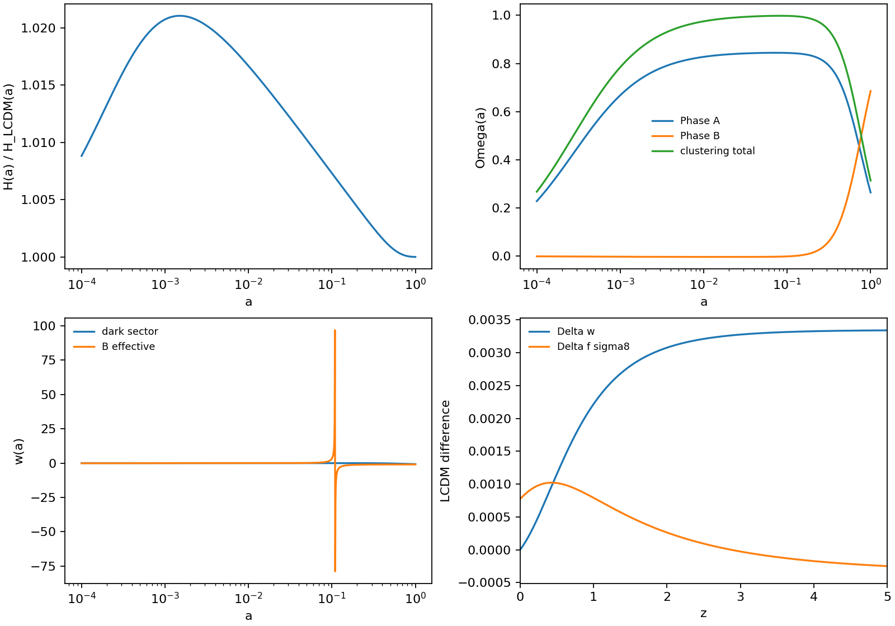
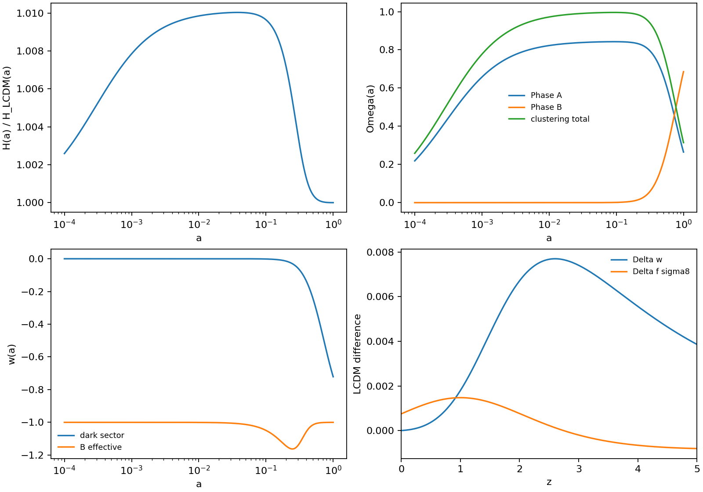
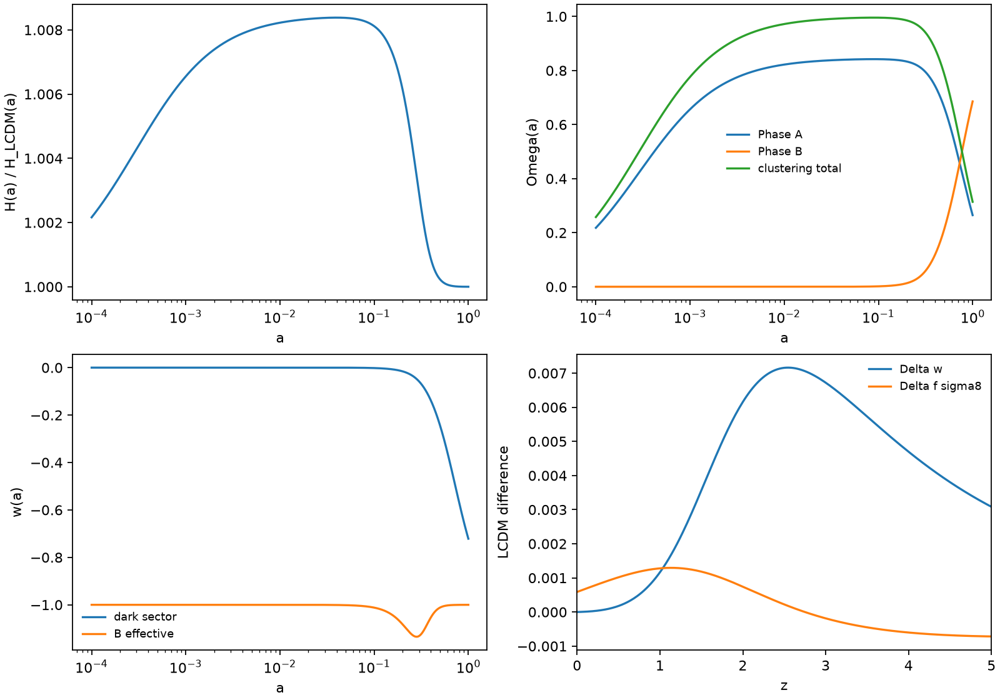
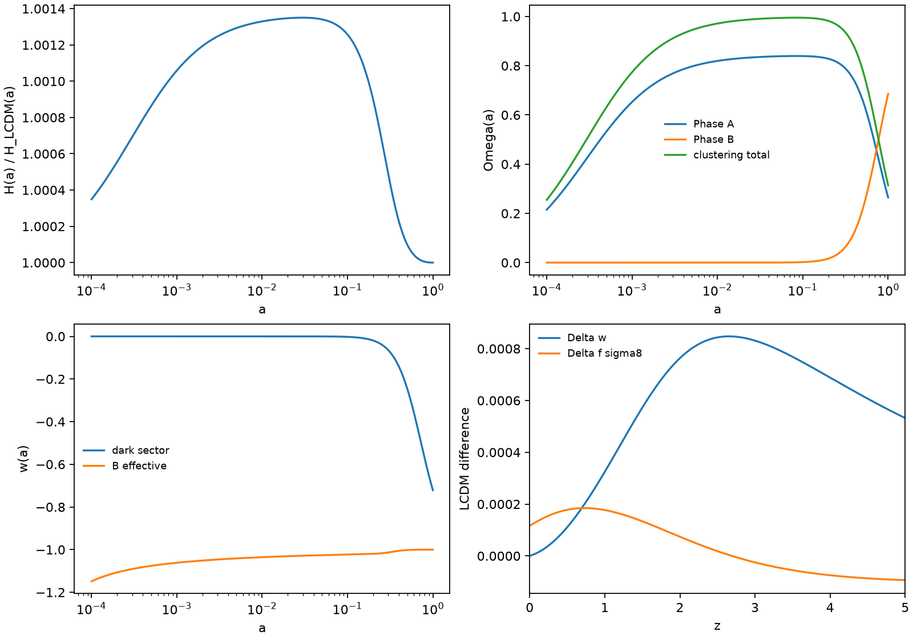

# Result 001: Gamma-Law Background Scan

Date: 2026-06-08

## What Did We Learn?

The first useful constraint on `Gamma(a)` is timing. A transfer law that is active during matter domination can destroy the background history when integrated backward from present-day densities. Low-redshift gated transfer is safer at background level.

The scan also confirmed a conceptual limit:

```text
free Gamma(a) -> ordinary interacting dark energy
Gamma(a)=0    -> LCDM
```

Therefore QFUDS needs a physically fixed transfer law, not only a fitted one.

## Model Tested

The background equations are:

```math
\frac{d\rho_A}{d\ln a}+3\rho_A=-\Gamma(a)\rho_A,
\qquad
\frac{d\rho_B}{d\ln a}=\Gamma(a)\rho_A.
```

The scan tested these `Gamma(a)` families:

- constant transfer;
- power-law late-time gate;
- ungated growth-driven transfer;
- collapsed-fraction toy gate;
- horizon-entropy gate;
- black-hole-entropy proxy;
- star-formation proxy.

## Figures

Representative failed laws:





Representative surviving background candidates:







## Did The Model Survive?

Only in a narrow background-level sense.

- The zero-transfer model survives because it is LCDM.
- Power-law and horizon-entropy-gated laws survive as ordinary interacting dark-energy examples.
- Collapsed-fraction, black-hole-entropy, and star-formation proxies survive the minimal background checks and remain worth testing.
- Constant and ungated growth-driven transfer fail at the tested amplitudes.

No experiment 001 result establishes perturbation stability, CMB viability, or novelty.

## Viability Table

| Law | Parameters | Result | Classification |
| --- | --- | --- | --- |
| LCDM limit | `gamma0=0` | passes as control | trivial LCDM |
| constant | `gamma0=0.01` | fails positivity and CMB-era `H(a)` deviation | rejected |
| power law | `gamma0=0.03`, `beta=5` | passes minimal checks | standard interacting dark energy |
| growth driven | `gamma0=0.01` | fails positivity and CMB-era `H(a)` deviation | rejected |
| collapsed fraction toy | `gamma0=0.03` | passes minimal background checks | candidate shape for later scrutiny |
| horizon entropy | `gamma0=0.03`, `beta=4` | passes minimal checks | standard interacting dark energy unless derived |
| black-hole entropy proxy | `gamma0=0.03` | passes minimal background checks | candidate shape for later scrutiny |
| star-formation proxy | `gamma0=0.003` | passes minimal background checks | candidate shape for later scrutiny |

The candidate label means only "worth testing next." It does not mean novel or observationally viable.

## Why?

The failing laws are too active too early. They can produce negative `rho_B` when the present-day boundary condition is integrated backward and can move `H(a)` away from the LCDM-like early universe.

The surviving toy laws are mostly low-redshift gates. They leave the early universe close to LCDM and defer transfer until structure formation, black-hole growth, or star formation becomes significant.

## What Failed?

1. Constant transfer with `gamma0=0.01`.
2. Ungated growth-driven transfer with `gamma0=0.01`.
3. Any claim that background-level survival proves QFUDS as a new theory.
4. Any claim that black-hole or star-formation proxies are derived microphysics.

## What Became The Next Target?

The next target is not more background scanning. The later QFUDS v0.15 /
Level 1.5 audit inserted a phase-transfer physicality gate before any
perturbation-level specification:

1. define phase-A perturbations;
2. define whether phase B is exactly smooth;
3. define transfer perturbations `delta_Q`;
4. identify stability and sound-speed conditions;
5. implement the surviving candidates in CLASS or CAMB;
6. compare CMB and matter power against LCDM.

Evidence:

- `docs/03_experiments/010_exp_001_gamma_scan.md`
- `outputs/qfuds_*gamma*.csv`
- `tests/test_gamma_v03.py`

## Full Technical Analysis

## 1. Executive Summary

This experiment 001 step tests whether the phase-transfer rate `Gamma(a)` can be tied to a physical quantity instead of used as an arbitrary fitting function.

Previous step: QFUDS was mapped against LCDM, unified dark fluids, k-essence, and interacting dark energy. The result was negative for novelty: with `Gamma=0`, QFUDS is exactly LCDM; with free `Gamma(a)`, it is a standard interacting dark-sector model.

This step asks what kind of `Gamma(a)` is needed for QFUDS not to collapse into those existing models. The answer is restrictive:

1. Constant or growth-driven transfer is too active in the early universe unless its amplitude is tiny.
2. Low-redshift gated transfer can keep the CMB-era background close to LCDM.
3. Black-hole entropy, collapsed fraction, and star-formation proxies are the most useful toy laws because they naturally peak after structure formation begins.
4. None of these laws proves QFUDS novel. In experiment 001 they are physically labeled interacting-vacuum models.

The strongest surviving target is not "Gamma is fitted by hand." It is:

```math
\Gamma(a)=\gamma_0\,F_{\rm phys}(a)
```

where `F_phys(a)` is fixed by a growth, collapse, horizon, black-hole, or star-formation variable before fitting `gamma0`.

## 2. What Changed Since v0.2

v0.2 established the minimal two-phase dark sector:

```math
\rho_{\rm dark}=\rho_A+\rho_B,\qquad
w_A\simeq 0,\qquad c_{s,A}^2\simeq0,\qquad w_B=-1.
```

experiment 001 adds multiple `Gamma(a)` modules and evaluates them with the same background and growth diagnostics:

- `gamma_constant`
- `gamma_powerlaw`
- `gamma_growth_driven`
- `gamma_collapsed_fraction_toy`
- `gamma_horizon_entropy`
- `gamma_black_hole_entropy_proxy`
- `gamma_star_formation_proxy`

All black-hole, collapse, and star-formation laws in this repository are toy proxies. They are not observationally validated input histories.

## 3. Candidate Gamma(a) Laws

The background equations are:

```math
\frac{d\rho_A}{d\ln a}+3\rho_A=-\Gamma(a)\rho_A,
\qquad
\frac{d\rho_B}{d\ln a}=\Gamma(a)\rho_A.
```

The general solution is:

```math
\rho_A(a)=\rho_{A0}a^{-3}
\exp\left[-\int_1^a \Gamma(\tilde a)\,d\ln\tilde a\right],
```

```math
\rho_B(a)=\rho_{B0}+\int_1^a
\Gamma(\tilde a)\rho_A(\tilde a)\,d\ln\tilde a.
```

The Friedmann equation remains GR:

```math
H^2(a)=H_0^2[
\Omega_r a^{-4}+\Omega_b a^{-3}+\rho_A(a)+\rho_B(a)].
```

The interacting-vacuum effective equation of state is:

```math
w_{B,\rm eff}(a)=-1-\frac{\Gamma(a)\rho_A(a)}{3\rho_B(a)}.
```

This can look phantom-like without a fundamental phantom field because it is an effective description of energy transfer.

### Constant

```math
\Gamma(a)=\gamma_0.
```

Interpretation: phenomenological constant conversion from phase A to phase B. This is not physically distinctive. It is a standard interacting-vacuum model and usually unsafe unless `gamma0` is extremely small.

### Power Law

```math
\Gamma(a)=\gamma_0 a^\beta.
```

Interpretation: phenomenological late-time gate when `beta>0`. This keeps the LCDM limit clean and can avoid early dark energy, but it is still a chosen fitting shape unless `beta` is derived.

### Growth Driven

```math
\Gamma(a)=\gamma_0 \frac{d\ln D}{d\ln a}
\simeq \gamma_0 \Omega_m(a)^{0.55}.
```

Interpretation: transfer responds to linear structure growth. The problem is that `d ln D / d ln a` is near unity during matter domination, so ungated transfer is active too early.

### Collapsed Fraction Toy

```math
f_{\rm coll}(a)=\frac{1}{1+(a_c/a)^\nu},
\qquad
\Gamma(a)=\gamma_0
\frac{d f_{\rm coll}/d\ln a}{\nu/4}.
```

Interpretation: transfer turns on when matter collapses into nonlinear structures. This is a useful toy proxy because it is naturally low at early times and peaked near `a_c`.

### Horizon Entropy

For apparent-horizon entropy:

```math
S_H\propto H^{-2},
\qquad
\frac{d\ln S_H}{d\ln a}=-2\frac{d\ln H}{d\ln a}.
```

The implemented gated toy law is:

```math
\Gamma(a)=\gamma_0 a^\beta
\max\left(0,-\frac{1}{2}\frac{d\ln H}{d\ln a}\right).
```

Interpretation: transfer tracks horizon information growth. The ungated entropy derivative is nonzero in radiation and matter eras, so the gate is not optional if CMB safety is required.

### Black-Hole Entropy Proxy

The implemented proxy uses the same logistic derivative shape as collapsed fraction:

```math
\Gamma(a)\propto \frac{dS_{\rm BH}^{\rm toy}}{d\ln a}.
```

Interpretation: total cosmological black-hole entropy grows mainly after structure and SMBH formation. This is the most QFUDS-like proxy, but it remains a proxy until tied to an actual black-hole mass and accretion history.

### Star-Formation / SMBH-Growth Proxy

The implemented proxy uses the Madau-Dickinson cosmic star-formation-rate shape:

```math
{\rm SFR}(z)\propto
\frac{(1+z)^{2.7}}{1+[(1+z)/2.9]^{5.6}},
\qquad z=a^{-1}-1.
```

The code normalizes this shape so that `max Gamma = gamma0`.

Interpretation: transfer follows baryonic star formation or SMBH accretion history. This is observationally motivated in shape, but it risks becoming an empirical fit proxy rather than a foam-derived law.

## 4. Numerical Implementation Summary

Implemented modules:

- `qfuds/gamma_laws.py`: Gamma-law definitions and dispatch.
- `qfuds/background.py`: generalized phase-transfer background integration, including `Gamma(a)` and `w_Bfoam_eff`.
- `qfuds/diagnostics.py`: LCDM comparison, `f sigma8` proxy, viability flags, and hostile classification.
- `scripts/run_minimal_model.py`: `--gamma-model` and `--exp-001-gamma-scan` runner.
- `tests/test_gamma_v03.py`: LCDM limit, finite-array, positivity, and viability-flag checks.

Diagnostics written to CSV:

- `rho_A(a)`, `rho_B(a)`
- `Omega_A(a)`, `Omega_B(a)`
- `H(a)/H_LCDM(a)`
- `w_dark(a)`, `w_B,eff(a)`
- `D(a)`, `f(a)`, `f sigma8` proxy
- `Delta w(a)` and `Delta f sigma8(a)` relative to LCDM

## 5. Plots / Output Files Produced

Generated CSV and PNG outputs:

- `outputs/qfuds_gamma0_beta0.csv`
- `outputs/qfuds_gamma0_beta0.png`
- `outputs/qfuds_gamma0.03_beta5.csv`
- `outputs/qfuds_gamma0.03_beta5.png`
- `outputs/qfuds_constant_gamma0.01_beta0.csv`
- `outputs/qfuds_constant_gamma0.01_beta0.png`
- `outputs/qfuds_growth_driven_gamma0.01_beta0.csv`
- `outputs/qfuds_growth_driven_gamma0.01_beta0.png`
- `outputs/qfuds_collapsed_fraction_toy_gamma0.03_beta0.csv`
- `outputs/qfuds_collapsed_fraction_toy_gamma0.03_beta0.png`
- `outputs/qfuds_horizon_entropy_gamma0.03_beta4.csv`
- `outputs/qfuds_horizon_entropy_gamma0.03_beta4.png`
- `outputs/qfuds_black_hole_entropy_proxy_gamma0.03_beta0.csv`
- `outputs/qfuds_black_hole_entropy_proxy_gamma0.03_beta0.png`
- `outputs/qfuds_star_formation_proxy_gamma0.003_beta0.csv`
- `outputs/qfuds_star_formation_proxy_gamma0.003_beta0.png`

## 6. Viability Table

| Law | Parameters | Positivity | Early B | CMB-era H | Growth | Classification |
| --- | --- | --- | --- | --- | --- | --- |
| LCDM limit | `gamma0=0` | pass | pass | pass | pass | A. trivial LCDM |
| constant | `gamma0=0.01` | fail, negative `rho_B` | fail by positivity | fail, max `|H/H_LCDM-1|=0.0219` | pass | D. observationally dead |
| power law | `gamma0=0.03`, `beta=5` | pass | pass | pass, max `0.0020` | pass | B. interacting dark energy |
| growth driven | `gamma0=0.01` | fail, negative `rho_B` | fail by positivity | fail, max `0.0207` | pass | D. observationally dead |
| collapsed fraction toy | `gamma0=0.03` | pass | pass | pass, max `0.0078` | pass | E. potentially interesting |
| horizon entropy | `gamma0=0.03`, `beta=4` | pass | pass | pass, max `0.0009` | pass | B. interacting dark energy |
| black-hole entropy proxy | `gamma0=0.03` | pass | pass | pass, max `0.0065` | pass | E. potentially interesting |
| star-formation proxy | `gamma0=0.003` | pass | pass | pass, max `0.0011` | pass | E. potentially interesting |

The "E" classification means only "worth testing next." It does not mean novel.

## 7. Failure Modes

1. If `Gamma(a)` is free, QFUDS is just interacting dark energy.
2. If `Gamma(a)` is nonzero during matter domination, it can make early `rho_B` negative when integrated back from today's boundary conditions.
3. If horizon entropy is ungated, it is active in the radiation and matter eras and risks CMB constraints.
4. If the star-formation or black-hole proxy is tuned after looking at `w(z)`, it becomes empirical curve fitting.
5. If phase B perturbations remain unspecified, the model is incomplete for CLASS/CAMB and cannot claim CMB viability.
6. If the same medium is treated as a single adiabatic fluid, sound-speed constraints can kill structure formation.

## 8. Most Promising Gamma(a)

The most promising experiment 001 direction is a low-redshift entropy/collapse law:

```math
\Gamma(a)\propto \frac{dS_{\rm BH}}{d\ln a}
```

or, as a toy precursor,

```math
\Gamma(a)\propto \frac{df_{\rm coll}}{d\ln a}.
```

Reason: these laws are naturally quiet before structure formation, can preserve the early LCDM background, and create a correlated change in effective `w(z)` and growth. This is the right place to look for a falsifiable QFUDS-specific signature:

```math
\Delta f\sigma_8(z)=F[\Delta w(z)]
```

with no extra free shape function.

## 9. Next Steps Toward CLASS/CAMB Integration

1. Keep `gamma0=0` as the regression target. It must reproduce LCDM spectra.
2. Implement only one low-redshift law first, preferably black-hole entropy proxy or collapsed-fraction proxy.
3. Add perturbation transfer terms instead of using only the background effective `w(a)`.
4. Specify whether phase B is exactly smooth or has dark-energy-fluid perturbations.
5. Compare against background-only BAO/SN before full CMB spectra.
6. Use full CLASS/CAMB only after the toy model passes positivity, early-B, CMB-era H, and growth checks.
