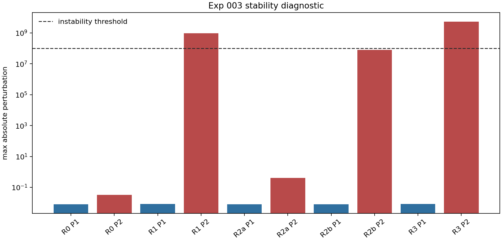
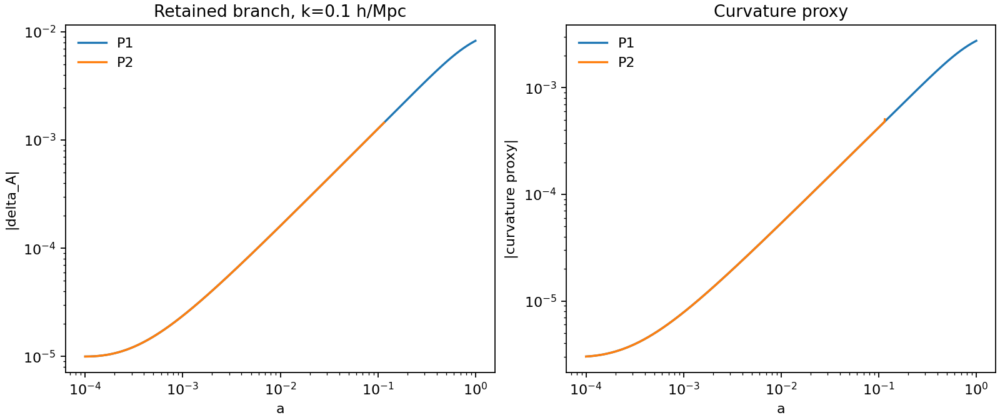

# Result 003: Phenomenological Perturbation Closure Audit

Date: 2026-06-08

> Correction notice (2026-06-08): the phase-A and phase-B Euler equations
> originally carried one extra unit of Hubble friction (base constant `2.0`
> instead of `1.0` on the conformal log-derivative). This was found by hostile
> verification against `qfuds/growth.py` and corrected. All diagnostics below
> are the **corrected** values. The original outputs are archived under
> `outputs/postmortem/exp003_friction_bug/`. See the "Friction-Bug Correction"
> section for the old-vs-new comparison and the from-scratch re-evaluation of the
> P1 verdict. The survive/fail classification did not change; the clustering
> diagnostic and instability magnitudes did.

## Executive Verdict

QFUDS can be written as a mathematically closed Level 2A phenomenological
perturbation system only in the interacting-vacuum P1 closure tested here.

The regularized near-vacuum phase-B fluid closure P2 fails at the retained
experiment 002 amplitude:

```text
Gamma(a) = 0.02 * normalized dF_coll/dln(a)
```

P2 becomes unstable for every tested wavenumber:

```text
k = 1e-4, 1e-3, 1e-2, 1e-1 h/Mpc
```

This result does not establish physical QFUDS perturbations. It establishes only
that one phenomenological interacting-vacuum closure can be integrated without
the stability flags used in this audit.

## Scope

This is a perturbation-level stability audit. It does not establish CMB
viability, matter-power consistency, survey-likelihood viability, or physical
QFUDS microphysics.

## What Was Tested

The implemented closure follows the experiment specification:

```text
Gauge: conformal Newtonian
Transfer frame: phase-A-comoving
Q_A^mu = -Q u_A^mu
Q_B^mu = +Q u_A^mu
Q = Hc Gamma(a) rho_A
deltaQ = Q delta_A
deltaGamma = 0
phase A: w_A=0, c_s,A^2=0, sigma_A=0
P1: interacting vacuum, no ordinary theta_B
P2: regularized fluid, w_B=-0.999, c_s,B^2=1, sigma_B=0
```

The implementation is:

```text
qfuds/perturbations.py
```

The runner is:

```bash
python3 scripts/run_minimal_model.py --exp-003-perturbation-closure --outdir outputs
```

This runs the full R0–R3 x P1/P2 suite at the predeclared amplitudes
(R0 `gamma0=0`, R1 `gamma0=0.02`, R2a `gamma0=0.005`, R2b `gamma0=0.01`,
R3 `gamma0=0.04`); `--outdir` defaults to `outputs`.

## Outputs

Primary diagnostics:

```text
outputs/exp003_phenomenological_perturbation_summary.json
outputs/exp003_stability_diagnostics.csv
outputs/figures/exp003_stability_summary.png
outputs/figures/exp003_stability_summary.svg
outputs/figures/exp003_retained_mode_growth.png
outputs/figures/exp003_retained_mode_growth.svg
```

Mode CSV outputs:

```text
outputs/exp003_R0_P1_gamma0.csv
outputs/exp003_R0_P2_gamma0.csv
outputs/exp003_R1_P1_information_production_gamma0.02.csv
outputs/exp003_R1_P2_information_production_gamma0.02.csv
outputs/exp003_R2a_P1_information_production_gamma0.005.csv
outputs/exp003_R2a_P2_information_production_gamma0.005.csv
outputs/exp003_R2b_P1_information_production_gamma0.01.csv
outputs/exp003_R2b_P2_information_production_gamma0.01.csv
outputs/exp003_R3_P1_information_production_gamma0.04.csv
outputs/exp003_R3_P2_information_production_gamma0.04.csv
```

## Visual Diagnostics



This figure is the main visual decision record for Exp 003. The dashed line is
the predeclared instability threshold. P1 remains safely below it for every
tested amplitude, while P2 crosses it at the retained amplitude and again at the
larger stress test. This is why the result keeps only the interacting-vacuum P1
closure as Level 2A phenomenology and rejects the regularized near-vacuum fluid
P2 closure at the retained branch.



This figure focuses on the retained-amplitude run at `k=0.1 h/Mpc`. The P1
curve shows the corrected phase-A growth staying interpretable under the
declared closure. The P2 curve exposes the instability channel that makes the
near-vacuum fluid interpretation unusable at the retained amplitude. The figure
does not establish CMB or matter-power viability; it only visualizes the
stability audit already summarized in the CSV diagnostics.

## Stability Diagnostics

Corrected diagnostics (base friction `1.0`):

| Run | Variant | gamma0 | Unstable? | Unstable modes | Max perturbation | Max curvature proxy |
| --- | --- | ---: | --- | --- | ---: | ---: |
| R0 | P1 | 0 | no | none | 7.959e-3 | 2.653e-4 |
| R0 | P2 | 0 | no | none | 3.212e-2 | 2.653e-4 |
| R1 | P1 | 0.02 | no | none | 8.255e-3 | 2.752e-4 |
| R1 | P2 | 0.02 | yes | all tested k | 9.344e8 | 7.589e-1 |
| R2a | P1 | 0.005 | no | none | 8.032e-3 | 2.677e-4 |
| R2a | P2 | 0.005 | no | none | 4.002e-1 | 2.677e-4 |
| R2b | P1 | 0.01 | no | none | 8.106e-3 | 2.702e-4 |
| R2b | P2 | 0.01 | no flag | none | 7.885e7 | 9.330e-3 |
| R3 | P1 | 0.04 | no | none | 8.559e-3 | 2.853e-4 |
| R3 | P2 | 0.04 | yes | all tested k | 5.323e9 | 3.612e-2 |

The conservation residual column in `outputs/exp003_stability_diagnostics.csv`
is zero for all runs because the implemented transfer is explicitly
antisymmetric between the two dark-sector components.

## Friction-Bug Correction

This section records a hostile-verification finding and its resolution. It is
kept in the result document so the reasoning history is preserved.

### What was found

An independent reproduction confirmed the original outputs bit-for-bit, then
checked whether the phase-A clustering was physical. It was not: the
matter-dominated growing-mode exponent `dln delta_A / dln a` was approximately
0.6 for the most sub-horizon tested mode (k=0.1 h/Mpc), where cold dark matter
requires approximately 1.0 and the repository's own `qfuds/growth.py` gives
approximately 0.97.

### Root cause

Both Euler equations in `qfuds/perturbations.py` used base friction constant
`2.0` added to the conformal log-derivative `dln_hc_dx = 1 + dlnH/dlna`. For the
dimensionless variable `theta/Hc` actually integrated (the continuity equation
uses `d delta/dx = -theta/Hc`), the correct base constant is `1.0`:

```text
correct phase A:  d(theta/Hc)/dx = -(1 + dlnHc/dx)(theta/Hc) + kappa^2 Phi
correct phase B:  d(theta/Hc)/dx = -[(1 - 3 cs_B^2) + dlnHc/dx](theta/Hc) + ...
```

The code carried one extra unit of Hubble friction, over-damping velocities and
suppressing growth. This was inconsistent with both standard fluid perturbation
theory and the repository's validated `qfuds/growth.py` (which correctly uses
`2 + dlnH/dlna = 1 + dlnHc/dx`).

### Old vs new

| Run | Variant | gamma0 | Old unstable | Old max pert | New unstable | New max pert |
| --- | --- | ---: | --- | ---: | --- | ---: |
| R0 | P1 | 0 | no | 8.282e-4 | no | 7.959e-3 |
| R0 | P2 | 0 | no | 8.282e-4 | no | 3.212e-2 |
| R1 | P1 | 0.02 | no | 8.522e-4 | no | 8.255e-3 |
| R1 | P2 | 0.02 | yes | 2.840e9 | yes | 9.344e8 |
| R2a | P1 | 0.005 | no | 8.342e-4 | no | 8.032e-3 |
| R2a | P2 | 0.005 | no | 6.538e-2 | no | 4.002e-1 |
| R2b | P1 | 0.01 | no | 8.401e-4 | no | 8.106e-3 |
| R2b | P2 | 0.01 | no flag | 4.021e7 | no flag | 7.885e7 |
| R3 | P1 | 0.04 | no | 8.766e-4 | no | 8.559e-3 |
| R3 | P2 | 0.04 | yes | 1.432e9 | yes | 5.323e9 |

Phase-A matter-era slope (k=0.1 h/Mpc), `dln delta_A / dln a`:

| Window in a | Buggy | Corrected | `growth.py` reference |
| --- | ---: | ---: | ---: |
| 0.02 - 0.1 | 0.597 | 0.897 | 0.995 |
| 0.1 - 0.5 | 0.582 | 0.881 | 0.971 |
| 0.5 - 1.0 | 0.410 | 0.648 | 0.720 |

### Re-evaluation of the P1 verdict from scratch

The corrected run does **not** kill P1:

- P1 remains numerically stable in every run (R0, R1, R2a, R2b, R3) at every
  tested wavenumber.
- After the fix, phase A clusters with the approximately correct exponent
  (~0.9 in the matter era), so the earlier suspicion that P1 stability was an
  over-damping artifact is removed. The correction *strengthened* P1's survival.
- P2 still fails at the retained `gamma0=0.02` and at `gamma0=0.04` for every
  tested wavenumber. The near-vacuum `1/(1+w_B)` instability is genuine and
  survives the correction.

The bug therefore changed the clustering diagnostic and the instability
magnitudes, not the survive/fail classification. Its real cost was a false
clustering statement: the original document's claim that phase-A clustering loss
was "not triggered for P1" was unjustified under the buggy code, and is only
justified after the correction.

### Residual limitations (not bugs)

P1 "survives" only under the declared phenomenological closure, and these
limitations remain after the correction:

1. The metric potential is an algebraic Newtonian-gauge closure
   (`Phi proportional to -(Omega_A delta_A + Omega_B delta_B)/(kappa^2+3)`),
   not a dynamical constraint. It structurally cannot exhibit the superhorizon
   curvature instability that kills simple interacting dark energy models, so
   failure criterion 1 (unbounded superhorizon curvature growth) is **untested**
   for P1, not passed.
2. The algebraic Poisson source omits baryons, so corrected phase-A growth
   (~0.90) still sits slightly below the `growth.py` reference (~0.97).
3. `deltaGamma = 0` remains a phenomenological gauge-fixed choice, not derived.

These keep P1 firmly at Level 2A phenomenological interacting vacuum. They do not
constitute new failures; they are the boundaries of what this audit established.

## Interpretation

The result is hostile to the regularized phase-B fluid interpretation. The P2
equations contain the expected near-vacuum denominator `1+w_B`; at the retained
amplitude this drives a large instability in all tested modes. This is a real
failure mode for treating phase B as an ordinary nearly-vacuum fluid with a
velocity perturbation.

The P1 interacting-vacuum branch is numerically stable in this audit, including
at `gamma0=0.02` and `gamma0=0.04`. That does not rescue QFUDS as new physics.
It means the branch can be represented as a known-style phenomenological
interacting-vacuum perturbation closure.

The P2 small-amplitude scan also shows a warning sign before the formal
threshold: `gamma0=0.01` reaches a maximum perturbation amplitude of
approximately `7.885e7` in the corrected run (`4.021e7` in the original buggy
run). It was not flagged only because the predeclared instability threshold was
`1e8`. The corrected value sits closer to the threshold, reinforcing that P2 is
marginal even below the retained amplitude.

## Failure Criteria Result

| Criterion | Result |
| --- | --- |
| unbounded superhorizon curvature growth | P2 fails at retained and larger amplitude by large curvature response; for P1 this is **untested**, because the algebraic Newtonian-gauge `Phi` closure cannot carry an independent superhorizon curvature mode |
| negative physical densities | not triggered in this perturbation run |
| singular behavior as `w_B -> -1` | P2 shows the expected near-vacuum instability |
| arbitrary `deltaQ` or transfer-frame dependence | unresolved; only the baseline A-frame closure was tested |
| loss of phase-A clustering behavior | not triggered for P1 after the friction correction (matter-era slope ~0.9, near the `growth.py` reference ~0.97); it *was* degraded (~0.6) under the original buggy code; P2 instability prevents interpretation |
| phase-B clustering incompatible with vacuum pressure | P2 fails by making phase B an unstable ordinary fluid |
| no gauge-consistent interpretation | not killed for the declared Newtonian-gauge P1 closure, but `deltaGamma=0` remains phenomenological |
| equivalence to ordinary interacting vacuum | P1 survives only in this non-novel class |

## Decision

Experiment 003 partially kills the baseline closure:

```text
P2 regularized phase-B fluid: failed at retained amplitude.
P1 interacting vacuum: mathematically closed and stable in this audit.
```

QFUDS may continue only as Level 2A phenomenology under the P1
interacting-vacuum closure. Level 2B remains blocked. No CMB, matter-power, or
survey-likelihood claim is valid from this result.

## Next Gate

Before any CLASS/CAMB work, record that the only stable branch from this audit is
ordinary phenomenological interacting vacuum unless Level 1.5 supplies a
physical transfer derivation.
