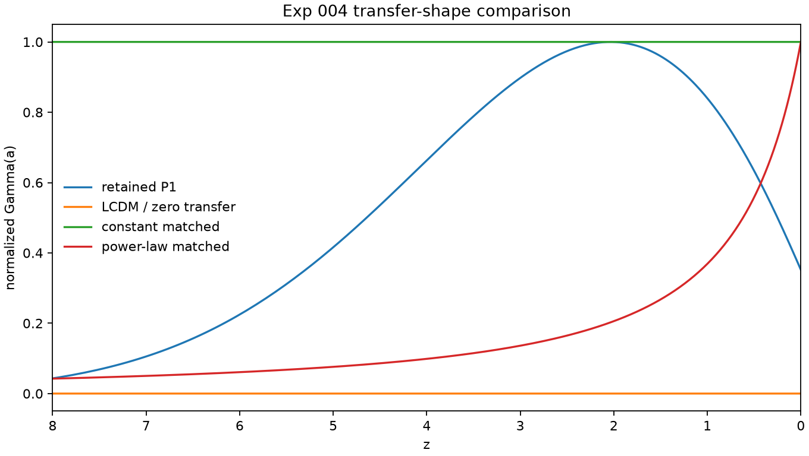
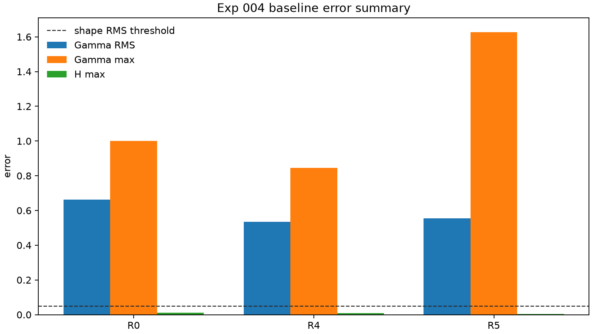

# Result 004: Retained P1 Model-Family Positioning and Equivalence Map

Date: 2026-06-09

## Executive Verdict

Retained P1 is best classified as:

```text
an exact interacting-vacuum instance with a specified time-dependent coupling
Gamma(a), and therefore a subset of generic time-dependent interacting dark
energy under xi(a) = Gamma(a).
```

This is a positioning result, not a novelty or survival verdict. Equivalence to
interacting vacuum is scientifically useful because it places the original QFUDS
intuition inside a known cosmology model family with existing perturbation,
stability, and observational-comparison machinery.

The retained source-shaped `Gamma(a)` remains useful as a phenomenological
transfer-shape prompt. It is not a physical QFUDS derivation.

## Scope

This result establishes a [Level 2A](../wiki/glossary/repository_levels.md) model-family classification for retained P1.

It does not establish:

- physical QFUDS validation;
- physical Level 2B readiness;
- DM-to-DE phase-transition proof;
- CLASS/CAMB viability;
- CMB, matter-power, BAO, supernova, DESI, Euclid, Roman, or likelihood
  viability;
- novelty of QFUDS as a physical theory.

## Evidence

Execution command:

```bash
python3 scripts/run_minimal_model.py --exp-004-p1-positioning --outdir outputs
```

Code paths:

- `scripts/run_minimal_model.py`
- `qfuds/positioning.py`
- `qfuds/background.py`
- `qfuds/gamma_laws.py`
- `qfuds/growth.py`
- `qfuds/perturbations.py`

Primary outputs:

```text
outputs/exp004_positioning_summary.json
outputs/exp004_baseline_comparison.csv
outputs/exp004_background_equivalence.csv
outputs/exp004_transfer_reconstruction.csv
outputs/exp004_closure_frame_mapping.csv
outputs/exp004_reduction_limits.csv
outputs/exp004_R6_effective_w_reconstruction.csv
outputs/figures/exp004_gamma_shape_comparison.png
outputs/figures/exp004_gamma_shape_comparison.svg
outputs/figures/exp004_baseline_error_summary.png
outputs/figures/exp004_baseline_error_summary.svg
```

Per-run background and perturbation outputs:

```text
outputs/exp004_R0_background_growth.csv
outputs/exp004_R0_p1_perturbations.csv
outputs/exp004_R1_background_growth.csv
outputs/exp004_R1_p1_perturbations.csv
outputs/exp004_R2_background_growth.csv
outputs/exp004_R2_p1_perturbations.csv
outputs/exp004_R4_background_growth.csv
outputs/exp004_R4_p1_perturbations.csv
outputs/exp004_R5_background_growth.csv
outputs/exp004_R5_p1_perturbations.csv
```

Execution note:

The command emitted local matplotlib/fontconfig cache warnings because the
environment could not write to the default user cache directories. The Exp 004
runner produced CSV, JSON, PNG, and SVG outputs. The cache warnings did not
affect the generated diagnostics.

## Visual Diagnostics



This figure shows the transfer-shape part of the positioning result. The direct
interacting-vacuum mapping is identical to retained P1, so drawing it separately
would only overplot the retained curve. The visible comparison is therefore
between retained P1 and simpler shape bases. Constant coupling has no localized
timing information, and the matched power-law still misses the transient support
of the retained profile. This supports the conclusion that the remaining
difference is a `Gamma(a)` parameterization choice, not a physical model-family
difference.



This figure separates two facts that are easy to blur in prose. Constant and
power-law baselines can be relatively close in some background diagnostics, but
their normalized transfer-shape errors remain far above the predeclared
equivalence thresholds. That is the key evidence for the Exp 004 boundary:
simple baselines differ from retained P1 by transfer-shape basis, while retained
P1 itself is still exactly inside interacting-vacuum / time-dependent IDE
phenomenology.

## Baseline Comparison

| Run | Baseline | Classification | Key evidence |
| --- | --- | --- | --- |
| `R0` | LCDM / `Gamma(a)=0` | `parameterization_difference`; LCDM null limit | zero transfer is the exact null model, but differs from retained P1 by transfer shape and background metrics |
| `R1` | retained P1 | `exact_equivalence` | reference branch |
| `R2` | interacting vacuum with `xi(a)=Gamma(a)` | `exact_equivalence` | all reported background, transfer, growth, and P1 perturbation differences are zero |
| `R3` | generic time-dependent IDE with `xi(a)=Gamma(a)` | `generic_IDE_subset_mapping` | analytic mapping; not an independent numerical baseline without a distinct IDE closure |
| `R4` | constant-coupling IDE/interacting vacuum matched by integrated transfer | `parameterization_difference` | transfer-shape RMS error `0.536`, max error `0.845`; not approximately equivalent |
| `R5` | power-law `Gamma(a)` matched by least-squares transfer shape | `parameterization_difference` | transfer-shape RMS error `0.556`, max error `1.628`; not approximately equivalent |
| `R6` | effective non-interacting `w(a)` reconstruction | `background_degenerate` | background expansion can be reconstructed, but no transfer perturbation exists |

## Quantitative Diagnostics

| Run | `Gamma` RMS error | `Gamma` max error | `H` max error | `delta_A` RMS rel. error max over k | Same stability flags? |
| --- | ---: | ---: | ---: | ---: | --- |
| `R0` | 0.663 | 1.000 | 0.0119 | 0.0203 | yes |
| `R1` | 0 | 0 | 0 | 0 | yes |
| `R2` | 0 | 0 | 0 | 0 | yes |
| `R4` | 0.536 | 0.845 | 0.00877 | 0.00661 | yes |
| `R5` | 0.556 | 1.628 | 0.00293 | 0.00129 | yes |

The simple constant and power-law baselines can be reasonably close in some
background and growth diagnostics, but they fail the predeclared
transfer-shape thresholds. Their remaining difference is therefore
parameterization-level, not physical.

## Closure and Frame Mapping

| Comparison | Classification | Interpretation |
| --- | --- | --- |
| P1 retained closure | implemented baseline | phase-A-comoving interacting vacuum with `deltaQ = Q delta_A` and `deltaGamma = 0` |
| Geodesic-CDM interacting vacuum | closure-equivalent within Level 2A | maps to the declared P1 phase-A-frame closure at this audit level |
| Generic time-dependent IDE | generic IDE subset mapping | equivalent only when the IDE closure is the same vacuum/phase-A-frame closure |
| Alternate momentum-transfer frame | unresolved | not implemented; frame independence cannot be inferred |
| Effective non-interacting `w(a)` reconstruction | background-degenerate only | reproduces background expansion but has no transfer perturbation route |

## Reduction Limits

| Limit | Classification |
| --- | --- |
| `Gamma(a) -> 0` | LCDM null limit |
| `Gamma(a) = const` | constant-coupling IDE/interacting-vacuum limit, but not approximately equivalent to retained P1 at matched integrated transfer |
| arbitrary `Gamma(a)` | generic time-dependent IDE/interacting-vacuum model |
| `xi(a) = Gamma(a)` | direct interacting-vacuum/IDE subset mapping |
| `w_B = -1` with transfer along `u_A^mu` | interacting vacuum in the phase-A/geodesic frame |
| background-only `H(a)` matching | effective non-interacting `w(a)` degeneracy at background level |

## Positioning Statement

Retained P1 is best classified as an interacting-vacuum model with a specified
time-dependent transfer history:

```text
Q = Hc Gamma(a) rho_A
```

It is exactly equivalent to interacting vacuum at the background and declared
Level 2A P1 perturbation-closure layers when the interacting-vacuum coupling is
identified as:

```text
xi(a) = Gamma(a)
```

It is also a subset of generic time-dependent interacting dark energy under the
same mapping, but `R3` is not independent numerical evidence unless a distinct
IDE closure is supplied.

The closest approximate alternatives tested here, constant-coupling and
power-law transfer forms, do not reproduce the retained transfer shape within
the predeclared thresholds. Their differences are parameterization differences:
they change the shape basis for `Gamma(a)`, not the physical model family.

An effective non-interacting `w(a)` reconstruction can reproduce the background
expansion by construction. That is a background degeneracy only; it does not
provide the interacting-vacuum perturbation closure.

The original QFUDS intuition that survived is the idea that the retained branch
can be represented as a late, structure-timed dark-sector transfer shape. The
part that did not survive is the stronger claim that the retained collapse or
information-production source physically derives a DM-to-DE phase transition or
distinguishes QFUDS from known interacting-vacuum / IDE model families.

## What Was Learned

1. P1 is not disconnected from cosmology literature. It lands directly in the
   interacting-vacuum / time-dependent IDE landscape.
2. Equivalence is useful because it identifies the correct comparison class for
   future phenomenology: interacting-vacuum and IDE constraints, not physical
   QFUDS Level 2B.
3. The retained `Gamma(a)` shape is still a meaningful phenomenological object,
   but its current distinction is a transfer-shape parameterization, not a
   physical source derivation.
4. Background expansion alone is insufficient for classification because an
   effective non-interacting `w(a)` can reconstruct it.
5. Alternate momentum-transfer frames remain unresolved and cannot be inferred
   from the single phase-A-frame P1 closure.

## Decision

Classify retained P1 as:

```text
exact_interacting_vacuum_instance
generic_IDE_equivalent under xi(a) = Gamma(a)
```

Remaining differences:

```text
parameterization-only for the retained source-shaped Gamma(a) within Level 2A;
alternate frames unresolved.
```

Physical-difference classification:

```text
false
```

No novelty claim is supported by this experiment. No physical-QFUDS claim is
supported by this experiment.

## Decision Recommendation

Use retained P1 as a positioning bridge into interacting-vacuum / IDE
phenomenology. Do not treat it as an independent physical QFUDS branch.

If future phenomenology continues, compare against interacting-vacuum and IDE
literature directly. If future physical QFUDS work begins, it must satisfy the
separate physical-branch admission rule before Level 2B.

## Experiment-Summary Update Proposal

Add the following experiment-summary row:

```text
exp_004 | Level 2A positioning/classification | retained P1 model-family map |
outputs/exp004_positioning_summary.json and comparison CSVs |
P1 is exact interacting vacuum and a time-dependent IDE subset; simple transfer-shape baselines differ by parameterization |
phenomenological positioning result, not physical QFUDS |
use interacting-vacuum / IDE literature as the comparison class
```

## Traceability Update Proposal

Add a traceability row connecting:

```text
Roadmap conclusion:
retained P1 remains Level 2A phenomenological interacting-vacuum/IDE work

Theory assumptions:
docs/02_theory/030_qfuds_phenomenological_perturbations.md
docs/00_project/qfuds_positioning.md

Experiment definition:
docs/03_experiments/030_exp_004_p1_model_family_positioning.md

Code path:
qfuds/positioning.py
scripts/run_minimal_model.py

Outputs:
outputs/exp004_positioning_summary.json
outputs/exp004_baseline_comparison.csv

Result:
docs/04_results/030_result_004_p1_model_family_positioning.md

Decision record:
docs/00_project/decision_log.md
```

## Next Gate

No physical Level 2B gate opens from this result.

The next legitimate work item, if active phenomenology continues, is to compare
retained P1 against interacting-vacuum / IDE literature constraints using the
classification from this result. A new physical branch remains blocked unless it
provides source `X`, `Q^nu`, phase-B vacuum-pressure rationale, `delta Q` route,
and known-model distinction.
