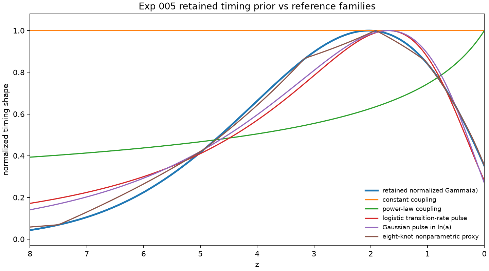
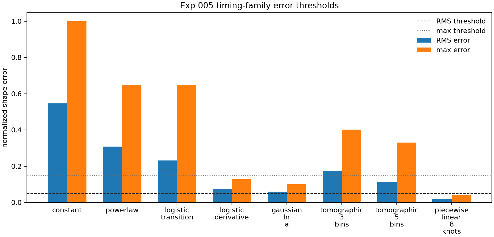

# Result 005: Timing-Prior Usefulness and Redundancy Audit

Date: 2026-06-09

## Executive Verdict

The retained structure-era `Gamma(a)` profile is best classified as:

```text
potentially_useful_compression_target
```

It should not be described as a new physical source, a physical QFUDS branch, or
a distinct IV/IDE model family. Its possible value is narrower:

```text
an interpretable, low-leakage timing prior for IV/IDE coupling histories.
```

The audit found that the best compact two-parameter pulse, a Gaussian in
`ln(a)`, was close but did not pass the predeclared RMS threshold. The flexible
eight-knot reconstruction proxy did pass. That means retained timing is not
killed as a prior, but its value must be tested as compression of flexible
timing structure, not as uniqueness.

## Scope

This result is a timing-only phenomenological audit.

It establishes:

- retained timing remains a possible IV/IDE timing-prior compression target;
- constant and power-law timing families are too rigid;
- compact smooth pulses are close but did not pass the declared RMS threshold;
- a flexible reconstruction proxy can reproduce the retained timing profile.

It does not establish:

- physical QFUDS validation;
- a physical `Gamma(a)` source;
- a new `Q^nu`;
- physical [Level 2B](../wiki/glossary/repository_levels.md) readiness;
- CMB, matter-power, BAO, supernova, DESI, Euclid, Roman, or likelihood
  viability;
- novelty of QFUDS as a physical theory.

## Evidence

Execution command:

```bash
python3 scripts/run_minimal_model.py --exp-005-timing-prior-audit --outdir outputs
```

Code paths:

- `scripts/run_minimal_model.py`
- `qfuds/timing_prior.py`
- `qfuds/background.py`
- `qfuds/gamma_laws.py`

Primary outputs:

```text
outputs/exp005_timing_prior_summary.json
outputs/exp005_timing_family_comparison.csv
outputs/exp005_timing_fingerprint.csv
outputs/exp005_timing_prior_criteria.csv
outputs/figures/exp005_timing_family_shapes.png
outputs/figures/exp005_timing_family_shapes.svg
outputs/figures/exp005_timing_family_errors.png
outputs/figures/exp005_timing_family_errors.svg
```

Execution note:

The command emitted local matplotlib/fontconfig cache warnings from the runner's
plotting import. Exp 005 produced JSON, CSV, PNG, and SVG outputs. The cache
warnings did not affect the generated diagnostics.

## Visual Diagnostics



This figure is the visual form of the timing-prior question. The retained curve
is a finite structure-era pulse, not a constant or monotonic power-law coupling.
The Gaussian and logistic-rate pulses show why compact smooth-pulse families are
the right comparison class: they capture the broad location of the support, but
not the retained shape closely enough to pass the declared RMS threshold. The
eight-knot reconstruction proxy shows that flexible timing descriptions can
recover the profile.



This figure makes the decision rule explicit. The dashed and dotted horizontal
lines are the RMS and max-error thresholds. The flexible eight-knot
reconstruction proxy is the only shown family that passes both. The best compact
family comes close in max error but misses the RMS threshold. That is why the
result is `potentially_useful_compression_target`: retained timing is not proven
unique, but it is not reduced to the tested compact pulse families either.

## Retained Timing Fingerprint

The retained profile is the normalized `information_production` `Gamma(a)` shape
with the existing retained parameters.

| Metric | Value |
| --- | ---: |
| peak redshift | `2.046` |
| weighted mean redshift | `1.746` |
| half-max support | `z ~= 0.259 to 4.632` |
| half-max width | `Delta ln(a) ~= 1.498` |
| skew in `ln(a)` | `-0.0116` |
| `z > 1100` fraction | `0` |
| `z > 10` fraction | `0.000215` |
| `z < 1` fraction | `0.2886` |
| `z < 0.5` fraction | `0.1376` |

This matches the known qualitative fingerprint: a low-leakage structure-era
transient with broad support from late to mid redshift.

## Family Comparison

All families were normalized to `max(shape)=1`. Amplitudes were not compared.

Approximate timing equivalence required:

```text
shape RMS error <= 0.05
shape max error <= 0.15
```

| Family | Parameters | RMS error | Max error | Classification |
| --- | ---: | ---: | ---: | --- |
| constant coupling | `0` | `0.546` | `0.999` | too rigid |
| power-law coupling | `1` | `0.308` | `0.648` | too rigid |
| logistic transition | `2` | `0.231` | `0.648` | poor timing match |
| logistic transition-rate pulse | `2` | `0.0755` | `0.129` | close but outside RMS threshold |
| Gaussian pulse in `ln(a)` | `2` | `0.0604` | `0.100` | best compact match; outside RMS threshold |
| three-bin tomography | `3` | `0.174` | `0.402` | poor timing match |
| five-bin tomography | `5` | `0.114` | `0.330` | poor timing match |
| eight-knot reconstruction proxy | `8` | `0.0190` | `0.0416` | flexible reconstruction match |

## Interpretation

The retained timing profile is not useful because it is physically derived. That
claim remains closed for the retained branch.

The retained timing profile may be useful because it defines a compact
structure-era target that flexible IV/IDE reconstructions can be compared
against. In this audit, standard rigid families were too weak and flexible
reconstruction matched well. Compact smooth-pulse families came close enough to
be relevant, but not close enough to make retained timing redundant under the
declared thresholds.

The strongest argument for the timing prior is:

```text
It supplies an interpretable, low-leakage structure-era support profile for
where IV/IDE coupling should be active.
```

The strongest argument against it is:

```text
Without a source derivation, the profile may become an aesthetically motivated
curve prior unless actual IV/IDE reconstructions prefer the same support.
```

## Decision

Classify retained timing as:

```text
potentially_useful_compression_target
```

The smallest next useful analysis is not a new physical QFUDS branch. It is:

```text
compare retained timing against actual IV/IDE tomographic or reconstructed
coupling histories and ask whether it compresses their preferred redshift
support with fewer interpretable parameters.
```

Decision boundaries:

- If future reconstructions prefer similar support, retained timing may be a
  useful low-dimensional prior.
- If standard pulse families or tomographic bins reproduce all useful behavior
  with equal or fewer assumptions, retained timing is redundant.
- If no external reconstruction or observationally constrained history prefers
  this support, retained timing remains aesthetic.

No physical claim is supported. No roadmap status change is implied.

## Next Gate

Use retained timing only as phenomenological IV/IDE prior-compression target.
Any future execution should compare against actual transition, tomographic, or
reconstructed IV/IDE timing histories. Do not reopen Level 1.5 or derive a new
physical source from this result.
