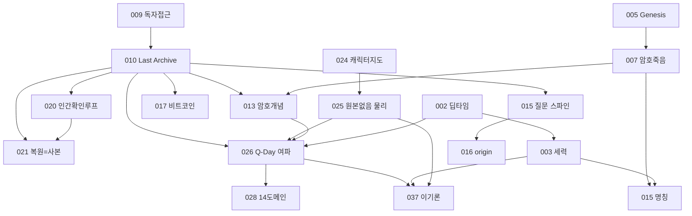

# QFUDS Verse 월드빌딩 아키텍처 지도 (문서 인덱스·권위 트리·의존/영향 그래프)

## 무엇인가

`qfuds-verse`의 in-scope 문서 80개를 하나의 지도로 묶는 **읽기 전용 감사 산출물**이다.
"어느 문서가 권위인가", "어느 선반이 무엇을 소유하나", "이 문서 하나 고치면 무엇이
영향받나"를 즉시 답한다. 드리프트·기술부채·리팩터 우선순위는 자매 문서
[901 Canon Drift·Tech Debt 리포트](901_canon_drift_and_tech_debt_report_ko.md)가 보유한다.

이 문서는 새 고유명·캐논·인물을 만들지 않는다. 기존 문서 본문도 고치지 않는다. 실존
종교·민족·집단을 가해자/피해자로 고정하지 않는다.

```text
fiction/provenance only
research evidence: no
external source claim: no
```

## 범위 (고정)

- INCLUDE: `qfuds-verse/README.md`, `00_continuity/**`, `10_world/**`,
  `20_series/qfuds-saga/{00_bible, 00_workroom, 10_story_design, 40_release, README}`.
- EXCLUDE: `20_drafts/**`, `30_revisions/**`, `90_archive/**` (원고·개정·아카이브).
- 총 **80개 문서** (연속성 5, 세계 24, bible 11, workroom 13, story_design 23,
  release 2, universe/series 루트 2). 감사 기준일 2026-07-01, 프론트매터 `depends_on`
  그래프 직접 산출.

## 1. 문서 인덱스 (선반별)

### 1.1 `00_continuity` · 캐논 권위·연표 SSOT (5)

| 문서 | 역할 | status |
| --- | --- | --- |
| [000 권위·SSOT 지도](000_canon_authority_and_ssot_map_ko.md) | 충돌 시 어느 문서가 이기나(제작 권위 루트) | draft |
| [002 장기 복원 문명사 타임라인](002_deep_time_restoration_timeline_ko.md) | 0~9기 딥타임 연대기(연표 SSOT) | draft |
| [011 연표·복원 행정·블랙홀 본거지](011_chronology_restoration_admin_black_hole_seat_ko.md) | 연표·기술곡선·복원 행정 구조 | draft |
| [036 먼 미래 심층시간 연대기](036_far_future_deep_time_chronicle_ko.md) | 002 5~9기를 물리 시계에 건 심층시간 확장 | draft |
| [README 연속성 인덱스](README.md) | 선반 정책·SSOT 안내 | draft |

### 1.2 `10_world` · 공유 세계 캐논 (24)

물리·암호 축:

| 문서 | 역할 | status |
| --- | --- | --- |
| [001 세계 기준점·핍진성](001_world_anchor_and_verisimilitude_ko.md) | 현실 앵커와 그럴듯함의 경계 | draft |
| [005 Genesis Chain·복원 신화](005_bitcoin_genesis_chain_and_restoration_myth_ko.md) | 비트코인 위상·복원 신화 기원 | draft |
| [007 암호학적 죽음·해시 계약](007_cryptographic_death_and_hash_covenant_ko.md) | Q-Day 위에 선 약속들 | draft |
| [013 Cryptographic Death·암호 개념](013_cryptographic_death_era_and_crypto_concepts_ko.md) | 암호 개념 상세 설정 | draft |
| [010 Last Archive 기원·역연산 인과](010_last_archive_origin_and_reversal_causality_ko.md) | **키스톤.** Last Archive 기원·인과 구조 | draft |
| [021 복원 메커니즘 정정](021_restoration_mechanism_correction_ko.md) | 복원=손실 사본(부활 아님) | draft |
| [025 in-world 물리(정보·유니터리)](025_in_world_physics_information_unitarity_restoration_ko.md) | 원본 없음·복원 물리 근거(최상위 우선) | draft |
| [017 비트코인 위상·이념전쟁·심층시간](017_bitcoin_stature_ideology_deeptime_ko.md) | 장기시간 유효성·이념전쟁 | draft |
| [018 세계관 컴펜디움](018_world_compendium_codex_ko.md) | 세계 설정 종합 코덱스 | draft |

세력·문명사·제도 축:

| 문서 | 역할 | status |
| --- | --- | --- |
| [003 세력·문화·권력·생태계](003_factions_cultures_power_ecology_ko.md) | 세력 생활권·이념·생태계 장부 | draft |
| [037 이기(理氣) 이념 축](037_yi_gi_ideology_axis_ko.md) | 원본 실재 vs 부재 형이상학 축(candidate) | draft |
| [015 세력 명칭 Canon 확정](015_factions_canon_naming_ko.md) | 세력 이름 canon(명칭 SSOT) | draft |
| [006 Post-AGI 문명사·이중언어 규약](006_post_agi_civilization_history_bilingual_protocol_ko.md) | AGI 이후 문명사·한국어 우선 | draft |
| [020 AI·자동화·인간 확인 루프](020_ai_automation_human_in_the_loop_ssot_ko.md) | 왜 사람이 도장을 찍나(제도 근거) | draft |
| [026 Q-Day 여파 타임라인과 세계](026_qday_aftermath_timeline_and_world_ko.md) | Q-Day 여파(7인 패널 종합) | draft |
| [028 Q-Day 14도메인 매트릭스](028_qday_world_system_14domain_matrix_ko.md) | 026 부속 14도메인 인과 매트릭스 | draft |
| [009 메타포 토대·독자 접근성](009_reader_accessibility_and_real_world_anchors_ko.md) | 메인 메타포·검증 대장 | draft |

세계 확장 웨이브(candidate 대사전):

| 문서 | 역할 | status |
| --- | --- | --- |
| [030 웨이브 1](030_world_expansion_wave1_names_places_events_ko.md) | 고유명사·지명·세력·인물·사건·어휘 | draft |
| [031 웨이브 2](031_world_expansion_wave2_factions_relationships_ko.md) | 세력 내부 심화·관계망 | draft |
| [032 웨이브 3](032_world_expansion_wave3_geography_event_chains_ko.md) | 지리·궤도·사건 연쇄 | draft |
| [033 웨이브 4](033_world_expansion_wave4_economy_rites_calendar_ko.md) | 경제·통화·의례·달력 | draft |
| [034 웨이브 5](034_world_expansion_wave5_language_tech_infra_ko.md) | 언어·기술 인프라 | draft |
| [035 웨이브 6 capstone](035_world_expansion_wave6_ecology_education_media_index_ko.md) | 생태·교육·미디어·크로스 인덱스 | draft |
| [README 세계 인덱스](README.md) | 선반 규칙·확장 register | draft |

### 1.3 `00_bible` · series SSOT (11)

| 문서 | 역할 | status |
| --- | --- | --- |
| [004 시점·주제·고유명사 규칙](004_narrative_pov_theme_naming_ko.md) | 서사 규칙 SSOT | draft |
| [008 첫 Arc Canon 정리](008_first_arc_canon_consolidation_ko.md) | 1부 원고에서 굳은 세계 사실 | draft |
| [012 주인공 시트 Liora Sen](012_character_liora_sen_ko.md) | 주인공 캐릭터 SSOT | draft |
| [014 작가 사유 렌즈·압축·SSOT](014_authorial_lenses_compression_ssot_soft_editing_ko.md) | 작가 렌즈(리쾨르·루만 구조 차용) | draft |
| [016 앙상블 보이스·관계 바이블](016_character_ensemble_voices_relationships_ko.md) | 앙상블 인물 보이스·관계 | draft |
| [019 입체 캐릭터 시트](019_character_depth_sheets_ko.md) | 인물 심층 시트 | draft |
| [022 기준 작성권 사상축](022_authorship_of_the_standard_theme_axis_ko.md) | 무엇이 진짜였는지 정하는 권력 | draft |
| [023 이념 비일관 삼각](023_ideological_incoherence_triad_ko.md) | 세 양립 불가 신앙 | draft |
| [024 캐릭터 지도·타임라인 좌표](024_character_map_and_timeline_coordinates_ko.md) | 인물별 시대 좌표 SSOT | draft |
| [027 기계 화자 관통선(AI 발전사)](027_machine_childhood_ai_history_narrator_throughline_ko.md) | 실제 AI사 관통선 | draft |
| [README bible 인덱스](README.md) | 선반 지도 | draft |

### 1.4 `00_workroom` · 생산 도구 (13)

| 문서 | 역할 | status |
| --- | --- | --- |
| [001 창작 시스템](001_agentic_saga_system_ko.md) | 에이전트 창작 시스템 | draft |
| [003 이중언어 용어규율 글로서리](003_bilingual_term_discipline_glossary_ko.md) | 용어 정규화 글로서리 | draft |
| [004 2부 GSD Phase Brief](004_arc_two_gsd_phase_brief_ko.md) | 2부 제작 브리프 | draft |
| [005 시리즈 제작 하네스](005_series_production_harness_ko.md) | 제작 하네스 | draft |
| [006 작가 아이디어 추적 원장](006_creative_inputs_traceability_ko.md) | 창작 입력 추적 | draft |
| [007 1부 Book1 GSD Brief](007_first_arc_book1_gsd_phase_brief_ko.md) | 1부 제작 브리프 | draft |
| [008 외부 AI 글쓰기 갭 감사](008_external_ai_writing_systems_gap_audit_ko.md) | 외부 시스템 갭 감사 | draft |
| [009 Production Board](009_saga_production_board_ko.md) | 진행 보드·게이트 | draft |
| [010 Chapter Intent Card 템플릿](010_chapter_intent_card_template_ko.md) | 챕터 의도 카드 | draft |
| [011 전문가 패널 세계-체계 인계](011_expert_panel_world_system_handoff_ko.md) | 패널 확장 인계 | draft |
| [012 근미래 예측 패널 방법](012_near_future_forecast_panel_method_ko.md) | 근미래 예측 방법 | draft |
| [013 실세계·물리 리서치 앵커](013_real_world_and_physics_research_anchors_ko.md) | 핍진성 리서치 앵커 대장 | draft |
| [README workroom 인덱스](README.md) | 선반 지도 | draft |

### 1.5 `10_story_design` · 아웃라인·리빌 (23)

| 문서 | 역할 | status |
| --- | --- | --- |
| [002 시각 전시물 설계](002_visual_exhibit_design_ko.md) | 작중 전시물 설계 | draft |
| [007 2부 한국어 우선 계획](007_arc_two_korean_primary_plan_ko.md) | 2부 집필 계획 | draft |
| [008 Last Archive 반전 설계](008_last_archive_reveal_architecture_ko.md) | 반전·복선 배치 | draft |
| [009 형식·throughline·진행](009_format_throughline_and_progress_ko.md) | 형식·관통선·진행 | draft |
| [010 2부 에피소드 맵](010_arc_two_episode_map_ko.md) | 2부 에피소드 단위 | draft |
| [011 다부작 아크 지도](011_saga_arc_map_multiarc_ko.md) | 부 구조·번호 SSOT | draft |
| [012 1부 Book1 재설계 아웃라인](012_first_arc_book1_outline_reboot_ko.md) | 1부 reboot 아웃라인 | completed |
| [013 1부 Book1 씬 카드](013_first_arc_scene_cards_ko.md) | 1부 reboot 씬 카드 | completed |
| [014 소버린 AI·오픈/봉쇄 축](014_sovereign_ai_open_closed_axis_brainstorm_ko.md) | 이념 축 발상 | draft |
| [015 5대 극적 질문 스파인](015_five_core_dramatic_questions_spine_ko.md) | **서사 축 키스톤.** 관통 질문 | draft |
| [016 1부 origin 아웃라인](016_first_arc_origin_outline_ko.md) | origin 전체 아웃라인 | draft |
| [017 1부 origin 씬 카드](017_first_arc_origin_scene_cards_ko.md) | 장면 카드 | draft |
| [018 암호 개념 독자 온보딩](018_crypto_concepts_reader_onboarding_check_ko.md) | 암호 개념 전달 점검 | draft |
| [019 사엘 원고 실행 시트](019_sael_origin_execution_sheet_ko.md) | 집필 실행 시트 | draft |
| [020 Q-Day 사건 사슬 bridge](020_qday_incident_bridge_outline_ko.md) | B1↔B2 연결 | draft |
| [021 1부 독자 공개 사다리](021_first_arc_reader_reveal_ladder_ko.md) | 정보 공개 순서 | draft |
| [022 1부 causal master outline](022_first_arc_causal_master_outline_ko.md) | 인과 마스터 아웃라인 | draft |
| [023 세계관·인물 한눈에](023_first_arc_reader_orientation_world_and_cast_ko.md) | 독자·작가 오리엔테이션 | draft |
| [024 새 1부 오르페우스 설계](024_new_book1_orpheus_design_ko.md) | 사별·복원 사본 축 1부 설계 | draft |
| [025 근미래 리센터 방향](025_near_future_recenter_direction_ko.md) | 근미래 grounded SF 무게중심 | draft |
| [026 기계 화자 트리트먼트](026_machine_narrator_voice_and_setup_payoff_treatment_ko.md) | 기계 화자 보이스·구조 | draft |
| [027 근미래 프렐류드 대사전](027_near_future_prelude_forecast_ko.md) | 2020s~2090s 예측(candidate) | draft |
| [README story_design 인덱스](README.md) | 선반 지도 | draft |

### 1.6 `40_release` + 루트 (4)

| 문서 | 역할 | status |
| --- | --- | --- |
| [900 Pre-Reboot 릴리스 매니페스트](../20_series/qfuds-saga/40_release/900_pre_reboot_first_arc_release_manifest_ko.md) | provenance manifest | provenance |
| [40_release README](../20_series/qfuds-saga/40_release/README.md) | 릴리스 선반 | draft |
| [qfuds-verse README](../README.md) | universe 루트 인덱스 | draft |
| [qfuds-saga README](../20_series/qfuds-saga/README.md) | series 루트 인덱스 | draft |

## 2. Canon Authority Tree (충돌 시 무엇이 이기나)

`depends_on` in-scope 피의존도(in-degree)로 본 권위 서열. 피의존이 높을수록 아래에서
많은 문서가 그 문서를 근거로 선다.

| 순위 | 문서 | 피의존 | 자리 |
| --- | --- | --- | --- |
| 1 | 010 Last Archive 기원·역연산 인과 | **18** | 세계 캐논의 키스톤 |
| 2 | 002 딥타임 연표 / 017 비트코인 이념·심층시간 / 015 5대 질문 스파인 | 10 | 연표·이념·서사의 척추 |
| 3 | 026 Q-Day 여파 | 8 | 여파 착지 노드 |
| 4 | 003 세력 / 007 암호죽음 / 013 암호개념 / 024 캐릭터 지도 / 009 독자접근성 / 016 origin 아웃라인 | 7 | 세력·암호·캐릭터·서사 허브 |
| 5 | 020 인간 확인 루프 / 028 14도메인 | 6 | 제도·인과 매트릭스 |

**충돌 우선순위 규칙**(000 권위 지도·037 경계에서 확정): 물리·의미가 부딪히면
**025(원본 없음 물리) > 021(복원=손실 사본) > 026(여파) > 003(세력) > 015(명칭)**
순으로 이긴다. 즉 기술어(검증·복원=사본·유니터리)는 이념 별칭으로 숨기지 않고 025가 최상위다.

series bible SSOT 승격 타깃(world README): **015·024·003·026·028**. 시대 좌표(인물별)
SSOT는 [024 캐릭터 지도](../20_series/qfuds-saga/00_bible/024_character_map_and_timeline_coordinates_ko.md)가 유지한다.

## 3. Domain Ownership Map (선반별 소유)

| 선반 | 소유 도메인 | 대표 문서 |
| --- | --- | --- |
| `00_continuity` | 캐논 권위·연표 SSOT | 000 권위, 002 딥타임, 011 복원행정, 036 먼미래 |
| `10_world` (물리·암호) | 정보·유니터리·복원·암호 붕괴 | 025·021·010·013·007·005·017·001·018 |
| `10_world` (세력·제도) | 세력·문명사·이념·제도 | 003·037·015·006·020·026·028·009 |
| `10_world` (확장) | universe 공유 대사전(candidate) | 030~035 웨이브 |
| `00_bible` (캐릭터) | 인물 SSOT | 012·016·019·024 |
| `00_bible` (주제) | 사상·주제·화자 축 | 004·014·022·023·027 |
| `00_workroom` | 생산 도구·방법·게이트 | 009 보드·005 하네스·011·012·013 |
| `10_story_design` | 아웃라인·리빌·씬 카드 | 011 아크지도·015 질문·016~022 origin |
| `40_release` | 릴리스 매니페스트 | 900 |

원칙: 세계 사실은 `10_world`/`00_bible`, 브레인스토밍은 `10_story_design`, 생산 절차는
`00_workroom`, 산문은 `20_drafts`(범위 밖). 공유 세계 대사전은 universe 레벨(`10_world`),
시리즈는 플롯·캐스트만 보유한다.

## 4. Dependency & Impact Graph (수정 시 영향)

핵심 캐논 척추의 의존 관계(화살표 = "A는 B를 근거로 선다", 즉 B를 고치면 A가 흔들린다).
가독성을 위해 상위 허브와 그 직접 연결만 도식한다.



"이 문서 수정 시 직접 영향" 블라스트 표(회귀 점검 필수 순위):

| 고치는 문서 | 직접 영향(피의존) | 회귀 점검 강도 |
| --- | --- | --- |
| 010 Last Archive | 18 | 최상 (거의 전 세계 캐논) |
| 002 딥타임 / 017 비트코인 / 015 질문 | 10 | 상 |
| 026 Q-Day 여파 | 8 | 상 |
| 003·007·013·024·009·016 | 7 | 중상 |
| 020·028 | 6 | 중 |

## 5. 서사·캐논 레이어 순서 (읽는/짓는 순서)

1. **연표 골격:** 002 딥타임 → 011 복원 행정 → 036 먼미래(물리 시계 확장).
2. **물리·암호 바닥:** 025(원본 없음·유니터리) → 021(복원=사본) → 007·013(암호 붕괴) →
   005·017(비트코인 위상).
3. **세력·제도:** 003 세력 → 015 명칭 → 020 인간 확인 루프 → 026·028 Q-Day 여파 →
   037 이기 형이상학 축.
4. **series bible:** 004 규칙 → 012·016·019·024 캐릭터 → 022·023·014·027 주제·화자.
5. **story_design:** 011 아크 지도 → 015 질문 스파인 → 016~022 origin → 024~027 근미래 축.

## 6. 용어 글로서리 정규화 포인터

용어 표기·이중언어 규율은 아래가 SSOT다. 새 용어는 여기에 먼저 물린다.

- [00_workroom/003 이중언어 용어규율 글로서리](../20_series/qfuds-saga/00_workroom/003_bilingual_term_discipline_glossary_ko.md)
- [10_world/006 이중언어 프로토콜](../10_world/006_post_agi_civilization_history_bilingual_protocol_ko.md) (한국어 우선 규약)
- 기술어(hash·KDF·entropy·Page curve 등) 보존 규칙: [10_world/README](../10_world/README.md) Technical Rule 표.

핵심 개념 축약: 검증경제(Aletheia), 복원=손실 사본, 인간 확인 루프(020), 필드마크 사슬,
보존주의(므네모시네)/망각주의(레테) 진자, 이/기(원본 실재 vs 부재).

## 7. 교차참조 클러스터

- **캐릭터:** 012 Liora(주인공) · 016 앙상블 · 019 입체 시트 · 024 지도·좌표. (중복 검토는 901 §3.)
- **세력·이념:** 003 세력 · 015 명칭 · 023 삼각 · 022 기준 작성권 · 037 이기 · 014 작가 렌즈.
- **Q-Day 사건:** 007·013 암호 붕괴 → 026·028 여파 → 020 인간 확인 루프 → story_design 020 bridge.
- **근미래 축:** 025 리센터 · 024 오르페우스 · 026 기계 화자 · 027 프렐류드 · workroom 012·013.
- **딥타임:** 002 → 011 → 036 · 017 심층시간.

연속성·상위 참조: [000 권위 지도](000_canon_authority_and_ssot_map_ko.md) ·
[10_world README](../10_world/README.md) · [00_bible README](../20_series/qfuds-saga/00_bible/README.md) ·
[10_story_design README](../20_series/qfuds-saga/10_story_design/README.md) ·
[901 드리프트·부채 리포트](901_canon_drift_and_tech_debt_report_ko.md).

```text
fiction/provenance only
research evidence: no
external source claim: no
```
