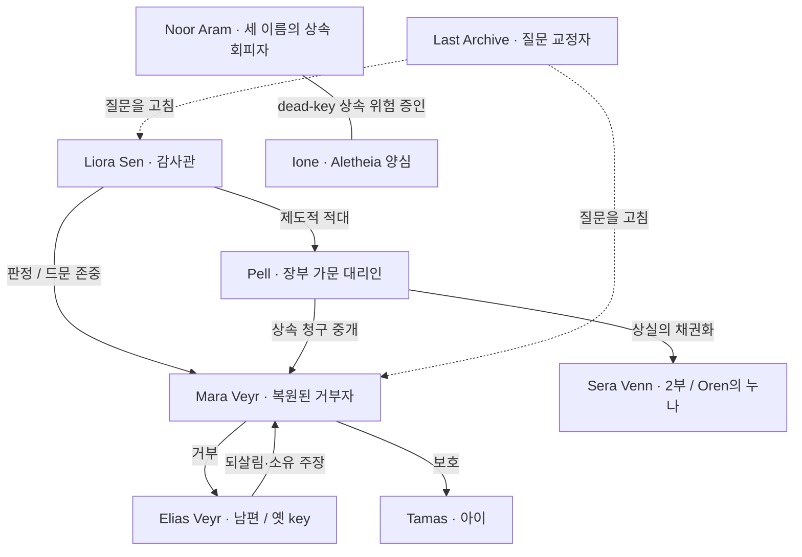

# QFUDS SAGA 시리즈 제작 하네스

## 진단: 왜 단편은 되고 시리즈는 무너졌나

기존 하네스는 **문서(에피소드) 단위**만 검증했다. AI-tell·자연스러움·이해도·
validate는 한 편 안에서만 본다. 그래서 단편은 통과한다. 그러나 6편을 쌓자
**시리즈 차원의 결함**이 드러났다(리텐션 테스트 5인 전원 중반 이탈).

- 에피소드 공식 반복(표식 거부 후 재입력, 미래시제 클로징)을 잡는 게이트가 없었다.
- 인물별 목소리 차별화 기준이 없어 대사가 한 사람처럼 균질화됐다.
- 아크·상승·중심 질문 연속성을 추적하는 문서가 없었다.
- 떡밥/회수, 연속성(누가 무엇을 아는가) 원장이 없었다.

즉 **집필 전에 시리즈를 시리즈로서 검증하는 층**이 통째로 비어 있었다. 이 문서가
그 층이다.

**중요한 자기진단:** 도구가 없던 게 아니다. 전역 템플릿
[character_sheet_template](../../../../../../../../.agent/templates/fiction/character_sheet_template.md)는
Want/Need/Fear/Wound/Lie/모순/관계기능 + Arc + Voice까지 갖춘 완전한 캐릭터 도식
템플릿이고, continuity_audit·work_bible·craft 하네스도 전부 있었다. 문제는 **부재가
아니라 미집행**이었다. 이 템플릿을 Liora([203](../00_bible/203_character_liora_sen_ko.md))
단 한 명에게만 채우고 나머지 캐스트는 건너뛰었다. "반복 인물은 집필 전 시트 필수"라는
**게이트가 없으면 좋은 템플릿도 안 쓰인다.** 그래서 이 하네스의 핵심은 새 도구가
아니라 **집행**이다. 차용 craft는 일반 공개 자료를 확인했다(workflow state `hit_not_cached`):
TV show bible / fiction series bible(연속성 보존), 드라마 throughline(중심 질문),
Swain scene/sequel(장면=목표·갈등·재난 / 시퀄=반응·딜레마·결정), Save the Cat
시리즈 막 구조. 출처: ScreenCraft·StudioBinder show-bible, Jane Friedman·River
story bible, Narrative First throughline, September C. Fawkes(Swain), savethecat.com.

## 시리즈 바이블 레이어 (있어야 하는 것)

| 레이어 | 무엇 | 현 위치 / 상태 |
| --- | --- | --- |
| 전제·중심 질문·throughline | 시리즈를 관통하는 단일 질문 | [304 진행/throughline](../10_story_design/304_format_throughline_and_progress_ko.md) |
| 아크 맵·상승 사다리 | 부/편별 판돈이 어떻게 커지나 | 1부 [307](../10_story_design/307_first_arc_book1_outline_reboot_ko.md), 2부 [305](../10_story_design/305_arc_two_episode_map_ko.md), 다부작 [306](../10_story_design/306_saga_arc_map_multiarc_ko.md) |
| 인물 앙상블·목소리·관계 | 인물별 보이스 키, 관계도 | [205 캐릭터 바이블](../00_bible/205_character_ensemble_voices_relationships_ko.md) |
| 세계·연표·세력 canon | 설정 정합 | [107](../../../10_world/107_last_archive_origin_and_reversal_causality_ko.md)·[002](../../../00_continuity/002_chronology_restoration_admin_black_hole_seat_ko.md)·[109](../../../10_world/109_factions_canon_naming_ko.md) |
| 떡밥/회수 원장 | 심은 단서와 회수 지점 추적 | **신규 필요**(아래 §떡밥 원장) |
| 연속성 원장 | 인물이 시점마다 아는 정보·타임라인 | **신규 필요**([연속성 감사 템플릿](../../../../../../../../.agent/templates/fiction/continuity_audit_template.md) 활용) |
| 릴리즈 게이트 | 구조·이해도·기술·보이스·리텐션 | [002 게이트](../30_revisions/002_first_arc_release_immersion_revision_plan_ko.md) |

## 집필 전 프리플라이트 (에피소드 N을 쓰기 전에)

에피소드를 새로 쓰기 전 반드시 확인한다. 이걸 건너뛰어서 1부가 무너졌다.

실행 순서는 전역
[Agentic Fiction Production Workflow](../../../../../../../../.agent/workflows/agentic-fiction-production-workflow.md)를
따른다. SAGA 로컬 상태는 [408 production board](408_saga_production_board_ko.md)가,
장/대형 장면의 최소 계약은 [409 chapter intent card](409_chapter_intent_card_template_ko.md)가
보유한다.

0. **(집행)** 이 편에 나오는 모든 반복 인물이
   [character_sheet_template](../../../../../../../../.agent/templates/fiction/character_sheet_template.md)로
   채워진 시트(또는 [205 앙상블 바이블](../00_bible/205_character_ensemble_voices_relationships_ko.md)
   항목) + 관계도를 갖췄나? 없으면 **집필 금지**.
1. 이 편은 직전 편과 **그래서/하지만**으로 인과 연결되나? (단순 "그리고 또"면 재설계)
2. 판돈·위험이 **상승**하나? 직전 편과 같은 강도면 멈춘다.
3. 구조가 직전 편과 **다른가**? 같은 공식(같은 장소·같은 해결 안무)이면 변주.
4. 중심 질문(되살아난 거부자 Mara)이 이어지나, 새 의뢰인으로 희석되나?
5. 등장 인물 대사가 [205] 보이스 키로 **태그 없이 구별**되나?
6. 새 기술·과학어가 ep1 비트코인 수준으로 **정확+평이**하게 grounding되나?
7. 새로 심는 떡밥/회수하는 떡밥을 §떡밥 원장에 적었나?
8. em dash 0(한국어·영어판 모두), 표식=mark, 민감 주제 0.
9. **(덴마식 앙상블 구조, 비모방)** 이 편의 시점 인물이 선언됐나? 이 편이
   단독 사건으로 끝나지 않고 연재 스레드(중심 질문·떡밥)를 전진시키나? 시점이
   시리즈 전체에서 로테이션·교직되나? 단독 완결형이면 재설계. 여기서 "덴마식"은
   문체·캐릭터·고유 설정 모방이 아니라, 단편처럼 읽히는 편들이 더 큰 사가
   구조로 연결되는 **추상 연재 구조 요건**만 뜻한다.
10. **(의도 카드)** 이 편의 desire/threat/forced choice/cost/turn/handoff가
    [409](409_chapter_intent_card_template_ko.md)에 있나? 없으면 설정 설명으로 미끄러질
    위험이므로 먼저 카드를 채운다.

## 집필 후 회수 패스

draft나 큰 revision이 끝나면 바로 polish로 가지 않는다. 먼저 아래 순서로 회수한다.

```text
critic / reader-sim -> continuity -> chronicler -> verification
```

| Pass | 목적 | 기록 위치 |
| --- | --- | --- |
| critic / reader-sim | 흥미 이탈, 수동 주인공, 설명 과다, 장면 목표 부재 탐지 | production board 또는 revision note |
| continuity | 인물 지식 상태, chronology, field mark, technical term 정합 | continuity audit / draft notes |
| chronicler | 새 canon 후보, 인물 상태 변화, 열린/닫힌 떡밥, glossary 후보 회수 | [chronicler template](../../../../../../../../.agent/templates/fiction/chronicler_pass_template.md) 또는 workroom note |
| verification | `fiction_gate`, docs validation, workflow guard | commit 전 검증 로그 |

Review wave는 다음 순서만 허용한다.

```text
foundation scan -> high-severity fix -> re-scan -> continuity fix -> voice polish -> release gate
```

high-severity 구조 문제가 남아 있으면 humanize나 문장 polish를 하지 않는다. humanize는
AI 탐지 회피가 아니라 최종 자연스러움 보정에만 쓴다.

## 기존 원고 retroactive gate

이 게이트가 생기기 전에 작성된 원고도 예외가 아니다. 이미 개요가 잡힌 1편이라도
release 후보로 유지하려면 아래를 역적용한다.

1. draft의 `Harness Applied` 아래에 `Series Gate Applied` 표를 넣는다.
2. 반복 인물은 [205 앙상블 바이블](../00_bible/205_character_ensemble_voices_relationships_ko.md)
   또는 개별 시트로 Want/Need/Fear/Wound/Lie/관계기능이 확인돼야 한다.
3. 1편이 단독 완결이 아니라 다음 편으로 넘어갈 연재 스레드를 실제 본문에 남겨야 한다.
4. draft를 고쳐도 release 본문 중복 build를 수기로 유지하지 않는다. active release가
   필요할 때만 [Release Shelf](../40_release/README.md)에 manifest/export를 새로 만든다.
5. [002 release gate](../30_revisions/002_first_arc_release_immersion_revision_plan_ko.md)에
   편별 적용 결과를 남긴다.

기계 집행: `scripts/fiction_gate.py --staged`는 `20_drafts/019` 이후 한국어
primary/adaptation draft를 staged 상태로 올릴 때 `## Series Gate Applied` 표가 없으면
pre-commit을 실패시킨다. 즉 다음 편을 고치려면 먼저 이 게이트를 통과시켜야 한다.

## 시리즈 게이트 (릴리즈 차단 조건)

[002](../30_revisions/002_first_arc_release_immersion_revision_plan_ko.md)에 정식
수록. 요약: **스토리 아키텍처(구조)** → **독자 이해도** → **기술 정확·평이** →
**보이스 차별화(205)** → **AI-tell/em dash 0** → **독자 페르소나 리텐션 테스트**.
리텐션 테스트는 다양한 페르소나가 "재미 유지되는 동안만" 읽고 이탈 지점을 보고,
공통 이탈을 고쳐 반복한다.

## 떡밥 원장 (신규, 여기서 시작)

| 떡밥 | 심은 곳 | 회수 예정 | 상태 |
| --- | --- | --- | --- |
| Vera ↔ Mara Veyr 이름 공명(주제적 거울, 계보 미확정·의도된 모호성) | world 107 §2·209 | 후반 반전(의심으로만) | open |
| Last Archive = 합의(AGI 아님) | 전편 암시 | 시리즈 반전 | open |
| Mara의 봉인 편지 | 1부 4·6편 | 1부 6편 일부 회수 | partial |
| `who may author loss` | 1부 6편 | 2부 | active |

## 인물 관계도 (mermaid)



## 글로벌 승격 경로

이 시리즈 게이트·프리플라이트·바이블 레이어는 saga 한정이 아니라 모든 시리즈물에
필요하다. 안정화되면
[Fiction IP Management Workflow](../../../../../../../../.agent/workflows/fiction-ip-management-workflow.md)에
"시리즈 스케일 절" + [템플릿](../../../../../../../../.agent/templates/fiction/)으로
승격한다(series-bible 템플릿, 떡밥/연속성 원장 템플릿). 그러면 다음 시리즈는 같은
실수를 처음부터 막는다.
