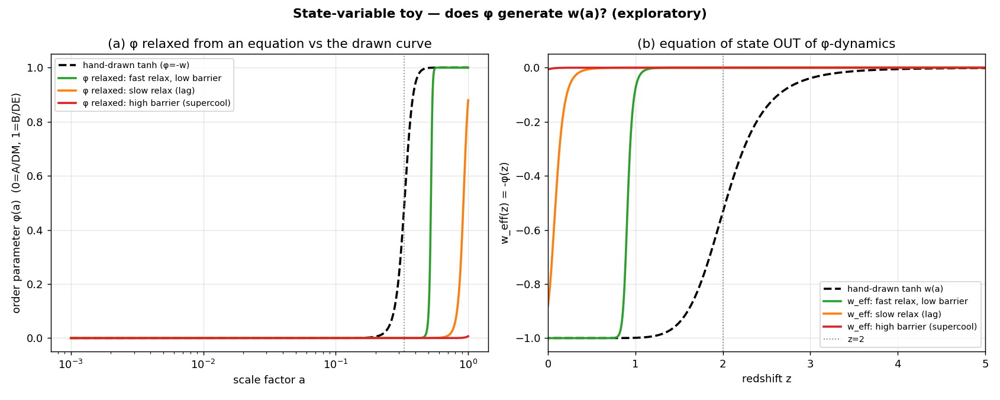

# QFUDS SAGA 시각 전시물 설계

## 경계

이 문서는 fiction-system 설계 노트다.

새 연구 증거, QFUDS support, validation, physical-source derivation, Level 2B
admission을 만들지 않는다. 아래 이미지는 repository에 이미 있는 asset을
소설 속 archive plate, 법정 전시물, 시각 은유로 재사용하는 후보일 뿐이다.

외부 source 처리는 계속
[Research Asset and Product Workflow](../../../../../../../../.agent/workflows/research-asset-product-workflow.md)가
관장한다.

현재 workflow state:

```text
asset_cached
inspected_no_numerical_product
```

## 원칙

시각 언어는 "이것이 QFUDS를 증명한다"라고 말하면 안 된다.

대신 이렇게 말해야 한다.

```text
먼 미래 문명이 보존한 것은, 우주에게 제대로 질문하려다 실패한 초기 시도의
잔해다.
```

이미지는 법정 archive 안의 손상된 plate처럼 다룰 때 가장 잘 작동한다. 독자에게
세계를 설명하는 도표가 아니라, 인물들이 무엇을 물려받고, 오해하고, 의식화하고,
결국 넘어섰는지를 보여 주는 물건이어야 한다.

## 시각 전시물 후보

| Asset | fiction 역할 | 은유 사용 | 배치 |
| --- | --- | --- | --- |
| `../../../../../../lineage/assets/004_rough_tanh/fig_double_well_explainer.svg` | Exhibit A: 낡은 두 골짜기 신화 | 슬픔을 풍경으로 그리려는 문명. 한 골짜기는 뭉치고, 다른 골짜기는 압력으로 희박해지고, 그 사이 능선은 신학이 된다. | phase A/B 신화가 나오는 장 앞. |
| `../../../../../../lineage/assets/004_rough_tanh/fig_phase.png` | Exhibit B: phase plate | 증명이 아니라 오래된 욕망의 지도. 사람들은 암흑물질과 암흑에너지가 같은 보이지 않는 대기의 두 날씨이길 바랐다. | 라우어 관측소 강의나 court appendix. |
| `../../../../../../lineage/assets/004_rough_tanh/fig_state_variable.png` | Exhibit C: 금지 변수 | 열쇠구멍처럼 보이는 도표. 모두가 그것을 `X`로 돌리고 싶어 하지만 auditor는 계속 `not_derived`를 찍는다. | Mara Veyr evidence wall 근처의 warning plate. |
| `../../../../../../lineage/assets/004_rough_tanh/fig_cp6a_ceiling.png` | Exhibit C-2: ceiling plate | 모든 knob가 반대신문을 견딘다. tuning은 문제를 해결하지 않고 이동시킬 수 있다는 법정 reminder가 된다. | methods appendix 또는 auditor briefing. |
| `../../../../../../lineage/assets/004_rough_tanh/fig_cp21_xi_criticality.png` | Exhibit D: 10 Mpc 유혹 | 미신이 된 자. 측정값으로는 유용하지만 운명처럼 읽으면 위험하다. | Mara prologue가 아니라 뒤쪽 cosmic-web 장. |
| `../../../../../../lineage/assets/004_rough_tanh/fig_cp20_ceiling_derivation.png` | Exhibit D-2: 10 Mpc 상처 | microscopic foam에는 너무 크고 horizon에는 너무 작다. audit이 출처를 묻기 전까지는 답처럼 보이는 scale. | lineage lecture 또는 failed-candidate hearing. |
| `../../../../../../lineage/assets/004_rough_tanh/fig_growth.png` | Exhibit E: growth trace | 애초에 살아 있었는지도 모를 환자의 맥박선. retained `Gamma(a)`가 timing handle로는 남았음을 보여 줄 때 좋다. | IV/IDE bridge 장면. |
| `../../../../../../lineage/assets/004_rough_tanh/fig_background.png` | Exhibit F: background plate | ledger처럼 그려진 오래된 우주. 신화가 되기엔 덜 아름답고, 판결이 되기엔 덜 엄밀하다. | archive-wall montage. |
| `../../../../../../lineage/assets/004_rough_tanh/fig_cp14_kill_test.png` | Exhibit G: kill plate | 유리 뒤에 보관된 단두대 같은 이미지. 우아한 curve도 죽을 수 있음을 인물들에게 상기시킨다. | Constraint Order 장면. |
| `../../../../../../lineage/assets/004_rough_tanh/fig_cp12_fluid_frameworks.png` | Exhibit H: classification plate | 새 물리학으로 왕관을 씌우지 않고 known-theory space에 놓인 toy model. | auditor가 novelty language를 거절하는 장면. |

## 첫 사용 추천

처음에는 `fig_state_variable.png`를 쓴다.



이유:

```text
Mara Veyr의 사건은 한 사람이 recoverable state로 환원될 수 있는가를 묻는다.
QFUDS의 오래된 실패는 암시적인 scale이나 curve를 physical state variable로
승격할 수 있는가를 묻는다.
```

그래서 이 이미지는 주제적으로 유용하다. 법정 벽에는 오래된 cosmology plate가
걸려 있고, 법적 사건은 같은 구조의 질문을 인간의 형태로 다시 묻는다.

```text
언제 trace는 thing이 되는가?
언제 reconstruction은 person이 되는가?
언제 diagram은 claim이 되는가?
```

## Caption Style

caption은 교과서 설명이 아니라 archive label처럼 들려야 한다.

GitHub 표시 안정성을 위해 PNG를 우선한다. 확대나 선명한 선이 중요할 때만 SVG를
쓴다. `fig_double_well_explainer.svg`는 SVG-only다.

좋은 예:

```text
EXHIBIT Q-17
EARLY FOAM-SECTOR STATE-VARIABLE SKETCH
ANNOTATION: BEAUTIFUL, UNDEFINED, NOT ADMITTED
```

나쁜 예:

```text
This proves that QFUDS has two phases and explains dark energy.
```

## 원고 통합 패턴

이미지는 방 안에 있는 물건으로 들어와야 한다.

```text
On the far wall, behind the restored woman's chair, hung an old cosmology plate.
It showed a curve trying to become a law.

Someone had stamped three words across it in red:

BEAUTIFUL.
UNDEFINED.
NOT ADMITTED.
```

한국어판:

```text
복원된 여자의 의자 뒤, 먼 벽에는 오래된 우주론 plate가 걸려 있었다.
그것은 법칙이 되고 싶어 하는 곡선을 보여 주었다.

누군가 그 위에 붉은 글씨 세 단어를 찍어 두었다.

BEAUTIFUL.
UNDEFINED.
NOT ADMITTED.
```

## Agent Workflow Note

SAGA writers' room은 sub-agent를 실제 도구로 쓰지 못하더라도 아래 역할을
논리적 체크리스트로 사용할 수 있다.

| 역할 | 시각 작업 |
| --- | --- |
| `worldbuilder` | exhibit이 court, monastery, observatory, archive culture 중 어디에 속하는지 결정 |
| `science_auditor` | caption이 fiction을 evidence로 바꾸지 않는지 확인 |
| `style_editor` | 이미지가 붙여 넣은 도표가 아니라 장면 일부처럼 느껴지게 조정 |
| `plot_architect` | exhibit이 뒤의 reversal을 foreshadow할지 결정 |

실제 Codex/Claude sub-agent 도구가 있으면 main agent가 read-only critique agent나
분리된 doc-edit worker로 사용할 수 있다. 그런 도구가 없으면 같은 역할을 main
agent 내부 체크리스트로 유지한다.

## 결정

다음 원고 pass의 권장 사항:

1. Mara Veyr prologue revision에는 visual plate 하나만 넣는다.
2. `fig_state_variable.png`를 courtroom background object로 사용한다.
3. narration에서 이미지를 설명하지 않는다.
4. caption이 일을 하게 둔다.
5. 모든 이미지 사용은 fiction/provenance boundary 안에 둔다.
