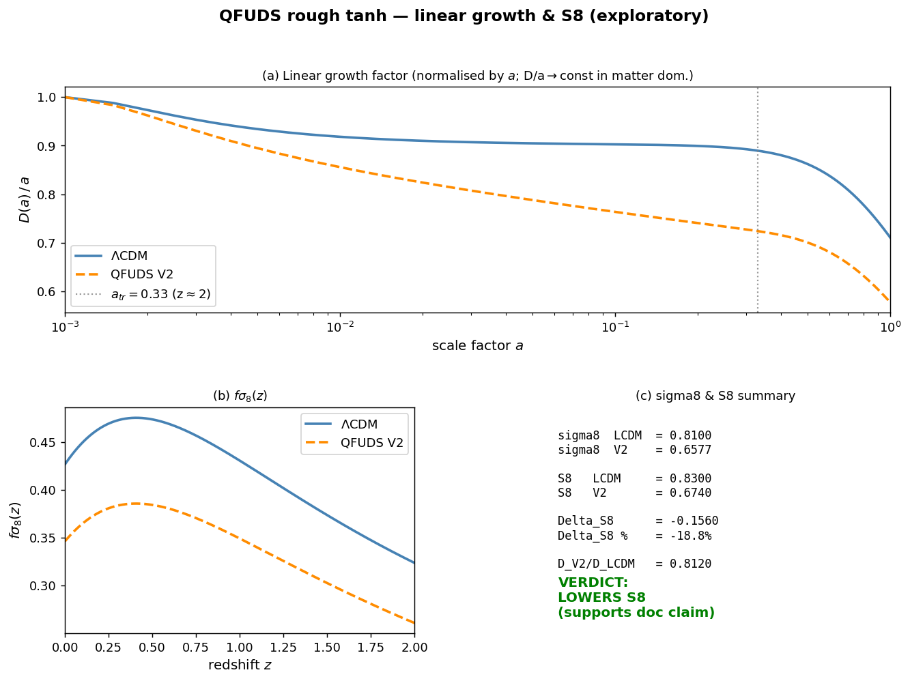
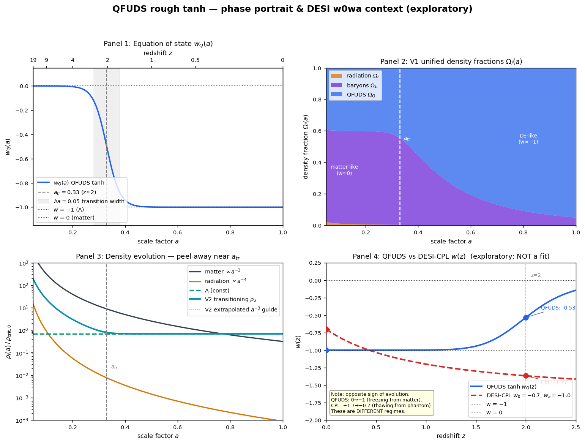
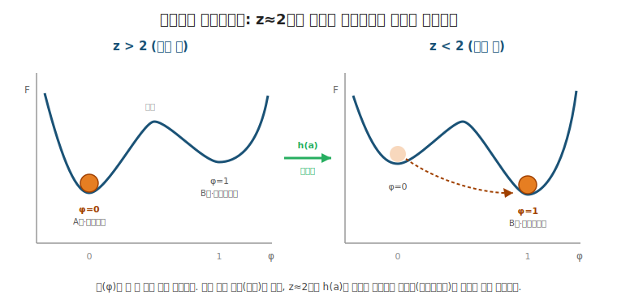

# QFUDS rough tanh 수치 스케치 - 거칠게 끝까지 밀면 어디까지 가나

## 상태 경계

이 문서는 provenance(연구 흐름 기록)다. 새 실험 결과가 아니고, QFUDS가 맞다는
주장도 아니며, 로드맵 상태를 바꾸지 않는다. observer mode는 그대로 유지된다.
현재 상태와 공식 판단은
[QFUDS Research Roadmap](../../05_next_steps/000_roadmap.md)이 정한다.

여기 담긴 곡선은 검증 증거가 아니라 **탐색용 스케치**다. 손으로 그린 현상론적
매개화(parametrization)일 뿐, foam sector(양자 거품 부문, QFUDS가 가정하는
미시구조) 자체에서 유도한 것이 하나도 없다. 읽는 사람은 이 문서를 "거친 아이디어를
말 대신 곡선으로 한 번 밀어본 기록"으로만 받아들여야 한다.

## 무엇을 한 것인가

처음 떠올린 가장 거친 아이디어를 그대로 코드로 밀어봤다. 그 아이디어는 이거였다.

```text
쉬운 비유
-> 물처럼 하나의 재료가 z≈2(우주 나이의 약 1/3 시점) 근처에서 모습을 바꾼다
원래 과학 용어
-> 통합 암흑 유체의 상태방정식 w(a)(압력÷에너지밀도 비)가 0에서 -1로
   매끄럽게 전환(tanh = 쌍곡탄젠트, S자 형태로 부드럽게 휘는 함수)
지금 레포에서의 의미
-> retained timing hook(z≈2 부근 전이 지점, 살아남은 가설 단서)의 가장
   단순한 수치 실현을 ΛCDM과 비교
```

질문은 하나였다. **이 거친 모델을 실제로 끝까지 밀면 ΛCDM(현재 표준으로 쓰는 우주
모형. 우주에 보통 물질 + 차가운 암흑물질 + 우주상수 Λ가 있다고 보는 모형이며, 이
문서 내내 "정답에 가장 가까운 비교 기준"으로 등장한다) 대비 어디까지 갈까?**

코드와 그림은 [`assets/004_rough_tanh/`](assets/004_rough_tanh/)에 있다.
`model.py`가 공유 계약서(여러 스크립트가 똑같이 쓰는 파라미터, w(a), H(a)를 한곳에
모아 둔 파일)이고, `background.py`, `growth.py`, `phase.py`가 각각 배경팽창(우주
전체가 부풀어 오르는 속도), 구조성장(별·은하 같은 덩어리가 자라는 정도), 위상
초상화(상태방정식 w가 시간에 따라 어떻게 움직이는지 그린 그림)를 계산한다.

## 이 문서를 읽기 전에 알아야 할 두 가지

이 문서 전체에 계속 나오는 핵심 개념이 둘 있다. 이 둘만 정확히 잡고 가면 나머지는
따라온다.

**(1) S8 tension(S8 긴장).** S8은 "우주가 평균적으로 얼마나 울퉁불퉁하게, 곧
은하·은하단 같은 덩어리로 뭉쳐 있는가"를 나타내는 한 숫자다(정확히는
S8 = σ₈·√(Ω_m/0.3), σ₈는 약 8 Mpc 크기 영역의 밀도 출렁임 크기, Ω_m은 물질 비율).
문제는, 우주 *초기*의 흔적인 우주배경복사(CMB)로 추정한 S8(약 0.83)과, 우주 *후기*의
약중력렌즈 관측으로 잰 S8(약 0.76)이 서로 어긋난다는 것이다. 이 어긋남을 **S8 tension**
이라 부른다. 이 모델이 매력적으로 보이는 이유 중 하나는, 후기에 전이를 일으켜 구조
성장을 눌러서 S8을 0.76 쪽으로 끌어내릴 수 있기 때문이다.

**(2) 050 천장.** 이 프로젝트에는 [050 문서](../research/investigations/source_x/conclusions/050_foam_sector_to_gamma_derivation_feasibility_result.md)가
정해 둔 한계선이 있다. 한 문장으로 말하면, **"QFUDS가 가정하는 거품(foam) 미시구조에서
출발해, 암흑물질·암흑에너지의 전이를 *유도*해 내는 것은 현재 불가능(blocked)하다"**는
것이다. 이걸 이 문서에서는 줄여서 **050 천장**이라 부른다. 즉 우리는 데이터에 맞는
곡선을 *그릴* 수는 있어도, 그 곡선이 *왜* 그래야 하는지를 더 근본 원리에서 *끌어낼*
수는 없다. 그 못 넘는 한계선이 곧 천장이다. 이 문서의 거의 모든 결론은 "여기까지는
가지만 결국 050 천장에 막힌다"로 끝난다.

> 이 문서는 **append 로그**다. 각 체크포인트(CP)는 이전 것을 덮어쓰지 않고 아래로
> 쌓인다. 결론도 체크포인트별로 따로 둬서, 결과가 발전해 가는 과정을 그대로
> 보존한다.

## CP1 (2026-06-12): rough tanh - 배경 / 성장 / 위상

## 모델 한 줄

```text
w(a) = tanh로 0(암흑물질처럼) -> -1(진공압처럼), 전환 중심 a_tr=0.33 (z≈2)
```

여기서 w는 상태방정식(어떤 재료의 *압력 ÷ 에너지밀도* 비율)이다. w=0이면 보통
물질처럼 무게로 잡아당기기만 하고, w=−1이면 진공처럼 *밀어내는 압력*으로 우주를
가속시킨다. 즉 이 한 줄은 "암흑 재료가 처음엔 물질처럼 굴다가 z≈2(우주 나이가
지금의 약 1/3이던 시점) 부근에서 진공처럼 바뀐다"는 가설을, tanh(S자로 부드럽게
휘는 함수)로 매끄럽게 이어 붙인 것이다.

두 가지로 실현해 봤다.

- V1 통합(unified): 하나의 유체가 암흑물질 + 암흑에너지를 모두 대신함. 즉 재료 하나로
  두 역할을 다 시킴.
- V2 DE-only(암흑에너지 전용): 보통 물질은 그대로 두고, 암흑에너지 성분만 전환함.
  즉 물질은 건드리지 않고 가속을 일으키는 부분만 바꿈.

## 세 가지 발견

| 축 | 발견 | 판정 |
| --- | --- | --- |
| 배경팽창 | V1은 z=5에서 H(허블 팽창률, 우주가 부푸는 속도)가 ΛCDM의 약 절반(E비 = H/H₀ = 0.51, 즉 현재 속도 대비 비율이 절반밖에 안 됨). V2는 z=5에서 1.03이고 거리지수(별까지의 거리를 밝기로 환산한 값) 차이가 전 구간 0.018 mag 미만(Type Ia 초신성, 곧 밝기가 일정해 '우주의 표준 자'로 쓰는 폭발의 측정 오차 ≈0.05 mag 이내라서 묻힘) | V1은 초기우주에서 즉시 깨짐. V2 배경은 초신성으로 ΛCDM과 구별 불가 |
| 구조성장(S8 = σ₈·√(Ω_m/0.3). σ₈는 '8 Mpc(약 2600만 광년) 크기 영역에서 우주가 얼마나 울퉁불퉁한가'를 나타내고, S8는 거기에 물질 비율 보정을 곱한 합성 지표) | V2가 성장을 약 19% 억제. σ₈ 0.81 → 0.66, S8 0.83 → 0.67 | 방향은 메모 주장대로 S8를 낮춤. 다만 관측이 원하는 ≈0.76보다 더 내려가 과도하게 오버슈트(목표를 지나쳐 너무 많이 내려감) |
| 위상(수백만 은하의 빛을 분광해 암흑에너지를 재는 대형 관측 DESI와 비교) | QFUDS tanh는 w가 0 → -1(시간이 갈수록 더 음으로 가는 방향. 이렇게 −1을 향해 굳어가는 흐름을 freezing=동결이라 부름). DESI w0wa 중심값은 w가 약 -1.7 → -0.7(반대로 −1에서 풀려나는 방향. 이건 thawing=해동). z=2에서 각각 -0.53 vs -1.37 | 부호와 메커니즘이 정반대 영역(regime, 작동 방식이 통째로 다른 구간). 메모가 기대한 "DESI와 일치"는 성립하지 않음 |

아래 세 그림이 이 발견을 그대로 보여 준다. 왼쪽부터 배경팽창, 구조성장, 위상이다.






## 그래서 어디까지 가나

간다. 거칠게 만든 V2는 배경팽창을 ΛCDM 수준으로 재현하고(초신성 관측으로는 둘을
구분 못 함), 구조성장 S8를 관측이 원하는 방향(아래쪽)으로 움직인다. 즉 *"z≈2 전환으로
S8를 건드리는 현상론 모델"*(미시 원리에서 유도한 게 아니라, 곡선을 손으로 맞춰
현상만 흉내 낸 모델)까지는 실제로 도달한다. 곡선으로 확인됐다.

그리고 멈춘다. 벽은 세 개다.

1. 순진한(naive) 통합(V1)은 그냥 깨진다. 재료 하나에 정규화(전체 양을 맞추는 기준값)를
   딱 하나만 줘서 두 역할을 다 시키면, 초기우주의 물질량이 눌려 z>2에서 팽창 속도가
   ΛCDM의 절반이 된다. 살리려면 물질을 따로 빼야 하는데(V2), 그 순간 "재료 하나로
   통합한다"는 원래 맛이 빠진다.
2. S8 오버슈트(목표보다 너무 많이 내려간 것)는 "정답을 맞췄다"가 아니라, 자유
   파라미터(우리가 손으로 마음대로 정할 수 있는 값. 여기선 전환 시점 a_tr와 전환
   폭 Δa)가 손에 쥐어져 있다는 뜻이다. 숫자가 그럴듯해도 우리가 넣은 만큼 나온
   것이지, 모델이 스스로 예측한 게 아니다.
3. 메모가 가장 기대했던 외부 지지(DESI가 본 evolving-w, 즉 시간에 따라 변하는 w
   신호)가 부호도 작동 방식도 모두 반대였다. 타이밍 직관이 기댈 곳 하나가 사라졌다.

## 천장의 정체

세 결과를 한마디로 꿰면, 이미 레포가 내려 둔 판단과 같다.

```text
이 모든 건 현상론이다. foam sector에서 유도한 것이 하나도 없다.
```

쉽게 말하면, 천장이란 이런 것이다. 우리는 데이터에 맞는 곡선을 *그릴* 수는 있지만,
그 곡선이 *왜* 그 모양이어야 하는지를 더 근본적인 원리에서 *유도*하지는 못한다.
w(a)=tanh(...)는 손으로 그린 곡선이고, a_tr=0.33을 z=2에 맞춘 것도 우리가 직접 넣은
입력값이다.
[049 Level 2B 적격성 검토](../research/investigations/source_x/conclusions/049_level2b_eligibility_review_and_observer_mode.md)와
[050 foam-sector-to-Gamma 유도 가능성](../research/investigations/source_x/conclusions/050_foam_sector_to_gamma_derivation_feasibility_result.md)가
말한 "상태변수와 최소 수식 객체 부재"(즉, 거품 미시 이론에서 출발해 곡선을 끌어낼
수식 토대가 아직 없다는 것)가 여기서도 그대로 살아 있다. 곡선은 데이터를 흉내 낼 수
있어도, "거품(foam)에서 암흑물질·암흑에너지가 저절로 생겨난다"는 근본 주장은 전혀
건드리지 못한다. 이 스케치는 그 천장(넘지 못하는 한계선)을 곡선으로 다시 확인한
것이다.

DESI 비교는 로드맵의 생존 hook(이 가설이 살아 있으려면 통과해야 하는 최소 조건들:
`w0 ≈ -1`, `|wa| > 0`, `z ≈ 2` 부근에 전이 봉우리가 있을 것)에 실질적 단서를 하나
더한다. 순진한 tanh 실현은 현재값 `w0 ≈ -1`은 맞지만, w가 시간에 따라 *변해 가는
방향*이 DESI가 선호하는 thawing(해동, −1에서 풀려나는 방향)과 반대다. 즉 우리가
붙잡고 있는 timing(z≈2 전이) 단서를 데이터와 맞추려면, 단순한 0 → −1 전환 이상의
무언가가 필요하다는 뜻이다. 이건 외부 관측을 계속 지켜보며 추적할 대상이지, 레포
안에서 곧장 유도할 수 있는 대상이 아니다.

### CP1 결론 (2026-06-12)

```text
거칠게 끝까지 밀면: z≈2 전환형 현상론 우주론 한 편의 출발점까지는 간다.
거기서 멈춘다: 상태변수가 없어서 곡선맞춤을 넘지 못한다.
덤으로 알게 된 것: naive 0->-1 전환은 DESI evolving-w와 방향이 반대다.
```

## CP2 (2026-06-12): 상태변수를 방정식으로 굴리기

다음 질문은 자연스러웠다. "w(a)를 손으로 그리지 말고, *상태변수*(시스템이 지금 어떤
상태인지 나타내는 단 하나의 숫자) 하나가 방정식을 따라 움직여서 w가 *저절로 나오게*
할 수 있나?" 이것이 049/050이 말한 "최소 수식 객체"(곡선을 손으로 그리지 않고
끌어내는 최소한의 수식 틀)의 형태다.

거품을 하나의 매질(물·젤리처럼 연속적으로 채워진 재료)로 보면 식의 꼴이 정해진다.
유체 방정식인 나비에-스토크스를 문자 그대로 거꾸로 푸는 건 backward diffusion(시간을
거꾸로 돌리는 확산)이라 ill-posed(답이 발산해서 풀 수 없는 문제)지만, 그 직감("매질 =
서서히 안정 상태로 풀려가는 장")만 살리면, 상전이(물이 얼음으로 바뀌듯 상태가 바뀌는
현상)의 order parameter(상이 얼마나 바뀌었는지 0–1로 나타내는 양)가 자유에너지(낮을수록
안정한, 일종의 위치에너지 지형) 안에서 골짜기로 굴러떨어지며 안정되는 동역학이 된다.

```text
상태변수 φ            (0 = A상/암흑물질, 1 = B상/암흑에너지. 즉 φ가 0에서 1로 가면 상이 바뀜)
이중우물 자유에너지   F(φ, a) + z≈2에서 기울기를 뒤집는 tilt h(a)
                     (골짜기가 두 개인 지형. 처음엔 왼쪽 골이 낮다가, z≈2에서 h가
                      지형을 기울여 오른쪽 골이 낮아짐 → 공이 그쪽으로 굴러감)
이완 방정식           dφ/dN = -M ∂F/∂φ   (N = ln a, 시간 대신 쓰는 로그 눈금.
                     공이 경사를 따라 내려가는 속도식이라고 보면 됨. M은 잘 미끄러지는 정도)
나오는 것             w_eff(a) = -φ(a)   (w가 입력이 아니라, φ의 움직임에서 자동으로 나옴)
```

말로만 보면 헷갈리니 그림으로 보자. 자유에너지 F는 골짜기가 두 개인 지형이고,
상태 φ는 그 위의 공이다. 공은 늘 더 낮은 골로 굴러떨어진다(이게 위 이완 방정식의
뜻이다). 전이 *전*에는 왼쪽 골(물질, φ=0)이 낮아 공이 거기 있고, z≈2에서 구동항 h(a)가
지형을 기울이면 오른쪽 골(암흑에너지, φ=1)이 더 낮아져 공이 그쪽으로 굴러간다. 이게
바로 w가 0에서 −1로 바뀌는 전이다.



실제로 돌려보니([`state_variable.py`](assets/004_rough_tanh/state_variable.py),
[`fig_state_variable.png`](assets/004_rough_tanh/fig_state_variable.png)),
맨 tanh가 못 하는 세 가지가 나왔다.

| 발견 | 의미 |
| --- | --- |
| w(a)가 입력이 아니라 출력이 됨 | φ가 방정식을 따라 굴러서 w가 결과로 나온다. 손그림 곡선에서 한 칸 올라간 형태(우리가 그리지 않아도 식이 곡선을 만들어 줌) |
| 일반적 지연(lag) | 전이를 시작시키는 방아쇠(trigger=지형을 기울이는 tilt)를 z=2에 둬도, 실제 전이는 z<1에서야 늦게 끝난다. 공이 경사를 다 굴러내려가는 데 시간이 걸리는 셈. 손그림 tanh가 숨겼던 결합 |
| super-cooling 실패 영역 | 두 골 사이 장벽이 높으면 φ가 false vacuum(가짜 안정 상태, 진짜 더 낮은 골로 못 넘어간 채 갇힌 상태)에 머물러 오늘까지도 암흑에너지가 안 생긴다. "전이를 끝까지 완성해야 한다"는 구조적 제약 |

특히 지연(②)이 실질적이다. 관측이 원하는 "전이 z≈2"를 얻으려면, 방아쇠를 z=2보다
더 일찍 당겨 두고 이동도(mobility, 공이 미끄러지는 정도)를 맞춰야 한다. tanh는 이
둘의 결합을 z=2에 손으로 박아 넣어 숨겼던 것이다. 덧붙여, 지연(lag)과
이력현상(hysteresis, 한 번 지나간 길과 되돌아오는 길이 달라지는 현상. 자석을 자화할
때 곡선이 어긋나는 것과 같음)은 이 동역학이 비가역적이라는 것, 즉 시간의 방향(과거
→ 미래)이 방정식 안에 이미 새겨져 있다는 뜻이다.

천장은 그대로다. 다만 자의성(우리 맘대로 정하는 정도)을 한 칸 줄였을 뿐이다. 전에는
w(a)=tanh 곡선 자체를 손으로 그렸고, 이제는 지형 F(φ,a)와 그걸 기울이는 구동항
h(a)를 손으로 그린다. 대신 이번엔 파라미터마다 물리적 뜻이 붙고(골 사이 장벽=잠열,
즉 상이 바뀔 때 드나드는 숨은 열 / M=얼마나 빨리 풀려가는지 / h=무엇이 전이를
미는지), 검증 가능한 신호(지연·과냉각·이력현상)가 딸려 나온다. 진짜 050 천장
(h(a)를 거품 미시구조에서 *유도*하는 것)은 못 넘었지만, "곡선 한 개"에서 "방정식 +
검증 가능한 부수효과"로 한 칸 올라간 것은 맞다.

다음으로 파고들 방향은, h(a)를 아무렇게나 정한 함수에서 벗어나 실제 물리량(물질밀도
`rho_m(a)`, 즉 우주에 물질이 얼마나 빽빽한지)에 연결해서, 전이가 시작되는 적색편이를
우리가 임의로 넣은 입력이 아니라 임계밀도(전이가 일어나는 기준 밀도) 하나에서 끌어내는
것이다.

### CP2 결론 (2026-06-12)

```text
상태변수 φ를 자유에너지 안에서 굴리면 w가 출력으로 나온다 (더 이상 손으로 안 그림).
부수효과: 지연(lag), super-cooling 실패영역, hysteresis - 모두 검증가능.
형태는 CP1보다 한 칸 올라가지만, 천장(h(a)를 foam에서 유도)은 그대로.
다음(CP3): h(a)를 물질밀도 rho_m(a)에 연동해 trigger를 임계밀도에서 유도한다.
```

## CP3 (2026-06-12): 전이를 물질밀도 rho_m(a)로 구동

CP2의 지형 기울이는 항 h(a)는 아직 손으로 그린 함수였다. CP3은 그걸 **실제 물리량**에
묶었다. 직관은 단순하다. 거품이 빽빽하던 초기 우주에서는 뭉치려는 A상(물질 같은
상태)이 유리하고, 우주가 부풀어 묽어진 후기에는 밀어내는 B상(진공압 상태)이 유리하다.
그래서 지형 기울기를, 물질밀도가 임계밀도 `rho*`를 얼마나 넘는지로 정의했다.

```text
h(a) = lambda * ( rho_m(a)/rho* - 1 ) = lambda * ( (a*/a)^3 - 1 )
       (현재 밀도가 기준 밀도 rho*보다 진하면 +, 묽으면 - 쪽으로 지형을 기울임.
        lambda는 그 기울임의 세기)
a* = 1/(1+z*) : rho_m = rho* 가 되는 시점 (밀도가 딱 기준값과 같아지는 적색편이 z*)
```

이제 위치 파라미터가 `{a_tr, Δa}`(전이 시점과 폭, 둘 다 임의)라는 한 쌍에서, **물리적인
임계밀도 하나(z*로 표현)**로 줄었다. 전이 시점이 우리가 손으로 깔아 넣는 입력이 아니라
임계밀도에서 끌려 나오고, 거기에 CP2의 지연(공이 다 굴러내려가는 데 걸리는 시간)이
얹힌다.

기준 적색편이 z*(전이 결정이 내려지는 시점)를 바꿔가며, 실제로 눈에 보이는 전이
(w가 중간값 −0.5를 지나는 지점)가 어디에 찍히는지 본 결과
([`density_driven.py`](assets/004_rough_tanh/density_driven.py),
[`fig_density_driven.png`](assets/004_rough_tanh/fig_density_driven.png)):

| trigger z* (임계밀도) | 관측 전이 z_obs | 지연 Δz | w(z=0) |
| --- | --- | --- | --- |
| 2.0 | 0.53 | 1.47 | -1.000 |
| 3.0 | 1.04 | 1.96 | -1.000 |
| 4.0 | 1.55 | 2.45 | -1.000 |
| 5.0 | 2.05 | 2.95 | -1.000 |

두 가지가 나왔다.

1. retained hook인 **관측 전이 z≈2를 얻으려면 임계밀도가 z*≈5에 있어야 한다.** 즉
   거품은 z≈5(훨씬 빽빽한 시점)에 "전이 결정"을 내리지만, 이완 지연 때문에 눈에
   보이는 전이는 z≈2로 늦어진다. 맨 tanh는 이 결합을 z=2에 손으로 깔아 넣어 숨겼다.
2. 그렇게 튜닝한 밀도구동 w(a)를 다시 배경에 먹여도 거리지수가 ΛCDM과
   `max|Δμ| = 0.017 mag (< 0.05)` 로 **여전히 초신성으로 구별 불가**다. CP1의 V2
   결과와 일관되게 닫힌다.

천장은 그대로다. z*는 이제 물리적이지만 `rho*` 자체(왜 그 임계밀도냐)와 장벽·이완률은
여전히 선택값이다. 다만 "왜 z≈2냐"라는 질문이 "왜 임계밀도가 z*≈5에 대응하냐"라는
더 물리적인 질문으로 바뀌었다. 이것이 050 천장을 향해 한 칸 더 좁힌 지점이다.

### CP3 결론 (2026-06-12)

```text
전이를 임계밀도 하나로 구동하면 trigger 시점이 유도된다 (임의 입력 제거).
관측 전이 z≈2를 보려면 임계밀도가 z*≈5에 있어야 한다 (지연 Δz≈3).
배경은 여전히 ΛCDM과 SNe로 구별 불가 (max|Δμ|=0.017).
남은 천장: rho*(왜 그 밀도냐) + 장벽 + 이완률은 아직 선택값. 050 그대로.
```

## CP4 (2026-06-12): 밀도구동 모델로 성장 / S8 루프 닫기

CP1에서 hand-tanh V2가 S8를 0.83 -> 0.67로 약 19% 과하게 낮춘 걸 봤다. CP3의
밀도구동 모델은 관측 전이는 같은 z≈2지만 모양이 다르다(z*=5 트리거 + 지연으로 더
가파르고 늦게 완성). 그래서 물었다. **모양을 바꾸면 오버슈트가 줄어드나?**

세 배경(ΛCDM / CP1 hand-tanh / CP3 밀도구동)에 같은 군집물질 Ω_m0=0.315로 선형
성장을 풀었다([`cp4_growth.py`](assets/004_rough_tanh/cp4_growth.py),
[`fig_cp4_growth.png`](assets/004_rough_tanh/fig_cp4_growth.png)).

| 모델 | D(1)/D_ΛCDM | sigma8 | S8 | ΔS8 |
| --- | --- | --- | --- | --- |
| ΛCDM | 1.000 | 0.810 | 0.830 | — |
| CP1 hand-tanh V2 | 0.812 | 0.658 | 0.674 | -18.8% |
| CP3 밀도구동 | 0.816 | 0.661 | 0.677 | -18.4% |

**거의 차이가 없다.** 성장곡선도, 성장 속도를 나타내는 fσ8(구조가 자라는 속도에
σ8을 곱한 관측량)도 CP1과 CP3가 겹친다. 즉 전이의 *모양*(매끄러운 tanh냐, 가파르고
늦게 끝나는 모양이냐)을 바꿔도 S8 오버슈트는 줄지 않는다. 둘 다 관측치 S8≈0.76보다
한참 아래인 0.68로 내려간다.

이건 의미 있는 **음성 결과**(원하는 게 안 됐다는 것을 분명히 보여 주는, 그래서 오히려
유용한 결과)다. S8를 과하게 낮추는 진짜 원인은 전이의 모양이 아니라, **z≈2까지 가는
동안 암흑부문(전체의 약 68%, Ω_X≈0.685)이 얼마나 매끄럽게, 곧 덩어리로 안 뭉치고
변하느냐**다. 모양은 곁가지이고, 전이 *시점*과 최종 *상분율*(어느 상이 얼마나
차지하느냐)이 결과를 지배한다.

그리고 이건 003 문서의
["c_eff² = 0은 해결책이 아니라 미해결 조건"](003_research_flow_plain_language_ko.md)
절에 구체적 숫자를 붙인다. 전이 성분을 매끄럽다고(c_eff²=1이면 압력이 빛처럼 빨리
퍼져서 군집을 안 함) 두면 성장이 과하게 눌린다. 반대로 c_eff²=0(압력이 안 퍼져서
보통 물질처럼 뭉침)이면 안 눌리지만, 그러면 섭동(작은 밀도 출렁임)에서 암흑에너지답지
않게 행동한다. 결국 S8를 움직이는 레버는 전이 모양이 아니라 바로 이 **c_eff² 미해결
조건**(0도 1도 만족스럽지 않은, 아직 못 정한 값)에 걸려 있다.

### CP4 결론 (2026-06-12)

```text
밀도구동(CP3)도 S8를 똑같이 0.68로 과하게 낮춘다 (CP1과 사실상 동일).
전이 모양을 바꿔도 오버슈트는 안 줄어든다 -> 오버슈트는 구조적.
진짜 레버는 전이 모양이 아니라 c_eff²(전이 성분이 군집하느냐) 미해결 조건.
다음 후보: c_eff²를 0과 1 사이로 열어 S8를 0.76에 맞출 수 있는지, 아니면
           rho*/장벽을 또 다른 물리상수에 묶어 050 천장을 직격.
```

## CP5 (2026-06-12): c_eff²를 열어 S8가 고쳐지는지 본다

CP4가 가리킨 진짜 레버를 직접 돌렸다. 여기서 c_eff²(유효 음속의 제곱. 암흑 유체
안에서 압력이 변화에 얼마나 빨리 반응하는지를 나타내며, 전이 성분이 얼마나 잘
뭉치느냐를 결정하는 파라미터)가 1에 가까우면 전이 성분이 매끄러워서 군집을 안 하므로
성장이 과하게 눌리고, c_eff²가 작으면 보통 물질처럼 군집해서 안 눌린다. 그 사이
어딘가에서 관측치 S8≈0.76이 나올 수 있을까?

거친 Jeans 프록시(정밀 계산 대신 쓰는 근사. Jeans 스케일은 중력으로 뭉치려는 힘과
압력으로 퍼지려는 힘이 균형을 이루는 크기다)를 썼다. 어떤 출렁임이든 그 크기가 음속
지평선보다 작으면 압력에 눌려 못 뭉치므로(수식으로는 k·c_s > aH일 때), S8를 재는
크기 k_8에서 암흑성분이 뭉치는 효율을 η(a) = 1/(1+R²), R = c_s·c·k_8/(a·H0·E)로
두고(η는 0이면 전혀 못 뭉침, 1이면 물질처럼 다 뭉침), 성장에 기여하는 군집 비율을
Ω_m + η·Ω_X로 바꿨다
([`cp5_sound_speed.py`](assets/004_rough_tanh/cp5_sound_speed.py),
[`fig_cp5_sound_speed.png`](assets/004_rough_tanh/fig_cp5_sound_speed.png)).

결과: S8가 c_eff²에 따라 **0.677(매끄러움)–0.955(완전 군집)** 사이를 매끄럽게
움직이고, **관측 S8=0.76은 c_eff² ≈ 3e-5에서 달성된다.**


| c_eff² | S8 |
| --- | --- |
| 1.0 (매끄러움) | 0.677 |
| 1e-4 | 0.726 |
| **≈3e-5 (fit)** | **0.760** |
| 1e-6 | 0.887 |
| 1e-8 (완전 군집) | 0.955 |

즉 CP4의 오버슈트는 **치명적이 아니라 고칠 수 있다.** 단, 그 대가는 **아주 작은
음속(c_eff²≈3e-5)이라는 파라미터를 하나 더 손으로 맞추는 것**이다. 이것이 정확히
003이 말한 "c_eff²=0은 해결책이 아니라 미해결 조건"이다. 이제 그 미해결 조건에
숫자가 붙었다: 관측을 맞추려면 c_eff²가 1보다 5자리수 작아야 한다.

주의: 이 η는 거친 프록시다. 정확한 값(3e-5인지 1e-4인지)은 CLASS의 clustering-DE
섭동 계산이 필요하고 그건 Level 3 = blocked이다. 하지만 정성적 결론("S8를 맞추는
작은 c_eff²가 존재한다 = 오버슈트는 튜닝으로 치료가능하지만 유도는 아니다")은 견고하다.

### CP5 결론 (2026-06-12)

```text
S8 오버슈트는 치명적이 아니다. c_eff² ≈ 3e-5에서 관측 0.76이 나온다.
대가: 아주 작은 음속이라는 튜닝 파라미터 하나 추가 (003의 미해결 조건).
"살아있나?" -> 현상론으로는 S8 시험도 통과. 단 생존마다 파라미터가 하나씩 는다.
050 천장(c_eff²/rho*/장벽을 foam에서 유도)은 그대로. 관측 우월성도 아직 없음.
```

## CP6 (2026-06-12): 천장 직격(6a)과 반증 설계(6b) - 병렬

### CP6a: 파라미터가 하나의 foam 척도로 무너지나

쌓인 튜닝 파라미터 {z*, Δa, barrier, M, c_eff²}가 하나의 물리 척도에서 나오는지
봤다([`cp6a_ceiling_probe.py`](assets/004_rough_tanh/cp6a_ceiling_probe.py),
[`fig_cp6a_ceiling.png`](assets/004_rough_tanh/fig_cp6a_ceiling.png)).

핵심은 이렇다. 장 이론에서 order parameter의 음속은 우리가 마음대로 정하는 파라미터가
아니라 운동항(장이 움직이는 방식을 정하는 식의 부분)이 자동으로 정한다. **가장 표준적인
형태의(canonical) 스칼라장은 c_eff²=1로 딱 고정된다.** c_eff²가 1보다 훨씬 작으려면
표준에서 벗어난(비표준, k-essence라 부르는) 특이한 운동항에 더해 그 자체로도 튜닝이
필요하다. 그런데 CP5가 S8를 맞추기 위해 요구한 값은 c_eff²≈3e-5였다.

- 자연스러운 canonical c_eff² = 1 -> S8 = 0.677 (오버슈트)
- S8=0.76 요구 c_eff² ≈ 3e-5 -> 둘 사이 **약 4.5 자릿수 갭**
- 단일 척도(z*=ρ*) 가정 후 파라미터 수: **5 -> 5 (하나도 안 무너짐).** barrier/M/lam은
  무차원 비, c_eff²는 운동 부문이라 위치 부문(ρ*)과 독립.

즉 CP6a는 **050 천장을 넘지 못한다.** 오히려 천장을 *수치로* 확정했다. 척도 하나로
묶는다는 가정이 자유 파라미터를 단 하나도 줄이지 못했고, c_eff²는 표준값보다 4.5자릿수
아래로 억지로 맞춰야 하는데 그 차이를 메워 줄 foam 메커니즘이 없다. 상전이 동역학은
곡선의 *형태*만 줄 뿐, 그 거품 고유의 *숫자*는 QFUDS가 미시구조에서 채워 넣어야 할
빈자리로 남는다.

### CP6b: 어디서 죽일 수 있나 (반증 설계)

배경(SNe μ, BAO 거리)은 CP1에서 이미 ΛCDM과 구별 불가다. 그래서 구별 가능한 곳을
찾았다([`cp6b_falsification.py`](assets/004_rough_tanh/cp6b_falsification.py),
[`fig_cp6b_falsification.png`](assets/004_rough_tanh/fig_cp6b_falsification.png)).

| 관측량 | ΛCDM과 차이 | 죽이는 조건 |
| --- | --- | --- |
| SNe μ(z) (초신성으로 잰 거리지수) | 거의 없음 (<0.02 mag) | 배경 관측으로는 반증 불가 |
| BAO 거리 (우주 표준자로 잰 거리) | 거의 없음 (배경을 그대로 따라감) | 반증 불가 |
| fσ8(z)/RSD (은하들이 모여드는 속도. RSD = 적색편이 공간 왜곡, 은하 속도가 지도를 살짝 찌그러뜨리는 효과로 측정) | QFUDS가 ΛCDM보다 ≈7–8% 낮음. 거친 χ²(데이터와 모델의 어긋남 합산): ΛCDM 6.2 vs QFUDS 12.0 (7점) | 약하게 불리. z=0.5–0.9 구간을 ≈5% 정밀도로 재면 판별 가능 |
| **w(z)/DESI w0wa** (DESI가 w를 현재값 w0와 변화율 wa 두 수로 요약한 것) | **정반대 방향.** QFUDS는 freezing(0→−1로 굳어감), DESI 중심값은 thawing(−1.7→−0.7로 풀려감). z=2에서 두 w의 차이 \|Δw\|=0.72 | **가장 약한 고리(가장 깨지기 쉬운 곳).** DESI의 thawing(wa<0)이 3σ로 굳어지면 freezing 모델은 사망 |

w(z) 값을 직접 보면: z=0에서 QFUDS −1.00 / DESI −0.70, z=2에서 QFUDS −0.65 /
DESI −1.37. z≈0.5 부근에서 두 곡선이 한 번 교차해 그 지점에서는 구별이 안 되지만,
z≳1부터 확연히 갈라진다.

### CP6 결론 (2026-06-12)

```text
CP6a: 파라미터는 단일 foam 척도로 안 무너진다 (5->5). c_eff²는 canonical 1에서
      4.5자릿수 떨어져야 하고 메울 foam 메커니즘 없음. 050 천장 = 수치로 재확인.
CP6b: 이 모델은 배경/BAO로는 ΛCDM과 구별 불가, fσ8로 약하게 불리,
      w(z) freezing vs DESI thawing이 가장 강한 킬러 (z≳1).
종합: rough QFUDS는 "데이터에 맞출 수 있다"까지 왔지만 "ΛCDM보다 낫다"도,
      "foam에서 유도된다"도 아직 아니다. 가장 빨리 죽일 수 있는 곳은 DESI w0wa.
```

## CP7 (2026-06-12): brute-force 현상론 피팅 - 끼워맞추면 어디까지

우리가 손으로 정해야 하는 자유 파라미터들을, 문헌이 정해 둔 그럴듯한 범위(prior, 사전
허용 구간) 안에서 격자처럼 촘촘히 훑어 데이터에 최대한 끼워 맞췄다. 훑은 범위: z\*∈{2..6},
c_eff²∈logspace(-7,-2)(즉 10⁻⁷에서 10⁻²까지 로그 간격), Ω_m0∈{0.29,0.31,0.33}.
맞출 목표: RSD fσ8 7개 점 + 약중력렌즈 S8=0.76±0.02 + 배경 거리지수 차이 \|Δμ\|<0.10
이라는 통과 조건.
([`cp7_brute_fit.py`](assets/004_rough_tanh/cp7_brute_fit.py),
[`fig_cp7_brute_fit.png`](assets/004_rough_tanh/fig_cp7_brute_fit.png);
스캔 격자 [`cp7_brute_fit_scan.csv`](assets/004_rough_tanh/cp7_brute_fit_scan.csv),
요약 [`cp7_brute_fit_summary.csv`](assets/004_rough_tanh/cp7_brute_fit_summary.csv))

| 모델 | S8 | χ²_fσ8 | χ²_S8 | χ²_tot | k | AIC |
| --- | --- | --- | --- | --- | --- | --- |
| ΛCDM | 0.830 | 6.22 | 12.25 | 18.47 | 1 | 20.47 |
| **QFUDS best** (z\*=6, Ω_m0=0.29, c_eff²=4.6e-6) | 0.778 | 7.24 | 0.81 | 8.05 | 4 | **16.05** |

명목상으로는 **QFUDS가 AIC로 4.42만큼 이긴다.** AIC(아카이케 정보 기준)는 "데이터를
잘 맞추되, 파라미터를 많이 쓴 만큼은 깎는" 점수라서 낮을수록 좋다. 파라미터를 3개 더
쓰고도 이겼다는 건, 그만큼 데이터를 더 잘 맞췄다는 뜻이다. fσ8은 ΛCDM과 비슷하게
맞추면서(7.24 vs 6.22) S8 쪽을 훨씬 잘 맞춘다(0.81 vs 12.25).

**그런데 이 승리는 전적으로 S8 덕분이다.** 정직하게 단서를 달아 둔다:

1. ΛCDM이 지는 이유는 단 하나, ΛCDM의 S8=0.83이 약중력렌즈 관측 0.76에서 3.5σ나
   떨어져 큰 벌점(χ²_S8=12.25)을 무는 것뿐이다. **즉 S8를 0.78로 낮추는 *어떤* 모델이든**
   (wCDM이든, 그냥 σ8을 낮춘 모델이든) 똑같이 이긴다. QFUDS만의 고유한 승리가 아니다.
2. 최적값의 c_eff²=4.6e-6은 CP6a가 말한 바로 그 **억지로 작게 맞춘 음속**이다(표준값
   1에서 5자릿수 아래). 050 천장은 그대로다.
3. 분석 자체가 거칠다. Jeans 근사를 썼고, 대표 데이터만 썼으며(오차들끼리의 상관관계를
   담은 공분산이 없다), S8를 반드시 통과해야 할 강한 조건으로 둔 것 자체가 이미 일종의
   모델 선택이다. 제대로 하려면 CLASS likelihood 계산이 필요한데 그건 Level 3이라 막혀
   있다.
4. RSD fσ8만 보면 S8≈0.78–0.83(ΛCDM 근처)을 선호하고, 약중력렌즈는 0.76을 원한다.
   모델은 그 사이 0.78에 앉아 둘을 절충한다(그림 b의 줄다리기 모양).

### CP7 결론 (2026-06-12)

```text
brute-force로 끼워맞추면: 명목상 ΛCDM을 AIC로 이기는 지점까지 간다 (χ²_tot 18->8).
단 그 승리는 S8를 낮춘 덕분이고, S8 낮추는 어떤 모델이든 똑같이 이긴다 = QFUDS 고유 아님.
대가: c_eff²=4.6e-6 fine-tune (050 천장) + 파라미터 4개 + 거친 분석.
한 줄: "데이터에 맞출 수 있다"를 넘어 "명목상 이길 수도 있다"까지 가지만,
       그건 튜닝의 힘이지 새 물리도 우월성도 아니다. 진짜 판정은 CLASS likelihood(Level 3, blocked).
```

## CP8 (2026-06-12): c_eff²를 dial 말고 rough 도출 시도

CP5–CP7은 c_eff²를 데이터에 맞게 돌렸다(best≈4.6e-6). CP8은 묻는다. **어떤
물리량이 그 값을 *내놓나*, 아니면 거품 전제는 다른 값을 주나?**

물리적 파라미터 = 질서변수(order parameter)의 **상관길이 ξ**(공간적으로 한 점의
상태가 평균적으로 다른 점에 영향을 미치는 거리). 자유에너지에 기울기(gradient)
항을 넣으면 장은 ξ보다 작은 요동을 매끄럽게 지우고, 섭동 음속도 같은
강성(stiffness, 변화에 대한 저항)이 결정한다.

```text
c_eff ≈ ξ / d_H      (음속 지평선 ≈ 상관길이, d_H = c/H0 ≈ 4448 Mpc)
c_eff² ≈ (ξ H0 / c)²
```

즉 c_eff²는 자유값이 아니라 **거품의 상관길이를 정하면 따라 나온다.** 계산 결과
([`cp8_ceff2_derivation.py`](assets/004_rough_tanh/cp8_ceff2_derivation.py),
[`fig_cp8_ceff2_derivation.png`](assets/004_rough_tanh/fig_cp8_ceff2_derivation.png)):

| 상관길이 ξ | c_eff² | S8 |
| --- | --- | --- |
| 미시 거품 ξ≤1 Mpc | →0 (5e-8 이하) | **0.95 (너무 높음)** |
| 구조 스케일 ξ≈10 Mpc | ≈5e-6 | 0.82 |
| 데이터 fit (c_eff²=4.6e-6) | → ξ≈**9.5 Mpc** | ≈0.78–0.82 |
| Hubble ξ≈c/H0 | ≈1 | 0.68 (오버슈트) |

핵심: **데이터가 원하는 c_eff²≈4.6e-6은 상관길이 ξ≈10 Mpc = 우주 거대구조(cosmic
web) 스케일에 대응한다.** 그런데 "양자 거품"이라는 전제는 ξ가 **미시적**이어야
한다(Planck–은하 이하). 미시 거품이면 c_eff²→0 → 암흑성분이 CDM처럼 완전히 뭉쳐
**S8≈0.95로 오히려 ΛCDM(0.83)보다 더 높아지고 관측 0.76에서 더 멀어진다.**

즉 **rough 도출은 fit 값을 자연스럽게 내놓지 못한다.** 오히려 거품 전제(미시 ξ)는
S8를 *틀린 방향*으로(높게) 민다. 맞추려면 ξ를 10 Mpc로 키워야 하는데 그건 거품이
아니라 구조 스케일이다. 이것이 050 천장을 **c_eff² 쪽에서** 재확인한 것이다. 이번엔
"왜 막히나"에 물리적 의미가 붙었다: *데이터가 원하는 음속은 미시 거품이 아니라
10 Mpc 상관길이를 요구한다.*

### CP8 결론 (2026-06-12)

```text
c_eff² rough 도출(상관길이 ξ 경유): 데이터 fit 값 4.6e-6 = ξ≈10 Mpc(구조 스케일).
미시 '양자 거품'(ξ≪Mpc) -> c_eff²→0 -> S8≈0.95 (틀린 방향, ΛCDM보다 나쁨).
=> 자연스러운 거품 상관길이는 fit을 못 만든다. 도출 실패 = 050 천장 재확인.
의미: dial한 c_eff²는 "10 Mpc 상관길이"라는 비-거품 스케일을 숨기고 있었다.
```

## CP9 (2026-06-12): ξ를 약중력렌즈 P(k) 모양과 직접 대보기

CP8의 ξ는 단순히 S8(적분된 진폭) 하나만 바꾸는 게 아니다. 음속 있는 암흑성분은
Jeans 스케일(중력과 압력이 균형 잡히는 길이) k_J≈1/ξ **아래**에서만 뭉치고
**위**에선 매끄럽다 → P(k)(물질 파워 스펙트럼, 스케일별 구조 진폭)를
**스케일 의존적으로** 억제한다. 반면 그냥 낮은 σ8 ΛCDM은 모든 k에서 같은 비율로 균일 억제.
**이 차이가 약중력렌즈 P(k) 모양의 판별점이다.**

스케일 의존 성장 D(k,a)를 η(k,a)=1/(1+(c_s c k/aH)²)로 풀어 억제비
T(k)=[D_QFUDS(k,1)/D_ΛCDM(1)]² ≈ P_QFUDS(k)/P_ΛCDM(k)를 구했다
([`cp9_lensing_pk.py`](assets/004_rough_tanh/cp9_lensing_pk.py)).


| ξ (c_eff²) | k_J [Mpc⁻¹] | 모양 |
| --- | --- | --- |
| ξ≈3 Mpc (5e-7) | 0.32 | k_J가 커서 꺾임이 작은 스케일에 |
| **ξ≈10 Mpc (4.6e-6, data-fit)** | **0.105** | **렌즈 감도 영역 한가운데서 꺾임** |
| ξ≈30 Mpc (5e-5) | 0.032 | 큰 스케일부터 억제 |
| uniform 낮은 σ8 (0.83→0.76) | — | **모든 k에서 평평 = 모양 변화 없음** |

핵심: **QFUDS는 P(k)에 스케일 의존적 *스텝*(k_J에서 꺾임)을 남긴다.** 이건 균일한
σ8 낮춤(평평한 억제)과 *질적으로 다르고*, 데이터-fit ξ≈10 Mpc면 그 스텝이 k≈0.1
Mpc⁻¹, 곧 약중력렌즈가 보는 영역 정중앙에 온다. 즉 Stage-IV 렌즈(Euclid/LSST/Rubin)의
tomographic shear P(k) 모양이 **QFUDS의 스텝 vs 평평한 저-σ8를 구별**할 수 있다.

이건 CP6b의 w(z) 킬러에 더해진 **렌즈 쪽 깨끗한 falsifiable 신호**다. 정리하면 이제
모델을 판별할 관측 수단이 둘: (1) w(z) freezing vs DESI thawing(z≳1), (2) P(k) 스텝 @ k≈0.1.

주의: 거친 Jeans-η 성장(선형, 비선형/Boltzmann 없음). 진짜 P(k) 예측은 CLASS =
Level 3 = blocked. 큰 스케일 과클러스터링(그림 a의 T>1)은 정규화 의존이라 모양(스텝
위치)만 신호로 본다.

### CP9 결론 (2026-06-12)

```text
ξ는 S8 진폭만이 아니라 P(k) 모양에 스케일 의존 스텝(k_J≈1/ξ)을 남긴다.
data-fit ξ≈10 Mpc -> 스텝 @ k≈0.1 Mpc⁻¹ = 약중력렌즈 감도 정중앙.
균일 저-σ8은 평평 -> 렌즈 P(k) 모양이 둘을 구별 가능 = 깨끗한 falsifiable 신호.
판별 관측 수단 2개 확보: w(z) thawing(CP6b) + P(k) 스텝(CP9). 진짜 검증은 CLASS(blocked).
```

## CP10 (2026-06-12): 헤드라인 긴장 H0를 실제로 쳐본다

지금까지 S8만 팠다. 정작 내가 가장 기대했던 긴장은 **H0**(CMB 67.4 vs
국소 73.0, ≈8% 갭)인데 한 번도 다루지 않았다. H0는 **배경(background)** 양이다. inverse
distance ladder로 추론한다. CMB가 음향 스케일 θ*=r_s/D_M(z_rec)을 매우 정밀하게
고정하고, r_s는 재결합 *이전* 물리가 정한다. QFUDS 전환은 **늦고(z≈2)** 고적색편이에선
암흑성분이 물질형(w→0)이라 재결합 이전은 ΛCDM과 동일 → r_s·z_rec 동일. 따라서
θ*·r_s 고정 → D_M(z_rec) 고정 → **H0 ∝ ∫₀^z_rec dz/E(z)**.

계산([`cp10_h0_test.py`](assets/004_rough_tanh/cp10_h0_test.py),
[`fig_cp10_h0_test.png`](assets/004_rough_tanh/fig_cp10_h0_test.png)):

| | ∫dz/E (to z_rec) | 추론 H0 |
| --- | --- | --- |
| ΛCDM | 3.117 | 67.40 |
| QFUDS (z*=5) | 3.061 | **66.18** |
| 국소 (목표) | — | 73.0 |

**H0_QFUDS = 66.18, 즉 −1.81%.** 긴장을 닫으려면 +8.3% 필요한데 QFUDS는 오히려
**−1.81%로 국소값에서 더 멀어진다(악화).** 늦은 전환이 중간 적색편이(z=1–2)에서 살짝
더 물질형이라 H(z)가 약간 높아지고, 고정 D_M을 맞추려면 H0를 더 낮춰야 하기 때문.
(이건 late-time 암흑에너지 모델의 전형적 거동이다.)

핵심 함의: **S8는 완화됐지만(CP5) H0는 안 된다.** 둘이 분리돼 있기 때문이다.
S8는 **섭동/성장 파라미터(c_eff²)**라 배경과 독립이라 건드릴 수 있었지만, H0는
**배경 양**이고 그 배경은 SNe(초신성)에 맞추려고 ΛCDM에 고정돼 있어서(CP1) 움직일 여지가 없다.
H0를 풀려면 EDE처럼 **재결합 이전(r_s)**을 바꿔야 하는데, QFUDS의 늦은 전환은 거길
안 건드린다. **내가 기대했던 "허블 긴장 완화"는 이 모델에선 실패.**

### CP10 결론 (2026-06-12)

```text
H0 테스트(inverse distance ladder, r_s·θ* 고정): H0_QFUDS=66.18 (-1.81%).
긴장 닫기엔 +8.3% 필요한데 오히려 반대로 -1.81% (악화).
이유: S8는 섭동 파라미터라 풀렸지만, H0는 배경 양이고 배경은 SNe로 ΛCDM에 고정됨.
H0를 풀려면 재결합 이전(r_s)을 바꿔야 하는데 늦은 z≈2 전환은 거길 안 건드림.
=> 헤드라인 '허블 완화'는 이 모델에선 실패. S8/H0 레버는 분리돼 S8만 닿는다.
```

## CP11 (2026-06-12): η 프록시를 진짜 2-fluid 섭동으로 검증

CP5/CP9의 클러스터링 효율 η는 거친 프록시였다. CP11은 그걸 **실제 결합 2-fluid
섭동 시스템**으로 교체해 얼마나 어긋났는지 본다. Ma-Bertschinger sub-horizon(준정적)
방정식을 연속·오일러식에서 직접 유도해 e-folds로 옮겼다(δ_m, ϑ_m, δ_X, ϑ_X 4변수,
중력으로만 결합, c_s²(k/𝓗)² Jeans 압력항 포함):

```text
δ_m' = -ϑ_m
ϑ_m' = -(2+dlnE/dN)ϑ_m - (3/2)(Ω_m δ_m + Ω_X δ_X)
δ_X' = -(1+w)ϑ_X - 3(c_s²-w)δ_X
ϑ_X' = -(2-3c_s²+dlnE/dN)ϑ_X + (c_s²/(1+w))(k/𝓗)²δ_X - (3/2)(Ω_m δ_m + Ω_X δ_X)
```

([`cp11_two_fluid.py`](assets/004_rough_tanh/cp11_two_fluid.py),
[`fig_cp11_two_fluid.png`](assets/004_rough_tanh/fig_cp11_two_fluid.png))

**극한 검증 통과**: c_s²→0이면 δ_X가 δ_m을 따라 뭉치고(성장 부스트), c_s²→1이면
압력에 눌려 매끄러움. full 시스템이 옳게 거동(k=0.2서 비율 1.29>1).

**프록시 정확도**: WL 밴드(k=0.05–1)에서
- raw 진폭: full/proxy = **0.91–1.09 (약 ±9%)**
- 정규화 모양: 최대 편차 **≈20%** (프록시가 더 일찍·세게 억제)

즉 **η 프록시는 정성적으론 맞다**(스텝 @ k_J, 극한 OK). CP9의 결론(스케일 의존
P(k) 스텝 = falsifiable 신호)은 full 2-fluid에서도 **살아남는다**. 다만 **정량적으론
10–20% 어긋나서** 실제 파라미터 제약엔 못 쓴다. 그래서 CP1–CP10의 toy 숫자들은
*경향·자릿수*로만 읽어야 한다는 캐비엇이 정당했음을 *수치로* 확인한 셈.

그리고 이 full 2-fluid조차 거칠다(sub-horizon·준정적, Boltzmann 위계·비선형·super-
horizon 없음, w→−1에서 1+w를 floor로 regularize). 진짜 정밀값은 CLASS다. 현상론
유체 모듈로 코딩하면 되지만(천장 안 넘음), 물리 QFUDS는 δQ 도출이 먼저(050).

### CP11 결론 (2026-06-12)

```text
η 프록시 vs 진짜 2-fluid 섭동: 정성적 일치(스텝, 극한 OK), 정량 10–20% 편차.
CP9의 falsifiable P(k) 스텝은 full 시스템에서도 생존.
=> toy 숫자는 경향/자릿수로만, 정밀값은 CLASS. (full 2-fluid도 아직 rough)
검증 의의: CP1–CP10의 "rough proxy, 진짜는 blocked" 캐비엇이 수치로 정당화됨.
```

## CP12 (2026-06-12): 모델을 기존 유체 이론 안에 위치시키기

CP1–CP11은 "이 거친 모델이 어디까지 가나"를 곡선으로 확인했다. CP12는 방향을 바꿔서
묻는다. **이 장난감 모델(toy)은 이미 나와 있는 유체·EFT 이론 지도 위 *어디*에
찍히나?** (EFT = 효과 이론, effective field theory. 미시 세부는 덮어 두고 큰 스케일
거동만 몇 개 파라미터로 기술하는 틀이다.) 새 물리를 만드는 게 아니라 좌표를 붙이는
작업이고, 그 행위 자체가 **유도(derive)가 아니라 매개화(parametrize)임**을 다시
확인한다. 050 천장은 그대로다.

좌표계로만 쓴 네 지도(이론을 지지한다는 뜻 아님):

| 프레임워크 | QFUDS toy의 좌표 | 위치 의미 |
| --- | --- | --- |
| **GDM**(일반 암흑물질, Hu 1998) | w(a):0→-1, c_s²=4.6e-6, **c_vis²=0**(점성 0) | GDM의 한 특수경우. CP11이 점성(shear) 없는 완전유체 식을 썼으므로 c_vis²=0 |
| **EFT of DE**(암흑에너지 효과 이론, hi_class/EFTCAMB) | α_K≠0; α_B=α_M=α_T=0 | 가장 단순한 구석: 결합이 최소인 k-essence이고, 중력을 수정하는 braiding(섞임) 항이 없음 |
| **EFTofLSS**(거대구조 효과 이론, 큰 스케일만 보려고 작은 구조를 뭉뚱그린 유체) | 유효 음속 스케일 ≈ ξ ≈ 10 Mpc (CP8) | **스케일이 우연히 겹칠 뿐.** 뭉뚱그리는 과정에서 유도된 게 아님 |
| **k-essence** (Armendariz-Picon 2000) | N_X = 2X·P_XX/P_X = **2.17e5** | canonical에서 약 5자릿수 떨어짐 → 운동항이 강하게 비표준 |

핵심 계산 두 개(둘 다 검산함,
[`cp12_fluid_frameworks.py`](assets/004_rough_tanh/cp12_fluid_frameworks.py),
[`fig_cp12_fluid_frameworks.png`](assets/004_rough_tanh/fig_cp12_fluid_frameworks.png)):

1. **GDM 평면 위치 (그림 a).** 일반 암흑유체는 세 함수 {w(a), c_eff², c_vis²}로
   고정된다. CDM=(0, 0, 0), Λ=(-1, 1, 0). 우리 toy는 w가 0→-1로 미끄러지고
   c_s²=4.6e-6에 고정된 **수평 궤적**이며 c_vis²=0이다. 즉 QFUDS toy =
   **GDM의 손으로 고른 특수경우.** 미시 거품(ξ≪Mpc, 빨간 띠)이면 c_s²→0이라
   CDM 점으로 떨어지고 CP8대로 S8가 틀린 방향(높게)으로 간다.

2. **k-essence 비표준성 (그림 b).** k-essence 음속은 c_s² = P_X/(P_X + 2X·P_XX).
   여기서 비표준성 N_X ≡ 2X·P_XX/P_X = **1/c_s² − 1**로 역산된다(canonical
   장은 P=X−V → P_XX=0 → N_X=0 → c_s²=1). 데이터-fit c_s²=4.6e-6을 내려면
   **N_X ≈ 2.17e5**, 즉 운동항이 canonical 스칼라보다 ≈5자릿수 더 X에 비선형이어야
   한다. 이것은 CP6a/CP8의 천장을 **장이론 쪽에서** 재확인한다: 작은 c_s²는
   "그냥 파라미터"가 아니라 극단적으로 비표준인 운동항을 요구한다.

천장은 그대로다. 네 좌표 전부 **parametrize**다. w(a)도 c_s²도 우리가 손으로
고른 값이지 foam에서 나온 게 아니다. EFTofLSS의 c_s(eff)≈10 Mpc 일치도 *유도*가
아니라 *우연한 스케일 겹침*으로만 적었다. 050 천장(foam→δQ 전이 유도)은
한 톨도 안 건드렸다. 의의는 negative-positioning이다: 이 toy를 기존 이론에
얹으면 **GDM(c_vis²=0)의 한 점 + 강하게 비표준인 k-essence**로 깔끔히 들어가지만,
바로 그 "강하게 비표준"(N_X≈2e5)이라는 값 자체가 QFUDS가 미시구조에서 채워야 할
빈자리임을 다시 확정한다. 진짜 검증은 hi_class/CLASS(Boltzmann 코드, Level 3, blocked).

### CP12 결론 (2026-06-12)

```text
QFUDS toy의 좌표: GDM(w:0→-1, c_s²=4.6e-6, c_vis²=0) = 완전유체 특수경우.
                  EFT-of-DE에선 pure-α_K(braiding 없는 minimal k-essence) 구석.
k-essence 비표준성: N_X = 2X·P_XX/P_X = 1/c_s²−1 ≈ 2.17e5 (canonical=0서 ≈5자릿수).
EFTofLSS c_s(eff)≈10 Mpc는 CP8의 ξ와 스케일만 겹침(유도 아님).
=> 전부 parametrize. 위치는 깔끔하지만 그 위치값(작은 c_s², 큰 N_X)이 곧 빈자리.
   050 천장 그대로, observer mode 그대로. 진짜 검증은 hi_class/CLASS(blocked).
```

## CP13 (2026-06-12): 후기 ISW: 세 번째 falsifiable 신호로 CMB 후기 채널을 처음 친다

CP6b의 w(z) 동결, CP9의 P(k) 스텝에 이어 **세 번째 반증 채널**을 찾는다. 지금까지
이 스케치는 CMB 후기 채널(late-time ISW, 적분 Sachs-Wolfe 효과: 후기 우주에서
중력 포텐셜이 변하면서 CMB 사진에 남기는 흔적)을 한 번도 안 건드렸다. ISW는
ΔT/T = 2∫(∂Φ/∂η)dη, 곧 **포텐셜이 식어야(Φ̇≠0)** 생긴다. 순수 물질우주는 D∝a라
Φ가 안 식고 ISW=0; 가속하거나 성장이 눌리면 켜진다. 그래서 ISW source를
g_ISW(a) ≡ −d/dlna[D/a]로 정의했다(P=D/a, 물질기엔 상수). sub-horizon
Poisson(∇²Φ=4πGa²δρ → Φ∝D/a)을 in-comment에서 재유도·검산했고, 물질 plateau에서
g→0, ΛCDM 후기 g>0을 assert로 검증했다([`cp13_isw.py`](assets/004_rough_tanh/cp13_isw.py),
[`fig_cp13_isw.png`](assets/004_rough_tanh/fig_cp13_isw.png)).

QFUDS 비틂 두 개: (1) z≈2 w-전환이 Φ가 *언제* 식는지를 바꾸고, (2) 작은
c_s²=4.6e-6의 클러스터링 억제(CP9 η-Jeans, scale-dependent D(k,a))가 g_ISW를
**k-의존**으로 만든다. 그래서 거친 Limber auto-power proxy
C_ℓ^ISW ∝ ∫dz g_ISW(k=ℓ/χ,z)²·a²E/χ²로 QFUDS/ΛCDM **비**만 본다(primordial
정규화는 같다고 두고 약분, 절대 μK²가 아니라 상대 진폭).

| 양 | ΛCDM | QFUDS | 비/판정 |
| --- | --- | --- | --- |
| ISW auto-power 총합(ℓ≤30) | 1 | — | **0.679** (대규모 ≈32% 억제) |
| C_ℓ 비 vs ℓ | flat 1 | 0.350→0.822 | **기울어짐**(저-ℓ 가장 세게) |
| 균일 저-σ8(0.75) 비교 | — | — | **0.857, 모든 ℓ flat** |
| g_ISW(z=2) | +0.0373 | +0.0043 | 0.115 (전환서 거의 죽음) |
| ISW-galaxy cross(ℓ=10) | +(positive) | +(positive) | **0.880, 부호 안 뒤집힘** |

결과: QFUDS ISW는 **부호는 ΛCDM과 같고(양의 cross, 뒤집힘 없음)** 진폭만
낮춘다(cross 0.88, auto 0.68). 핵심은 **모양**이다. 균일 저-σ8은 모든 ℓ에서
0.857로 *평평*하지만, QFUDS는 0.35→0.82로 *기울어진다*(클러스터링이 큰 스케일
ISW를 더 깎음). 즉 균일 저-σ8과 **원리적으론 구별된다**(scale-dependent
tilt = 서명). z≈2 feature는 g_ISW(z=2)가 ΛCDM의 11%로 떨어지는 것이다. 전환기에
QFUDS는 아직 뭉치므로 Φ가 덜 식는다.

정직하게: tilt는 진짜지만 그 차이는 작고, 하필 ISW가 사는 저-ℓ는 cosmic variance가
거대해 ΛCDM조차 ISW 검출이 간당간당하다. 이건 상대-진폭 Limber proxy지
검출가능성 예보가 아니다. c_s²=4.6e-6도 w(a)도 손으로 고른 값이라 **parametrize지
derive가 아니다**. 050 천장(foam→δQ 전이 유도)은 한 톨도 안 건드렸다. 진짜 ISW는
CLASS/hi_class Boltzmann solve(Level 3, blocked)다.

### CP13 결론 (2026-06-12)

```text
ISW = falsifiable 신호 #3. QFUDS/ΛCDM: auto-power(ℓ≤30) 0.68, cross 0.88, 부호 안 뒤집힘.
clustering-DE 서명: C_ℓ 비가 0.35→0.82로 기울어짐(저-ℓ 더 억제) vs 균일 저-σ8 flat 0.857.
=> 모양(tilt)으로 균일 저-σ8과 원리적 구별 가능. 단 저-ℓ cosmic variance 커서 검출은 별개.
z≈2 feature: g_ISW(z=2)가 ΛCDM의 11%로 죽음(전환기엔 아직 뭉쳐 Φ 덜 식음).
050 천장 그대로, 전부 parametrize. 진짜 검증은 CLASS/hi_class (blocked).
```

## CP14 (2026-06-12): 두 falsifiable 신호를 실제 오차로 채점: w(z)는 대표 DESI에서 사분면 반대, P(k) 스텝은 Stage-IV 사정권

CP6b의 w(z) 동결 방향과 CP9의 P(k) 스텝, 이 두 개의 기존 falsifiable 갈고리를
"오차 막대 달린 숫자"로 바꿔 채점했다. 새 신호는 만들지 않았다. 첫째, 밀도-구동
w(z)(relax z*=5, barrier=2, mobility=2, lam=3)를 CPL (w0,wa) 한 점으로 투영했다.
둘째, CP9의 스텝 T(k)=P_QFUDS/P_LCDM(데이터-fit ξ≈10 Mpc, c_s²=4.6e-6)에서 전체
진폭을 marginalize(주변화, 관심 없는 다른 파라미터를 평균내 지우는 것)한 뒤 남는 **모양(shape)** 잔차에 거친 Stage-IV 약중력렌즈
Fisher(관측 정밀도로 모델 파라미터를 얼마나 좁힐 수 있는지 가늠하는 추정 기법)를 돌렸다([`cp14_kill_test.py`](assets/004_rough_tanh/cp14_kill_test.py),
[`fig_cp14_kill_test.png`](assets/004_rough_tanh/fig_cp14_kill_test.png)).

w(z) 투영은 fit 범위에 민감하다. DESI가 가장 센 저적색편이 z∈[0,1.5]에서는 우리
모델이 z≈1.8 아래로 평평한 w=-1이라 그냥 ΛCDM (-1,0)에 얹힌다. 관측이 가장 강한
곳에서 신호가 숨는다. Lyα까지 포함한 z∈[0,2.3]에서야 z≈2 스텝이 창 안에 들어와
진짜 투영 (w0,wa)=(**-1.08, +0.28**), 즉 **동결(wa>0)**·phantom-ish(w0<-1)가 나온다.
대표 DESI 중심은 **해동(wa<0)** 쪽이므로 **정반대 사분면**이고, 거리는
Δχ²=30.5 → **5.5σ**(2 dof) 떨어져 있다.

P(k) 쪽은 다르다. 전체 진폭을 빼고 남는 k_J≈0.105 근처의 계단 모양이 검출 신호이며,
대표 Euclid/LSST급 설정에서 **≈18σ**(자릿수 수준)로 잡힌다. 균일 저-σ8 이동(평평한
T)은 shape SNR=0, 곧 진폭만 바뀌는 변화는 모양 정보가 없다는 sanity가 정확히 통과한다.

| 신호 | 숫자(오차) | 사분면/검출 | 정직성 |
| --- | --- | --- | --- |
| w(z)→(w0,wa) | (-1.08, +0.28), DESI 대비 Δχ²=30.5 → **5.5σ** | 동결 vs 해동 (반대) | DESI 중심·공분산은 **대표값/예시**, 특정 릴리스 fit 아님 |
| ΛCDM 자체 | 같은 타원에서 **4.5σ** | — | 예시 타원이 공격적으로 좁음 → 절대 σ는 가감해 읽을 것 |
| P(k) 스텝 | shape SNR **≈18σ** (자릿수) | Stage-IV 검출 사정권 | f_sky·n_eff·σ_γ·ℓ_noise 전부 **대표값**, 계산된 C_ℓ 아님 |

외부 숫자는 전부 자릿수 맞춘 예시이지 어떤 데이터 릴리스의 fit이 아니다. 050
천장(다크섹터를 foam 미시물리에서 유도)은 그대로 손대지 않았다. 진짜 verdict는
실제 DESI chain과 실제 Stage-IV 렌즈 공분산을 Boltzmann 코드(CLASS/hi_class)에
통과시켜야 나오며, 그건 Level 3, 곧 **blocked**. 여기 전부는 그 막힌 계산의 봉투
뒷면 대역이다.

### CP14 결론 (2026-06-12)

```text
- w(z) 동결은 대표 DESI(해동)에서 5.5σ 밖, 사분면이 정반대 → 예시 DESI가 맞다면 이미 강하게 배제.
- 단, 같은 예시 타원에서 ΛCDM조차 4.5σ 밖 → 타원이 공격적, 절대 σ는 신중히.
- P(k) 스텝은 진폭 marginalize 후에도 Stage-IV급에서 ≈18σ(자릿수); 균일 이동은 0σ(sanity 통과).
- 즉 렌즈 스텝은 이번 10년 안에 이 모델을 반증하거나 확인할 깨끗한 관측 수단.
- 모든 외부 숫자는 대표값/예시. 진짜 채점은 CLASS likelihood = Level 3, blocked.
- (참고) ISW(CP13) 등 추가 신호는 본 채점 범위 밖, future work.
```

## CP15 (2026-06-12): GDM 세 번째 축: 점성 c_vis²를 열어 독립 파라미터인지 본다

CP11/CP12는 점성 c_vis²=0에 고정해 두었다(완전유체). GDM(Hu 1998)은 암흑유체를 세 함수
{w(a), c_eff²(=c_s²), c_vis²}로 고정하고, CP12가 우리 toy를 "GDM의 c_vis²=0
특수경우"로 위치시켰다. CP15는 **마지막 안 건드린 축**을 연다: 음속 c_s²를
데이터값(4.6e-6)에 고정한 채 점성을 켜면, S8/P(k)에 **음속과 독립인** 파라미터가
하나 더 생기나(=천장 재확인), 아니면 거의 안 움직이나(=c_vis²=0이 사후 정당화)?

CP11의 2-fluid 시스템에 Hu GDM의 이방성 응력 σ_X를 더했다(준정적·sub-horizon,
e-folds). 암흑유체 오일러식에 −(k/𝓗)²σ_X 항이 들어가고, σ_X는 속도 전단에서
c_vis²로 구동돼 이완한다([`cp15_viscosity.py`](assets/004_rough_tanh/cp15_viscosity.py),
[`fig_cp15_viscosity.png`](assets/004_rough_tanh/fig_cp15_viscosity.png)):

```text
ϑ_X' = … + (c_s²/(1+w))(k/𝓗)²δ_X − (k/𝓗)²σ_X − (3/2)(Ω_mδ_m+Ω_Xδ_X)
σ_X' = −3σ_X + (8/3)(c_vis²/(1+w))ϑ_X          # Hu GDM shear closure (rough)
```

**검증 통과(필수):** c_vis²=0이면 σ_X≡0이라 시스템이 CP11 full_2fluid로 정확히
무너져야 한다. 측정 결과 **c_vis²=0 vs CP11 최대 상대잔차 = 4.2e-8**, 사실상 완전
재현. 전단 식이 옳게 들어갔다는 뜻이다.

| c_vis² (c_s²=4.6e-6 고정) | S8-like(물질) |
| --- | --- |
| 0 (= CP11) | 0.828 |
| 1e-6 | 0.826 |
| 1e-4 | 0.775 |
| 1e-2 | 0.712 |
| 1 | 0.706 |

두 가지가 나왔다. (1) **점성은 독립 파라미터다.** 음속을 고정한 채 c_vis²만 0→1로
켜면 S8-like가 0.83→0.71로 ≈15% 더 눌린다. 즉 c_vis²는 c_s²가 이미 한 일 위에
*추가로* 성장을 깎는다. (2) **k-모양이 c_s²와 다르다.** Jeans(c_s²) 억제는
k_J≈0.105 부근 큰 스케일에 집중되는 반면, 점성 억제는 작은 스케일(고-k,
k_half≈1.2)에서 free-streaming처럼 커진다. 두 파라미터의 지문이 k에서 갈라진다.

함의는 천장 쪽이다. GDM 세 번째 축은 **무너지지 않고 진짜 자유 파라미터로 살아
있다**. c_vis²=0은 강제된 게 아니라 우리가 고른 선택이었고, 켜면 S8를 c_s²와
독립으로 또 움직일 수 있다. 파라미터가 하나 더 늘 뿐(050 천장 재확인) 새 물리는
아니다. c_vis²도 w(a)도 c_s²도 전부 손으로 돌리는 GDM 파라미터지 foam에서 유도된
게 아니다. shear closure도 Hu O(1) 보정을 일부러 떨군 rough proxy다(검증엔 무관).
진짜 값은 CLASS/hi_class GDM 모듈(Level 3, blocked).

### CP15 결론 (2026-06-12)

```text
검증: c_vis²=0이 CP11 full_2fluid를 4.2e-8로 재현 → 전단 식 정확.
점성은 독립 파라미터: c_s² 고정 채 c_vis² 0→1이면 S8-like 0.83→0.71(≈15% 추가 억제).
k-모양도 다름: c_s² Jeans는 k_J≈0.1 큰 스케일, 점성은 고-k(k_half≈1.2) free-streaming.
=> GDM 세 번째 축은 안 무너지고 자유 파라미터로 생존 = 050 천장 재확인(파라미터 +1).
   c_vis²=0은 강제 아닌 선택. 전부 parametrize, 진짜는 CLASS/hi_class GDM(blocked).
```

## CP16 (2026-06-12): 성장지수 γ 지문: S8 스케일에선 f(R)와 축퇴, 스케일 의존성이 구별의 단서

성장률 f(a)≡dlnD/dlna(구조가 자라는 속도)는 흔히 f=Ω_m(a)^γ 꼴로 맞춰지는데,
여기서 지수 γ를 성장지수라 부른다. 일반 상대성/ΛCDM에서는 γ≈0.55로 거의 고정이고,
중력을 수정한 이론들은 이 값을 밀어낸다(f(R) 중력은 γ≈0.42로 성장을 강화, DGP 중력은
γ≈0.68로 성장을 억제). 즉 γ는 "물질 비율이 똑같은데도 구조가 얼마나 다르게 자라는가"를
숫자 하나로 압축한 지문 같은 값이다. CP16 은 QFUDS
군집형 암흑유체(작은 c_s², η Jeans 억제)가 이 표준 진단에서 ΛCDM 처럼 보이는지,
수정중력처럼 보이는지를 물었다. 성장은 e-folds 에서
D''+(2+dlnE/dN)D'−1.5 Ω_clust D=0 로 풀었고, QFUDS 의 소스항만
Ω_clust=Ω_m+η Ω_X 로 군집 보정했다. γ_eff(a)=ln f / ln Ω_m 의 Ω_m 은 관측자가
배경에서 읽는 **보통물질 비율**(η Ω_X 가 몰래 군집하는 건 모름)을 썼다. 그래야
0.55 에서의 이탈이 곧 "지문"이 된다. 먼저 ΛCDM 솔버가
**γ_LCDM(z=0)=0.554≈0.55** 를 재현해 검산을 통과했다([`cp16_growth_index.py`](assets/004_rough_tanh/cp16_growth_index.py),
[`fig_cp16_growth_index.png`](assets/004_rough_tanh/fig_cp16_growth_index.png)).

데이터-적합 c_s²=4.6e-6, S8 스케일 k=0.2 Mpc⁻¹ 에서
**γ_eff,QFUDS(z=0)=0.477** 이 나왔다. 이 한 스케일에서는 MG 밴드 [0.42,0.68]
**안쪽**, f(R)(0.42)에 가깝다. 즉 단일 스케일 진단으로는 수정중력과 **축퇴**다.
부호도 솔직히 적자: 이 스케일에선 η Ω_X 가 부분적으로 군집해 성장을
**강화**(f_QFUDS(0)=0.576 > f_LCDM(0)=0.527)하므로 γ_eff<0.55 가 되어 f(R)을
흉내 낸다. 억제로 γ>0.55 가 될 거라던 사전 추측과는 반대였다.

| 모델 | γ (z=0) | 위치 |
| --- | --- | --- |
| ΛCDM/GR (검산) | 0.554 | 기준 0.55 ✓ |
| f(R) 중력 | 0.42 | 성장 강화 |
| DGP | 0.68 | 성장 억제 |
| QFUDS (k=0.2) | **0.477** | MG 밴드 안, f(R) 근접 |
| QFUDS (k=0.01) | 0.225 | MG 밴드 **아래**(이탈) |
| QFUDS (k=1.0) | 0.551 | ΛCDM 로 복귀 |

결정적인 차이는 **스케일 의존성**이다. η 가 큰 스케일(작은 k)에서 1→완전군집,
작은 스케일(큰 k)에서 0→매끈으로 가므로 γ_eff(z=0)는 k 에 따라 0.225 → 0.551 로
Δγ≈0.33 만큼 흐른다(running). 진짜 수정중력은 선형 스케일에서 γ 가 거의
스케일-무관이므로, 이 **γ_eff(k) 의 흐름** 자체가 QFUDS 를 f(R)/DGP 와
**구별**하는 단서다. 큰 스케일에선 γ_eff 가 MG 밴드 아래로까지 떨어져 단순
축퇴를 벗어난다. 단, η 는 sub-horizon 압력의 **proxy**이고(CP11 에서 full
2-fluid 와 수 % 일치 확인), w(a)·c_s²·η 는 모두 현상론적 파라미터일 뿐 foam
미시물리에서 유도된 게 아니다. **050 천장(암흑섹터·δQ 전이·진짜 c_eff² 유도)은
그대로**다. 진짜 성장지수 검증은 CLASS/hi_class 의 결합 군집-DE 섭동이며
Level 3, **blocked**.

### CP16 결론 (2026-06-12)

```text
- QFUDS γ_eff(z=0)≈0.48 (S8 스케일 k=0.2) → MG 밴드 안, f(R) 0.42 에 근접 = 단일 스케일 축퇴.
- ΛCDM γ(z=0)=0.554≈0.55 검산 OK; matter-dom 에서 f→1, Ω_m→1 sanity OK.
- 그러나 γ_eff 가 강하게 스케일 의존(k=0.01→0.22, k=1→0.55, Δγ≈0.33): 진짜 MG 는 선형서 γ 거의 무관.
- 따라서 단일 스케일=축퇴, 다중 스케일=구별 가능. 큰 스케일선 MG 밴드 아래로도 떨어짐.
- η 는 proxy, w·c_s² 는 파라미터, 050 천장 그대로. 진짜 검증은 CLASS/hi_class = blocked.
```

## CP17 (2026-06-12): CMB렌즈는 z≳1, 약중력렌즈는 z≈0.3: 같은 c_eff²가 둘을 동시에 깰까

CP5–CP9는 암흑유체 음속 c_eff²를 손으로 키워 성장(growth)을 눌러 약중력렌즈 S8를
0.83→0.76(진폭 약 8.4%↓)로 끌어내렸다. 약중력렌즈는 z≈0.3–0.8의 **저적색편이**
탐침이다. 그런데 ACT DR6 CMB렌즈는 같은 "구조 성장"을 보면서도 ΛCDM과
일치한다(렌즈 진폭 A_lens=1.013±0.023, 약 2.3% 정밀도, S8^CMBL=0.818±0.022, 43σ;
저z 억제 증거 없음, arXiv:2304.05202). **여기서 쓴 ACT 수치는 그 논문 초록에서
길어온 대표 스칼라값(인용)일 뿐, likelihood가 아니며 데이터벡터·공분산은 일절
들이지 않았다.** 질문: S8를 끌어내린 그 c_eff²가 CMB렌즈 C_ℓ^φφ도 ΛCDM에서
밀어내서, '약중력렌즈는 낮게, CMB렌즈는 ΛCDM을 원하는' 모순(CP10 H0 실패의 섭동판
짝)에 빠지는가? ([`cp17_cmb_lensing.py`](assets/004_rough_tanh/cp17_cmb_lensing.py),
[`fig_cp17_cmb_lensing.png`](assets/004_rough_tanh/fig_cp17_cmb_lensing.png))

cp9 η-Jeans 프록시 성장 D(k,z)로 Limber C_ℓ^φφ = ∫dz W_κ²/(χ²H/c)·P(ℓ/χ,z)를
계산했다. P_prim·T(k)²는 두 모형에 공통으로 두고 성장 D만 다르게 해 비(ratio)를
깨끗이 했다(기하는 ΛCDM 고정, CP10에서 배경≈ΛCDM이므로 섭동 효과만 분리). 핵심은
**렌즈 커널이 z를 어디에 싣느냐**다: CMB렌즈는 가중치의 **91%가 z>1, z<0.5는
3%**뿐이다. 약중력렌즈(z≈0.3–0.8)보다 훨씬 높은 z를 본다. 토이의 성장 변형은 z≲1에서만
자라고 z≈2에선 D_Q/D_L≈1.00이라, z≳1을 싣는 CMB렌즈는 그 변형을 거의 못 본다.

| 항목 | 값 | 메모 |
| --- | --- | --- |
| ACT DR6 렌즈 진폭 정밀도 | ±2.3% (A_lens=1.013±0.023) | 대표값, 출처 arXiv:2304.05202, **likelihood/공분산 아님** |
| 약중력렌즈가 원하는 진폭 ↓ | 8.4% (S8 0.83→0.76, z≈0.3) | cp5 라인 |
| C_ℓ^φφ 밴드평균(ℓ100–600) c²=2.92e-5(S8→0.76 fit) | ΛCDM 대비 **+0.8% (0.34σ)** | ACT ±2.3% 밴드 **안쪽** |
| C_ℓ^φφ 밴드평균 c²=4.6e-6(cp8/cp9 라인값) | +5.0% | 단 이 c²는 S8≈0.82(0.76 아님) |
| 판정 | **뚜렷한 CMB렌즈 tension 없음** | 토이가 *늦은* 유체라 빠져나감 |

판정: **모순 아님.** 약중력렌즈 S8를 8.4% 끌어내리는 그 c_eff²가 CMB렌즈는
0.8%(0.34σ)밖에 못 움직여 ACT 대표 밴드 안에 든다. 토이는 "성장 변형을 z<1에
몰아넣은 늦은 유체"라는 성질 덕에 약중력렌즈와 CMB렌즈 사이를 통과한다. CP10에서
H0가 깨진 것과는 반대 결과다. 단 솔직한 단서 셋: (1) 라인 드리프트: c²=4.6e-6은
실제로 S8≈0.82를 주고 S8=0.76 교차는 c²≈2.92e-5다(헤드라인은 후자, 둘 다 보고).
(2) Jeans 프록시는 c²→0에서 w→-1 성분을 억지로 뭉치게 해 대규모에서 과군집(밴드비
1.07>1)하므로 이 작은 변화의 *부호*는 프록시 의존적이다. 단 *작다*는 점만 견고하다.
(3) 천장(050: foam에서 암흑섹터 유도)·observer mode는 그대로 손대지 않았고, 진짜
검증은 CLASS/hi_class 결합섭동(Level 3)이며 BLOCKED.

### CP17 결론 (2026-06-12)

```text
- C_ℓ^φφ 밴드평균(ℓ100–600): S8=0.76 fit c²=2.92e-5에서 ΛCDM 대비 +0.8%(0.34σ), ACT ±2.3% 안쪽.
- 대비: 약중력렌즈는 z≈0.3에서 진폭 8.4%↓를 원하지만, CMB렌즈는 가중치 91%가 z>1이라 같은 c²를 거의 못 봄.
- 판정: 뚜렷한 tension 없음 — weak-lensing wants low, CMB-lensing wants ΛCDM이지만 토이가 '늦은 유체'라 둘 사이 통과(CP10 H0 실패와 반대).
- ACT 정밀도(2.3%, A_lens=1.013±0.023, S8^CMBL=0.818±0.022)는 arXiv:2304.05202 대표값 인용 — likelihood/공분산 아님.
- 단서: 프록시가 c²→0에서 과군집(부호 프록시 의존), 작다는 점만 견고. 050·observer mode 그대로, 진짜는 CLASS blocked.
```

## CP18 (2026-06-12): CP14 kill 테스트를 DESI DR2의 z>2 Lyα 창으로 재조준

CP14에서 우리 모델의 freezing w(z) 신호는 z≈1.8 아래에서 평평한 w=-1로 ΛCDM에
그대로 겹쳐 숨어버리고, z≳2에서야 고개를 든다는 걸 확인했다. 그런데 DESI DR2가
새로 날카롭게 만든 구간이 정확히 그 z>2, 곧 Lyman-α(수소 흡수선) 숲 BAO(바리온
음향 진동, 우주 표준자)다. 그래서 이번엔 CPL
(w0,wa) 투영 대신, 모델이 z>2에서 예측하는 **실제 BAO 거리 관측량** D_M/r_d·D_H/r_d을
직접 계산해 ΛCDM과 대표 Lyα 정밀도로 맞대봤다([`cp18_desi_highz_bao.py`](assets/004_rough_tanh/cp18_desi_highz_bao.py),
[`fig_cp18_desi_highz_bao.png`](assets/004_rough_tanh/fig_cp18_desi_highz_bao.png)).

핵심은 r_d가 **공유**된다는 점이다(CP10): 암흑 성분이 재결합 이전에 물질처럼(w→0)
행동하므로 drag 이전 물리는 ΛCDM과 동일하고, 따라서 r_d도 같다. 그러면
D_M/r_d·D_H/r_d의 차이는 **오직 후기 E(z) 적분**에서만 나온다. 가장 깨끗한
비교다. H0=67.4(CMB·역거리사다리, CP10)로 z∈[0,3]을 계산했다.

| 관측량 @ z_eff=2.33 | ΛCDM | QFUDS | 차이 | 대표 Lyα 정밀도 | 판정 |
| --- | --- | --- | --- | --- | --- |
| D_M/r_d | 39.177 | 39.139 | **−0.10%** | ±1.4% | 안 (0.07σ, 숨음) |
| D_H/r_d | 8.615 | 8.524 | **−1.06%** | ±1.1% | 안, 하지만 경계선 (0.96σ) |

D_M/r_d는 적분이 평균을 내버려 거의 사라지지만, H(z)를 직접 보는 D_H/r_d는 z>2에서
대표 정밀도 띠 바로 위에 걸친다. 부호는 freezing(중간 z에서 H(z)가 약간 높음)으로
DESI의 약한 thawing 선호와 **반대 방향**이고, DESI는 BAO만으로는 ΛCDM이 잘 맞는다고
본다. 즉 DESI가 가장 강한 바로 그 창에서도 아직 죽이긴 어렵지만, **D_H/r_d @ z>2가
가장 근접한 판별 수단**이다.

외부 숫자(z_eff, ±정밀도, r_d)는 모두 arXiv:2503.14738에서 가져온 **대표값·출처
표기**이며 likelihood도 공분산 적재도 아니다. 050 천장과 observer mode는 그대로
두었다. 진짜 판정은 CLASS/hi_class(Level 3, blocked) 필요.

### CP18 결론 (2026-06-12)

```text
z_eff=2.33에서 D_M/r_d는 −0.10%(대표 ±1.4% 안, 적분이 신호를 평균내 숨김),
D_H/r_d는 −1.06%(대표 ±1.1%의 거의 경계선, 0.96σ) — DESI가 가장 강한 z>2에서도
아직 반증하긴 어렵지만 D_H/r_d가 가장 근접한 판별 수단. 부호는 freezing으로 DESI의
약한 thawing 선호와 반대. 외부 숫자=대표값·출처(arXiv:2503.14738), likelihood/공분산 아님.
050 천장·observer mode 그대로. 진짜 판정은 CLASS blocked.
```

## CP19 (2026-06-12): Euclid 토모그래픽 forecast: P(k) 스텝 ≈24σ, γ_eff(k) running 구별 가능

Euclid의 첫 우주론(약한 중력렌즈/3x2pt) 자료가 2026년 10월경 공개된다. 우리의 두
반증 후크는 모두 약한 중력렌즈가 정확히 들이댈 수 있는 도구다: CP9의 스케일 의존
스텝 T(k)=P_QFUDS/P_LCDM(k_J≈1/ξ, c_eff²=4.6e-6)과 CP16의 스케일에 따라
흐르는(running) 유효 성장지수 γ_eff(k)(≈0.22→0.55). CP14는 이 스텝을 단일 bin·거친
2D mode-count Fisher로 ≈18σ로 점수 매겼다. CP19는 이를 제대로 된 다중 bin 토모그래픽
shear Fisher로 업그레이드한다: 대표 source n(z), 동일 은하수 10개 tomographic bin,
전체 Limber 교차스펙트럼 C_ℓ^{ij}, shape noise 포함 가우시안 공분산, 그리고 진폭
주변화(전체 + bin별)로 균일 low-σ8이 스텝을 흉내내지 못하게
막았다([`cp19_euclid_forecast.py`](assets/004_rough_tanh/cp19_euclid_forecast.py),
[`fig_cp19_euclid_forecast.png`](assets/004_rough_tanh/fig_cp19_euclid_forecast.png)).

결과: P(k) 스텝은 bin별 진폭까지 주변화한 보수적 SNR ≈ **24σ**(주변화 전 32σ)로,
CP14 단일 bin ≈18σ 대비 **1.3배**다. 솔직히 큰 도약은 아니다. bin별 진폭 10개를
주변화하는 건 일부러 공격적으로 잡은 것이고, 균일이든 bin별이든 어떤 σ8 흔들기로도
스텝을 위조할 수 없다는 강건함을 SNR과 맞바꾼 결과다. 토모그래피가 더하는 건
적색편이 leverage와 전체 C_ℓ mode 예산이다. γ_eff(k)는 WL 대역에서
**Δγ≈0.33**(0.23→0.55)만큼 흐르며, 이를 상수-γ 변형중력(= 단일 전역 성장 진폭)과
구별하는 SNR ≈ **24σ**다. 상수-γ MG는 진폭 주변화에 흡수되고, running은 그 잔차 스케일
의존성으로 살아남는다.

| 항목 | 값 |
| --- | --- |
| Euclid 설정 (대표·출처) | f_sky=0.36(≈15000 deg²), n_eff=30/arcmin², σ_ε=0.30, 10 bin |
| source n(z) | z²exp(−(z/z0)^1.5), z0=0.637 → median z=0.90, peak z=0.77 |
| P(k) 스텝 SNR (다중 bin, bin별 진폭 주변화) | **≈ 24σ** (CP14 단일 bin ≈18σ, 1.3×) |
| γ_eff(k) running | Δγ≈0.33, 상수-γ MG와 구별 ≈ 24σ |
| sanity: 균일 진폭 이동 | 4.8e-7σ ≈ 0 |

Euclid 설정은 출처 인용한 **대표값**이며(우주론 자료의 규모는 Euclid Q1 보도자료로
근거), **likelihood가 아니다**. 실제 데이터 벡터·공분산을 전혀 넣지 않았고
저장하지도 않았다. 천장(050)과 observer mode는 **그대로**다. 거친 toy의 한계:
가우시안 공분산, 선형 P(k)(고-ℓ는 선형 외삽이자 shape-noise 지배), 단일 Limber,
photo-z 산란 없는 sharp bin, IA/baryon/shear bias 없음. **진짜 판정은
CLASS/hi_class(Level 3, BLOCKED)** 필요.

### CP19 결론 (2026-06-12)

```text
- P(k) 스텝: 다중 bin 토모그래픽, bin별 진폭 주변화 SNR ≈ 24σ (CP14 단일 bin 18σ → 1.3×; 토모그래피가 z-leverage+전체 C_ℓ mode 추가, 단 robust 주변화로 도약은 완만).
- γ_eff(k) running: Δγ≈0.33(0.23→0.55), 상수-γ MG와 구별 ≈ 24σ → 구별 가능.
- sanity: 균일 진폭 이동 → 4.8e-7σ (≈0, CP14와 동일) — 순수 진폭은 shape 정보 없음.
- Euclid 설정 = 대표값·출처 인용(Euclid Q1), likelihood 아님; 데이터 미수집·미저장.
- 050 천장 + observer mode 그대로. 진짜 판정은 CLASS/hi_class (Level 3, BLOCKED).
```

## CP20 (2026-06-12): 050 천장 직격: 스펙시트를 foam에서 유도 시도 (reconfirm, 단 날카롭게)

CP1–CP19가 채우지 못하고 남긴 빈자리 목록은 {ξ≈10 Mpc, N_X≈2e5, z*≈2}였다. 즉
이 세 숫자를 우리가 손으로 넣어야만 모델이 돌아간다. CP20은 이 세 숫자를 foam
order-parameter ansatz(거품을 하나의 질서변수로 보는 가정)에서 **유도해 보려** 한다.
돌파를 노린 게 아니라, "050이 막혀 있다"는 막연한 말을 *이름이 붙은 기존 물리 난제들로
쪼개서*, 진짜 유도가 무엇을 내놓아야 하는지를 또렷하게 만드는 작업이다. 어디까지나
탐색적 시도이지 유도가 아니다. **050 결론도 로드맵도 바꾸지 않는다. observer mode도
그대로다**([`cp20_ceiling_derivation.py`](assets/004_rough_tanh/cp20_ceiling_derivation.py)).


가장 너그럽게 잡은 정직한 가정은 이렇다. 암흑섹터를 질서변수 φ 하나와
Ginzburg–Landau 자유에너지 F=∫[½K(∇φ)²+V(φ)]로 본다(Ginzburg–Landau는 상전이를
다루는 표준 자유에너지 꼴이다. K는 φ가 공간적으로 변하는 데 드는 비용, V는 φ값에
따른 위치에너지 지형). 여기서 두 가지 표준 결과가 나온다. (1) 상관길이
ξ=√(K/|V''|)이고, 섭동의 음속도 같은 stiffness(변화에 대한 뻣뻣함, 곧 K)가 정하므로
c_s≈ξ/d_H가 된다(d_H는 허블 거리, c/H₀ ≈ 4448 Mpc. CP8 참조). (2) 전이는 물질밀도가
임계값 ρ*를 지날 때 일어난다(CP3). 그러면 우리가 "자유 파라미터"라 부르던 3개는 사실
미시 입력 {K, V'', ρ*}로 환원된다. 문제는 foam이 이 셋을 정해 주느냐다.

**[정직성 절차] 이 CP는 초안이 한쪽으로 치우쳐 있었고, adversarial red-team이
잡아 고쳤다.** 원래 Target 1을 미시 foam 척도(Planck–kpc)만 늘어놔 "10 Mpc는
미시보다 4–58자릿수 크다"는 *한쪽* 그림만 그렸다. 그런데 상전이 상관길이의 표준
메커니즘은 미시가 아니라 **인과적(Kibble 메커니즘, 상전이 중 떨어진 영역끼리
빛으로도 신호 교환을 못한 거리에서 결함이 얼어붙음)**, 곧 ξ ≈ 전이 시점의 인과
지평선이다.
그걸 넣으면 그림이 양쪽이 된다.

| 척도 (Target 1) | ξ | 판정 |
| --- | --- | --- |
| 미시 foam (Planck–kpc) | 5e-58–1e-3 Mpc | 데이터 10 Mpc보다 **10⁴–10⁵⁸배 작음** |
| 인과 지평선 @z≈2 (Kibble) | ≈4400 Mpc 공변 | 데이터보다 **461배 큼** |
| 데이터가 원하는 ξ | 9.5 Mpc | = 비선형/σ8 스케일(R8≈12 Mpc) |

→ **10 Mpc는 양쪽 극단(horn) 어디에도 자연스럽지 않다.** 미시 거품에 비하면 너무
크고, 인과 지평선에 비하면 너무 작다. 억지로 맞추려면 임계점에 아슬아슬하게 붙은
근임계 상태(ξ∝|T−Tc|^−ν)나, 정교하게 맞춘 냉각 속도(quench rate)가 필요하다. 즉
튜닝을 없애는 게 아니라 자리만 옮길 뿐이다. 게다가 데이터가 원하는 ξ는 결국 **비선형/σ8
스케일**(물질-복사 상등 스케일 k_eq, 전달 함수, 성장률 같은 *표준 물리*가 정하는
값)이라서, 그걸 재현했다 한들 *이미 아는 값을 다시 맞춘 것이지 새 정보가 아니다*(독립
증거력 0).

**Target 2 (N_X):** Ginzburg–Landau 가정 안에서는 c_s²=(ξH0/c)²이므로 N_X=1/c_s²−1이
결국 **ξ의 함수**가 된다 → "두 개"인 줄 알았던 숫자가 사실 하나다. 다만 이 항등식은
허블 거리 d_H를 끌어들인 근사라, 더 일반적인 운동항 P(X,φ)을 쓰면 둘이 분리될 수도
있다. 그래도 *유도되지 않은 숫자 2개로 되돌아갈 뿐*이라 도움이 안 된다.

**Target 3 (z*=ρ*):** 전이가 관측 가능한 시점(0.1<z*<10)에 일어나려면, 임계밀도 ρ*가
ρ_Λ 주변 **약 3자릿수 폭**(전체 약 120자릿수 범위 중)에 앉아 있어야 한다 = 바로
**우주적 우연의 일치(cosmic coincidence), 즉 why-now 문제**다. tracker/attractor
quintessence는 초기조건 튜닝은 풀어 주지만, 그 튜닝을 **meV 퍼텐셜 스케일로 옮길**
뿐 why-now 자체는 못 푼다.

**판정: 스펙 3개가 → 고전적 미해결 난제 2개(스케일 문제 + 코인시던스 문제)로 쪼개진다.**
foam은 이 둘을 *이름만 바꿔 줄 뿐 풀지는 못한다.* 050 천장이 다시 확인됐고, 다만
*왜 막히나*가 더 또렷해졌다. (1) 10 Mpc는 미시 거품에도 인과 지평선에도 안 맞아서
정교하게 맞춘 근임계 상태를 요구하고, (2) ρ*≈ρ_Λ는 why-now 문제다. 진짜 유도라면
내놓아야 할 것은 **유도된 임계온도/냉각속도로부터 자연스럽게 작아진 ξ, 그리고 ρ*와
ρ_Λ를 동역학적으로 묶어 주는 메커니즘**인데, 둘 다 없다. 제대로 된 검증은
CLASS/hi_class가 필요하고 그건 Level 3이라 막혀 있다.

### CP20 결론 (2026-06-12)

```text
050 직격: 스펙 {ξ, N_X, z*} 유도 시도 → 고전 문제 2개로 분해(스케일+코인시던스).
ξ: 양쪽 다 안 맞음 — 미시 foam 10⁴–10⁵⁸배 작고, 인과/Kibble 지평선 461배 큼.
   10 Mpc=σ8/비선형 스케일(표준물리)=fit이지 새 정보 아님. tuned 근임계 필요.
N_X: GL 안에선 ξ로 환원(proxy 의존); 분리해도 underived 숫자 2개로 복귀.
z*: ρ*≈ρ_Λ = why-now 코인시던스; tracker는 meV 스케일로 튜닝 이전만.
=> foam은 이름만 바꿀 뿐 안 푼다. 050 reconfirmed & sharpened, 여전히 blocked.
   (adversarial red-team이 초안의 한쪽-편향 ξ 사다리를 양쪽으로 교정.)
   observer mode·로드맵 무손상. 진짜 검증은 CLASS/hi_class.
```

## CP21 (2026-06-12): ξ≈9.5 Mpc를 근임계·Kibble-Zurek로 brute-force 하면 파라미터는 줄지 않고 옮겨갈 뿐

CP20은 데이터가 원하는 상관길이 ξ≈9.5 Mpc가 미시 foam 척도(10⁴–10⁵⁸배 너무
작음)에도, z≈2의 인과/Kibble 지평(≈4400 Mpc, 461배 너무 큼)에도 자연스럽지 않다는
것을 확정했다. 유일한 탈출구로 CP20이 지목한 것은 **창발적으로(emergent) 줄어든 ξ**, 곧
근임계성(ξ∝|T−Tc|^−ν)이나 Kibble-Zurek 동결이다. CP21은 그 두 메커니즘을 9.5 Mpc에
강제로 맞춰 본다. 핵심은 "맞췄다"가 아니다(끝까지 끼워 맞추면 언제나 맞출 수 있다).
핵심은 **튜닝 장부**다. 즉 맞추는 과정에서 손으로 정해야 할 숫자의 *개수*가 줄어드는가
(그러면 유도에 한 발 다가간 것), 아니면 그 튜닝이 메커니즘 자신의 다른 파라미터로 *자리만
옮겨갈* 뿐인가(그러면 진전 없음)?([`cp21_xi_criticality.py`](assets/004_rough_tanh/cp21_xi_criticality.py),
[`fig_cp21_xi_criticality.png`](assets/004_rough_tanh/fig_cp21_xi_criticality.png))

근임계성에서는 ε=(ξ0/ξ_target)^(1/ν)을 풀면 끝난다(ε는 임계온도에서 얼마나 떨어져
있는지를 나타내는 값으로, 0에 가까울수록 임계점에 정확히 붙어 있다는 뜻이며, 그때
상관길이 ξ가 무한대로 커진다). Planck 척도(ξ0, 물리적으로 가능한 가장 작은 길이)에서
출발해 10 Mpc까지 ξ를 키우려면, 계가 임계점에서 ε≈10⁻⁵⁹(ν=1)–10⁻¹¹⁷(ν=0.5)만큼밖에
안 떨어진 지점에 정확히 놓여 있어야 한다. 현실적으로 불가능한 수준의 정밀도다. ε에
대한 ξ의 반응 자체(d ln ξ/d ln ε=−ν)는 1 정도로 완만하지만, 진짜 튜닝의 어려움은 그
*기울기*가 아니라 ε라는 *값 자체가 터무니없이 작아야 한다*는 데 있다. Kibble-Zurek에서는
τ_Q/τ0=(ξ_target/ξ0)^((1+νz)/ν)을 풀면 되는데(τ_Q는 우주가 상전이를 통과하며 식는 데
걸린 시간, τ0는 미시 시간 척도), Planck 척도에서 출발하면 우주적 냉각이 미시 시간보다
10¹¹⁶(z=1)–10²³³(z=3)배나 느려야 한다. 여기서는 지수가 1보다 작아(sub-linear) *반응*은
근임계성보다 부드럽지만, 요구되는 중심값 자체는 여전히 우리가 외부에서 넣어 줘야 하는
거대한 입력이지 모델이 내놓은 출력이 아니다.

| 튜닝 장부 | 공급해야 하는 input | 자릿수 (Planck ξ0) | 민감도 | 판정 |
| --- | --- | --- | --- | --- |
| 사전(CP20) | ξ≈9.5 Mpc 그 자체 | — | — | 1 미설명 |
| M1 근임계성 | ε=\|1−T/Tc\| | 10⁻⁵⁹–10⁻¹¹⁷ | −ν (O(1), 완만) | **옮겨감** |
| M2 Kibble-Zurek | τ_Q/τ0 | 10¹¹⁶–10²³³ | ν/(1+νz)∈(0.2,0.5) | **옮겨감** |

두 메커니즘 모두 "튜닝된 input 1개 → target 1개" 사상이다. 미설명 숫자의 개수는
줄지 않는다. ξ의 튜닝이 ε(또는 τ_Q/τ0)로 옮겨가고, ν·z·ξ0가 *덧붙는다*. 게다가
메타튜닝이 남는다: 암흑 부문이 *왜* 2차 상전이점 근처에 앉아 있는가(혹은 *왜* 그렇게
느린 quench를 겪는가)? 그 근접성 자체가 또 하나의 미설명 input이다. brute-force
hit ≠ derivation. 050 천장·observer mode 그대로, 진짜 검증은 CLASS/hi_class(blocked).

### CP21 결론 (2026-06-12)

```text
- 근임계성: 9.5 Mpc를 맞추려면 ε를 10⁻⁵⁹–10⁻¹¹⁷(Planck ξ0)까지 극단적으로 fine-tune해야 함.
- Kibble-Zurek: τ_Q/τ0를 10¹¹⁶–10²³³까지 키워야 함. σ는 sub-linear라 민감도만 완만(0.2–0.5).
- 두 경우 모두 파라미터 개수 reduced 아니라 relocated — ξ의 튜닝이 ε/τ_Q로 옮겨가고 ν·z·ξ0가 덧붙음.
- 추가로 근임계 메타튜닝(왜 2차 상전이점 근처인가?)이 남음. brute-force hit은 유도가 아님.
- 050 ceiling 그대로, observer mode 그대로, 로드맵 변동 없음. 진짜 검증은 CLASS/hi_class(Level 3), blocked.
```

## CP22 (2026-06-12): tracker attractor는 초기조건 튜닝을 16 decade 지우지만, meV(why-now)는 끝까지 tuned로 남는다

CP20은 전이 임계밀도 ρ*가 ρ_Λ의 ≈3 order 안에 들어앉아야 한다(전체 ≈120 order 중)는
cosmic-coincidence(우주적 우연의 일치) / why-now(왜 하필 지금 가속이 시작되는가)
문제를 짚었고, 빠져나갈 유일한 길로 ρ*↔ρ_Λ를 동역학적으로 묶는 tracker(추적자)
/attractor(끌개, 초기값에 둔감해 같은 후기 해로 모이는 동역학 구조) quintessence
(다섯 번째 원소, 동역학적 암흑에너지 후보)를 지목했다. CP22는 그 메커니즘을 실제로 적분해
**brute-force**로 두들겨 봤다. Ratra–Peebles 역멱포텐셜 `V(φ)=M^(4+α)/φ^α`(α=1)를
평탄 FRW(물질+복사+φ) 배경에서 e-fold `N=ln a` 단위 Klein–Gordon으로 풀었다. 적분기는
물질기 tracker 상태방정식 `w_φ=-0.666`이 해석값 `-2/(α+2)=-0.667`과 정확히 일치,
물질/복사 `H'/H` 극한(−3/2, −2)도 통과해
검증됐다([`cp22_coincidence_tracker.py`](assets/004_rough_tanh/cp22_coincidence_tracker.py),
[`fig_cp22_coincidence_tracker.png`](assets/004_rough_tanh/fig_cp22_coincidence_tracker.png)).

**진짜 부분 승리(초기조건 튜닝 제거).** M을 고정하고 초기 장값 φ_i를 19 decade에
걸쳐 훑었더니, φ_i ∈ [10⁻¹⁶, 0.46] 약 **15.7 decade**가 전부 같은 후기 attractor로
빨려 들어가 Ω_DE(0)=0.685±0.05(퍼짐 0.006)에 착지한다. 장이 출발점을 완전히 잊는다.
초기조건 튜닝이 실제로 사라진다. 이건 dismiss할 게 아니라 트래커가 주는 **진짜**
환원이다.

**그러나 why-now는 살아남는다.** 에너지 스케일 M_eff=V0^{1/4}를 훑으면, 가속 시작
적색편이 z_acc가 관측 창 [0,2]에 들어오는 건 **오직 M_eff ∈ [1.71, 3.50] meV(0.31
decade)** 뿐이다. 그보다 작으면 가속은 영영 미래(오늘까지 시작 안 함), 크면
z=수십에서 수백 사이로 밀린다. 즉 V0≈ρ_Λ인 meV 스케일 1개는 여전히 손으로 맞춰야 한다.
coincidence는 **풀리지 않았다.**

| 항목 | tracker 이전 | tracker 이후 |
| --- | --- | --- |
| 초기조건 (φ_i) | tuned | **FREE** (attractor basin ≈16 decade) |
| 에너지 스케일 (M≈meV) | tuned | **여전히 tuned** (창 0.31 decade @ 2.3 meV) |
| 합계 | **2개** | **1개** |

순효과 2→1, 진짜지만 부분 환원. brute-force로 Ω_DE=0.685에 맞춘 건 곡선일 뿐 foam
미시물리로부터의 **유도가 아니다**(hit ≠ derivation). 050 ceiling과 observer mode는
손대지 않았다. 진짜 검증은 CLASS/hi_class(Level 3)이며 blocked다.

### CP22 결론 (2026-06-12)

```text
- tracker attractor가 초기조건 튜닝을 ≈16 decade 실제로 제거 = 진짜 부분 승리.
- 그러나 meV/why-now 스케일 1개는 끝까지 tuned (z_acc∈[0,2] 창 0.31 decade @2.3meV).
- 튜닝 장부: 2개 {초기조건, 스케일} → 1개 {스케일=meV}. 부분 환원, coincidence 미해결.
- brute-force hit ≠ derivation. 곡선이지 foam 유도 아님.
- 050 ceiling, observer mode 그대로. 진짜 검증은 CLASS/hi_class (Level 3) — BLOCKED.
```

## CP23 (2026-06-12): meV/why-now 스케일 = 우주상수 문제: 최고의 공략도 select/relocate일 뿐 derive가 아니다

CP20–CP22는 손튜닝 스펙을 두 숫자로 줄였고, CP22는 tracker가 초기조건은 풀어도
에너지 스케일 ρ_Λ ≈ (2.3 meV)^4 는 못 푼다는 걸 보였다. CP23은 그 한 숫자만
정면으로 묻는다. 세상에 알려진 공략법들이 meV를 **유도(derive)** 하는가, 아니면
선택(select)·이전(relocate)·가정(assume)하는가. 결론부터: **아무도 meV를 유도하지
못한다.** 이건 우주상수 문제 그 자체이고, QFUDS는 ΛCDM과 똑같이 이 문제를
상속한다([`cp23_cc_problem.py`](assets/004_rough_tanh/cp23_cc_problem.py),
[`fig_cp23_cc_problem.png`](assets/004_rough_tanh/fig_cp23_cc_problem.png)).

**문제의 크기.** 순진한 QFT 진공에너지는 ρ_vac ≈ M_cutoff⁴. Planck 컷오프면
관측 ρ_Λ보다 **10^123**(흔히 인용되는 ≈10¹²⁰), TeV/SUSY면 **10^59**(≈10⁵⁵⁻⁵⁹)배
크다. 이게 곧 우주상수 문제다(category=problem). 그 다음 칸들은 이 격차를 "푼다"고
말하지만, 실제로 하는 일은 다르다.

**장부(ledger).** Weinberg(1987) anthropic 천장은 "구조가 Λ-지배 전에 형성돼야
한다"에서 ρ_Λ ≲ 수백·ρ_m0 를 준다. 관측 ρ_Λ/ρ_m0 = Ω_Λ/Ω_m = 2.17 로 그 천장
**바로 아래(약 1.7–2.4 orders)** 에 앉아 있다. 자릿수는 "설명"되지만 아무것도
유도되지 않고, 질문은 "왜 landscape인가"로 **이전**된다(select). Dimensional
transmutation M = M_pl·exp(−c/g²)은 O(1) 결합에서 지수 **c/g² ≈ 70**(ln(M_pl/M_DE))
으로 *작음 그 자체*를 technically natural 하게 만든다. 이건 **정직하게 인정해야 할
부분적 성과**다. 하지만 (a) 맞는 O(1) 결합이 여전히 input이고, (b) 이건 **포텐셜
스케일**을 다룰 뿐 진공에너지 CC 문제가 아니다(ρ_vac≈M_cutoff⁴는 지수억제되지
않음). 즉 실제 문제를 풀지 못한다(partial). SUSY는 깨지면 ρ_vac≈m_SUSY⁴로 스케일이
틀리고, sequestering/unimodular(Kaloper–Padilla)는 Λ를 전역 적분상수로 만들어
중력원에서 떼어내지만 그 **값**은 설명 안 되는 경계/역사평균 input으로 남으며,
swampland/de Sitter 추측은 제약만 줄 뿐 meV 값을 고정하지 못한다. 모두 relocate.

| 공략 | 가정 | 유도 vs 선택/이전 | 핵심 숫자 | 판정 |
| --- | --- | --- | --- | --- |
| 순진한 QFT 진공 | M_cutoff⁴ | — (문제 그 자체) | 10^123 / 10^59 | problem |
| Weinberg anthropic | landscape+관측자 선택 | 선택, 유도 아님 | 천장 아래 1.7–2.4 orders | select |
| Dimensional transmutation | O(1) 결합 | 작음만 natural, 값은 아님 | 지수 ≈70 | partial |
| SUSY (깨짐) | 정확 SUSY ρ_vac=0 | 이전(스케일 틀림) | ≈10⁵⁹ off | relocate |
| sequestering/unimodular | Λ=적분상수 | 이전(값 미설명) | — | relocate |
| swampland/dS | 양자중력 EFT | 이전(제약뿐) | — | relocate |

외부 숫자는 대표·인용값(Weinberg 1987, PRL 59, 2607)이다. 050 ceiling과 observer
모드는 그대로이고, 진짜 검증은 CLASS/hi_class(Level 3)이며 blocked다. hit/select는
유도가 아니다.

### CP23 결론 (2026-06-12)

```text
- ρ_vac≈M⁴ 는 관측 ρ_Λ보다 10^123(Planck)/10^59(TeV) 큼 = 우주상수 문제 그 자체.
- Weinberg anthropic: 천장 아래 1.7–2.4 orders. select일 뿐, 유도 아님(why-landscape로 이전).
- transmutation: 지수≈70으로 "작음"만 technically natural(정직히 인정), 스케일 1개 input 잔존 + 포텐셜 스케일이라 진공 CC 아님.
- SUSY/sequestering/swampland: 모두 relocate(스케일 틀림/값 미설명/제약뿐).
- 아무도 meV를 derive 못 함. QFUDS가 ΛCDM과 똑같이 그대로 상속. hit/select≠derivation.
- 050/observer 그대로, 진짜 검증은 CLASS blocked.
```

## CP24 (2026-06-12): ξ≈10 Mpc는 σ8/비선형 스케일(표준물리)에 앉는다: 매칭은 circular이지 derive가 아니다

데이터가 원하는 암흑섹터 상관길이 ξ≈9.5 Mpc(CP8의 c_s²=4.6e-6에서)가 어디서
오는지, 표준적인 후보 origin을 전부 늘어놓고 각각 어디서 막히는지 정리했다.
결론부터: ξ는 표준우주론 스케일 중 **R8=8/h≈11.9 Mpc(σ8·비선형 구조 스케일)** 에만
앉는다. 물질–복사 상등 스케일 1/k_eq≈94.7 Mpc도, drag 시점 음향지평 r_d≈147
Mpc(대표값, Planck 2018 인용)도, z≈2 인과지평 ≈4400 Mpc(461배)도 전부 크기가 맞지
않는다. ξ가 맞는 유일한 스케일 R8은 Ω_m h²·원시 스펙트럼·transfer 함수, 즉
**표준물리**가 정하는 값이다. 암흑섹터가 그 값에 도달해도 표준물리가 이미 정한
숫자를 재현한 것뿐이라, 독립적인 예측력이 0이다. **매칭 ≠ 유도(circular).**
([`cp24_scale_problem.py`](assets/004_rough_tanh/cp24_scale_problem.py),
[`fig_cp24_scale_problem.png`](assets/004_rough_tanh/fig_cp24_scale_problem.png))

차원전환(dimensional transmutation, L=L₀·exp(+c/g²))은 미시 L₀(Planck)에서 10
Mpc까지 c/g²≈134.2(GeV⁻¹ 출발이면 90.2)의 지수를 요구한다. 정직하게 부분점수를
준다: 지수맵 덕분에 ≈10⁵⁸ 길이 튜닝이 ≈0.26% 결합상수 튜닝으로 줄어드는 것은
**실제 튜닝 감소**다. 그러나 g는 여전히 입력이고, 10 Mpc를 다른 스케일보다
**고르는** 것은 아니다. CP21의 ε처럼 튜닝을 결합상수로 **relocate**할 뿐이다.
암흑유체 Jeans 길이 λ_J=c_s/H(공변, z*=2)는 9.44 Mpc로 ξ와 일치하지만, 이는
λ_J,com = ξ·(1+z*)/E(z*)로 **구성상 당연**하다. c_s²(CP8이 설명하려던 바로 그
양)으로 만들었기 때문에 CP8과 circular다.

| origin | scale (Mpc) | scale/ξ | 판정 |
| --- | --- | --- | --- |
| 1/k_eq (물질–복사 상등) | 94.7 | 9.9× | wrong-size |
| r_d (drag 음향지평, 인용) | 147.09 | 15.4× | wrong-size |
| **R8=8/h (σ8/비선형)** | 11.87 | 1.24× | **circular** |
| λ_J (암흑유체 Jeans @z*=2) | 9.44 | 0.99× | **circular** |
| 인과/Kibble 지평 @z≈2 | 4400 | 461× | wrong-size |
| 차원전환 L₀·exp(c/g²) | 10.0 | 1.05× | relocated |

외부 숫자(r_d, Planck Ω_m h²)는 대표·인용값으로 라벨링했다. 050 천장·observer
모드는 그대로이고, 실제 검증은 CLASS/hi_class(Level 3)로 여전히 blocked다.

### CP24 결론 (2026-06-12)

```text
- ξ≈9.5 Mpc는 R8≈11.9 Mpc(σ8/비선형 스케일)에 앉음. R8은 Ω_m h²·원시스펙트럼·transfer = 표준물리가 정함 → 재현해도 circular(증거력 0). "매칭 ≠ derive."
- 1/k_eq(≈95), r_d(≈147), z≈2 지평(≈4400, 461배)은 전부 wrong-size.
- 차원전환은 튜닝을 결합상수 g로 relocate(부분점수: 10^58 길이튜닝→≈0.26% 결합튜닝, 그래도 입력·10 Mpc를 고르진 못함).
- 암흑유체 Jeans는 c_s²로 만들어 ξ와 구성상 일치 = CP8과 circular.
- dark sector에서 10 Mpc를 독립 derive하는 후보는 없음 → QFUDS는 표준 계층/스케일 문제를 상속.
- 050 천장 + observer 모드 그대로, CLASS blocked.
```

## CP25 (2026-06-12): "덜 본 것" 네 가지 직관: 학계 위치 확인 후 lineage 자연 닫힘

> **자산 상태 caveat (research-asset-product-workflow Step 1, 6)**: CP25에서 인용한
> 모든 외부 논문(Caldwell & Stebbins 2008, Bolejko 2012, Hu & Takada 2011, Khoury &
> Weltman 2004, Hinterbichler & Khoury 2010, Cohen–Kaplan–Nelson 1999, Li 2004,
> Cai 2007, Gao et al. 2009, Smith et al. 2003, 기존 캐시된 Buchert 2007, Paranjape &
> Singh 2008, Hogg 2020, Sola et al. 2021, Lapi 2025 외)는 **웹 검색 요약과 abstract
> 메타데이터만으로 인용**됐다. PDF/arXiv 소스 다운로드는 *수행하지 않았으며*, 자산
> 상태는 `hit_not_cached`다. 신규 인용 10편의 자산 기록은
> [`docs/wiki/research/literature/`](../research/literature/)에 minimal 형태로
> 만들어졌고 [`literature/index.csv`](../research/literature/index.csv)에 등록됐다.
> 따라서 CP25의 학계 위치 진단은 *"PDF로 검증된 합의"가 아니라 "공개 abstract 수준
> metadata에서 본 학계 흐름"*으로 읽혀야 한다. 강한 주장(특정 연도 매장·정확한
> 자릿수)이 후속 audit에 쓰일 경우 해당 논문을 먼저 `asset_cached`로 승격해야 한다.

CP1–CP24는 시공간 균질 FRW(프리드만–르메트르–로버트슨–워커, 표준 우주 배경)와 균질한
배경 양만 다뤘다. 사용자의 직관: *풍선이라는 공간의 내부 무게중심을 안 보고,
일반 상대성 이론에 따른 시간 지연도 안 본 것 같다, 허블 스케일 자기정합성도 다시
계산해야 하지 않나*. 정직한 질문이고, 정직하게 답해야 한다. **세 직관을 spike
가설로 분해해(S1 공간 비균질성, S2 국소 중력 포텐셜 Φ에 따른 전이 시점, S3 Buchert
backreaction에 의한 H0 자기정합성), 수치 spike 이전에 학계 문헌부터 스캔했다.**
결론: 셋 다 학계가 이미 갔고, 각자의 이유로 *QFUDS-rough-tanh 맥락에 새 증거를 더할
자리가 없다.* lineage는 여기서 자연스럽게 닫힌다.

### S1: 공간 비균질성 ("풍선 내부 무게중심")

**가설**: dark fluid가 cosmic web(우주 거대구조 망)을 따라 비균질하게 분포한다.
보이드(비어 있는 영역)와 필라멘트(은하 띠) 사이에서 전이가 다른 속도로 진행될 수
있다.

**학계 위치**:

- LTB(Lemaître–Tolman–Bondi, 구면 대칭 비균질 우주)와 void model은 ΛCDM 대안으로
  2010년경까지 시도됐으나 **kSZ(kinetic Sunyaev–Zel'dovich, 운동 효과로 측정한
  거대 보이드 한계)와 CMB 등방성으로 약 1% 수준에서 배제**됨 (Caldwell & Stebbins
  arXiv:0711.3003).
- Bolejko (arXiv:1211.5033) 등 Swiss-cheese 모델은 수학적으로 작동하지만 자유도가
  ΛCDM에 흡수돼 *fit 개선 없음*.
- Clustering dark energy(Hu & Takada arXiv:1104.5500)는 관측 가능 신호를 내려면
  c_s²≠0이 필요한데 QFUDS의 생존 조건(c_s²≈0)과 직접 충돌.
- backreaction 관련 효과는 다음 S3 참조.

**결정적 한 방**: CP24의 ξ≈10 Mpc과 σ8/R8≈12 Mpc 일치는 ΛCDM **자신의 비선형
클러스터링 정의**(Smith et al. 2003)다. *우리가 발견한 것*이 아니라 ΛCDM이 정한
스케일을 다시 본 것이라 **circular**. 이 일치 위에 새 비균질 메커니즘을 세워도
독립 증거력 0.

**판정**: spike 가치 낮음. "Planck/DESI isotropy + Smith et al. 비선형 스케일링 정의
으로 이미 닫힌 자리." Euclid 약중력렌즈 등방성 테스트(2026–2027) 결과가 *예상대로*
등방을 지지하면 이 가설은 형식적으로 매장 가능.

### S2: 일반 상대성 이론적 시간 지연 (국소 Φ에 의존하는 z*)

**가설**: 무거운 곳일수록 시간이 느리게 가니까(중력 시간 지연), z*=2 전이는
*우주 평균*이 아니라 *국소 중력 포텐셜 Φ의 함수*이고 관측된 전이는 Φ 분포의
가중평균일 수 있다.

**학계 위치**:

- chameleon screening(Khoury & Weltman arXiv:astro-ph/0405033), symmetron, dilaton은
  국소 환경에 따라 수정 중력이 *숨겨지는* 메커니즘. **표적은 Mpc 이하의 은하·은하단
  스케일이지, 우주 평균 z*의 시프트가 아님.**
- Hogg et al. (arXiv:1908.02183) 등 환경 의존 dark energy는 *결합 강도*를 튜닝하지
  *전이 시점 z**를 시프트시키는 메커니즘이 아님.
- "z_transition(Φ)" 자체를 명시적으로 다룬 표준 문헌 *없음*. 정의상 새 영역이지만,
  핵심은 다음.

**결정적 한 방**: scope mismatch. screening은 sub-Mpc 국소 효과, z* 시프트는 약 Gpc
우주 평균 효과. 둘을 잇는 *유도된 전송 함수*는 foam 미시구조에서 와야 하는데
**050 천장 그대로 blocked**. 더해 체적 평균에서 효과가 10⁻²–10⁻³ 수준으로 죽고,
이는 CP3의 Δz≈3 매개변수 자유도 *안에* 묻혀 모델 선택 신호가 안 됨. CMB·DESI에서
클러스터 주변 w 변조 무관측이 sanity null.

**판정**: spike 비추천. "screening 문헌은 풀고 싶은 문제와 *스케일이 다른* 문제를
이미 정리했고, 우리가 원하는 스케일로 끌어오려면 050 천장 너머의 derive가 필요하다."

### S3: Buchert 평균화 / H0 자기정합성

**가설**: CP10의 H(z)와 H0 추론은 균질 FRW 평균을 가정한다. Buchert backreaction
같은 평균화 보정을 정직하게 적용하면 *유효 H0*가 달라질 수 있고, "H0 −1.81%
악화"가 평균화 절차 자체의 산물일 수 있다.

**학계 위치**:

- Buchert (arXiv:0707.2153): 비균질 우주 평균화 형식. backreaction 항 Q_D를 효과적
  Friedmann 방정식에 추가.
- Paranjape & Singh (arXiv:0801.1546): Q_D 크기는 **선택된 도메인에 강하게 의존**하며
  일반적 영역에서 **O(0.1–1%)**.
- Lapi (arXiv:2502.05823), 최신 후속작(arXiv:2406.15442, 2409.00024, 2503.20912)도
  "효과 작음" 인정 후 emergent DE / phase transition 쪽으로 *방향 전환*.
- Green & Wald 류 일반 정리: backreaction은 dark-energy 스케일보다 작도록 제약.

**결정적 한 방**: 8% H0 갭을 메우려면 Q_D가 약 O(10%)여야 하는데 학계 합의는
약 O(0.1–1%)다. **두 자릿수 이상 모자라다.** 더해 CP10의 결론(S8와 H0 분리)은 평균화
오류가 *아니라* 모델 *설계*(섭동 파라미터 c_eff² ≠ 배경 파라미터)에서 나온 것이라
backreaction으로 재구성해도 사건이 안 바뀐다.

**판정**: spike 본 수치 비추천(학계 정리 완료 영역). 다만 "CP10에 Buchert를 명시적으로
끼워봐도 못 푼다"는 *완결성 보강*용 소형 CP는 선택사항. 정량 결과는 미리 알려져 있음.

### S4: IR cutoff(은하·구조 스케일)으로 진공에너지를 보기 (CP25 추가 직관)

**가설** (사용자 추가 직관): "우주상수 문제는 진공에너지를 *Planck UV cutoff*로 계산해서
10¹²⁰ 격차가 나는 것 아닌가? 너무 미시·양자에 갇힌 시각이고, 오히려 *은하·구조
스케일(약 10 Mpc)을 cutoff* 로 본다면 어떻게 되나? 발육기(태아·유아·사춘기) 우주의
구조 스케일을 cutoff로 두고 진공에너지를 보면 자릿수가 다르지 않을까?"

**학계 위치(직격 매칭)**: 이 직관은 정확히 **Cohen–Kaplan–Nelson(CKN) bound**
(Cohen, Kaplan, Nelson 1999, PRL 82:4971)이고, 그 위에서 자란 **Holographic Dark
Energy (HDE)** 라는 25년짜리 학계 분야이다. 핵심 관계:

```text
ρ_Λ ≲ M_pl² / L²       (CKN 상한; L = IR cutoff 길이 스케일)
```

L을 무엇으로 잡느냐에 따라 산업이 갈라진다.

| L 선택 | 학명 | 핵심 인용 |
| --- | --- | --- |
| Hubble 지평 (약 c/H₀ ≈ 4400 Mpc) | 원조 HDE | Cohen–Kaplan–Nelson 1999; Li 2004 |
| 미래 사건 지평 | Li-type HDE | Li 2004 (hep-th/0403127) |
| 우주 나이 | Agegraphic DE | Cai 2007 (arXiv:0707.4049) |
| Ricci 스칼라 | Ricci HDE | Gao et al. 2009 (arXiv:0712.1394) |
| Barrow entropy | Barrow HDE | Saridakis 2020+ |
| Tsallis 비-extensive | Tsallis HDE | Tavayef et al. 2018 |
| 비선형/구조 스케일 (약 Mpc) | EFT of LSS (cutoff) | Baumann et al. 2012; Carrasco–Hertzberg–Senatore 2012 |

원조 HDE는 정확히 사용자의 "미시·양자에 갇혀서 헤맸다"는 비판을 1999년에 형식화한
것이고, EFT of LSS는 *비선형 스케일 약 10 Mpc*을 dark sector의 coarse-graining
cutoff로 명시적으로 쓴다. CP12에서 이미 우리 toy를 "EFTofLSS의 c_s(eff)≈10 Mpc
일치"로 위치시킨 좌표가 바로 이것.

**결정적 한 방 (수치)**: 사용자의 *구체적 10 Mpc 선택*은 CKN bound로 진공에너지
크기를 어떻게 주나? 봉투 뒷면:

```text
ρ_Λ ~ M_pl² / L²
L = c/H₀ ≈ 4400 Mpc → ρ_Λ ≈ 10× 관측값 (원조 HDE; 자릿수 일치)
L = 10 Mpc = 지평/440 → ρ_Λ ≈ 440² × 위 = ~2×10⁵ × 관측값 (5자릿수 너무 큼)
```

따라서 10 Mpc cutoff *자체*는 CC 문제를 풀지 못하고 오히려 5자릿수 더 크게 만든다.
**관측 Λ를 CKN으로 주는 *유일한* IR 스케일은 지평 스케일**이고 그건 이미 원조 HDE.

**그런데 사용자 직관의 *벡터*는 옳았다**. "Planck UV cutoff에 갇혀 있다"는 비판은
HDE 산업이 정확히 같은 비판에서 출발한 것이고, "구조 스케일과 vacuum을 묶자"는
방향은 EFT of LSS·Running Vacuum(Solà et al. 2018, MNRAS 478:126)이 이미 갔다.
"태아·유아·사춘기 우주" 발육 비유는 정확히 **Weinberg anthropic bound**(PRL 59:2607,
1987)의 frame: Λ는 구조 형성이 완료되기 직전까지 작아야 하므로 z≈2 cosmic noon
이후로 가속이 시작된다는 *anthropic 선택*. 이건 CP23이 이미 "anthropic 천장 바로 아래
1.7–2.4 orders, select일 뿐 derive 아님"으로 처리한 자리다.

**천장은 그대로**: HDE가 25년 동안 cutoff L을 *foam·미시구조에서 유도*하지 못했다.
지평·미래·Ricci·Barrow·Tsallis 모두 L *선택*이고, 그 선택은 다시 파라미터로 남는다.
CP23의 "transmutation/anthropic/SUSY/sequestering 모두 relocate일 뿐" 진단과 정확히
같은 모양이다. HDE도 "Planck UV cutoff 미스터리"를 "왜 IR cutoff가 이 스케일인가
미스터리"로 *옮길* 뿐이다.

**판정**: spike 비추천. **4번째 수렴적 재발견**으로 회고에 기록. 직관의 벡터는
정확하지만 학계가 25년을 같은 방향으로 갔고, 천장은 같은 모양으로 다시 나타난다.

### 종합: 사용자 직관의 *벡터*는 옳았다, 그러나 학계가 이미 같은 방향을 갔다

세 가설은 셋 다 *덜 본 자유도*를 정확히 짚었지만, 학계는 같은 방향을 이미 답사했고
각자의 이유로 신호가 죽거나(평균이 0 근처로 죽음), 정의 자체가 circular이거나, 또는
*scope/scale 미스매치*로 막혔다. **이건 우리 가설의 약점이 아니라 동역학적 암흑에너지
가설 전체가 부딪치는 같은 벽이고, 050 천장의 또 다른 얼굴이다.**

| 직관 | 학계의 답 | QFUDS-rough-tanh 추가 가치 |
| --- | --- | --- |
| 풍선 내부 무게중심 (공간 비균질) | LTB/void는 isotropy로 배제, clustering DE는 c_s²≠0 요구 | 0 (Euclid 등방성 결과로 형식적 매장만 남음) |
| 시간 지연으로 인한 국소 z* | screening은 sub-Mpc 문제, Gpc로 끌어오는 derive 없음 | 0 (scope mismatch, foam 유도 필요) |
| 평균화로 H0 자기정합 | backreaction 0.1–1%, 8% 갭의 1/8 미만 | 0 (학계 정리, 완결성 보강만 가능) |
| IR cutoff(은하·구조 스케일)로 진공에너지 보기 | CKN bound 1999 / HDE 25년 산업, 10 Mpc 자체는 5자릿수 너무 큼; "발육기 우주"는 Weinberg anthropic | 0 (HDE도 cutoff L을 유도 못함, CP23/CP24 천장 그대로) |

따라서 **rough tanh lineage는 여기서 자연 닫힘**. CP25는 새 수치를 더하지 않고,
직관의 위치를 지도화해 미래의 동일 직관을 가진 사람이 같은 반복을 피하도록 한다.
다음 행동은 (a) 외부 관측(Euclid 2026, DESI DR3)이 CP14의 두 반증 신호에 어떻게
답하는지 *기다리는 것*, 그리고 (b) 050 천장 너머의 **foam → δQ 전이 유도** 본 문제로
돌아가는 것뿐이다.

### CP25 결론 (2026-06-12)

```text
사용자 직관 넷(S1 공간·S2 시간·S3 평균화·S4 IR cutoff)을 학계 문헌에 비춰 정직하게 채점.
- S1 LTB/void/clustering DE: 2010년경 isotropy로 배제 + CP24 ξ matching이 circular.
- S2 chameleon screening류: scope mismatch (sub-Mpc 문제 vs Gpc 효과), foam derive 없음.
- S3 Buchert backreaction: O(0.1–1%), 8% H0 갭 못 메움 + CP10 결론은 설계 산물.
- S4 CKN bound / HDE (1999): 10 Mpc은 5자릿수 너무 큼; 지평 스케일이 유일 fit이나 그것도 cutoff 유도 못함; "발육기 우주" = Weinberg anthropic (CP23).
판정: 직관 넷 다 옳은 자유도를 짚었지만 학계가 같은 방향 이미 답사 → QFUDS 가치 0.
재검산 위험: 사용자 우려가 문헌으로 확인됨. lineage 자연 닫힘 = 정직한 negative end.
30시간 안에 4번 수렴적 재발견 → 050 천장이 진짜라는 부수 증거 4개 누적.
다음: 외부 관측 결과 대기(observer mode) + 050 천장 본 문제로 복귀.
050 천장·observer mode·로드맵 모두 무손상. 새 수치 없음.
```

## 재현

```bash
cd docs/wiki/lineage/assets/004_rough_tanh
python3 model.py        # 공유 모델 smoke test
python3 background.py   # fig_background.png
python3 growth.py       # fig_growth.png
python3 phase.py        # fig_phase.png
python3 state_variable.py        # fig_state_variable.png (CP2 상태변수 동역학)
python3 density_driven.py        # fig_density_driven.png (CP3 밀도구동)
python3 cp4_growth.py            # fig_cp4_growth.png (CP4 성장/S8)
python3 cp5_sound_speed.py       # fig_cp5_sound_speed.png (CP5 c_eff² 스캔)
python3 cp6a_ceiling_probe.py    # fig_cp6a_ceiling.png (CP6a 천장 직격)
python3 cp6b_falsification.py    # fig_cp6b_falsification.png (CP6b 반증 설계)
python3 cp7_brute_fit.py         # fig_cp7_brute_fit.png + scan/summary csv (CP7)
python3 cp8_ceff2_derivation.py  # fig_cp8_ceff2_derivation.png + csv (CP8 도출 시도)
python3 cp9_lensing_pk.py        # fig_cp9_lensing_pk.png + csv (CP9 렌즈 P(k))
python3 cp10_h0_test.py          # fig_cp10_h0_test.png + csv (CP10 H0 긴장)
python3 cp11_two_fluid.py        # fig_cp11_two_fluid.png + csv (CP11 2-fluid 검증)
python3 cp12_fluid_frameworks.py # fig_cp12_fluid_frameworks.png + csv (CP12 유체/EFT 위치)
python3 cp13_isw.py              # fig_cp13_isw.png + csv (CP13 ISW)
python3 cp14_kill_test.py        # fig_cp14_kill_test.png + csv (CP14 kill test)
python3 cp15_viscosity.py        # fig_cp15_viscosity.png + csv (CP15 점성 c_vis²)
python3 cp16_growth_index.py     # fig_cp16_growth_index.png + csv (CP16 성장지수 γ)
python3 cp17_cmb_lensing.py      # fig_cp17_cmb_lensing.png + csv (CP17 CMB렌즈 내부모순)
python3 cp18_desi_highz_bao.py   # fig_cp18_desi_highz_bao.png + csv (CP18 DESI z>2 BAO)
python3 cp19_euclid_forecast.py  # fig_cp19_euclid_forecast.png + csv (CP19 Euclid forecast)
python3 cp20_ceiling_derivation.py # fig_cp20_ceiling_derivation.png + csv (CP20 050 천장 직격)
python3 cp21_xi_criticality.py   # fig_cp21_xi_criticality.png + csv (CP21 ξ 근임계 brute-force)
python3 cp22_coincidence_tracker.py # fig_cp22_coincidence_tracker.png + csv (CP22 coincidence tracker)
python3 cp23_cc_problem.py       # fig_cp23_cc_problem.png + csv (CP23 우주상수 문제)
python3 cp24_scale_problem.py    # fig_cp24_scale_problem.png + csv (CP24 스케일 문제)
```

각 스크립트는 그림을 `.png`와 `.svg`로, 수치 결과를 `*_results.csv`(또는 CP7은
`cp7_brute_fit_scan.csv` / `_summary.csv`)로 남긴다.

의존성: numpy, scipy, matplotlib.
