# 통합 암흑 부문의 거친 tanh 상전이 현상론: 효과적 적합성, 반증 가능 신호, 그리고 이론적 천장

**A rough tanh phase-transition phenomenology of a unified dark sector:
effective fit, falsifiable signatures, and the theoretical ceiling**

---

> **문서 성격 (반드시 먼저 읽을 것).** 이 보고서는 QFUDS(Quantum Foam Unified Dark
> Sector) 프로젝트의
> [004 rough tanh 계보 기록](004_rough_tanh_numerical_sketch_ko.md)(provenance)에서
> 파생된 **학술 보고서 초안**이다. 새로운 검증 증거를 주장하지 않으며, 프로젝트 로드맵
> 상태·050 천장·observer mode를 바꾸지 않는다. 본문의 모든 수치 모델은
> **거친 프록시(rough proxy)**이고, 엄밀한 검증은 Boltzmann 코드(CLASS/hi_class)
> 수준에서만 가능하며 현 단계에서는 미수행(blocked)이다. 이 보고서의 학술적 기여는
> *"새 우주론의 발견"이 아니라*, **하나의 거친 통합 암흑부문 가설이 데이터에 어디까지
> 맞고 어디서 왜 막히는지를 단계별로 정리하고, 차세대 관측이 검증할 반증 가능
> 신호를 도출한 것**이다.

> **2026-06-18 추가 경계.** 이후 baseline-reference audit chain은 이 보고서의 천장 결론을
> 더 좁혔다. `xi ~= 10 Mpc`는 state variable이 아니며, `X(x,a)`는 현재
> `rho_F[X]`/`p_F[X]` mapping과 evolution equation이 없어 정의 실패다.
> `f_B(x,a)`는 phase-B fraction bookkeeping에는 쓸 수 있지만, phase B가 왜
> `w ~= -1`인지 설명하지 못하므로 물리 source가 아니다. 따라서 NASA/LAMBDA와 BAO는
> 여전히 baseline/kill-map일 뿐이고, 이 보고서의 rough proxy 결과를 model-facing
> 해석으로 승격하지 않는다. 관련 baseline source state는 NASA/LAMBDA `asset_cached`,
> DESI DR2 Ly-alpha BAO `asset_extracted_not_digitized` + `direct_table`,
> eBOSS DR16 Ly-alpha BAO `asset_cached` + `direct_table`이다.
> 같은 날짜의 `f_B` stress-energy audit은 이 결론을 더 좁힌다. `f_B =
> rho_B/(rho_A+rho_B)`는 identity/bookkeeping이고, `p_B ~= -rho_B`,
> `T_mu_nu`, `Q^nu`, `delta Q`를 독립적으로 주지 못하면 effective `w(a)` 또는
> IV/IDE 재표현으로 기각된다.

---

## 초록 (Abstract)

표준 우주론 ΛCDM은 정밀하지만 두 가지 긴장($S_8$ 구조성장 진폭, $H_0$ 허블 상수)과
근본적 미설명(암흑물질의 정체, 암흑에너지의 우주상수 문제)을 안고 있다. 이 보고서는
"암흑물질과 암흑에너지를 하나의 유체가 우주 전성기($z \approx 2$) 부근의 상전이로
대신한다"는 가장 거친 통합 암흑부문 아이디어를, 손으로 그린 상태방정식 $w(a)$의
`tanh` 파라미터화에서 출발해 수치 곡선까지 전개하고 그 도달 한계를 정량화했다.

세 가지를 확인했다.

(1) **효과적 수준**에서, 보통 물질을 분리한 변형(V2)은 배경 팽창을 초신성으로 ΛCDM과
구별 불가능하게 재현하고, 작은 유효 음속(단일 $S_8$ 교차값은
$c_{\mathrm{eff}}^2 \approx 2.9\times10^{-5}$, CP7 격자 최적값은
$4.6\times10^{-6}$)을 도입하면 $S_8$를 관측값 쪽으로 낮출 수 있다.
그러나 이 적합은 ΛCDM 대비 우월하지 않고($S_8$를 낮춘 보편적 효과일 뿐), $H_0$ 긴장은
오히려 악화된다.

(2) 이 모델은 ΛCDM과 **갈라지는 반증 가능 신호 셋**을 남긴다: 약중력렌즈 물질 파워
스펙트럼의 스케일 의존 계단($k_J \approx 0.1\,\mathrm{Mpc}^{-1}$), 후기 ISW의 스케일
의존 기울기, 그리고 스케일에 따라 달라지는 성장지수 $\gamma_{\mathrm{eff}}(k)$다.
대표 Euclid급 토모그래픽 예측에서 이 계단은 약 $24\sigma$ 수준으로 검출 가능하다.

(3) **근본적 수준**에서, 데이터가 요구하는 파라미터를 미시 거품
구조에서 *유도*하려는 시도는 막힌다. 데이터가 선호하는 상관길이는
$\xi \approx 10\,\mathrm{Mpc}$(미시 거품이 아니라 거대구조 스케일)이고, 전이 시점은
임계밀도 $\rho_\ast \approx \rho_\Lambda$를 요구한다. 이 두 숫자를 메커니즘으로
맞추려 하면 튜닝은 *줄지 않고 위치만 옮겨가며*,
결국 둘은 **계층/스케일 문제**와 **우주상수 문제** 그 자체로 환원된다. 즉 이 가설의
이론적 천장은 이론물리학의 두 미해결 난제와 동일하며, 이는 이 가설 고유의 실패가
아니라 모든 동역학적 암흑에너지 모델이 공유하는 벽이다.

작업 운영도 별도의 결과로 남았다. 24개 체크포인트는 **AI 에이전트 연구 하네스** 위에서
진행됐다. 여기서 하네스는 AI가 결론을 대신 내는 장치가 아니라, 결론의 강도를 제한하는
작업 틀이다. 첫째, [운영 워크플로](../../../.agent/workflows/)가 연구 산출물이 상태 권위를
오염시키지 못하도록 라우팅·전파·금지 규칙을 둔다. 둘째, 세션 단위의 병렬 fan-out,
적대적 검증, 결정론적 게이트가 실행 패턴을 이룬다. 덕분에 아직 검증 전인 가설을
끝까지 검토하면서도 "맞췄다"와 "유도했다"를 섞지 않는 결론에 도달할 수 있었다.

**키워드:** 통합 암흑 부문, 동역학적 암흑에너지, $S_8$ 긴장, 약중력렌즈, 반증 가능성,
일반화 암흑물질(GDM), 우주상수 문제, AI 연구 하네스.

---

## 1. 서론 (Introduction)

### 1.1 동기

ΛCDM은 우주배경복사, 바리온 음향 진동, 거대구조, 중력렌즈를 130억 년에 걸쳐 정밀하게
설명한다. 그러나 두 가지 관측적 긴장이 누적되고 있다.

- **$S_8$ 긴장**: 후기 우주 약중력렌즈가 측정한 구조성장 진폭
  $S_8 = \sigma_8\sqrt{\Omega_m/0.3}$이
  CMB가 예측하는 값보다 낮다.
- **$H_0$ 긴장**: 국소 거리사다리($\approx 73$)와 CMB 추론값($\approx 67.4$)이 약
  8% 어긋난다.

동시에 ΛCDM은 두 성분(암흑물질, 암흑에너지)을 *손으로 삽입*한다. 암흑물질의 입자
정체는 40년 직접탐색에도 미발견이고, 암흑에너지를 진공에너지로 해석하면 양자장론
예측이 관측보다 약 $10^{120}$배 크다(우주상수 문제).

이 배경에서 자연스러운 질문이 있다. **"암흑물질과 암흑에너지를 하나의 매질이 상전이로
대신한다"는 가장 거친 통합 아이디어를 수치적으로 전개하면 ΛCDM 대비 어디까지 가는가?**
이 보고서는 이 질문을 계산된 곡선과 실패 조건으로 답한다.

### 1.2 연구 설계와 방법론적 원칙

이 작업은 24개의 체크포인트(CP)로 구성된 append-only 탐색 로그로 수행됐다. 각 CP는
하나의 독립 스크립트, 그림(png/svg), 수치 결과(csv)를 남긴다. 두 가지 방법론적 원칙을
엄격히 지켰다.

1. **표준 우주론식은 직접 유도·검산 후 사용**한다(배경 $E(z)$, 선형 성장, 거리, $S_8$).
   근사는 모두 "프록시"로 명시한다.
2. **parametrize와 derive를 구분**한다. 손으로 값을 깔고 곡선을 맞추는 것
   (parametrize)과 미시구조에서 값이 나오는 것(derive)은 다르다. 이 보고서의 핵심
   결론은 이 구분 위에 선다.

전체 토대는 "여기까지는 거친 프록시이고, 정밀 검증은 CLASS에서 다시 해야 하며,
그 단계는 아직 열리지 않았다"는 제한 위에 놓인다.

---

## 2. 모델과 방법 (Model and Methods)

모델을 읽을 때 먼저 확인해야 할 것은 세 가지다. 무엇을 가정했는가, 무엇을 계산했는가,
무엇은 아직 계산하지 못했는가. 새 이름을 붙이는 것보다 모델의 파라미터와 검증 범위를
분명히 쓰는 것이 중요하다. 아래에서는 배경 팽창, 전이 동역학, 섭동 프록시, 연구 운영
절차를 따로 적는다.

### 2.1 상태방정식 파라미터화

가장 먼저 정한 것은 통합 암흑유체의 상태방정식이다. 여기서 $a$는 우주의 크기를 나타내는
scale factor이고, $w$는 압력과 에너지밀도의 비율이다. $w \approx 0$이면 차가운
암흑물질처럼 군집하고, $w \approx -1$이면 암흑에너지처럼 팽창을 가속한다. 이 두 거동을
하나의 매끄러운 `tanh` 전이로 연결했다.

$$
w(a)=\frac{1}{2}(w_f-w_i)\tanh\left(\frac{a-a_{\mathrm{tr}}}{\Delta a}\right)
     +\frac{1}{2}(w_i+w_f),
\quad w_i=0,\quad w_f=-1,\quad a_{\mathrm{tr}}=0.33\;(z\approx2).
$$

전이 *이전*(고적색편이)에는 $w \approx 0$, 전이 *이후*(후기)에는 $w \approx -1$이 된다.
모델 전체가 네 파라미터 $\{a_{\mathrm{tr}},\Delta a,w_i,w_f\}$로 정해진다. 이 선택은 미시 물리에서 유도된 식이 아니라,
"이런 전이가 있다면 관측량이 어디까지 가는가"를 보기 위한 현상론적 파라미터화다.

두 가지 실현을 비교했다.

- **V1 (통합)**: 하나의 유체($\Omega \approx 0.95$)가 암흑물질+암흑에너지를 모두 대신.
- **V2 (DE-only 전이)**: 보통 물질($\Omega_m=0.315$)은 분리해 $a^{-3}$로 두고,
  암흑에너지 성분만 $w:0\to-1$ 전이.

이 구분이 중요한 이유는 초반 우주 물질량 때문이다. V1은 하나의 유체가 모든 암흑 성분을
담으려 하므로 초기 우주에서 쉽게 깨진다. V2는 보통 물질을 따로 두기 때문에 배경 팽창을
더 안정적으로 맞출 수 있다. 배경 팽창은 Friedmann 방정식에서 직접 계산했다.

$$
E(a)=\frac{H(a)}{H_0}
  =\sqrt{\Omega_b a^{-3}+\Omega_r a^{-4}+\rho_X(a)/\rho_{\mathrm{crit}}},
$$

$$
\rho_X(a)=\Omega_{X0}\exp\left[-3\int_1^a \frac{1+w(a')}{a'}\,da'\right].
$$

### 2.2 상태변수 동역학과 밀도 구동 (CP2–CP3)

두 번째 단계에서는 손으로 그린 $w(a)$를 그대로 두지 않았다. 대신 상태변수 $\phi$가
이중우물 자유에너지 안에서 움직인다고 놓았다. 이중우물은 가능한 상태가 두 개 있는
간단한 상전이 모형이다. 이 경우 $w_{\mathrm{eff}}(a)=-\phi$가 입력이 아니라 출력으로 나온다.
계산에 쓴 형태는 $d\phi/dN=-M\,\partial F/\partial\phi$이고, $N=\ln a$다.

이 장치의 장점은 전이 곡선 하나만 그리는 것보다 더 많은 실패 조건을 만든다는 점이다.
전이가 너무 늦게 따라오는 지연(lag), 식어도 전이가 일어나지 않는 super-cooling 실패영역,
같은 조건에서도 이전 경로에 따라 결과가 달라지는 이력(hysteresis)이 생길 수 있다. 이런
부수효과는 모델을 좋게 보이게 하는 장식이 아니라, 모델을 더 쉽게 틀리게 만들 수 있는
검사 항목이다.

전이 시점도 임의 숫자로만 두지 않았다. 물질밀도가 임계밀도를 넘는 정도
$h(a)\propto \rho_m/\rho_\ast - 1$에 묶어, "왜 그 시점에 전이하는가"라는 질문을
임계밀도 $\rho_\ast$ 하나로 좁혔다. 다만 이 역시 완전한 유도가 아니다.
$\rho_\ast$ 자체가 왜 그 값이어야 하는지는 뒤의
천장 분석에서 다시 막힌다.

### 2.3 섭동과 구조 성장

선형 성장은 밀도 요동이 시간에 따라 얼마나 커지는지 보는 계산이다. 성장 함수 $D$는
$N=\ln a$에서 다음 식으로 풀었다.

$$
D''+\left(2+\frac{d\ln E}{dN}\right)D'
-\frac{3}{2}\Omega_{\mathrm{clust}}D=0.
$$

음속이 있는 암흑성분은 모든 크기에서 똑같이 군집하지 않는다. 작은 스케일에서는 압력처럼
작용해 군집을 억제할 수 있다. 이를 본문에서는 Jeans 프록시
$\eta(k,a)=1/[1+(c_s c k/aH)^2]$로 처리했다. 여기서 $k$는 공간 스케일을 나타내는 파수이고,
$c_s$는 유효 음속이다. 이 프록시는 정밀 계산을 대신하는 임시식이다. 위치와 경향을 보기
위한 것이지, 최종 관측 판정에 바로 쓰는 식은 아니다.

이 프록시가 완전히 맞는지는 따로 확인했다. Ma-Bertschinger 형식의 결합 2-유체 섭동계와
대조했을 때, 프록시는 스텝 위치와 극한 거동은 맞혔지만 정량값은 약 10-20% 어긋났다.
따라서 본문의 모든 프록시 수치는 *경향과 자릿수*로만 읽어야 한다. 정밀한 우주론 검증은
CLASS 또는 hi_class 같은 Boltzmann 코드에서 다시 해야 하며, 이 단계는 현재 열려 있지 않다.

### 2.4 연구 인프라: AI 에이전트 연구 하네스

마지막 방법론 요소는 코드 자체가 아니라 작업 운영 방식이다. 24개 체크포인트는 AI에게
자유롭게 결론을 쓰게 한 것이 아니라, 파일 위치, 검증 스크립트, 커밋 단위, 반례 검토
절차로 제한한 하네스 위에서 수행됐다. 여기서 하네스는 "AI가 과장하지 못하게 잡아 두는
작업 틀"에 가깝다.

#### (A) 운영 워크플로

연구가 문서, 데이터, 문헌, 자산, 산출물에 손을 대는 반복 절차는
[운영 워크플로](../../../.agent/workflows/)를 먼저 따르게 했다. 채팅 기록이나 도구 메모리는
권위가 아니다. 현재 상태는 [로드맵](../../05_next_steps/000_roadmap.md)이 말하고,
반복 절차는 운영 워크플로가 말한다.

이 규칙은 네 가지를 막는다.

1. 자산 산출물이 생겼다는 이유만으로 물리 결론을 올리지 않는다. 예를 들어 그림 CSV는
   [연구 자산 폴더](../research/assets/)에 둘 수 있지만, 그것이 무엇을 바꾸는지는
   [Source-X 결론 문서들](../research/investigations/source_x/conclusions/)이 따로 판단한다.
2. 현재 레벨, blocker, 다음 gate는 [로드맵](../../05_next_steps/000_roadmap.md)만 말한다.
3. 문헌 요약, 수치화, 실행 결과는 각각 자기 위치에 기록하고, 상태 변경 조건을 채우기 전에는
   [계보 기록](README.md)이나 로드맵으로 승격하지 않는다.
4. 연구 산출물로 "QFUDS 지지", 후보 $X$, $\delta Q$, Level 2B 적격, 기존 모델 구별을 주장하지
   않는다. 해당 책임 문서가 실제 증거를 공급할 때만 말할 수 있다.

여기서 가장 중요한 경계는 **자산 산출물 상태는 물리적 적격 상태가 아니다**라는 점이다.
특정 그림을 CSV로 수치화해도, 그 자체로 물리-QFUDS Level 2B가 열리지는 않는다.

#### (B) 세션 실행 패턴: 병렬·적대적·결정론적

한 연구 세션은 다음 패턴으로 진행됐다.

- **Append-only 기록.** 각 CP는 독립 스크립트, 그림, CSV, 문서 섹션을 남기고 이전 결론을
  지우지 않는다.
- **원자적 커밋.** 가능하면 하나의 CP를 하나의 커밋으로 묶어 계산, 출력, 해석이 분리되지
  않게 했다.
- **병렬 fan-out과 직렬 통합.** ISW, 반증 테스트, 점성, 성장지수, 천장 분석처럼 독립인 작업은
  병렬로 돌렸고, CP 번호와 공유 문서 통합은 충돌을 피하려 메인 세션에서 직렬로 처리했다.
- **적대적 검토 역할.** 긍정 주장에는 "이 결론을 깨려는 리뷰어" 역할을 붙여 반례를 찾게
  했다. 예를 들어 `ξ` 스케일 분석이 미시 쪽으로만 기울었을 때, 인과/Kibble 지평이라는
  거시 쪽 반례를 추가해 양면 검토로 고쳤다.
- **결정론적 게이트.** 매 커밋은 [문서 검증기](../../../scripts/validate_docs.py),
  [연구 정합성 검사](../../../scripts/research_consistency.py), [pre-commit 훅](../../../scripts/git-hooks/pre-commit)을
  통과해야 했다. 이 검사는 로드맵 SSOT, 미성숙 완료 주장 금지, 문서 인덱스 정합성을
  파일 수준에서 강제한다.

이 하네스의 역할은 물리 결론을 만들어 내는 것이 아니다. 역할은 결론의 강도를 제한하는
것이다. "맞췄다"와 "유도했다"는 다르다. "대표값으로 비교했다"와 "likelihood를
돌렸다"도 다르다. "프록시로 보았다"와 "CLASS 검증을 통과했다"도 다르다. 이 차이를
문서와 코드 검사로 계속 분리했다.

---

## 3. 효과적 수준의 결과: 배경과 구조성장 (CP1, CP3–CP8)

여기서는 "파라미터를 입력으로 주면 모델이 관측량을 얼마나 흉내낼 수 있는가"를 본다.
따라서 성공의 의미도 제한된다. 어떤 곡선이 관측값 근처에 왔다는 말은, 그 값이 미시
물리에서 유도됐다는 뜻이 아니다. 그림은 모두 해당 CP에서 생성된 산출물이며, 각 그림
아래에 무엇을 봐야 하는지 따로 적었다.

### 3.1 배경은 초신성으로 ΛCDM과 구별 불가

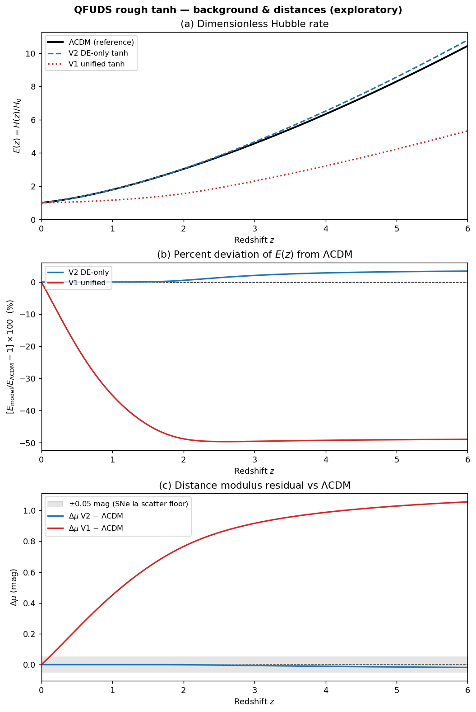

**그림 1. 배경 팽창과 초신성 거리 비교.** 이 그림은 V1, V2, ΛCDM의 배경 팽창과 거리
차이를 비교한다. 판독 포인트는 $E(z)$의 비율과 거리모듈러스 차이 $\Delta\mu$다.
V1은 초기우주에서 물질량을 잘못 주어 깨지고, V2는
$|\Delta\mu|<0.02\,\mathrm{mag}$로 초신성 산포 안에 숨는다.

V1 통합 실현은 단일 정규화로 두 역할을 한 유체에 넣어 초기우주 물질량을 눌러 $z>2$에서
팽창이 ΛCDM의 절반이 되어 즉시 깨진다. 반면 V2는 $z=5$에서도 $E$비 1.03이고, 거리지수
차이가 전 구간 $|\Delta\mu|<0.02\,\mathrm{mag}$로 **초신성 산포(약 0.05 mag) 안에 숨는다.**
밀도구동 모델로 다시 배경을 대입해도 $\max|\Delta\mu|=0.017\,\mathrm{mag}$로 일관된다.
즉 *배경만으로는 이
모델을 배제하기 어렵다.*

### 3.2 $S_8$ 오버슈트는 구조적이며, 유효 음속으로 완화 가능하지만 튜닝이다

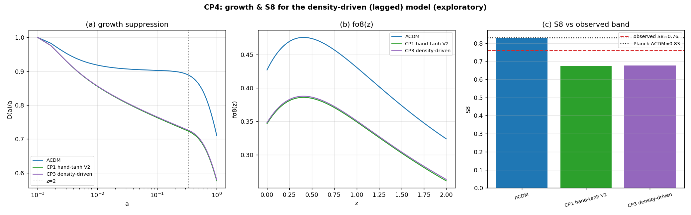

**그림 2. 전이 모양을 바꿨을 때의 구조성장.** 이 그림은 tanh 전이를 매끄럽게 하거나
가파르게 바꿔도 $S_8$ 오버슈트가 사라지지 않음을 보여준다. 따라서 문제의 원인은 전이 곡선의
모양이 아니라, 전이 성분이 군집하는 정도다.

V2는 구조성장을 약 19% 억제해 $S_8$를 0.83에서 0.67로 *과하게* 낮춘다(관측값 약 0.76 아래로
오버슈트). 전이 모양(매끄러운 tanh vs 가파른 지연)을 바꿔도 오버슈트는 줄지 않는다.
즉 오버슈트의 원인은 전이 *모양*이 아니라, 전이 성분이 얼마나 매끄럽게(군집 안 하고)
변하느냐, 곧 유효 음속 $c_{\mathrm{eff}}^2$다.

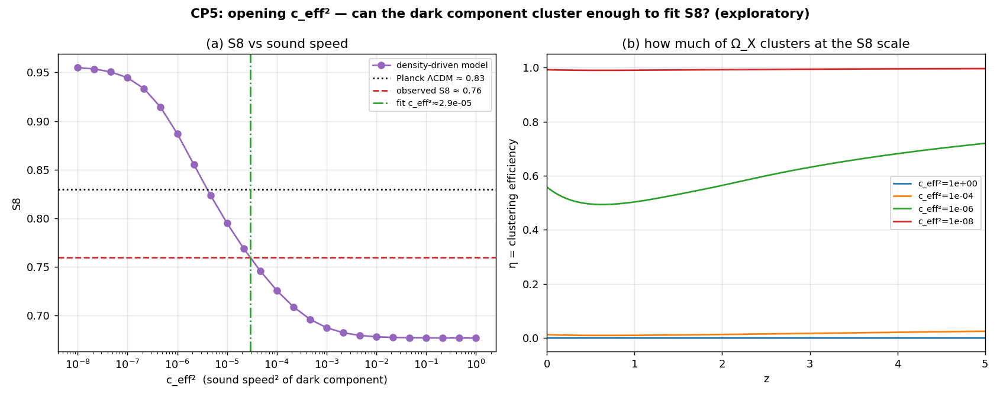

**그림 3. 유효 음속 스캔.** 이 그림은 $c_{\mathrm{eff}}^2$를 바꿀 때 $S_8$가 어떻게 움직이는지 보여준다.
관측값 근처인 $S_8 \approx 0.76$은
$c_{\mathrm{eff}}^2 \approx 2.9\times10^{-5}$에서 나온다.
결론은 "완화할 수 있다"이지만, 동시에 "작은 음속을 손으로 맞춰야 한다"다.

$c_{\mathrm{eff}}^2$를 0에서 1 사이로 열면 $S_8$가 0.677(매끄러움)에서
0.955(완전 군집) 사이를 매끄럽게 움직이고, **관측 $S_8=0.76$은
$c_{\mathrm{eff}}^2 \approx 2.9\times10^{-5}$에서 달성된다.** 즉 오버슈트는 즉시 배제
조건은 아니며 완화할 수 있다. 단 그 대가는 *아주 작은 음속이라는 조절 변수를 하나 더 손으로
맞추는 것*이다. 물리적으로는 여기서 질문이 바뀐다. "맞출 수 있는가"가 아니라
"왜 그 정도로 작은 음속이 나오는가"를 설명해야 한다.

### 3.3 도출 시도: 입력한 $c_{\mathrm{eff}}^2$는 비-거품 스케일을 숨긴다

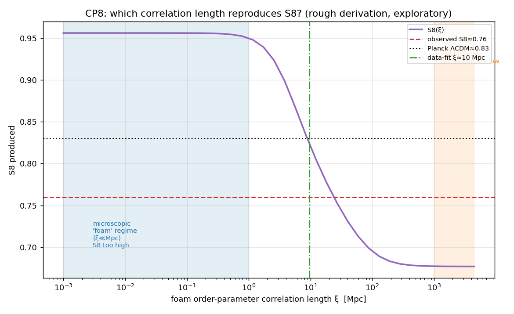

**그림 4. 유효 음속을 상관길이로 해석한 결과.** 이 그림은 적합된
$c_{\mathrm{eff}}^2$를 상관길이 $\xi$로 바꾸면 약 $10\,\mathrm{Mpc}$가 필요함을
보여준다. 이는 미시적 양자 거품 스케일이 아니라 은하 분포가 만드는 거대구조 스케일이다.

$c_{\mathrm{eff}}^2$를 자유값이 아니라 order parameter의 상관길이 $\xi$에서 유도하려 했다
($c_{\mathrm{eff}} \approx \xi/d_H$). 데이터가 원하는
$c_{\mathrm{eff}}^2 \approx 4.6\times10^{-6}$은 **$\xi \approx 10\,\mathrm{Mpc}$,
곧 우주 거대구조 스케일에 대응한다.** 그런데 "양자 거품" 전제는 $\xi$가 미시적이어야
하고, 미시 거품이면 $c_{\mathrm{eff}}^2 \to 0 \to S_8 \approx 0.95$로 오히려
*틀린 방향*(높게)으로 간다. 즉 자연스러운 거품
상관길이는 필요한 적합을 만들지 못한다. 이것이 첫 번째 천장 신호다. 필요한 길이가 미시 세계에서
나오지 않고, 이미 관측된 거대구조 스케일 쪽으로 넘어가 버리기 때문이다.

### 3.4 $H_0$ 긴장은 풀리지 않고 악화된다

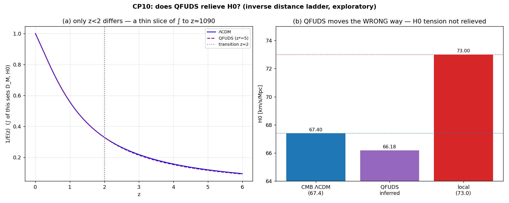

**그림 5. 역거리사다리 $H_0$ 추정.** 이 그림은 같은 모델이 $H_0$ 긴장을 풀지 못하고 오히려
낮은 방향으로 가는 것을 보여준다. $S_8$는 섭동 조절 변수로 움직일 수 있었지만, $H_0$는 배경 팽창과
재결합 이전 물리에 묶여 있어 이 늦은 전이로는 움직이기 어렵다.

역거리사다리($r_s\theta_\ast$ 고정)로 $H_0$를 추론하면
$H_{0,\mathrm{QFUDS}}=66.18$, 즉 **-1.81%**다. 긴장을
닫으려면 +8.3%가 필요한데 오히려 반대로 멀어진다. 이유는 명료하다: $S_8$는 *섭동*
조절 변수($c_{\mathrm{eff}}^2$)라 배경과 독립적으로 바꿀 수 있었지만, $H_0$는 *배경* 양이고 그 배경은
초신성에 고정돼(§3.1) 움직일 여지가 없다. $H_0$를 풀려면 재결합 이전($r_s$)을 바꿔야
하는데, 늦은 $z \approx 2$ 전이는 그 영역을 바꾸지 않는다. **$S_8$와 $H_0$가
민감하게 반응하는 물리량은 분리돼 있고, 이 모델은 $S_8$ 쪽에만 닿는다.**

### 3.5 격자 탐색 적합과 그 해석

격자 탐색 적합은 명목상 ΛCDM을 정보기준(AIC)으로 이기는 지점에 도달한다
($\chi^2_{\mathrm{tot}}:18\to8$). 그러나 이 승리는 전적으로 $S_8$를 낮춘 덕이다.
**$S_8$를 낮추는 어떤
모델이든 비슷한 방식으로 이길 수 있다.** 그러므로 이 결과는 QFUDS 고유의 물리 승리가
아니다. 더해 최적 적합값 $c_{\mathrm{eff}}^2 = 4.6\times10^{-6}$은 §3.3의
미세조정이며, 분석 자체도 거칠다(프록시, 공분산 없음). 결론은 다음처럼 제한된다.
*"데이터에 맞출 수 있다"를 넘어
"명목상 이길 수도 있다"까지 가지만, 그것은 튜닝의 힘이지 새 물리도 우월성도 아니다.*

---

## 4. 반증 가능 신호: 모델이 ΛCDM과 갈라지는 곳 (CP9, CP13, CP16, CP14, CP17–CP19)

배경·BAO로는 구별 불가하므로, 모델의 과학적 가치는 ΛCDM과 *갈라지는* 관측 신호에 있다.
아래 그림들은 "이 모델이 맞다"가 아니라 "맞다면 어디서 배제될 수 있는가"를 보여준다.

### 4.1 약중력렌즈 P(k)의 스케일 의존 계단

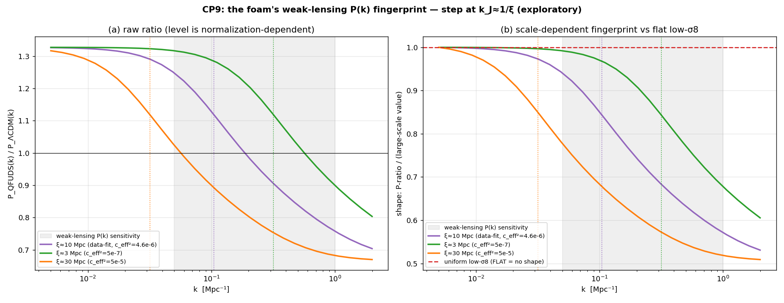

**그림 6. 약중력렌즈 물질 파워 스펙트럼의 계단.** 이 그림은 단순히 전체 진폭을 낮춘
저-$\sigma_8$ ΛCDM과, 특정 스케일 부근에서 모양이 꺾이는 QFUDS 프록시를 비교한다. 핵심은
$k \approx 0.1\,\mathrm{Mpc}^{-1}$ 부근의 스케일 의존 계단이다.

음속 있는 암흑성분은 Jeans 스케일 $k_J \approx 1/\xi$ *아래*에서만 군집하고 *위*에서는
매끄럽다. 이는 $P(k)$를 **스케일 의존적으로** 억제한다. 데이터 적합값
$\xi \approx 10\,\mathrm{Mpc}$이면 그 계단은
$k \approx 0.1\,\mathrm{Mpc}^{-1}$ 부근, 곧 약중력렌즈 감도 중심부에 놓인다.
결정적으로 이것은 단순히 $\sigma_8$를 균일하게 낮춘 ΛCDM(모든 $k$에서 평평한 억제)과
질적으로 다르다. 이 계단은 균일 저-$\sigma_8$ 모델이 쉽게 모방하기 어려운 반증 신호다.
따라서 이 신호는 모델을 뒷받침하는 장식적 설명이 아니라, 실제 관측이 모델을 배제할 수
있는 지점이다.

### 4.2 후기 ISW의 스케일 의존 기울기

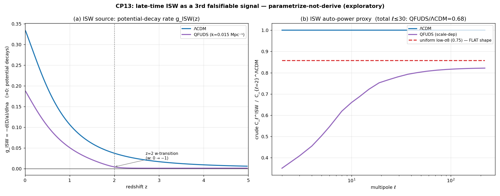

**그림 7. 후기 ISW 신호의 multipole 의존성.** 이 그림은 ISW-galaxy 교차상관의 비율이
낮은 $\ell$과 높은 $\ell$에서 다르게 움직이는지를 본다. 균일 저-$\sigma_8$ 모델은 거의 평평하지만,
QFUDS 프록시는 기울어진 모양을 남긴다.

세 번째 채널로 후기 CMB(적분 Sachs-Wolfe) 신호를 검토했다. QFUDS의 ISW는 부호는 ΛCDM과
같으나(양의 ISW-galaxy 교차, 뒤집힘 없음) 진폭이 낮고, 핵심은 *모양*이다:
$C_\ell$ 비가 저-$\ell$에서 0.35, 고-$\ell$에서 0.82로 **기울어진다.**
균일 저-$\sigma_8$(모든 $\ell$에서 0.857)과
원리적으로 구별된다. 단 ISW가 사는 저-$\ell$는 cosmic variance가 커서 검출 자체는
별개의 문제임을 명시한다.

### 4.3 성장지수 γ의 스케일 의존성

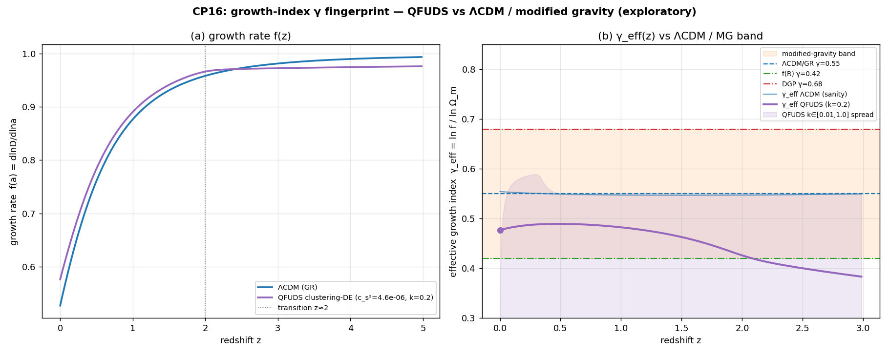

**그림 8. 성장지수 $\gamma_{\mathrm{eff}}(k)$의 스케일 의존성.** 이 그림은 한 스케일만 보면 수정중력과
비슷해 보일 수 있지만, 여러 $k$를 보면 $\gamma_{\mathrm{eff}}$가 달라지는지를 보여준다. 여기서 스케일
의존성은
스케일에 따라 값이 변한다는 뜻이다. 이 변화가 수정중력과 구별되는 후보 신호다.

성장률 $f=\Omega_m^\gamma$의 유효 지수를 환산하면, $S_8$ 스케일($k=0.2$)에서
$\gamma_{\mathrm{eff}}(z=0)\approx0.48$로 수정중력 $f(R)$의 대표값(0.42)과
*단일 스케일에서는 축퇴*된다. 그러나 $\gamma_{\mathrm{eff}}$는 $k$에 따라
0.22에서 0.55로 강하게 달라진다($\Delta\gamma \approx 0.33$). 대표적 수정중력 모형은
선형 스케일에서 $\gamma$가 거의 무관하므로, 이
**스케일 의존성 자체가 QFUDS를 f(R)/DGP와 구별하는 단서**다.

### 4.4 실제 오차로의 채점과 내부 정합성

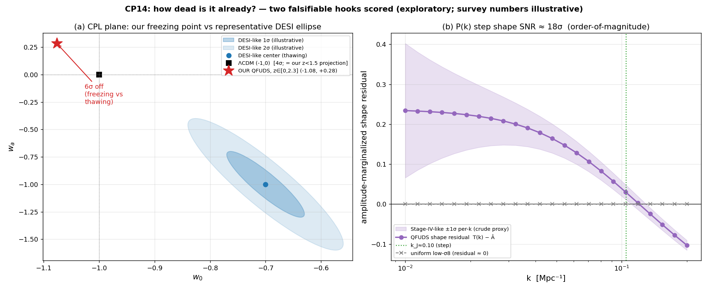

**그림 9. 대표 관측 오차로 본 반증 테스트.** 이 그림은 두 질문을 동시에 본다. $w(z)$의
방향이 DESI가 선호하는 사분면과 맞는가, 그리고 $P(k)$ 계단이 Stage-IV 약중력렌즈에서 보일
정도로 큰가. 첫 질문은 불리하고, 둘째 질문은 반증 가능성이 있다.

두 신호를 대표 오차로 채점했다. 여기서 쓴 외부 숫자는 실제 likelihood가 아니라
대표값/예시다. $w(z)$를 CPL $(w_0,w_a)$로 투영하면 우리 모델은 동결(freezing, $w_a>0$)로, 대표 DESI가
선호하는 해동(thawing)과 *정반대 사분면*에 놓인다. 한편 $P(k)$ 계단은 진폭을 주변화한
뒤에도 대표 Stage-IV 설정에서 약 $18\sigma$의 모양 신호로 남고, 균일 이동은
$0\sigma$(기본 검산).

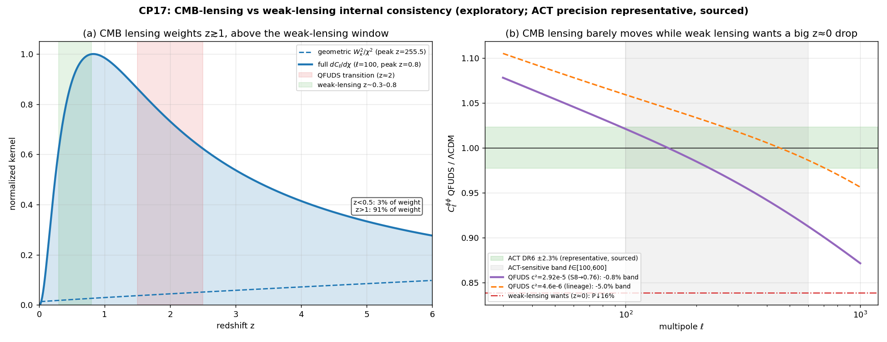

**그림 10. CMB 렌즈와 약중력렌즈의 시간 가중치 비교.** 이 그림은 왜 $S_8$를 낮추는 후기
성장 변화가 CMB 렌즈를 크게 훼손하지 않는지 보여준다. 약중력렌즈는 낮은 적색편이에
민감하고, CMB 렌즈는 더 이른 구조에 민감하다.

중요한 내부 정합성 검증: $S_8$를 낮춘 그 $c_{\mathrm{eff}}^2$가 ACT급 CMB렌즈(ΛCDM과 일치)를
과억제해 모순을 일으키지 않는가? 결론은 그렇지 않다. 약중력렌즈는 $z \approx 0.3$,
CMB렌즈는 가중치 91%가 $z>1$이라, $z<1$에 몰린 우리 성장 변형이 CMB렌즈를 거의 바꾸지 않는다.
이 모델은 "늦은 유체"라는 성질 덕에 약중력렌즈와 CMB 렌즈 조건을 동시에 크게 위반하지 않는다
($H_0$ 실패와는 반대 결과).

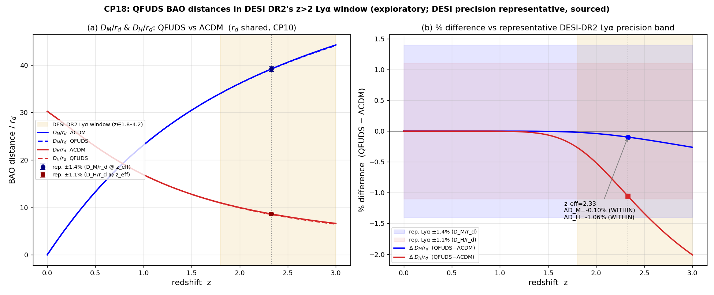

**그림 11. DESI 고적색편이 BAO와 거리비.** 이 그림은 $D_M/r_d$와 $D_H/r_d$ 중 어느 쪽이
모델 차이를 더 민감하게 드러내는지 본다. $D_H/r_d$가 가장 가까운 판별자이지만, 대표 오차 기준에서는
아직 결정타는 아니다.

CP14가 freezing 신호는 $z \gtrsim 2$에서만 산다는 점을 보였고, DESI DR2가 정밀해진 곳이 바로
그 $z>2$(Lyα)다. $r_d$는 재결합 이전이 ΛCDM과 동일하므로 공유되고, 거리비 차이는 오직
후기 $E(z)$에서 온다. $z_{\mathrm{eff}}=2.33$에서 $D_M/r_d$는 -0.10%(숨음),
$D_H/r_d$는 -1.06%(대표 ±1.1% 경계선)로, 가장 민감한 지점에서도 아직 배제하기는 어렵지만 $D_H/r_d$가 가장
가까운 판별자다.

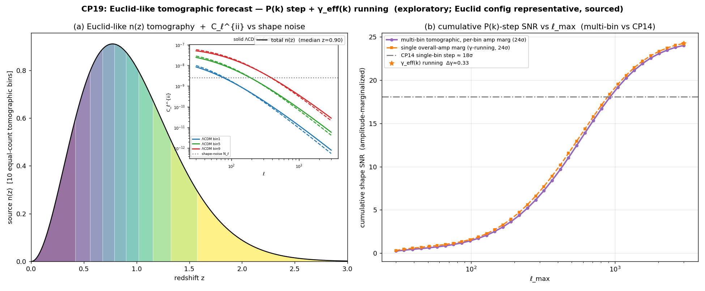

**그림 12. Euclid급 토모그래피 예측.** 이 그림은 여러 적색편이 bin을 합치고 진폭을
주변화해도 $P(k)$ 계단과 $\gamma_{\mathrm{eff}}(k)$의 스케일 의존성이 남는지 본다. 수치는 실제 likelihood
결과가 아니라 대표 Fisher 예측이며, 검출 가능성의 자릿수를 보여주는 용도다.

대표 Euclid급 토모그래픽 약중력렌즈 Fisher 예측에서, 진폭을 bin별로 주변화한 뒤에도
$P(k)$ 계단은 **약 $24\sigma$**, $\gamma_{\mathrm{eff}}(k)$의 스케일 의존성은 상수-$\gamma$
수정중력과 **약 $24\sigma$**로 구별된다. 균일 진폭 이동은 $0\sigma$(기본 검산 통과).
즉 이 모델의 반증 가능 신호는 차세대 관측의 검증 범위에 들어간다.

---

## 5. 이론적 위치와 천장 (CP11–CP12, CP15, CP20–CP24)

앞 절까지는 "맞출 수 있는가"를 보았다. 여기서는 한 단계 더 강한 질문을 묻는다. 맞춘
숫자들이 미시 물리에서 자연스럽게 나오는가, 아니면 다른 이름의 튜닝인가? 효과적 모델의
모양이 그럴듯해도, 자유 파라미터가 어디서 왔는지 설명하지 못하면 물리적 설명으로
승격할 수 없다.

### 5.1 기존 유체/EFT 이론 안에서의 좌표

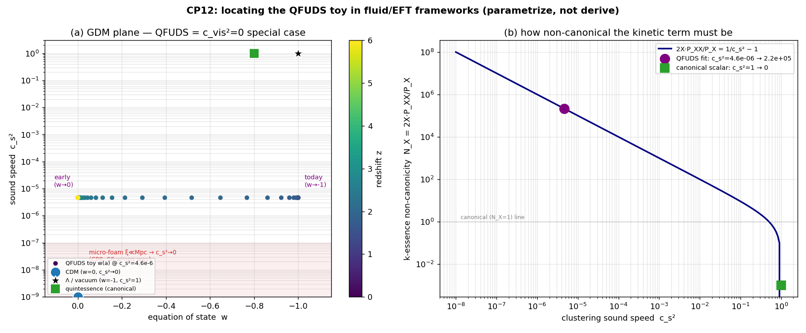

**그림 13. 기존 유체/EFT 이론 안에서의 위치.** 이 그림은 본 모델이 완전히 새로운
수학적 종이 아니라, 기존 유체 모형과 k-essence 이론의 특정 구석에 놓인다는 점을
정리한다. 핵심 판독점은 $w(a)$, $c_{\mathrm{eff}}^2$, $c_{\mathrm{vis}}^2$ 중 무엇을
실제로 설명했는가다.

이 현상론적 모델을 기존 이론 위에 올려 보면 위치가 꽤 분명하다. 첫째, **GDM**(Hu 1998)에서는 세
함수 $\{w(a), c_{\mathrm{eff}}^2, c_{\mathrm{vis}}^2\}$ 중 점성
$c_{\mathrm{vis}}^2=0$인 특수경우다. 둘째, **EFT of Dark
Energy**에서는 braiding 없는 minimal k-essence 구석에 가깝다. 셋째, **k-essence**로
읽으면 비표준성
$N_X = 2X P_{XX}/P_X = 1/c_s^2 - 1 \approx 2\times10^5$가 필요하다. 이는 canonical
스칼라장에서 약 5자릿수 떨어진 극단적 운동항이다.

따라서 결론은 "기존 이론 밖의 완전히 새 물리"가 아니다. 더 정확히는 "기존 유체/EFT
좌표 안에 놓을 수 있지만, 필요한 파라미터가 매우 비표준적이며 아직 유도되지 않았다"다.
별도로 점성 $c_{\mathrm{vis}}^2$를 열면 $S_8/P(k)$를 조정하는 변수가 하나 더 생기지만, 그것 역시
설명이 아니라 추가 파라미터다.

### 5.2 천장의 분해: 두 고전 난제

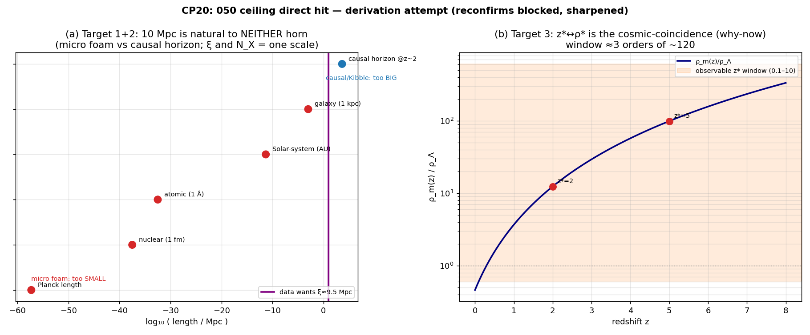

**그림 14. 요구 스펙이 두 고전 난제로 내려가는 구조.** 이 그림은 데이터가 요구한
세 숫자
$\{\xi \approx 10\,\mathrm{Mpc},\, N_X \approx 2\times10^5,\, z_\ast \approx 2\}$를
한 단계 아래 물리로 설명하려 할 때, 결국 스케일 문제와 코인시던스 문제로 갈라짐을
보여준다.

데이터가 요구하는 스펙
$\{\xi \approx 10\,\mathrm{Mpc},\, N_X \approx 2\times10^5,\, z_\ast \approx 2\}$를
Ginzburg-Landau order parameter ansatz에서 *유도 시도*하면, 셋이 두 고전 문제로
분해된다.

- **스케일 문제**: $\xi \approx 10\,\mathrm{Mpc}$은 미시 거품에는 너무 크고,
  $z \approx 2$ 인과/Kibble 지평(약 4400 Mpc 공변, 461배 큼)에는 너무 작다.
  크기가 맞는 유일한 후보는 비선형/$\sigma_8$ 구조 스케일($R_8 \approx 12\,\mathrm{Mpc}$)이다.
  하지만 이 스케일은 표준 구조형성이 이미 정하는 값이다.
  따라서 다시 맞춘다고 해도 독립 증거가 되기 어렵다(매칭≠유도). $N_X$는 $\xi$로 환원되어
  둘은 사실 하나의 문제다.
- **코인시던스 문제**: 전이가 관측 가능하려면 임계밀도 $\rho_\ast$가 $\rho_\Lambda$의 약 3자릿수 안
  (전체 약 120자릿수 중)에 앉아야 한다. 바로 why-now 문제 그 자체다.

> *방법론 주석:* 본 절의 초안은 `ξ` 스케일 사다리를 미시 쪽으로만 제시하는 편향이
> 있었다. 반례 검토 역할이 인과/Kibble 지평이라는 거시 쪽 후보를 빠뜨렸다고 지적했고,
> 이후 너무 작은 후보와 너무 큰 후보를 함께 비교하는 방식으로 교정했다. 결론은 같지만
> 논증은 더 균형 있게 바뀌었다.

### 5.3 격자 탐색 메커니즘: 튜닝은 줄지 않고 옮겨간다

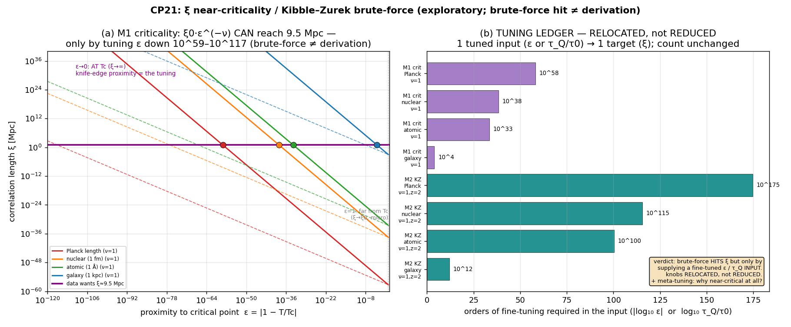

**그림 15. $\xi \approx 10\,\mathrm{Mpc}$를 근임계 현상으로 맞추려는 시도.** 이 그림은 임계점 근접도나
quench 비율을 조정하면 숫자는 만들 수 있지만, 그 조정 자체가 새 튜닝이 됨을 보여준다.

천장의 두 숫자를 메커니즘으로 격자 탐색하면 어떻게 되는가? **$\xi$**(근임계
$\xi \propto |T-T_c|^{-\nu}$ 또는 Kibble-Zurek 동결)는 맞출 수 있다. 그러나
Planck 척도에서 출발하면 임계점 근접도 $\epsilon$을
$10^{-59}\text{--}10^{-117}$까지, 또는 quench 비율을
$10^{116}\text{--}10^{233}$까지 *극도로 정밀하게*
공급해야 한다. 조절 변수 개수는 줄지 않고 $\epsilon/\tau_Q$로 *옮겨가며*, "왜 2차 상전이점
근처인가"라는 메타튜닝까지 더해진다. 튜닝이 줄어든 것이 아니라 위치가 바뀐 것이다.

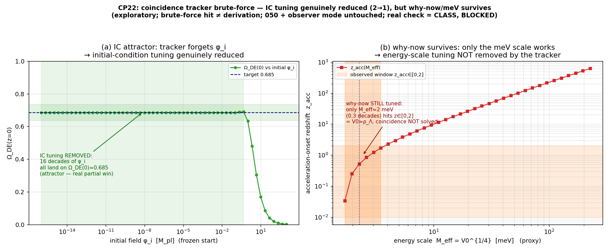

**그림 16. tracker quintessence의 부분 승리.** 이 그림은 초기조건을 넓게 바꿔도 해가
attractor로 모이는지를 보여준다. 초기조건 튜닝은 실제로 크게 줄지만, meV 에너지 스케일은
여전히 입력으로 남는다.

**코인시던스**(tracker quintessence, Ratra-Peebles)는 다르다. 초기조건 $\phi_i$를
19자릿수 범위에 걸쳐 훑으면 약 **15.7자릿수**가 같은 attractor 해로 수렴해
$\Omega_{\mathrm{DE}}(0)=0.685$에 도달한다. 초기조건 튜닝이 *실제로* 줄어드는 것이다
(적분기가 tracker 상태방정식 $w_\phi=-2/(\alpha+2)=-0.667$을 재현해 검증됨).
이 작업 전체에서 실제로 튜닝을 줄인 부분 성과는 이 항목뿐이다. 그러나 에너지 스케일
$M_{\mathrm{eff}}$가 관측 창에 들려면
$M_{\mathrm{eff}}\in[1.71,3.50]\,\mathrm{meV}$(0.31자릿수)로 여전히 손으로 맞춰야 한다.
튜닝 장부는 2개{초기조건, 스케일} → 1개{스케일}로
*부분* 환원될 뿐, why-now는 풀리지 않는다.

### 5.4 남은 두 숫자는 곧 이론물리의 두 난제

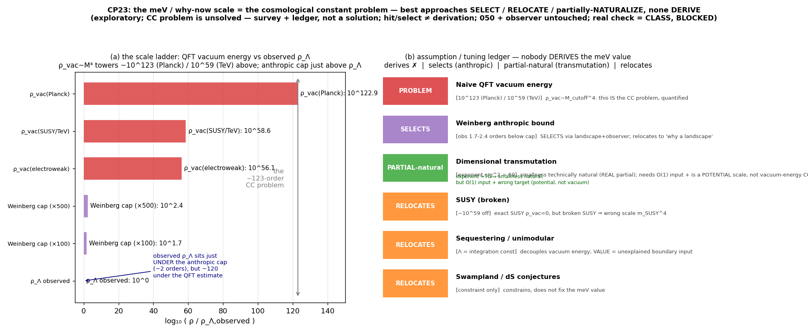

**그림 17. meV 스케일과 우주상수 문제.** 이 그림은 필요한 에너지 스케일이 왜 우주상수
문제와 같은 위치에 놓이는지 정리한다. 여러 알려진 접근은 값을 선택하거나 튜닝을 다른
곳으로 옮기지만, 이 보고서에서 필요한 값을 직접 유도하지는 않는다.

남은 두 숫자를 정면으로 보면 정체가 드러난다. **meV 스케일**은 우주상수 문제 그
자체다. 단순한 진공에너지 추정은 관측 $\rho_\Lambda$보다
$10^{123}$(Planck) 또는 $10^{59}$(TeV)배 크다. 알려진
공략들도 값을 직접 유도하지는 못한다. Weinberg anthropic 천장은 관측값을 가능한 범위
안에서 "선택"하게 만들 뿐이고, 차원전환은 작음 자체를 자연스럽게 만들 수는 있어도
O(1) 결합을 입력으로 남긴다. SUSY, sequestering, swampland 접근도 이 보고서의 필요한
숫자를 직접 공급하지 않는다.

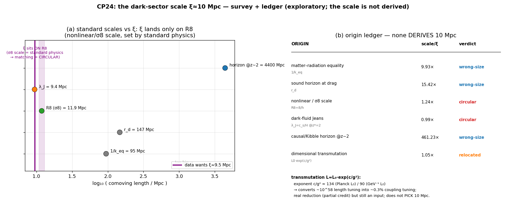

**그림 18. $\xi \approx 10\,\mathrm{Mpc}$와 $\sigma_8$ 구조 스케일.** 이 그림은 필요한 길이 스케일이 표준 구조형성의
비선형 스케일과 겹친다는 점을 보여준다. 이미 표준 물리가 정한 스케일을 다시 맞추는 것은
독립 유도가 아니라 순환 설명에 가깝다.

**$10\,\mathrm{Mpc}$ 스케일**은 표준 물리가 정하는 비선형/$\sigma_8$ 스케일
($R_8 \approx 11.9\,\mathrm{Mpc}$)이다. $1/k_{\mathrm{eq}}$(약 95 Mpc),
$r_d$(약 147 Mpc), $z \approx 2$ 지평(약 4400 Mpc)은 전부 크기가 맞지 않는다. 차원전환은
튜닝을 결합상수 쪽으로 옮길 뿐($10^{58}$ 길이 튜닝을 약 0.26% 결합 튜닝으로 줄이는 부분
점수는 인정하되, $10\,\mathrm{Mpc}$를 *고르지는* 못함), 암흑유체 Jeans 길이는
$c_{\mathrm{eff}}^2$로 만들어
구성상 일치하므로 순환 설명에 가깝다. **암흑 부문에서 $10\,\mathrm{Mpc}$를 독립 유도하는 후보는
없으며, 이 모델은 표준 계층/스케일 문제를 그대로 상속한다.**

---

## 6. 논의 (Discussion)

### 6.1 효과적 수준 대 근본적 수준

결과는 두 레벨에서 다르게 읽어야 한다.

- **효과적 수준:** 파라미터를 입력으로 주면 모델은 배경 팽창, $S_8$, CMB 렌즈, 일부 BAO
  대표값을 동시에 크게 훼손하지 않는다. 이 수준에서는 "관측적으로 즉시 배제되지는 않는다"가
  결론이다.
- **근본적 수준:** 그 파라미터가 왜 그런 값이어야 하는지는 설명하지 못한다. 특히
  $\xi \approx 10\,\mathrm{Mpc}$와 $\rho_\ast \approx \rho_\Lambda$는 각각 스케일 문제와
  우주상수/코인시던스 문제로 내려간다.

따라서 이 모델의 상태를 한 문장으로 쓰면 다음과 같다. **효과적 모형으로는 흥미롭지만,
미시 유도까지 성공한 이론은 아니다.** "$10\,\mathrm{Mpc}$를 가정으로 깔면 된다"는 말은 가능하지만,
그 순간 QFUDS의 유도 야망은 포기된다. 이 구분이 선명해야 결론의 강도가 과해지지 않는다.

### 6.2 무엇이 증거인가

이 가설의 천장이 이론물리의 두 난제(우주상수+계층)와 동일하다는 사실은 *이 가설을
지지하는 증거가 아니다.* 좋은 증거는 경쟁 이론들을 구별해야 한다. 그런데 모든 동역학적
암흑에너지 모델이 비슷한 난제를 상속하므로, 그 공유된 벽은 어느 모델도 특별히 편들지
못한다.

이 가설이 증거를 얻을 수 있는 자리는 ΛCDM과 *갈라지는* 곳뿐이다. 본문에서 그 후보는
세 가지다. 첫째, 약중력렌즈 $P(k)$의 스케일 의존 계단. 둘째, 후기 ISW의 스케일 의존
기울기. 셋째, 성장지수 $\gamma_{\mathrm{eff}}(k)$의 스케일 의존성이다. 이 세 신호는 아직 증거가 아니다.
정확히는 나중에 관측으로 배제될 수 있는 표적이다.

### 6.3 한계의 명시

- 모든 수치 모형은 거친 프록시다. Jeans-$\eta$ 성장은 완전 2-유체와 10-20% 어긋난다.
- 외부 관측 숫자(DESI, ACT, Euclid 정밀도)는 대표값/예시로만 사용했다. 실제 데이터
  벡터, 공분산, likelihood는 사용하지 않았다.
- 본문의 $\sigma$ 값은 발견 주장이나 배제 주장이 아니라 자릿수 추정이다. 실제 채점은 CLASS
  likelihood를 요구한다.
- foam 미시구조에서 어떤 파라미터도 유도되지 않았다. 이 보고서의 핵심 한계는
  parametrize-not-derive다.

---

## 7. 결론 (Conclusion)

거친 통합 암흑부문 tanh 가설을 수치 곡선까지 전개해 다음을 정량화했다.

1. **효과적 모델로는 성립 가능성이 있다.** 보통 물질을 분리한 변형(V2)은 배경을 ΛCDM과 구별 불가하게
   재현하고,
   작은 음속으로 $S_8$를 관측값에 맞춘다.
2. **그러나 ΛCDM보다 낫다고 말할 수 없다.** 명목상 AIC 승리는 $S_8$를 낮춘 보편 효과이고,
   $H_0$는 악화되며,
   필요한 음속은 미세조정이다.
3. **세 반증 신호를 남긴다.** $P(k)$ 스케일 의존 계단
   ($k \approx 0.1\,\mathrm{Mpc}^{-1}$), ISW 스케일 의존 기울기,
   $\gamma_{\mathrm{eff}}(k)$의 스케일 의존성. Euclid급 토모그래피에서 약 $24\sigma$로 검출 가능.
4. **천장은 두 고전 난제다.** 데이터가 요구하는 $\xi \approx 10\,\mathrm{Mpc}$(스케일 문제)과
   $\rho_\ast \approx \rho_\Lambda$
   (우주상수/코인시던스 문제). 메커니즘으로 맞추려 하면 튜닝은 위치만
   옮겨가며(코인시던스의 초기조건 부분만 진짜로 부분 환원), 둘 다 미해결로 남는다.

핵심 기여는 둘이다. **물리적으로**, 하나의 거친 가설을 효과적 적합성, 반증 가능성,
이론적 천장의 세 축에서 정리했다. **방법론적으로**, 운영 워크플로와 검증 게이트를 결합한
AI 연구 하네스가 아직 검증 전인 가설의 과대주장을 줄이는 데 도움이 됨을 보였다.

다음 단계는 둘로 제한된다. 하나는 Euclid/DESI 후속 우주론 자료로 §4의 반증
신호를 검산하는 일이다. 다른 하나는 $\xi \approx 10\,\mathrm{Mpc}$와
$\rho_\ast \approx \rho_\Lambda$를 원리적으로 유도할 수 있는지
다시 묻는 일이다. 후자는 곧 우주상수 문제와 스케일 문제에 직접 들어가는 작업이다.

2026-06-18 기준 추가 audit 결과, 이 두 번째 길은 더 좁아졌다. `xi` 자체를 state variable로
두는 경로는 기각됐고, stress-energy-side `f_B(x,a)`는 bookkeeping 변수로만 남았다.
`f_B`가 물리 변수가 되려면 `rho_A`, `rho_B`, `p_A`, `p_B`, phase-B equation of state,
conservation/transfer law, perturbation route, known-model reduction test를 먼저 채워야 한다.
추가 stress-energy audit에서는 `f_B = rho_B/(rho_A+rho_B)`가 이미 존재하는 phase split의
identity일 뿐이며, `p_B ~= -rho_B`, `T_mu_nu`, `Q^nu`, `delta Q`를 독립적으로 주지 못하면
effective `w(a)` 또는 IV/IDE 재표현으로 닫힌다고 판정했다.
이 전에는 NASA/LAMBDA나 BAO를 모델 해석에 쓰면 순환논리다.

---

## 부록 A: 체크포인트–결과 대응표

각 체크포인트는 하나의 질문, 핵심 결과, 대표 산출물로 읽으면 된다.

- **CP1 배경/성장/위상.** V2 배경은 SNe로 구별하기 어렵고, $S_8$ 오버슈트와 DESI 방향
  반대가 확인됐다.
  산출물: [배경](assets/004_rough_tanh/fig_background.png),
  [성장](assets/004_rough_tanh/fig_growth.png),
  [위상](assets/004_rough_tanh/fig_phase.png).
- **CP2 상태변수 동역학.** `w`가 입력이 아니라 출력으로 나오며, lag·super-cooling·
  hysteresis가 생긴다.
  산출물: [상태변수](assets/004_rough_tanh/fig_state_variable.png).
- **CP3 밀도 구동.** 전이 시점을 임계밀도에서 유도하려 했고,
  $z_\ast \approx 5 \to z_{\mathrm{obs}}\approx 2$ 구조를 얻었다.
  산출물: [밀도 구동](assets/004_rough_tanh/fig_density_driven.png).
- **CP4 성장/$S_8$.** 오버슈트는 전이 모양을 바꿔도 사라지지 않는 구조적 문제였다.
  산출물: [성장/$S_8$](assets/004_rough_tanh/fig_cp4_growth.png).
- **CP5 유효 음속 스캔.** $S_8=0.76$은
  $c_{\mathrm{eff}}^2 \approx 2.9\times10^{-5}$에서 맞지만, 이는 튜닝이다.
  산출물: [음속 스캔](assets/004_rough_tanh/fig_cp5_sound_speed.png).
- **CP6 천장과 반증.** 조절 변수는 5개에서 5개로 줄지 않았고, DESI $w(z)$가 반증 후보로 남았다.
  산출물: [천장](assets/004_rough_tanh/fig_cp6a_ceiling.png),
  [반증](assets/004_rough_tanh/fig_cp6b_falsification.png).
- **CP7 격자 탐색.** 명목 AIC 승리는 가능했지만 $S_8$ 조건 덕이며 고유 승리가 아니었다.
  산출물: [격자 탐색 적합](assets/004_rough_tanh/fig_cp7_brute_fit.png).
- **CP8 $c_{\mathrm{eff}}^2$ 도출 시도.** 적합값은
  $\xi \approx 10\,\mathrm{Mpc}$라는 비-거품 스케일을 요구했다.
  산출물: [유효 음속 도출](assets/004_rough_tanh/fig_cp8_ceff2_derivation.png).
- **CP9 렌즈 $P(k)$.** $k_J \approx 0.1$ 부근의 스케일 의존 계단이 반증 신호로 남았다.
  산출물: [렌즈 P(k)](assets/004_rough_tanh/fig_cp9_lensing_pk.png).
- **CP10 $H_0$.** 역거리사다리 추정은 66.18로 내려가며 $H_0$ 긴장을 악화했다.
  산출물: [$H_0$ 테스트](assets/004_rough_tanh/fig_cp10_h0_test.png).
- **CP11 2-유체 검증.** `η` 프록시는 정성적으로 맞지만 정량적으로 10-20% 어긋났다.
  산출물: [2-유체 검증](assets/004_rough_tanh/fig_cp11_two_fluid.png).
- **CP12 유체/EFT 위치.** GDM의 특수경우이자 비표준 k-essence 구석으로 분류됐다.
  산출물: [유체/EFT 위치](assets/004_rough_tanh/fig_cp12_fluid_frameworks.png).
- **CP13 후기 ISW.** $C_\ell$ 비율이 0.35에서 0.82로 기울어져 구별 가능성이 생겼다.
  산출물: [후기 ISW](assets/004_rough_tanh/fig_cp13_isw.png).
- **CP14 실오차 채점.** freezing 방향은 대표 DESI와 반대이고, $P(k)$ 계단은 약 $18\sigma$로 남았다.
  산출물: [반증 테스트](assets/004_rough_tanh/fig_cp14_kill_test.png).
- **CP15 점성 $c_{\mathrm{vis}}^2$.** 독립 조절 변수가 하나 더 생겨 천장을 재확인했다.
  산출물: [점성 스캔](assets/004_rough_tanh/fig_cp15_viscosity.png).
- **CP16 성장지수 $\gamma$.** $f(R)$과 단일 스케일에서는 축퇴되지만 스케일 의존성으로 구별된다.
  산출물: [성장지수](assets/004_rough_tanh/fig_cp16_growth_index.png).
- **CP17 CMB 렌즈 정합.** 늦은 유체라 ACT급 CMB 렌즈와 큰 tension을 만들지 않았다.
  산출물: [CMB 렌즈](assets/004_rough_tanh/fig_cp17_cmb_lensing.png).
- **CP18 DESI $z>2$.** $D_H/r_d$가 -1.06%로 가장 가까운 판별자였지만 결정타는 아니었다.
  산출물: [DESI 고적색편이 BAO](assets/004_rough_tanh/fig_cp18_desi_highz_bao.png).
- **CP19 Euclid 예측.** $P(k)$ 계단과 $\gamma$ 스케일 의존성이 각각 약 $24\sigma$ 자릿수로 남았다.
  산출물: [Euclid 예측](assets/004_rough_tanh/fig_cp19_euclid_forecast.png).
- **CP20 천장 직격.** 요구 스펙은 스케일 문제와 코인시던스 문제로 분해됐다.
  산출물: [천장 분해](assets/004_rough_tanh/fig_cp20_ceiling_derivation.png).
- **CP21 $\xi$ 격자 탐색.** 튜닝은 감소하지 않고 $\epsilon/\tau_Q$ 쪽으로 위치만 이동했다.
  산출물: [ξ 근임계/Kibble-Zurek](assets/004_rough_tanh/fig_cp21_xi_criticality.png).
- **CP22 coincidence tracker.** 초기조건 튜닝은 약 16자릿수 줄었지만 meV 스케일은 남았다.
  산출물: [tracker attractor](assets/004_rough_tanh/fig_cp22_coincidence_tracker.png).
- **CP23 meV와 우주상수 문제.** 필요한 에너지 스케일은 직접 유도되지 않았다.
  산출물: [우주상수 문제](assets/004_rough_tanh/fig_cp23_cc_problem.png).
- **CP24 $\xi$와 $\sigma_8$ 스케일.** $10\,\mathrm{Mpc}$는 표준 구조 스케일과
  순환적으로 겹치며 독립 유도가 없다.
  산출물: [스케일 문제](assets/004_rough_tanh/fig_cp24_scale_problem.png).
- **CP25 학계 위치 확인.** "덜 본 것" 직관의 S1·S2·S3는 모두 학계가 이미 답사한
  경로로 판정됐고, 계보 기록은 자연스럽게 닫혔다. 수치 산출물은 없다.

## 부록 B: 재현 (Reproducibility)

모든 결과는 [004 rough tanh 자산 폴더](assets/004_rough_tanh/)의 독립 스크립트로 재현된다.
의존성: numpy(≥2.4, `np.trapezoid`), scipy, matplotlib. 각 스크립트는 그림(png+svg)과
수치(csv)를 남기며, 표준 우주론식은 코드 내에서 직접 유도·assert로 검산된다. 전체
실행 목록은 [004 수치 스케치](004_rough_tanh_numerical_sketch_ko.md)의 '재현' 절을 참조.

```bash
cd docs/wiki/lineage/assets/004_rough_tanh
python3 model.py                 # 공유 모델 smoke test
python3 cp9_lensing_pk.py        # 반증 신호 #1 (P(k) 계단)
python3 cp13_isw.py              # 반증 신호 #3 (ISW)
python3 cp19_euclid_forecast.py  # Euclid forecast
python3 cp20_ceiling_derivation.py  # 천장 분해
python3 cp22_coincidence_tracker.py # tracker attractor (부분 승리)
```

## 부록 C: 연구 하네스 운영 SSOT

이 작업의 인프라(§2.4)는 [운영 워크플로](../../../.agent/workflows/)에 운영 SSOT로 문서화돼 있다.

- [Documentation Folder Routing Workflow](../../../.agent/workflows/documentation-folder-routing-workflow.md):
  기능 기반 문서 라우팅, 상태 경계, 금지 단축을 정한다.
- [Wiki Maintenance Workflow](../../../.agent/workflows/wiki-maintenance-workflow.md):
  wiki 인덱스와 재사용 가능한 기록을 유지한다.
- [Research Asset and Product Workflow](../../../.agent/workflows/research-asset-product-workflow.md):
  외부 논문, 자산, 산출물의 가용성과 캐시 처리를 정한다.
- [Research Asset Digitization Workflow](../../../.agent/workflows/research-asset-digitization-workflow.md):
  캐시 자산을 Markdown, CSV, figure 산출물로 변환하는 절차를 정한다.
- [Research Investigation Result Routing Workflow](../../../.agent/workflows/research-investigation-result-routing-workflow.md):
  assets, plans, conclusions 사이의 산출물 라우팅을 정한다.

세션 단위 회고는 [postmortem 폴더](../postmortem/)에 원자적으로 기록된다. 이 세션의
회고는 [rough tanh 계보 하강 회고](../postmortem/010-20260612-dorito-rough-tanh-lineage-descent-retro.md)에 있다.

## 참고 개념 및 문헌 (대표)

- [Hu, W. (1998), *Generalized Dark Matter*, astro-ph/9801234](https://arxiv.org/abs/astro-ph/9801234):
  암흑 성분을 세 함수 $\{w, c_{\mathrm{eff}}^2, c_{\mathrm{vis}}^2\}$로 일반화한
  GDM(일반화 암흑물질) 유체 학파.
  이 현상론적 모델의 좌표가 GDM 안에 들어간다.
- Armendariz-Picon, Mukhanov, Steinhardt (2000), *k-essence*: 운동항이 비표준인
  스칼라장으로 암흑에너지를 만드는 k-에센스 학파. 음속이
  $c_s^2=P_X/(P_X+2X P_{XX})$로 정해진다.
- Ratra & Peebles (1988); Steinhardt, Zlatev, Wang (1999): 초기조건과 무관하게 같은
  해로 수렴하는 tracker(추적자) 퀸테센스 학파. 코인시던스 문제 완화 시도의 원조.
- [Weinberg, S. (1987), *Anthropic bound on the cosmological constant*, PRL 59, 2607](https://doi.org/10.1103/PhysRevLett.59.2607):
  우주상수 값을 인류 원리(우리가 존재할 수 있는 범위)로 제한하는 고전 논문. 값을
  '유도'하지 않고 '선택'하는 논증의 원조다.
- [Ma & Bertschinger (1995), astro-ph/9506072](https://arxiv.org/abs/astro-ph/9506072):
  결합 유체의 우주론적 섭동을 정식화한 표준 참고문헌(본문 2-유체 검증의 토대).
- DESI DR2 BAO (2025); ACT DR6 CMB lensing; Euclid Q1 (2025): 차세대 거대구조·CMB
  렌즈 관측 릴리스. 본문에서는 대표값으로만 인용하고 likelihood는 쓰지 않았다.

> 이 보고서의 모든 수치는 거친 프록시이며, 엄밀한 검증은 Boltzmann 코드(CLASS/hi_class)
> 수준에서 수행되어야 한다. 현 단계에서 그 검증은 미수행(blocked)이다.
