# Amendola et al. 2024 — PageIndex Full-Text Extraction

Verbatim page-by-page text extraction of arXiv:2307.02474v2 ("Constraints on
cosmologically coupled black holes from gravitational wave observations and
minimal formation mass", MNRAS) via PageIndex MCP `get_page_content` (14 pages).
Quality: `source_text_parse` — faithful text and LaTeX-equation transcription
including Table 1 and Eqs. (1)–(23, B1–B4), higher fidelity than the prior
MarkItDown pass, but machine-extracted and not line-for-line verified.

Figure image links resolve to the repo PNG mirrors under
`../figures/extracted/plots/`. Figure→file mapping is taken from the arXiv LaTeX
source (`\includegraphics` in each figure environment of
`BH-CosmoCoupled-minMass.tex`), so it is authoritative:
Fig.1→`plotZxM12.png`; Fig.2→`full-corner-plot.png`; Fig.3→`min-mass-debh-new.png`;
Fig.4→`histSampleDirect.png`; Fig.5→`plotkXmDirect.png`;
Fig.6→`mass-ordered-prob.png`; Fig.7 (4 panels)→`plotArrowsObs.png`,
`plotArrowsMerger.png`, `plotArrowsCCBH.png`; Fig.8 (2 panels)→`plotPDFformationDist.png`
(m1), `plotPDFformationDist2.png` (m2); Fig.9→`plotProbabilityNullw.png`;
Fig.10→`cornerPlotCCBH.png`; Fig.11→`histSamplePLPP1k3k.png`;
Fig.12→`plotkXmPLPP.png`; Fig.13 (2 panels)→`ghodlaRelationZm.png` (left),
`tdDistributionGhodla.png` (right); Fig.14→`plotkXmG23.png`;
Fig.A1 (= source Fig.15)→`plotNewLowMassEvent.png`;
Fig.C1 (= source Fig.16)→`contour-w-beta.png`.

---

## Page 1

# Constraints on cosmologically coupled black holes from gravitational wave observations and minimal formation mass

Luca Amendola¹, Davi C. Rodrigues¹,²,³, Sumit Kumar⁴,⁵, Miguel Quartin³,⁶,⁷
(¹ Institut für Theoretische Physik, Universität Heidelberg; ² Departamento de Física & Cosmo-Ufes, UFES; ³ PPGCosmo, UFES; ⁴ Max-Planck-Institut für Gravitationsphysik (AEI), Hannover; ⁵ Leibniz Universität Hannover; ⁶ Instituto de Física, UFRJ; ⁷ Observatório do Valongo, UFRJ.)

###### Abstract

We test the possibility that the black holes (BHs) detected by LIGO-Virgo-KAGRA (LVK) may be cosmologically coupled and grow in mass proportionally to the cosmological scale factor to some power $k$, which may also act as the dark energy source if $k\approx 3$. This approach was proposed as an extension of Kerr BHs embedded in cosmological backgrounds and possibly without singularities or horizons. In our analysis, we develop and apply two methods to test these cosmologically coupled BHs (CCBHs) either with or without connection to dark energy. We consider different scenarios for the time between the binary BH formation and its merger, and we find that the standard log-uniform distribution yields weaker constraints than the CCBH-corrected case. Assuming that the minimum mass of a BH with stellar progenitor is $2M_{\odot}$, we estimate the probability that at least one BH among the observed ones had an initial mass below this threshold. We obtain these probabilities either directly from the observed data or by assuming the LVK power-law-plus-peak mass distribution. In the latter case we find, at $2\sigma$ level, that $k<2.1$ for the standard log-uniform distribution, or $k<1.1$ for the CCBH-corrected distribution. Slightly weaker bounds are obtained in the direct method. Considering the uncertainties on the nature of CCBHs, we also find that the required minimum CCBH mass value to eliminate the tensions for $k=3$ should be lower than $0.5~M_{\odot}$ (again at $2\sigma$). Finally, we show that future observations have the potential to decisively confirm these bounds.

**keywords:** black hole physics – gravitational waves – dark energy

## 1 Introduction

Recently, a new intriguing hypothesis about the origin of the cosmic acceleration has been put forward by Croker & Weiner (2019); Croker et al. (2020b), with further developments by Farrah et al. (2023b). According to this scenario, black holes (BHs) grow in mass due to a form of cosmological coupling unrelated to local accretion. If this growth is fast enough, it could compensate the decrease in number density due to the cosmic expansion, and generate a form of effective cosmological constant. These BHs deviate from the standard Kerr solution. There is expectation that these solutions can be found within general relativity (GR) and that they could be singularity free (see also Dymnikova & Galaktionov, 2016). These non-standard BH solutions are asymptotically Friedmann-Robertson-Walker, rather than Minkowski (Faraoni & Jacques, 2007; Croker et al., 2020a; Croker & Weiner, 2019; Croker et al., 2020b). They could provide an average pressure that would constitute the entire amount of dark energy needed to explain the cosmic acceleration if the BHs have the necessary abundance. Farrah et al. (2023b) argue that this may be the case. In a companion paper, Farrah et al. (2023a) have found strong indication in favor of just such a cosmological growth of supermassive BHs in elliptical galaxies. This growth seems very difficult to explain in terms of the standard local growth channels of accretion. From different considerations, Gao & Li (2023); Cadoni et al. (2023a, b) provide further support for cosmologically coupled black holes.

This new BH solution is at the moment a conjecture, and in fact, criticisms on the above framework within GR have appeared. For instance, Avelino (2023) considers the use of gravastars as CCBHs, criticizes the mechanism for generating cosmological pressure assuming that the Birkhoff theorem can be applied and, additionally, points out that, if CCBH momentum is conserved, SMBHs could not be at rest with respect to their host galaxy. Parnovsky (2023) criticizes both the uncertainty in the estimation of SMBH data and the possibility of BHs to provide a negative pressure. Mistele (2023) points out an inconsistency between the averaging process proposed by Croker & Weiner (2019) and the action principle, thus this work also puts into question the proposed mechanism that generates the cosmological pressure. Wang & Wang (2023) argue that a cosmological coupling cannot exist within general relativity inside gravitationally bound systems.

(Footnote 1: Since astrophysical BHs are expected to have angular momentum, Kerr is a better description than Schwarzschild. Kerr BHs are asymptotically Minkowski and have a singularity "dressed" by a horizon. Kerr-de Sitter solutions are also known; for a review see Akcay & Matzner 2011.)

## Page 2

Here we take an agnostic view and show how this may be at tension with GW data, independently of the detailed microphysics that may lead to the CCBH realization.

This paper is devoted to testing the cosmologically coupled BHs (CCBH) by looking at the current and future datasets from LIGO-Virgo-KAGRA (LVK). The current understanding is that the gravitational waves (GW) detected by LVK come from the merging of BHs with stellar progenitors. If the CCBH hypothesis is correct, they must have grown to the observed mass from an initially lower mass. However, BHs with a stellar progenitor cannot be formed with arbitrarily low masses. Observationally, there is evidence of a paucity of BH masses between $2-5M_{\odot}$ (Özel et al., 2010; Abbott et al., 2023; de Sá et al., 2022), while there is no conclusive evidence for a BH with mass about or below $2M_{\odot}$ (see also Abbott et al., 2022). Our main results are based on the conservative mass threshold $m_{\rm th}=2.0M_{\odot}$ as the minimum BH formation mass. However, we also consider changes in different values for this threshold. The higher (lower) is this threshold, the stronger (weaker) are our constraints. If in the future a stellar BH is detected with mass below $2M_{\odot}$ this will clearly imply that $m_{\rm th}$ has to be smaller than what is detected, weakening our constraints. In particular, the constraints would vanish for very low thresholds of $\lesssim 0.5M_{\odot}$. In Appendix A we present further discussions on this.

In this paper, we use two complementary approaches, explore ways to alleviate the tensions we find, and briefly discuss future prospects. We conclude that the CCBH as proposed by Farrah et al. (2023b) is in strong tension with what we know about stellar progenitor BHs, but there still is an open parameter space where it can survive the present test. In particular, we find no relevant tension for the CCBH case studied by Croker et al. (2021). The forthcoming new GW datasets will soon shed further light on the CCBH conjecture.

The codes we used for this work are available at https://github.com/itpamendola/CCBH-direct and https://github.com/davi-rodrigues/CCBH-Numerics.

## 2 Cosmologically coupled black holes

Farrah et al. (2023a) considered three samples of red-sequence elliptical galaxies at different redshifts and found that the growth of supermassive BHs is significantly larger than the growth of stellar mass, being a factor of 20 from $z\sim 2$ to $z\sim 0$. This growth is too large to be compatible with the expected accretion rate (Farrah et al., 2023a). This suggests a different growth mechanism such that $m_{\rm BH}\propto m_{*}(1+z)^{-3.5\pm 1.4}$, at 90% confidence level, where $m_{*}$ is the stellar mass of the galaxy and $m_{\rm BH}$ the supermassive BH mass of the same galaxy.

A possible explanation for the above physics comes from the proposal of cosmologically coupled BHs (CCBHs) (Faraoni and Jacques, 2007; Croker and Weiner, 2019; Croker et al., 2021). In this case, BHs would grow following the parametrization (Croker et al., 2021)

$m(a)=m(a_{i})\left(\frac{a}{a_{i}}\right)^{k}\,,$ (1)

where $k\geq 0$ is a constant, $a_{i}$ is the cosmological scale factor at the time of the BH formation and $m(a_{i})$ is its mass at that time.

Farrah et al. (2023b) explore the viability of $k\approx 3$, which would both explain the supermassive BHs growth and provide a source of dark energy capable of generating the observed $\Omega_{\Lambda}$ value. The latter requires further assumptions, in particular a proper star formation rate, that all the remnants with mass $>2.7M_{\odot}$ are BHs, and that all the BHs follow the above mass parametrization. Beside the theoretical issues commented in Sec. 1, Lei et al. (2023) used JWST data and found a conflict with Farrah et al. (2023a) parametrization at redshifts $z\sim 4.5-7$. These high redshift results are mostly independent of our analysis: the constraints we find come from lower redshifts, as will be shown when constraining the maximum redshift of binary BH formation ($z_{\rm max}$).

If all BHs are cosmologically coupled with $k=3$, Rodriguez (2023) pointed out that this would be in contradiction with globular cluster NGC 3201 data, since it would imply that one of the BHs would have a mass below $2.2M_{\odot}$. A similar test on two Gaia DR3 stellar-BH systems with reliable age estimation has been carried out by Andrae and El-Badry (2023), resulting in the $2\sigma$ upper limit $k\leq 3.2$ assuming the same $2.2M_{\odot}$ limit and fixing the background to $\Lambda$CDM. In Appendix A we detail further aspects of the BH minimum mass in the context of CCBH.

Ghodla et al. (2023) found that the rate of mergers and their typical masses in a CCBH scenario would be hardly compatible with LVK observations; they also point out that CCBHs should exhibit lower spins due to their increase in mass. They have also derived a modified delay time for CCBHs that we consider in Sec. 6. This modified delay time makes CCBHs more incompatible with current data, as we develop here.

Our purpose here is to test if the BHs detected from their coalescence waves could be cosmologically coupled. Before the results from Farrah et al. (2023b), Croker et al. (2021) (see also Croker et al., 2020a) developed simulations of merging BHs and considered the impact of the cosmological coupling on the LVK detected BHs, showing that $k=0.5$ would be preferred over the standard $k=0$, at least for certain isolated-binary-evolution model. We use here the most recent data from LVK, together with more recent delay time expectations. A crucial difference between this work and the works of Croker et al. (2021); Ghodla et al. (2023) on CCBH and LVK data is that they started from a given BBH formation mass, assumed to be realistic, and consider if they could mimic LVK data from that initial mass distribution. Here we aim to estimate what is the probability that at least one of the observed BHs via LVK would be formed with a mass below a given threshold mass (thus in part similar to Rodriguez, 2023). A key quantity for modelling the CCBH effects on LVK data is the delay time $t_{\rm d}$ (i.e., the interval between BBH formation and merger), which is detailed in Sec. 3.

Within the general class of CCBHs, we distinguish two cases. If BHs have dark energy implications and constitute its only source, as proposed in (Croker et al., 2020b; Farrah et al., 2023b), then the constant $k$, which parametrizes the energy density of BHs as a function of $a(t)$, has a direct connection with the dark energy equation of state parameter $w$, with

$k\equiv-3w\,.$ (2)

We call this scenario dark energy BHs, DEBH.

If CCBHs masses increase following Eq. (1), but if they do not constitute a dark energy source, we call these growing BHs (GBHs). For instance, Croker et al. (2021) considered BHs with this property with $k=0.5$. This picture can be realised if the CCBHs contribution to the total cosmological energy density is negligible, or if GBHs are receiving energy with another field, say an additional scalar field. In the GBH scenario, dark energy is fully sourced by a cosmological constant and there is no deviation from $\Lambda$CDM background cosmology.

## Page 3

The two models, DEBH and GBH, have identical background cosmological evolution for $k=3$ but diverge otherwise. We consider both in the following.

## 3 Delay time and the mass correcting factor

The merging of binary black holes (BBH) systems detected by LVK is commonly considered to be the end of a pair of BHs that orbited together from several Myrs to several giga-years before the merger (Abbott et al., 2021c). These BHs masses are consistent with them being remnants of star progenitors, and this constitutes the standard interpretation (e.g., Belczynski et al., 2016; Mapelli, 2020; van Son et al., 2022; Chen et al., 2022; Abbott et al., 2023).

The relevant time during which the CCBH effect (1) is active extends between the BHs formation and their merger. We call this time the BBH delay time and denote it by $t_{\rm d}$. We note that another delay-time definition, as the time between the stellar pair formation and the BBH merger, is also used in the literature. However, they typically differ by a few Myr (van Son et al., 2022), hence both definitions are essentially the same.

For the GBH scenario, we consider any value of $k$ in the range $0\leq k\leq 3$ (Croker et al., 2021), where $k=0$ corresponds to the standard case (uncoupled Kerr BHs). Apart from the $k=3$ case, other values of particular interest that have been discussed in the literature are $k=0.5$ (Croker et al., 2021) and $k=1$ (Cadoni et al., 2023b).

For the DEBH case, changing the $k$ value changes cosmology. For clarity, this case will be parameterized with a constant $w$, instead of $k$. We mainly consider $-0.6\leq w\leq-1$. We do not consider more negative $w$ values since they can only strengthen our constraints. The DEBH scenario has no limit that leads simultaneously to standard BHs and standard background cosmology.

Abbott et al. (2021c, 2023) state that the distribution of delay times can be approximated by a log-uniform distribution (i.e., $p(t_{d})\propto 1/t_{d}$) with $0.05<t_{d}$(Gyrs)$<13.5$ for BBHs. It is also pointed out that the formation of the first BBHs is restricted to $z<10$. This picture is in good agreement with simulations and observational constraints (e.g., Belczynski et al., 2016; van Son et al., 2022; Fishbach and Kalogera, 2021).

CCBHs, on the other hand, grow with time and therefore their delay times will also change: since larger BH masses dissipate energy faster through GW emission, the delay time of CCBHs should be smaller than for ordinary BHs for the same initial mass and orbit (Croker et al., 2020b; Farrah et al., 2023b; Ghodla et al., 2023). This does not imply that the delay time distribution of the detected BBH mergers will favour shorter times. In particular, as commented by Farrah et al. (2023b); Ghodla et al. (2023), BBHs that would not merge before $z=0$ in the standard picture may merge if CCBH is true. We will explore in more detail the possible CCBHs changes to the $t_{\rm d}$ distribution in Sec. 6 and Appendix B. Of particular relevance, there it is shown that the CCBH corrections to the delay-time distribution favor larger delay times than the log-uniform distribution. Therefore, studying the log-uniform case is useful also because it provides conservative bounds.

Due to such unknowns, we use a log-uniform distribution for $t_{\rm d}$ varying three parameters that have a direct impact on the $t_{\rm d}$ values ($t_{\rm min}$, $t_{\rm max}$ and $z_{\rm max}$, as detailed below). Moreover, in Appendix C we explore the possibility of a steeper PDF for the $t_{\rm d}$ distribution (i.e., smaller delay times on average), which reduces the tensions we find in the main analysis.

We adopt then here the log-uniform $t_{\rm d}$ distribution,

$\log t_{\rm d}\sim U(\log t_{\rm min},\log t_{\rm x}),$ (3)

where $t_{\rm x}$ is the minimum between the maximum delay time $t_{\rm max}$ and the time difference between the merger redshift ($z_{\rm m}$) and the maximum redshift with BBH formation ($z_{\rm max}$). As reference values, we consider

$t_{\rm min}=0.05\,{\rm Gyr},\quad t_{\rm max}=13.0\,{\rm Gyr},\quad z_{\rm max}=10,\quad w=-1,\quad k=3\,.$ (4)

Besides these reference values, we also explore other combinations. We anticipate that the CCBH tension that we find here either increases or stays constant if $t_{\rm max}$, $z_{\rm max}$, or $t_{\rm min}$ are increased. For the cosmological model we assume $\Omega_{\rm m}=0.32$ and $H_{0}=70$ km s⁻¹ Mpc⁻¹.

Fishbach and Kalogera (2021) studied a possible correlation between $t_{\rm d}$ and $m_{1}$ considering observational data. It was found a marginal preference for smaller masses values to have larger $t_{\rm d}$. We do not consider such a correlation here, but if future analyses confirm this mass delay-time correlation, it will result in stronger bounds on the CCBH model from GW data. In any case, the true delay-time distribution and its dependence on the mass are still uncertain (e.g., van Son et al., 2022).

Let us now consider a BH that is formed at $z_{i}$ and merges after a delay time $t_{d}$ at $z_{m}$. Then

$t_{d}=\int_{z_{i}}^{z_{m}}\frac{{\rm d}z}{(1+z)H(z)}\,.$ (5)

This can be inverted for a given $w$ using

$H^{2}=H_{0}^{2}\big[\Omega_{m}(1+z)^{3}+(1-\Omega_{m})(1+z)^{3+3w}\big]\,,$ (6)

leading to $z_{i}=z_{i}(z_{m},t_{d})$ (7). Then the initial mass $m_{i}$ of BHs will be a function of $z_{m}$, $t_{d}$, $k$, and proportional to the mass $m_{m}$ at merging time,

$m_{i}=m_{m}\left(\frac{1+z_{m}}{1+z_{i}(z_{m},t_{d})}\right)^{k}\,.$ (8)

From a given set of observed BHs masses and a $t_{\rm d}$ distribution (3), we aim to find the probability that none of the observed BHs was formed with mass below the mass threshold $m_{\rm th}$ (i.e., $M_{i}<m_{\rm th}$). If this probability is close to 1, then there is no tension between observations and the CCBH model. Otherwise, there is tension. We estimate this probability in two complementary ways: the **direct method** (uses the current dataset directly) and the **PLPP method** (derives the expected initial mass distribution accounting for selection bias via the power-law-plus-peak profile, Abbott et al. 2021d, 2023).

## Page 4

L. Amendola, D. C. Rodrigues, S. Kumar, M. Quartin

**Table 1.** Selected confident GW events from GWTC-3 catalog (Abbott et al., 2021a) classified in (Abbott et al., 2023) as BBH or NSBH systems (we require $p_{\rm astro}>0.5$ and ${\rm FAR}_{\rm min}<1$ yr⁻¹), for a total of 72 events. The columns show the event name, the merging redshift and the primary and secondary masses. The full table is provided electronically.

| Event | $z_{m}$ | $m_{1}$ (M$_\odot$) | $m_{2}$ (M$_\odot$) |
| --- | --- | --- | --- |
| GW150914 | $0.090^{+0.030}_{-0.030}$ | $35.6^{+5}_{-3.1}$ | $30.6^{+3.0}_{-4.}$ |
| GW151012 | $0.21^{+0.09}_{-0.09}$ | $23.^{+15}_{-6.}$ | $14^{+4}_{-5.}$ |
| GW151226 | $0.09^{+0.04}_{-0.04}$ | $13.7^{+9}_{-3.2}$ | $7.7^{+2.2}_{-2.5}$ |
| GW170104 | $0.20^{+0.08}_{-0.08}$ | $31.^{+7}_{-6.}$ | $20^{+5}_{-5.}$ |
| GW170608 | $0.070^{+0.020}_{-0.020}$ | $11.0^{+6}_{-1.7}$ | $7.6^{+1.4}_{-2.2}$ |
| … | … | … | … |

The GWTC-3 data we use are shown in Table 1 and in Fig. 1. These data come from confident BBH and NSBH events (Abbott et al., 2021a, 2023) that satisfy $p_{\rm astro}>0.5$ and ${\rm FAR}_{\rm min}<1$ yr⁻¹. In our analysis, we use separately either the primary $m_{1}$ masses or the secondary $m_{2}$ ones. Therefore, each selected mass corresponds to an independent history of a compact binary evolution and merger. Considering all the $m_{1}$ and $m_{2}$ in a single analysis would be incorrect since binary BHs have the same $t_{d}$ and would therefore not be independent. Although we consider here results with either primary or secondary masses, emphasis is given on the results for $m_{1}$ masses, since these produce more robust and more conservative constraints. For the direct method, this choice automatically removes BHs that are outliers with particularly low mass. For the PLPP method, the $m_{1}$ data is more robust since its distribution depends on one less parameter than the $m_{2}$ distribution.

The selected sample, Table 1, has only two systems classified as NSBH by LVK: GW200105_162426 and GW190917_114630. This classification depends on the adopted minimum mass for BHs, and Abbott et al. (2023) consider $2.5M_{\odot}$. When considering that the minimum mass is $2M_{\odot}$, there remains a single NSBH, GW200115_042309. Excluding all events with secondary mass less than $5M_{\odot}$ as potential NS or outliers, we are left with 69 $m_{2}$ data points.

## 4 Direct constraints from the observed events

Here we discuss the direct method. The formation redshift that a BH of merging mass $m_{m}$ observed at $z_{m}$ should have to initially form with a given threshold mass $m_{\rm th}$ is given by Eq. (8) as

$z_{\rm th}=(1+z_{m})\left(\frac{m_{m}}{m_{\rm th}}\right)^{1/k}-1\,,$ (9)

and the corresponding delay time is $t_{\rm th}=t_{d}(z_{m},z_{\rm th})=t_{d}(z_{m},m_{m},m_{\rm th})$ (10). If the delay time is larger than $t_{\rm th}$, the BH would have formed with a mass below the threshold. Given a normalized delay-time distribution $\Psi(t_{d})$, the probability that a BH has formation mass above $m_{\rm th}$ is

$p_{i}(z_{m},m_{m},m_{\rm th})=\int_{0}^{t_{\rm th}}\Psi(t_{d}){\rm d}t_{d}\,.$ (11)

The combined probability of having $N$ BHs within the acceptable formation mass range $>m_{\rm th}$ is

$P(m_{1}>m_{\rm th})=\prod_{i}^{N}p_{i}$ (12)

and therefore the probability of at least one below-threshold BH is $1-P$. In order to reject the CCBH hypothesis at given $k$, we should find a small $P$. The $p$-value for rejecting the CCBH hypothesis is $p=P(m_{1}>m_{\rm th})$.

We consider both the DEBH case ($k=-3w$) and the GBH scenario (fix $w=-1$). We illustrate in the corner plot Fig. 2 the exclusion plots for various combinations of parameters for both scenarios, implicitly fixing all the other parameters to the reference case Eq. (4).

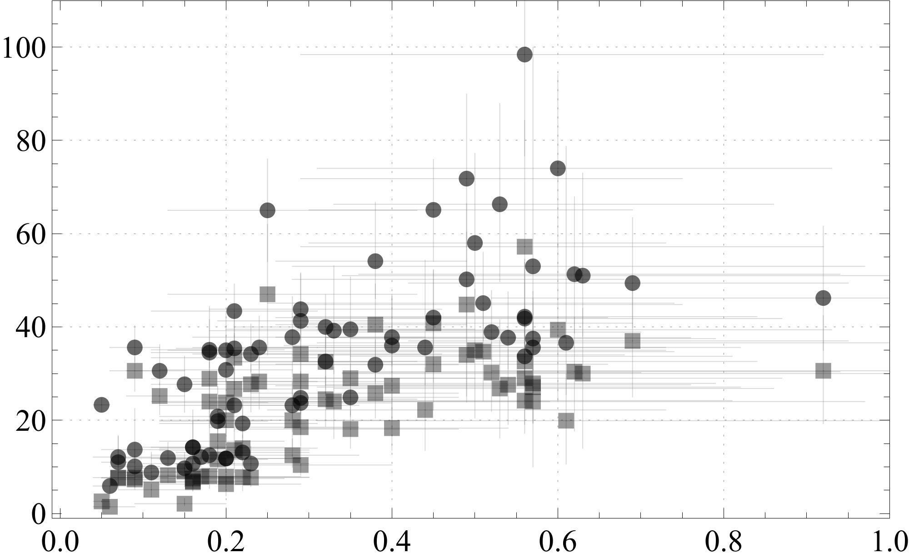
Figure 1. The distribution of $m_{1}$ (disks) and $m_{2}$ (squares) as a function of the merging redshift ($z_{m}$). Data from Table 1.

The main result is that, for DEBH and in the reference case, the probability of having no BHs below threshold is $0.0083$, corresponding to $2.64\sigma$. Using instead the $m_{2}$ masses, and excluding as potential outliers the two compact objects with masses in the range $2-5M_{\odot}$, we obtain a higher rejection level

## Page 5

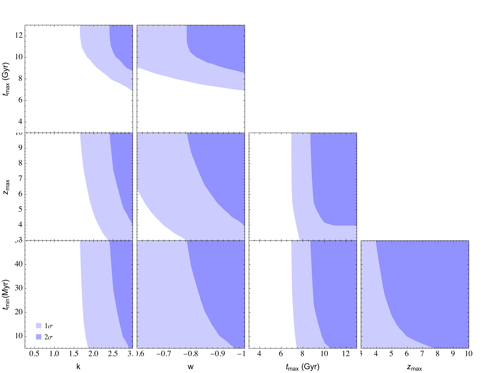
Figure 2. Direct method. Exclusion plots for the GBH and DEBH tensions. Here we assume a minimum mass threshold $m_{\mathrm{th}} = 2M_{\odot}$. The reference values are always in the upper right corner of each plot. The first and second column correspond respectively to the GBH and the DEBH cases. The two last columns show results that are common to both approaches.

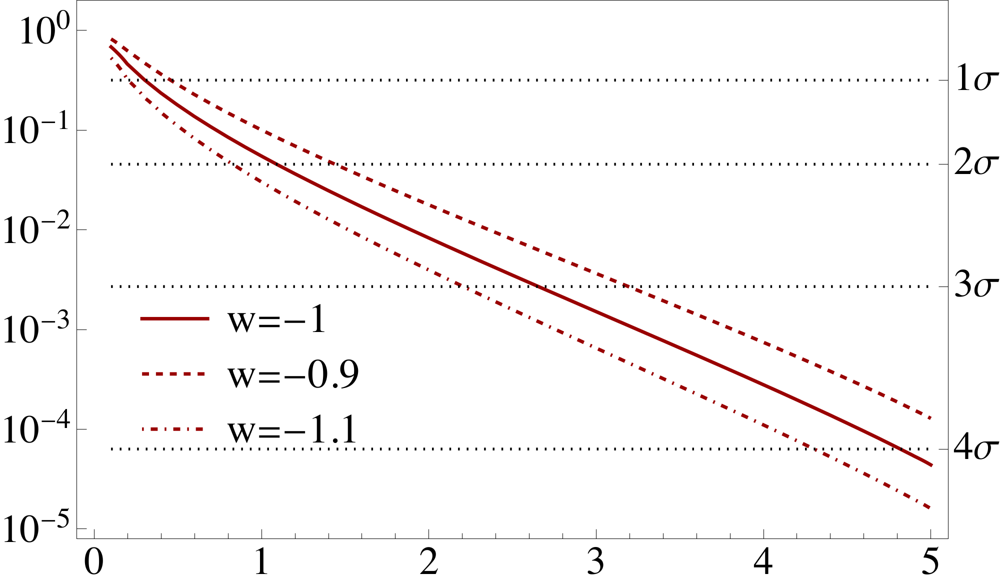
Figure 3. Direct method. Plot of $P(m_{1} > m_{\mathrm{th}})$ versus minimum BH mass in the DEBH scenario. The dotted horizontal lines mark the $\sigma$ levels.

of $3.05\sigma$. Decreasing $w$ into the phantom regime $w < -1$ makes the result stronger. For $w < -1.2$, using $m_{1}$ masses the rejection is at the $3\sigma$ level. For the other parameters, the range for which the tension is reduced below the $2\sigma$ level are $t_{\mathrm{max}} < 8.7$ Gyr and $z_{\mathrm{max}} < 4$.

For $k \approx 3$, the dependence on the threshold mass is shown in Fig. 3. Using the reference values, the tension is removed only if the minimum BH mass is lower than $1.1M_{\odot}$ for $k = 3$. Within the DEBH scenario, the minimum BH mass should be below $1.4M_{\odot}$ for $w = -0.9$, or below $0.9M_{\odot}$ for $w = -1.1$.

In Fig. 4 we show the distribution of probabilities for 1000 realizations of the current data randomly chosen.

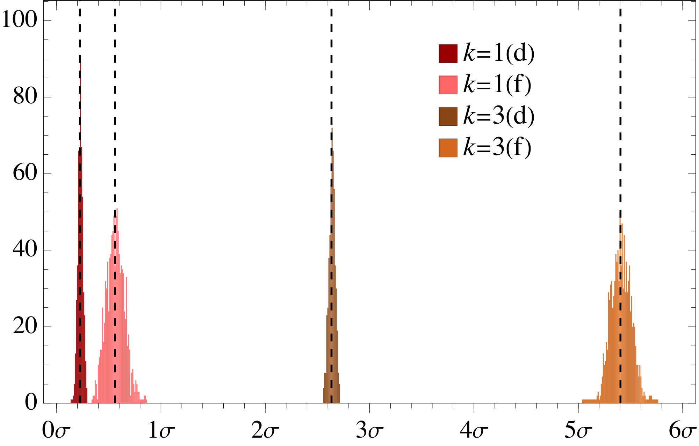
Figure 4. Direct method. Tensions assuming a fixed threshold $m_{\mathrm{th}} = 2M_{\odot}$ and the reference values (4) for current data (d) and for the forecasted 250 LVK O4 events (f) obtained as 1000 random realizations of the current GW data, for $k = 1$ and $k = 3$. The vertical black dashed lines show the median value of each distribution.

For the forecast and $k = 3$, the rejection level goes beyond $5\sigma$. On the other hand, for $k = 1$ even the forecasted data implies no relevant tension. After 4 months LVK O4 run has observed 44 significant

## Page 6

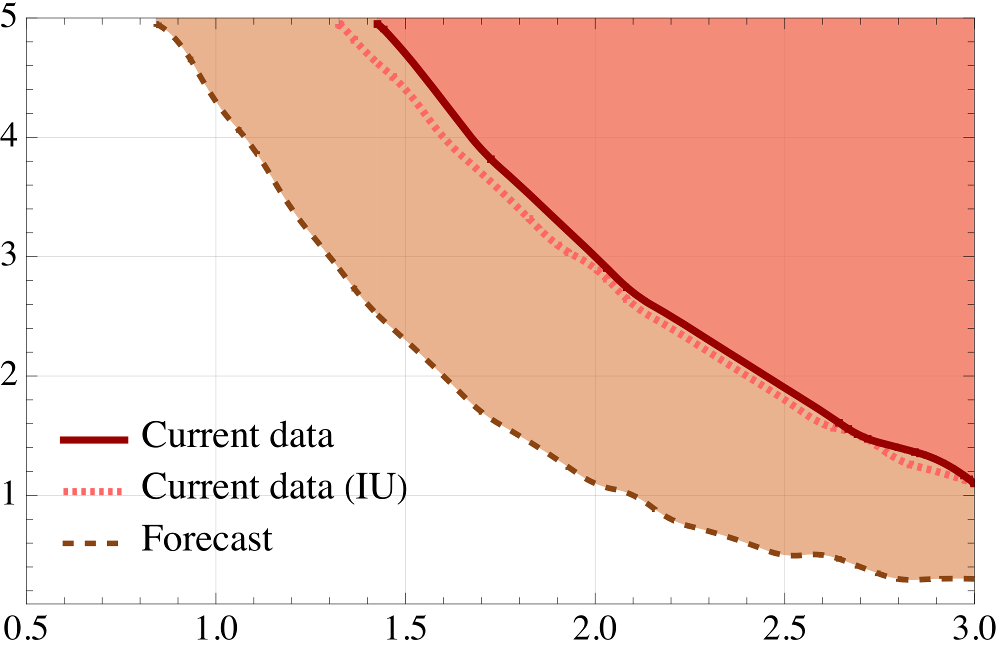
Figure 5. Direct method. Excluded $2\sigma$ regions for current data (72 events, red) and forecast (250 events, brown). The GBH model is used here. The solid red line uses the observed mass and redshift distributions of all 72 events. The dotted red line is the resulting $2\sigma$ exclusion line based on the 72 events central values (ignoring uncertainties, IU). The forecast assumes no changes in the mass-redshift distribution and considers 250 events.

BBH candidate events. If we limit ourselves to those with preliminary $\mathrm{FAR}_{\mathrm{min}} < 1/\mathrm{yr}$ and preliminary BBH classification with over $90\%$ probability, 35 BBH candidates remain. Considering that O4 should last for 20 months, and that Virgo has not yet joined, one expects a conservative lower bound of $20/4 \times 35 = 175$ new BBH events (247 in total) by the end of O4. We assumed 250 BBH events for our O4 forecasts.

Fig. 5 explores the two most relevant parameters, $k$ and minimum BH mass ($m_{\mathrm{th}}$), using the GBH picture. We stress the following results at $2\sigma$ level for the current and the forecast data: i) assuming $m_{\mathrm{th}} = 2M_{\odot}$: $k < 2.5$ (current) and $k < 1.6$ (forecast). ii) for $k = 3$, $m_{\mathrm{th}} < 1.1M_{\odot}$ (current) and $m_{\mathrm{th}} < 0.3M_{\odot}$ (forecast). For $k = 1$, there are no constraints from the current data. For $k = 0.5$, there are no constraints from this approach.

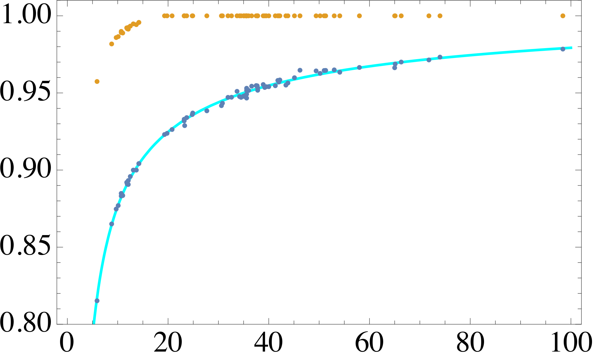
Figure 6. Direct method. Individual probabilities for each BH to be formed with a mass above the $2M_{\odot}$ threshold, as a function of its observed mass at merging. The cyan curve is the best fit given by Eq. (13) for the reference case $k = 3$. The orange dots represent the probabilities for $k = 1$; they are of course much closer to unity.

$$p(m) = C \log\left(A - B m^{-1/2}\right), \tag{13}$$

with $A = 26.72$, $B = 30.88$, $C = 0.3096$.

## 5 Constraints using the power-law-plus-peak distribution

### 5.1 General procedures

We now move to the PLPP method. The true population of merged BBHs is not well described by the detected BBHs since detection bias has an important role. A successful profile for the mass distribution of merged BBHs is the power-law-plus-peak (PLPP) one, proposed by Talbot & Thrane (2018). Considering the $m_{1}$ mass distribution, the PLPP is a combination of a power law $\beta(m_{1})$, a Gaussian peak $G(m_{1})$ and a smoothing function $S(m_{1})$. The PLPP depends on seven parameters for the $m_{1}$ distribution: the power $\alpha$, $(m_{\mathrm{min}}, m_{\mathrm{max}})$, the Gaussian mean and standard deviation $(\mu, \sigma)$, the smoothing parameter $\delta_{m}$ and the $\lambda$ parameter. The peak is interpreted as a consequence of pair-instability supernovae.

## Page 7

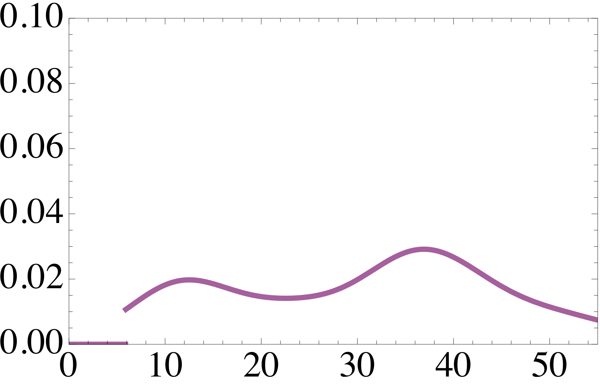
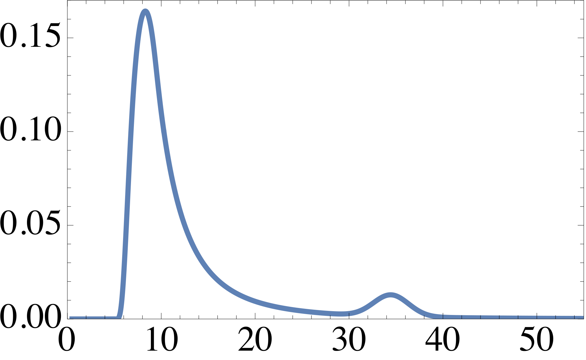
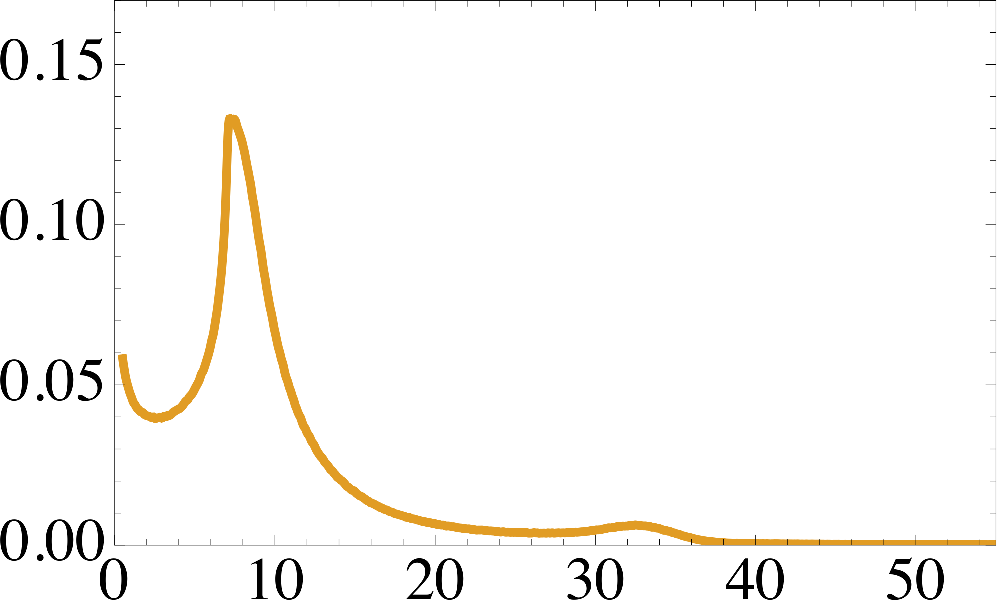
Figure 7. PLPP method. Illustration of the relation between three $m_{1}$ distribution contexts: the detected distribution, the expected distribution of all the $m_{1}$ masses from BBHs that merge (considering observational bias), and the expected $m_{1}$ distribution when it was formed. In the standard picture ($k = 0$, $w = -1$), the distributions for formation and merging are the same. For CCBH, between formation and merger, BHs increase their mass, hence the formation distribution will favour lower masses than the standard picture.

The PDF reads:

$$\pi(m_{1}) \propto (1 - \lambda)\beta(m_{1})S(m_{1}) + \lambda G(m_{1})S(m_{1}),$$
$$\beta(m_{1}) = \frac{\alpha - 1}{m_{\mathrm{min}}^{1-\alpha} - m_{\mathrm{max}}^{1-\alpha}} m_{1}^{-\alpha},$$
$$G(m_{1}) = \frac{1}{\sqrt{2\pi}\sigma}\exp\left(-\frac{(m_{1}-\mu)^{2}}{2\sigma^{2}}\right), \tag{14}$$
$$S(m_{1}) = \left\{\begin{array}{ll}\left[1 + \exp\left(\frac{\delta_{m}}{\delta m_{1}} - \frac{\delta_{m}}{\delta m_{1} - \delta_{m}}\right)\right]^{-1}, & \delta m_{1} < \delta_{m} \\ 1, & \delta m_{1} > \delta_{m}\end{array}\right.,$$

where $\delta m_{1} \equiv m_{1} - m_{\mathrm{min}}$. For the GWTC-3 data, the eight parameters (90% credible intervals) are:

$$\alpha = 3.40^{+0.58}_{-0.49}, \quad \delta_{m} = 4.8^{+3.3}_{-3.2}\,\mathrm{M}_{\odot},$$
$$m_{\min} = 5.08^{+0.87}_{-1.5}\,\mathrm{M}_{\odot}, \quad m_{\max} = 86.9^{+11}_{-9.4}\,\mathrm{M}_{\odot}, \tag{15}$$
$$\mu = 33.7^{+2.3}_{-3.8}\,\mathrm{M}_{\odot}, \quad \sigma = 3.6^{+4.6}_{-2.1}\,\mathrm{M}_{\odot},$$
$$\lambda = 0.039^{+0.058}_{-0.026}, \quad \beta_{q} = 1.1^{+1.8}_{-1.3}.$$

The maximum likelihood values read:

$$\alpha = 3.55, m_{\min} = 4.82\,\mathrm{M}_{\odot}, m_{\max} = 83.14\,\mathrm{M}_{\odot},$$
$$\delta_{m} = 5.45\,\mathrm{M}_{\odot}, \mu = 34.47\,\mathrm{M}_{\odot}, \sigma = 1.87\,\mathrm{M}_{\odot}, \tag{16}$$
$$\lambda = 0.019, \beta_{q} = 0.76.$$

To test the CCBH hypothesis, we use the merging BBH distribution from PLPP to find the expected BBH mass distribution at formation time (Fig. 7). Let $M_{1,m}$ be a random realization of the PLPP distribution and $F_{z_m}$ a random realization of the mass factor correction of eq. (8) at given $z_m$. Then the $m_1$ distribution at BBH formation time is the distribution of $M_{1,i}$, with

$$M_{1,i} = F_{z_{m}} M_{1,m}. \tag{17}$$

Our results are found using at least $10^{5}$ realizations of each random variable.

## Page 8

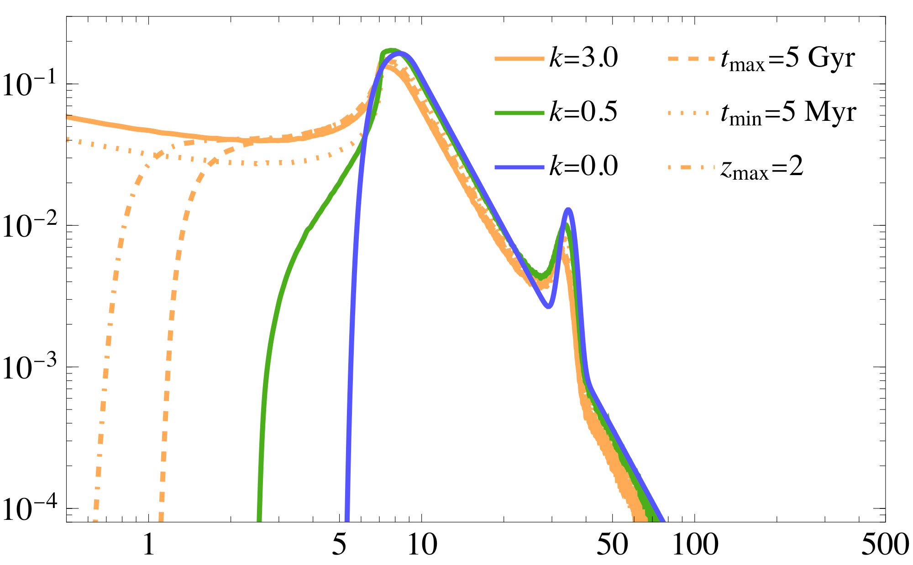
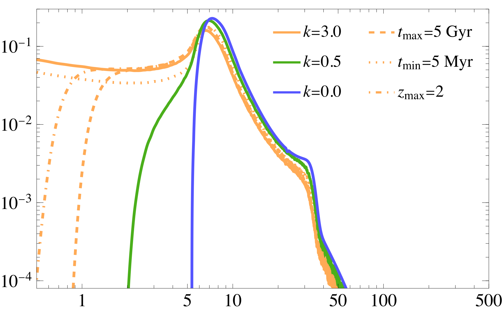
Figure 8. PLPP method. The $m_{1}$ (left) and $m_{2}$ (right) distributions at formation for different parameter values, assuming the PLPP distribution at merger (Fig. 7, using PLPP parameters of Eq. (16)). In blue: $k=0$ (no coupling). Green: $k=0.5$ within GBH. Solid orange: $k=3$ with reference values Eq. (4); the other three orange curves show variations: $t_{\rm max}=5$ Gyr (dashed), $t_{\rm min}=5$ Myr (dotted) and $z_{\rm max}=2$ (dot-dashed). Generated with $10^{7}$ simulated events.

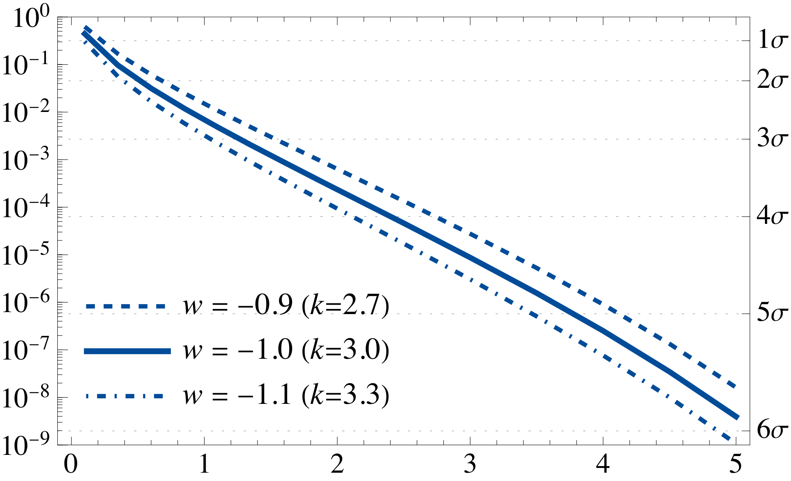
Figure 9. PLPP method. Probability that the DEBH model is in agreement with the minimum BH mass threshold, as a function of the latter, and for different $w$ values. This case uses $k=-3w$.

From the $m_{1}$ mass distribution at the BBH formation, one computes the probability that one of the merged BBHs could have been formed with $m_{1}$ larger than a given mass threshold $m_{\rm th}$. The probability of a CCBH realization being compatible with existing data is

$$P(m_{1}>m_{\rm th})=\prod_{j}^{N}p_{j}(m_{\rm th},z_{m,j})\approx p^{N}(m_{\rm th},\overline{z_{m}})\ , \tag{18}$$

where $\overline{z_{m}}$ is an average over all the $z_{m,j}$ values. The $m_{2}$ distribution is given by

$$\pi(m_{2}|m_{1})\propto\left(\frac{m_{2}}{m_{1}}\right)^{\beta_{q}}S(m_{2})\Theta(m_1-m_{2})\ , \tag{19}$$

and marginalizing over $m_1$:

$$\pi(m_{2})=\int_{m_{\rm min}}^{m_{\rm max}}\pi(m_{2}|m_{1})\pi(m_{1}){\rm d}m_{1}\ . \tag{20}$$

### 5.2 Results

By applying the mass factor correction on the PLPP distribution (17), with the best-fit parameters (16), and using eq. (18) with $N=72$, the probability that no merged BBH was formed with mass smaller than $2M_{\odot}$ is $P\approx 2\times 10^{-4}$, implying a minimum tension of $3.7\sigma$ for the reference values. With new detections in O4, the tension is forecast to increase beyond $5\sigma$ (250 events).

## Page 9

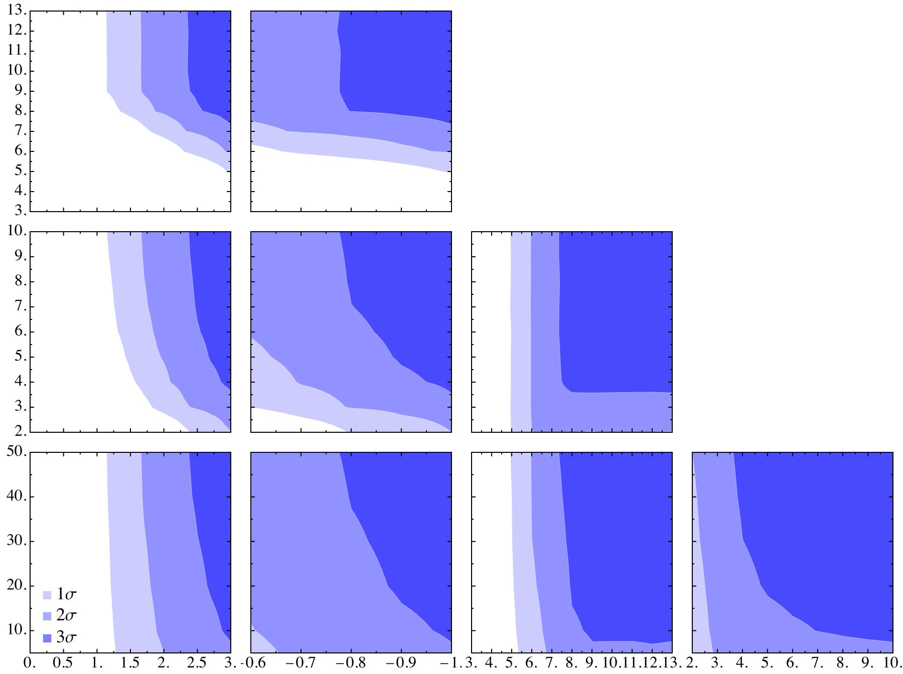
Figure 10. PLPP method. Same as Fig. 2. The GBH and DEBH tensions with observational data, assuming that the PLPP distribution models the detection bias and $m_{\mathrm{th}} = 2.0M_{\odot}$.

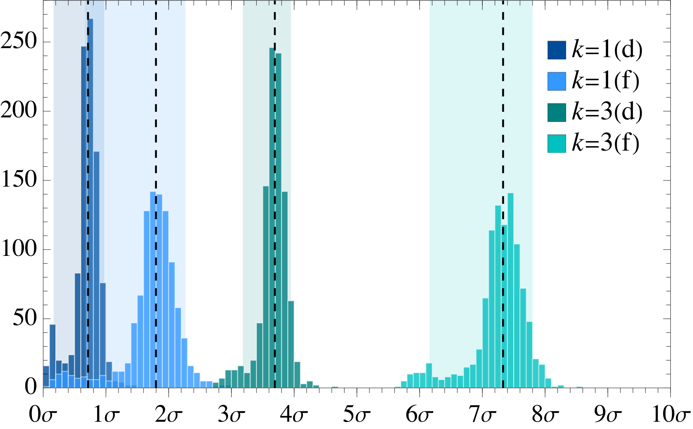
Figure 11. Similar to Fig. 4 for the PLPP method. The histograms show the CCBHs tensions computed from $10^{3}$ different PLPP parameter realizations, including correlations (15). The rectangular light-colored regions delimit the $5\%$ and $95\%$ quantiles.

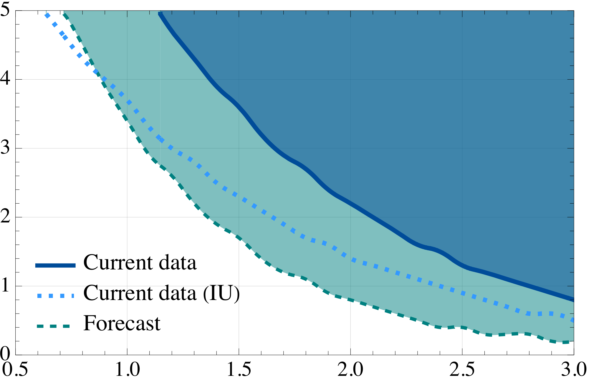
Figure 12. Similar to Fig. 5 for the PLPP method. Excluded regions at $2\sigma$ for current data (72 events, blueish, solid) or forecast (250 events, greenish, dashed), using the GBH approach.

Using the $m_{2}$ distribution, eq. (20), the tension becomes $4.0\sigma$ for $m_{\mathrm{th}} = 2M_{\odot}$. Fixing $k = 3$ but reducing the minimum mass, the tension disappears (less than $2\sigma$) if $m_{\mathrm{th}} < 0.5M_{\odot}$.

## Page 10

In Fig. 9 we show how the tension changes with the BH minimum mass, considering $m_{1}$ data, in the DEBH model. The tension decreases for larger $w$ (lower $k$). The case $k=0.5$ is safe (Croker et al., 2021).

In Fig. 10 we show exclusion plots for the DEBH and GBH models (72 observed $m_{1}$ data, fixed best PLPP parameters, $m_{\rm th}=2M_{\odot}$). The two most important parameters to alleviate tension are $k$ and $t_{\rm max}$. Necessary individual parameter ranges to reduce tension from $3.7\sigma$ to below $2.0\sigma$: $k\leq 1.7$, $t_{\rm max}<6$ Gyr, $z_{\rm max}<2$.

In Fig. 11, considering $10^{3}$ samples of the PLPP parameter distribution and $m_{\rm th}=2M_{\odot}$: i) for $k=1$, current and forecast are compatible with no tension; ii) for $k=3$ current data, 95% of realizations have tension $>3.2\sigma$; iii) for forecast with $k=3$, 95% of realizations have tension $>6\sigma$.

Figure 12 explores $k$ and $m_{\rm th}$ with the full PLPP parameter distribution. Results at $2\sigma$ level: i) $m_{\rm th}=2M_{\odot}$: $k<2.1$ (current), $k<1.4$ (forecast). ii) for $k=3$, $m_{\rm th}<0.8M_{\odot}$ (current) and $m_{\rm th}<0.2M_{\odot}$ (forecast). For $k=1$, no current constraints, forecast yields $m_{\rm th}<3.4M_{\odot}$. For $k=0.5$, no constraints.

## 6 Modified delay-time distribution from CCBH physics

In a recent work, Ghodla et al. (2023) (henceforth G23) considered the mass increase of CCBHs in BBH systems. We evaluate the consequences within the G23 picture, showing it leads to changes in the $t_{\rm d}$ distribution that can only strengthen the constraints. G23 finds, for a BBH system without eccentricity, the orbit radius $r$ follows (with $c=1$):

$$\frac{dr}{dt}=-\frac{64}{5}\frac{G^{3}\mu M^{2}}{r^{3}}\left(\frac{a}{a_{i}}\right)^{3k}\,, \tag{21}$$

where $M=m_{1}+m_{2}$ and $\mu=m_{1}m_{2}/(m_{1}+m_{2})$. Solving with $r(t_{m})=0$ and $t_{m}=t_{\rm d}+t_{i}$:

$$\int_{t_{i}}^{t_{\rm d}+t_{i}}\left(\frac{a(t)}{a_{i}}\right)^{3k}dt=\bar{t}_{\rm d}\,. \tag{22}$$

## Page 11

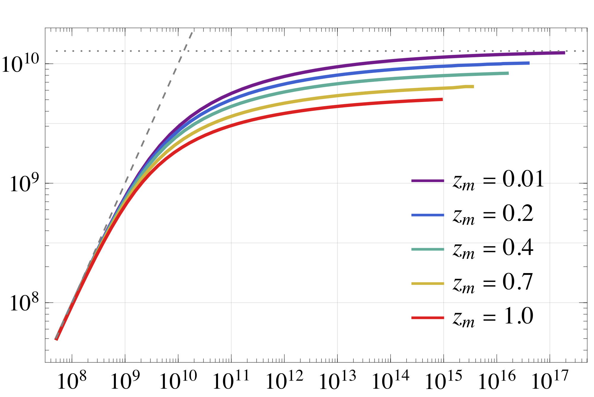
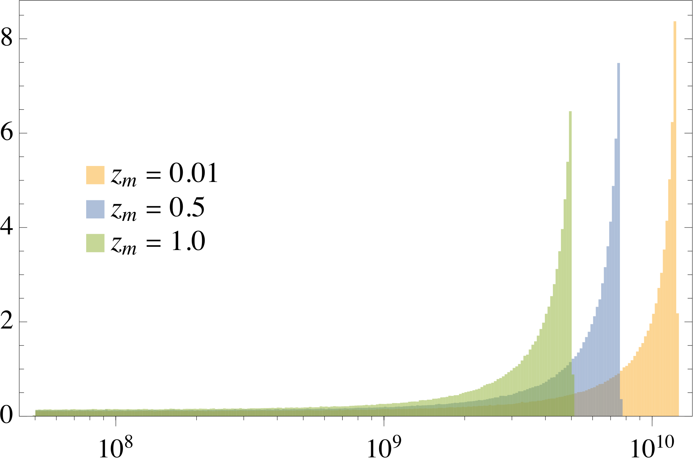
Figure 13. Left: the relation between the physical delay time $t_{\mathrm{d}}$ within the CCBH picture, with $k=3$, and an auxiliary one $\bar{t}_{\mathrm{d}}$ for $k=0$, at different merger redshifts $z_{m}$ (see eq. (23)). Right: using the log-uniform distribution for $\bar{t}_{\mathrm{d}}$, the $t_{\mathrm{d}}$ distribution strongly favours larger $t_{\mathrm{d}}$ values.

$$\int_{t_{m}-t_{\mathrm{d}}}^{t_{m}}\left(\frac{a(t)}{a_{i}}\right)^{3k}dt=\bar{t}_{\mathrm{d}}\,. \tag{23}$$

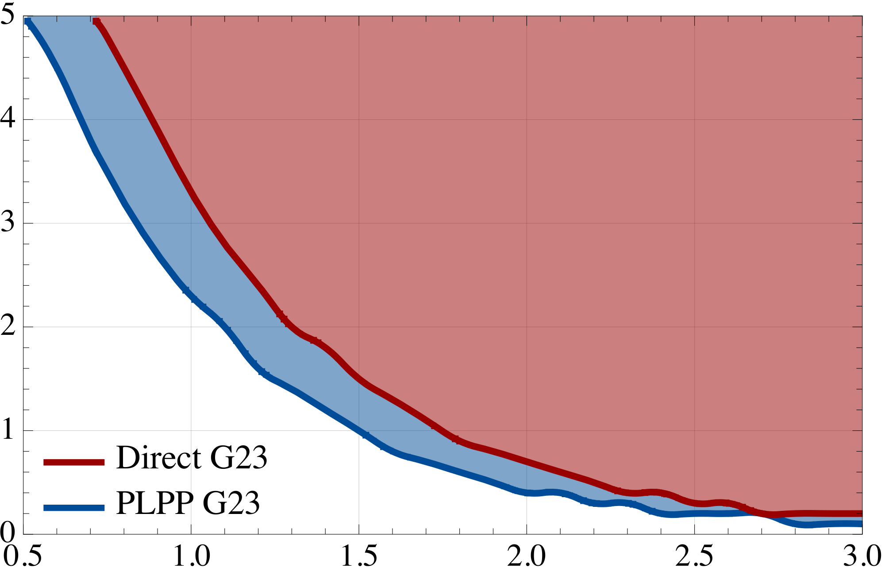
Figure 14. Similar to Figs. 5 and 12, but with $t_{\mathrm{d}}$ adjusted for CCBH and only considering current data. Excluded regions at $2\sigma$ using either the direct (red) or the PLPP (blue) method.

Fig. 14 combines the direct and PLPP $2\sigma$ bounds with the G23 relation. i) assuming $m_{\mathrm{th}}=2M_{\odot}$: $k<1.3$ (direct), $k<1.1$ (PLPP). ii) for $k=3$, $m_{\mathrm{th}}<0.2M_{\odot}$ (direct), $m_{\mathrm{th}}<0.1M_{\odot}$ (PLPP). For $k=1$, $m_{\mathrm{th}}<3.3M_{\odot}$ (direct), $m_{\mathrm{th}}<2.3M_{\odot}$ (PLPP). For $k=0.5$, no constraints.

## 7 Conclusions

According to a recent proposal (Croker & Weiner, 2019; Farrah et al., 2023b), BHs grow in mass due to a "cosmological coupling" and might be responsible for the cosmic acceleration. In this paper we tested this hypothesis by considering the binary BHs with stellar progenitors observed by LVK. The main result is that the combination of a minimum BH mass with the GW data can put strong bounds on the CCBH approach with current data. For $k=3$ and minimum BH mass ($m_{\rm th}$) of $2M_{\odot}$, a tension of $3\sigma$ or more is found with the current data. Specifically, with the current $m_{1}$ data, for $m_{\rm th}=2M_{\odot}$: $k<2.5(1.3)$ for the direct method, and $k<2.1(1.1)$ for the PLPP method, at $2\sigma$ level (values in parenthesis use the Ghodla et al. 2023 delay-time correction). The required $m_{\rm th}$ to eliminate the tensions for $k=3$ is $m_{\rm th}<0.5M_{\odot}$. For the CCBH variation studied by Croker et al. (2021) with $k=0.5$, and for $k=1$ (Cadoni et al. 2023b,a), we found no relevant tension.

## Acknowledgements

We thank Kevin Croker and Valerio Faraoni for very useful comments and feedback. We also thank Riccardo Sturani for several discussions. LA acknowledges support from DFG project 456622116. DCR thanks Heidelberg University, and acknowledges support from CNPq-Brazil and FAPES-Brazil (TO 1020/2022, 976/2022, 1081/2022). MQ is supported by FAPERJ, CNPq and CAPES. This study was financed in part by CAPES (Finance Code 001). We acknowledge support from the CAPES-DAAD bilateral project.

## Data availability

The data underlying this article are available in the article, in its online supplementary table and in the codes https://github.com/itpamendola/CCBH-direct and https://github.com/davi-rodrigues/CCBH-Numerics.

## Page 12 — References

- Abbott B. P., et al., 2019, Phys. Rev. X, 9, 031040
- Abbott R., et al., 2021b, preprint (arXiv:2108.01045)
- Abbott R., et al., 2021a, preprint (arXiv:2111.03606)
- Abbott R., et al., 2021c, Phys. Rev. D, 104, 022004
- Abbott R., et al., 2021d, Astrophys. J. Lett., 913, L7
- Abbott R., et al., 2022, preprint (arXiv:2212.01477)
- Abbott R., et al., 2023, Phys. Rev. X, 13, 011048
- Akcay S., Matzner R. A., 2011, Class. Quant. Grav., 28, 085012
- Andrae R., El-Badry K., 2023, Astron. Astrophys., 673, L10
- Avelino P. P., 2023, preprint (arXiv:2303.06630)
- Belczynski K., Holz D. E., Bulik T., O'Shaughnessy R., 2016, Nature, 534, 512
- Cadoni M., Sanna A. P., Pitzalis M., Banerjee B., Murgia R., Hazra N., Branchesi M., 2023b, preprint (arXiv:2306.11588)
- Cadoni M., Murgia R., Pitzalis M., Sanna A. P., 2023a, preprint (arXiv:2309.16444)
- Cardoso V., Pani P., 2019, Living Rev. Rel., 22, 4
- Chen Z., Lu Y., Zhao Y., 2022, Astrophys. J., 940, 17
- Croker K. S., Weiner J. L., 2019, Astrophys. J., 882, 19
- Croker K., Nishimura K., Farrah D., 2020a, ApJ, 889, 115
- Croker K. S., Runburg J., Farrah D., 2020b, Astrophys. J., 900, 57
- Croker K. S., Zevin M. J., Farrah D., Nishimura K. A., Tarle G., 2021, Astrophys. J. Lett., 921, L22
- Dymnikova I., Galaktionov E., 2016, Class. Quant. Grav., 33, 145010
- Faraoni V., Jacques A., 2007, Phys. Rev. D, 76, 063510
- Farrah D., et al., 2023a, ApJ, 943, 133
- Farrah D., et al., 2023b, Astrophys. J. Lett., 944, L31
- Fishbach M., Kalogera V., 2021, Astrophys. J. Lett., 914, L30
- Gao S.-J., Li X.-D., 2023, preprint (arXiv:2307.10708)
- Ghodla S., Easther R., Briel M. M., Eldridge J. J., 2023, preprint (arXiv:2306.08199)
- LIGO Scientific Collaboration Virgo Collaboration KAGRA Collaboration, 2023, Zenodo, v2
- Legred I., Chatziioannou K., Essick R., Han S., Landry P., 2021, Phys. Rev. D, 104, 063003
- Lei L., et al., 2023, preprint (arXiv:2305.03408)
- Mapelli M., 2020, Front. Astron. Space Sci., 7, 38
- Mazur P. O., Mottola E., 2015, Class. Quant. Grav., 32, 215024
- Mazur P. O., Mottola E., 2023, Universe, 9, 88
- Mistele T., 2023, Res. Notes AAS, 7, 101
- Morras G., et al., 2023, Phys. Dark Univ.
- Özel F., Psaltis D., Narayan R., McClintock J. E., 2010, ApJ, 725, 1918
- Parnovsky S. L., 2023, preprint (arXiv:2302.13333)
- Rocha L. S., Bachega R. R. A., Horvath J. E., Moraes P. H. R. S., 2021, preprint (arXiv:2107.08822)
- Rodriguez C. L., 2023, Astrophys. J. Lett., 947, L12
- Romani R. W., et al., 2012, Astrophys. J. Lett., 760, L36
- Talbot C., Thrane E., 2018, Astrophys. J., 856, 173
- Wang Y., Wang Z., 2023, preprint (arXiv:2304.01059)
- Wolfe N. E., Vitale S., Talbot C., 2023, preprint (arXiv:2305.19907)
- Ye C., Fishbach M., 2022, Astrophys. J., 937, 73
- de Sá L. M., Bernardo A., Bachega R. R. A., Horvath J. E., Rocha L. S., Moraes P. H. R. S., 2022, Astrophys. J., 941, 130
- van Son L. A. C., et al., 2022, Astrophys. J., 931, 17

## Page 13

### Appendix A: CCBH and minimum mass

Here we discuss the adopted $2M_{\odot}$ as the main value for the minimum BH mass in the CCBH context. Neutron star (NS) stability studies based on the Tolman-Oppenheimer-Volkoff (TOV) equation predict that nonrotating NS could have masses at least as high as $2.2M_{\odot}$ (Ye & Fishbach 2022; Legred et al. 2021), which sets a lower bound for Kerr BHs forming through stellar collapse. Rotating NS have been measured with masses as high as $2.7M_{\odot}$ (Romani et al. 2012), and binary systems containing NS find an empirical upper limit as high as $2.6M_{\odot}$ (Rocha et al. 2021). This constraint of $2.2M_{\odot}$ was used in Rodriguez (2023) and Andrae & El-Badry (2023).

Since GBHs simply grow proportionally to $a^k$, they may or may not have a horizon. DEBHs (a type of GEODE, Croker & Weiner 2019) need be a source of DE, thus are not expected to have a horizon. They could be named nonsingular BHs or exotic compact objects (ECOs). The limit of $2.2M_{\odot}$ need not apply to them. Considering the current scenario, $2M_{\odot}$ is a conservative minimum BH mass even in the DEBH scenario.

Morras et al. (2023) present moderate significance evidence for a subsolar compact object detection of mass $m_2 = 0.76^{+0.50}_{-0.14}M_{\odot}$ at $z_{m} = 0.028$. This is not strong evidence, since there is still $16\%$ chance of its mass being above $1M_{\odot}$ (could be a NS).

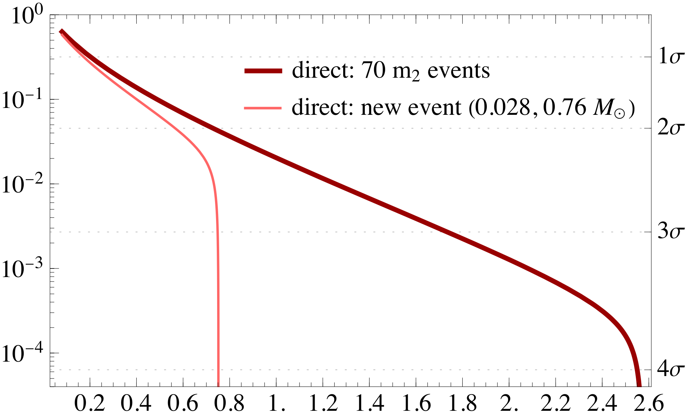
Figure A1. Same as Fig. 3 but using $m_2$ data and only for $k = 3$. We use two data sets: one with 70 $m_{2}$ events from Table 1 (including $m_2 = 2.6M_{\odot}$), and a second that adds the Morras et al. (2023) object as a stellar BH with $m_2 = 0.76M_{\odot}$, $z_{m} = 0.028$.

For the first data set and $k = 3$, the minimum BH mass threshold should satisfy $m_{\mathrm{th}} < 0.73M_{\odot}$ at $2\sigma$ level. Once the Morras et al. (2023) object is considered, one finds $m_{\mathrm{th}} < 0.57M_{\odot}$.

### Appendix B: CCBH-modified delay-time distributions compared with the log-uniform one: general approach

Here we consider the impact of CCBH on the delay-time distribution under general considerations. We show that the CCBH correction to the delay time distribution is not expected to decrease the chances of finding larger $t_{\mathrm{d}}$ values with respect to the log-uniform distribution. Considering CCBHs as true for some fixed $k$ value $(0 < k \leqslant 3)$, one can compute both the expected physical delay time $t_{\mathrm{d}}$ and an auxiliary delay time $\bar{t}_{\mathrm{d}}$ that ignores the cosmological coupling effects $(k = 0)$.

## Page 14

These delay times satisfy $t_{\mathrm{d}} < \bar{t}_{\mathrm{d}}$. We consider: i) there exists an invertible function $T$ with $\bar{t}_{\mathrm{d}} = T(t_{\mathrm{d}})$; ii) $T(t)$ increases faster than linearly; iii) $t_{\mathrm{min}}$ and $t_{\mathrm{max}}$ are known; iv) the auxiliary delay time has a log-uniform PDF:

$$\tilde{\pi}\left(\bar{t}_{\mathrm{d}}\right) = \frac{1}{\ln\left(\bar{t}_{\max}/\bar{t}_{\min}\right)}\frac{1}{\bar{t}_{\mathrm{d}}}, \tag{B1}$$

The probability of finding a physical $t_{\mathrm{d}}$ between $t_{\min}$ and $t$:

$$P(t) = \int_{t_{\min}}^{t}\pi(t_{\mathrm{d}})\mathrm{d}t_{\mathrm{d}} = \int_{\bar{t}_{\min}}^{\bar{t}}\tilde{\pi}(\bar{t}_{\mathrm{d}})\mathrm{d}\bar{t}_{\mathrm{d}}, \tag{B2}$$

$$P(t) = \frac{1}{\ln\left(\bar{t}_{\max}/\bar{t}_{\min}\right)}\ln\left(\frac{T(t)}{\bar{t}_{\min}}\right) = \frac{\ln T(t)}{\ln\bar{t}_{\max}}. \tag{B3}$$

Comparing to a log-uniform probability $\tilde{P}(t)$:

$$\frac{P(t)}{\tilde{P}(t)} = \frac{\ln t_{\max}}{\ln\bar{t}_{\max}}\frac{\ln T(t)}{\ln t}. \tag{B4}$$

If $\ln T(t)$ increases faster than $\ln t$, then $P(t) < \tilde{P}(t)$ for $t < t_{\max}$, so the $t_{\mathrm{d}}$ distribution favours larger $t_{\mathrm{d}}$ values. A special case $T(t) = t^n$ ($n>1$) preserves the log-uniform distribution. Exponentials and polynomials change it, increasing the odds of large delay times. We conclude that the CCBH correction either preserves the log-uniform distribution (and our Sec. 4–5 results) or strengthens the constraints.

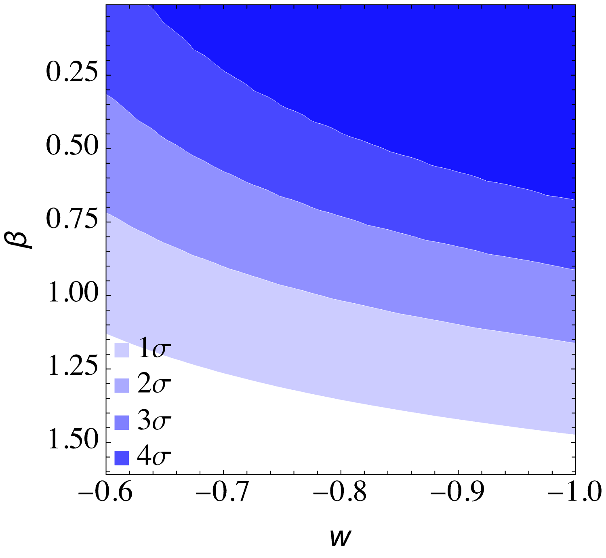
Figure C1. Direct method. Contour plot of $P(m_{1} > m_{\mathrm{th}})$ as a function of $w$ and the slope $\beta$ in the DEBH model.

### Appendix C: Changing the delay time distribution slope

The delay time distribution is a crucial assumption. van Son et al. (2022) show a tendency for low-mass BHs to be formed via the common envelope channel, with a delay time distribution steeper than $1/t_{d}$, corresponding to $\beta = 1.1 - 1.3$. In Fig. C1 we show the probability contour plot for $w, \beta$. Negative $\beta$ seems totally excluded. For $\beta \geqslant 1.2$, the probability for $w = -1$ decreases below $2\sigma$, bringing the DEBH model into the non-rejection region. Therefore, such steeper power-laws might alleviate or solve the tension.
