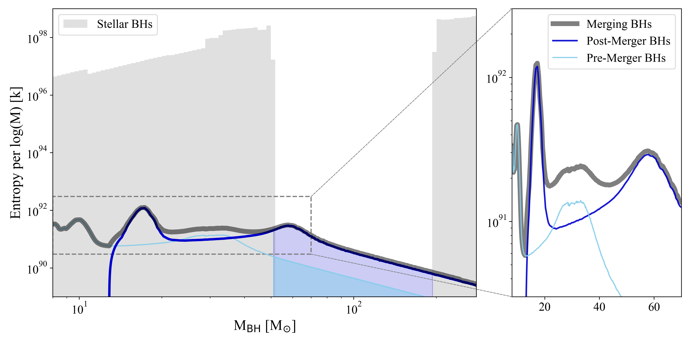
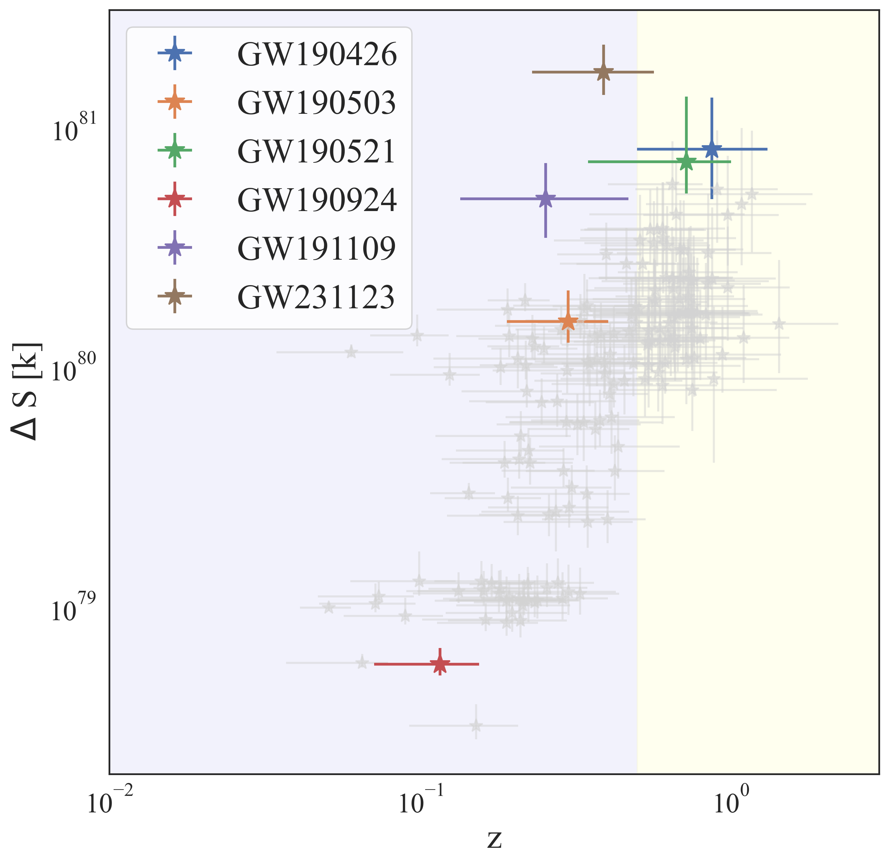
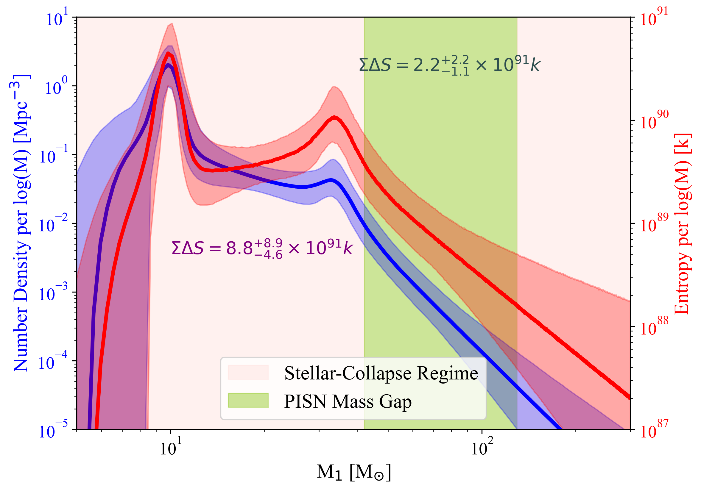
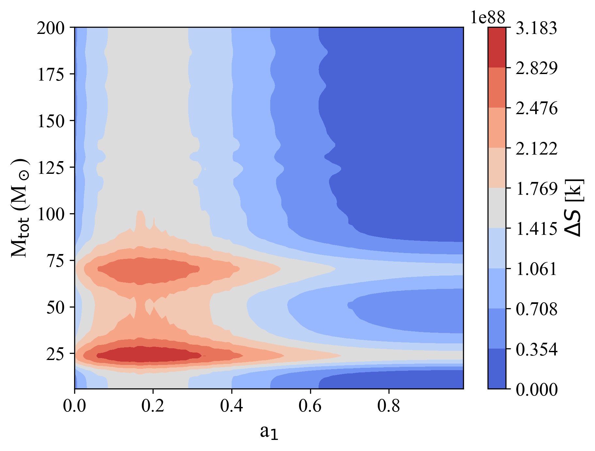
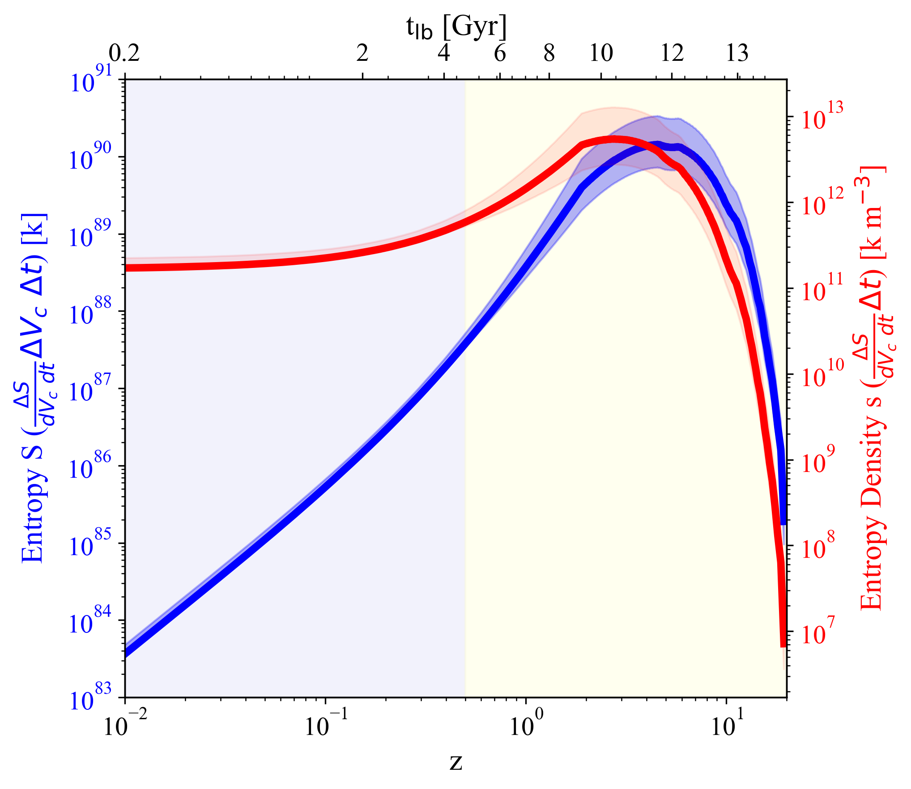
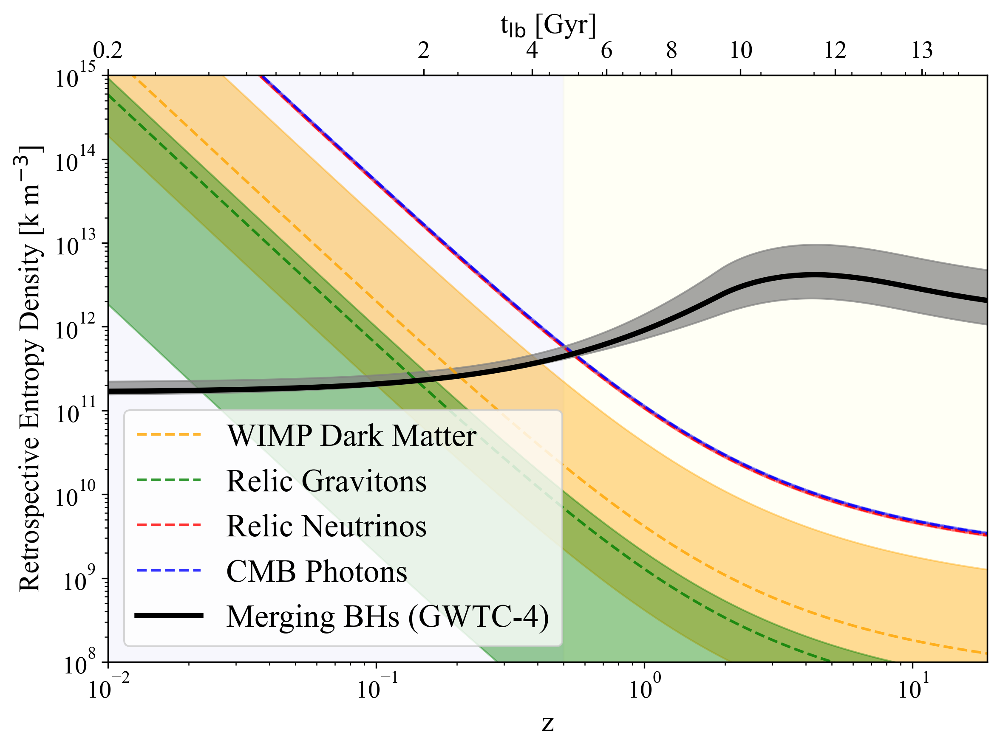
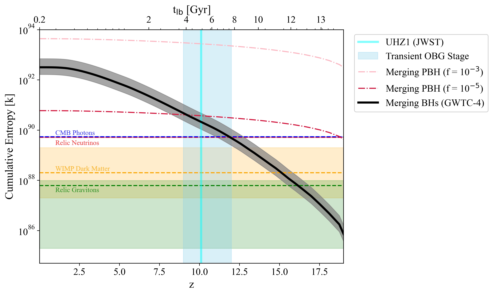

# Chen, Jani, and Kephart 2026 — PageIndex Full-Text Extraction

Verbatim page-by-page text extraction of arXiv:2601.13621v1 ("Cosmological Budget
of Entropy from Merging Black Holes") via PageIndex MCP `get_page_content`
(15 pages). Quality: `source_text_parse` — faithful text and LaTeX-equation
transcription including Table 1 (updated entropy budget) and Eqs. (1)–(16),
higher fidelity than the prior MarkItDown pass, but machine-extracted and not
line-for-line verified.

Figure image links resolve to the repo PNG mirrors under `../figures/extracted/`.
Mapping: Fig.1→`pisn_bh_imf_gwtc4.png`, Fig.2→`redshift-entropy.png`,
Fig.3→`num_density_entropy_gwtc4.png`, Fig.4→`spin_mass.png`,
Fig.5→`growth_entropy_gwtc4_only.png`, Fig.6→`cumulative_ent_den_gwtc4_only.png`,
Fig.7→`cumulative_tot_ent_gwtc4_pbh.png`.

---

## Page 1

# Cosmological Budget of Entropy from Merging Black Holes

Siyuan Chen (Center for Astrophysics | Harvard & Smithsonian), Karan Jani (Vanderbilt University), Thomas W. Kephart (Vanderbilt University)

###### Abstract

Black holes contain more entropy than any other component of the observable universe. Gravitational-wave observations from LIGO and Virgo have shown evidence of a previously unknown black hole mass range, which provides new information to update the entropy budget. Increases in entropy due to binary black hole mergers, as implied in the second law of thermodynamics, should also be added to the budget. In this study, we update the cosmological entropy budget for black holes in the stellar to lite-intermediate-mass range ($5-300~M_{\odot}$), originating from either supernovae or binary mergers, by utilizing a suite of population synthesis models and phenomenological fits derived from numerical relativity. We report three new insights: Firstly, the cumulative entropy from merging black holes surpasses the total entropy from cosmic microwave background photons around the onset of the Over-massive Black Hole Galaxy phase at $z\sim 12$, suggesting that mergers played a more significant role in shaping the thermodynamic state of the early universe than relic radiation. Secondly, if primordial black holes constitute a nonzero fraction of dark matter, their early binary mergers establish an "entropy floor" in the Dark Ages and can dominate the cumulative merger-generated entropy history even for small abundances. Thirdly, by computing the cosmological density parameters, we highlight the thermodynamic asymmetry in black hole mergers, where the production of gravitational-wave energy is inefficient compared to the immense generation of Bekenstein-Hawking entropy.

## 1 Introduction

Most gravitational wave (GW) events reported by the LIGO-Virgo-KAGRA (LVK) collaboration are associated with binary black hole (BBH) mergers (Abbott et al., 2016; Yunes et al., 2024). According to the second law of thermodynamics, irreversible processes, such as black hole mergers (Kephart and Ng, 2003), would increase the entropy of the universe (Bekenstein, 1973). As the universe evolves toward greater disorder through rising entropy, this thermodynamic progression is closely connected to the arrow of time. Therefore, entropy offers a novel lens for probing the evolution of the universe.

Understanding this thermodynamic evolution requires placing it in the context of the universe's expansion history. As outlined by Frieman et al. (2008), the universe has evolved through three distinct eras. At $z\gtrsim 3000$, shortly after the Big Bang, the universe was in the radiation-dominated era. This was followed by the matter-dominated era ($0.5\lesssim z\lesssim 3000$). The current epoch ($z\lesssim 0.5$) is governed by dark energy, which drives the accelerated expansion of the universe.

Past studies including Frampton and Kephart (2008); Berman (2009); Frampton et al. (2009); Frampton (2009); Egan and Lineweaver (2010); Frampton and Ludwick (2011) have estimated the entropy budget associated with various cosmic components. In particular, Egan and Lineweaver (2010) categorized heavier stellar-mass black holes in the mass range $42-140~M_{\odot}$ as *tentative components* due to their overlap with the so-called

## Page 2

upper mass gap — more commonly referred to as the Pair-Instability Supernovae (PISN) mass gap. Stellar evolution and nucleosynthesis theories predict the existence of a mass gap, spanning approximately $45-130~M_{\odot}$, in which black holes cannot form directly. Progenitors entering this regime undergo Pulsational Pair-Instability Supernovae (PPISN), shedding significant mass before collapse and potentially forming a pile-up of black holes just below the gap. For more massive cores, the instability leads to a full PISN explosion that completely disrupts the star, leaving no compact remnant behind (Woosley, 2017; Farmer et al., 2019; Fishbach and Holz, 2020; Marchant and Moriya, 2020; Woosley and Heger, 2021; Edelman et al., 2022). However, observations from LVK challenge this exclusion picture. The most prominent example, GW190521 (Abbott et al., 2020a), involves two inspiral black holes ($m_{1}=85^{+21}_{-14}~M_{\odot}$ and $m_{2}=66^{+17}_{-18}~M_{\odot}$) that reside squarely within the PISN gap, producing an IMBH remnant of $m_{\rm f}=142^{+28}_{-16}~M_{\odot}$. Furthermore, the most massive event reported to date, GW231123 (Abac et al., 2025), features a primary component ($m_{1}=137^{+23}_{-18}~M_{\odot}$) and a remnant ($m_{\rm f}=222^{+28}_{-42}~M_{\odot}$) that sit at or beyond the upper edge of the predicted gap.

## 2 Methods

### 2.1 Entropy for Stellar Black Holes

Based on the Hawking Area Theorem, the entropy of a black hole correlates to the surface area of its event horizon. By expressing the Bekenstein-Hawking Formula (Bekenstein, 1973) in terms of mass (m) and spin (a), we can compute the entropy of an individual black hole as:

$S=\frac{kA}{4l_{p}^{2}}=\frac{kAc^{2}}{4G\hbar^{2}}=\frac{2\pi kG}{\hbar c}m^{2}(1+\sqrt{1-a^{2}})$ (1)

We categorize stellar-origin black holes into three regimes: standard stellar BHs ($5-45~M_{\odot}$); PISN BHs ($45-130~M_{\odot}$); and lite-IMBHs ($130-300~M_{\odot}$, from direct collapse of VMS). More broadly, we adopt $10^{2}-10^{7}~M_{\odot}$ as the IMBHs range, and BHs exceeding $10^{7}~M_{\odot}$ as SMBHs.

To compute the total number density of massive stars that can collapse into black holes, we adopt the Salpeter Initial Mass Function (IMF; Salpeter 1955) with power-law index $\alpha=2.35^{+0.35}_{-0.65}$:

$\xi(m_{\star})\,dm=\xi_{0}\left(\frac{m_{\star}}{M_{\odot}}\right)^{-\alpha}dm,$ (2)

We calibrate $\xi_{0}$ by requiring the integral of the mass-weighted IMF over $0.1-350\,M_{\odot}$ reproduces the observed present-day cosmic stellar mass density, $\Omega_{\star}\simeq 0.0027\pm 0.0005$:

$\rho_{\star}=\int_{0.1~M_{\odot}}^{350~M_{\odot}}m_{\star}\,\xi(m_{\star})\,dm_{\star}=\Omega_{\star}\,\rho_{\rm c,0}$ (3)

The number density of black hole progenitors within $[m_{\rm min},m_{\rm max}]=[8,350]\,M_{\odot}$:

$n_{\star}=\int_{m_{\rm min}}^{m_{\rm max}}\xi(m_{\star})\,dm_{\star}$ (4)

## Page 3

Figure 1. Cosmological Binary Black Hole Entropy Inventory: the total accumulated entropy (Static Budget) from different black hole populations as a function of black hole mass. The stellar-origin black holes (grey histogram) include black holes formed via supernova and direct collapse. The population of merging black holes is decomposed into pre-merger components (light blue) and post-merger remnants (dark blue), both contributing in the range $5-200~M_{\odot}$. The total entropy budget from merging binaries is shown as a thick gray band. The right panel zooms in on the entropy profile of merging black holes in the range $8-70~M_{\odot}$.

For each progenitor mass $m_{\star}$, we determine the corresponding remnant mass, $m_{\rm rem}$, using the SEVN stellar evolution code (Spera & Mapelli, 2017). We assume a low-metallicity environment ($Z=2\times 10^{-4}$). The mapping $m_{\star}\mapsto m_{\rm rem}$ is non-bijective due to mass-loss pile-ups (PPISN) and complete disruptions (PISN); we compute the remnant mass function $\xi_{\rm BH}(m_{\rm rem})$ by enforcing particle number conservation. We assume a uniform distribution for the dimensionless spin, $a\sim\mathcal{U}[0,1]$, and compute the entropy for each remnant mass using Eq. 1.

### 2.2 Entropy for Merging Binary Black Holes

For merging BBHs, we get 4 different entropies: primary ($S_{1}$), secondary ($S_{2}$), remnant ($S_{\rm f}$), and the entropy produced during the merger ($\Delta S$):

$\Delta S=S_{\rm f}-(S_{1}+S_{2})$ (5)

To compute the entropy change for individual BBHs reported by LVK, we utilize the parameter estimation results from the GW Open Science Center. We adopt posterior samples obtained with the IMRPhenomXPHM waveform model. For each posterior sample, we evaluate Eq. 1 for the primary, secondary, and remnant black holes to obtain $(S_{1},S_{2},S_{\rm f})$ and then compute $\Delta S$ with Eq. 5.

## Page 4

Figure 2. Entropy Production in Individual GW Events: grey bars show the correlation between the redshift of the binary and the change in entropy during BBH mergers for 168 BBH events reported by LVK. The bar represents $z$ and $\Delta S$ with $90\%$ confidence interval. The purple-shaded region corresponds to the dark energy-dominated era ($z \leq 0.5$), while the yellow-shaded region represents the matter-dominated era ($z > 0.5$).

To extend the analysis to the population level, we adopt the Power Law + Peak (PP) model (Talbot & Thrane 2018). Given the hyperparameterized distributions of the PP model, we generate a Monte Carlo sample of $N_{\mathrm{BBH}}$ synthetic binaries, computing the remnant parameters using the NR surrogate fit NRSur7dq4Remnant (Blackman et al. 2017; Boschini et al. 2023) implemented in the SurfinBH package.

Observational constraints parameterize the BBH merger-rate density as a redshift-dependent power law $\mathcal{R}_{\mathrm{BBH}}(z) \propto (1 + z)^{\kappa}$. For $z \geq 1.5$, we utilize $\mathcal{R}_{\mathrm{BBH}}(z)$ from Mapelli & Giacobbo (2018) derived from the Illustris simulation. The expected number of BBH mergers in a lookback-time bin centered at redshift $z$:

$$N_{\mathrm{BBH}}(z) = \mathcal{R}(z) \times \Delta V_{c}(z) \times \Delta t_{\mathrm{lb}}(z) \tag{6}$$

We also consider the corresponding entropy density:

$$s = \frac{S}{V_{\mathrm{obs}}} \tag{7}$$

where $V_{\mathrm{obs}} = 3.52^{+0.11}_{-0.11}\times 10^{80}\,m^3$ (Profumo et al. 2024).

### 2.3 Entropy Budget for Primordial Black Holes

PBHs may constitute a fraction $f_{\mathrm{PBH}}\equiv \Omega_{\mathrm{PBH}}/\Omega_{\mathrm{DM}}$ of the total dark matter density ($\Omega_{\mathrm{DM}}\approx 0.26$). Current constraints from LVK merger rates suggest $f_{\mathrm{PBH}}\lesssim 10^{-3}$ for stellar-mass PBHs.

## Page 5

**Table 1.** Updated entropy budget table of different cosmological components in the observable universe, with comparisons to previous work. All entropy densities computed by dividing by $V_{\rm obs}$. References: [1] Frautschi (1982), [2] Frampton & Kephart (2008), [3] Frampton (2009), [4] Frampton et al. (2009), [5] Egan & Lineweaver (2010), [6] Profumo et al. (2024).

| Components | Entropy Density $s$ [k m⁻³] | Entropy $S$ [k] (This Work) | Entropy $S$ [k] (Previous Work) |
| --- | --- | --- | --- |
| Stellar BHs (5–45 $M_{\odot}$) | $1.8\times 10^{18}$ | $2.8\times 10^{98}$ | $10^{96}$[6], $10^{97}$[4][5], $10^{98}$[1] |
| PISN BHs (45–130 $M_{\odot}$) | $1.2^{+1.3}_{-0.5}\times 10^{12}$ | $1.9^{+2.1}_{-0.7}\times 10^{93}$ | $10^{99}$[5] |
| Lite-IMBHs (130–300 $M_{\odot}$) | $5.1\times 10^{18}$ | $1.8\times 10^{99}$ | – |
| IMBHs ($10^{2}$–$10^{7}$ $M_{\odot}$) | $1.4\times 10^{17}$ [3][6] | – | $10^{97}$[6], $10^{105}$[3] |
| SMBHs ($10^{7}$–$10^{9}$ $M_{\odot}$) | $2.4^{+3.0}_{-2.2}\times 10^{21}$ [6] | – | $10^{101}$[6], $10^{102}$[4], $10^{103}$[2], $10^{104}$[5] |
| BBH mergers $\Delta S$ (5–~500 $M_{\odot}$) | $7.1^{+9.2}_{-3.5}\times 10^{12}$ | $1.1^{+1.5}_{-0.6}\times 10^{93}$ | – |
| GWTC Pre-merger $S$ (5–300 $M_{\odot}$) | $1.2^{+1.5}_{-0.6}\times 10^{13}$ | $1.9^{+2.5}_{-0.9}\times 10^{93}$ | – |
| GWTC Post-merger BHs (8–~500 $M_{\odot}$) | $1.9^{+2.5}_{-0.9}\times 10^{13}$ | $3.1^{+4.0}_{-1.5}\times 10^{93}$ | – |
| Photons | $1.5\times 10^{9}$ [6] | – | $10^{88}$[4], $10^{89}$[5][6] |
| Relic Neutrinos | $1.4\times 10^{9}$ [6] | – | $10^{88}$[4], $10^{89}$[5][6] |
| WIMP Dark Matter | $8.9^{+64}_{-6.0}\times 10^{7}$ [6] | – | $10^{88}$[5], $10^{87}$–$10^{89}$[6] |
| Relic Gravitons | $1.7\times 10^{17}$ [5][6] | – | $10^{87}$[5] |
| ISM and IGM | $7.5\times 10^{1}$ [5][6] | – | $10^{81}$[5], $10^{80}$–$10^{81}$[6] |
| Stars | $2.6\times 10^{-1}$ [5][6] | – | $10^{79}$[4], $10^{80}$[5], $10^{74}$–$10^{81}$[6] |

(Note: a few exponents in this table were OCR-extracted and should be checked against the source PDF before numerical reuse.)

We adopt a log-normal mass distribution for the PBH population:

$\psi(M)=\frac{1}{\sqrt{2\pi}\sigma M}\exp\left[-\frac{\ln^{2}(M/M_{c})}{2\sigma^{2}}\right]$ (8)

with characteristic mass $M_{c}=30~M_{\odot}$ and width $\sigma=0.5$, and dimensionless spin $a=0$. We adopt the merger rate density of Sasaki et al. (2016):

${\cal R}(t)={\cal R}_{0}\left(\frac{t}{t_{0}}\right)^{-34/37},$ (9)

${\cal R}_{0}\approx 1.6\times 10^{6}\left(\frac{f_{\rm PBH}}{10^{-3}}\right)^{53/37}~{\rm Gpc}^{-3}\,{\rm yr}^{-1}.$ (10)

### 2.4 Cosmological Density Parameters

For a cosmic component $i$ with mass-energy density $\rho_{i}$:

$\Omega_{i}=\frac{\rho_{i}}{\rho_{c,0}},\quad{\rm where}\quad\rho_{c,0}=\frac{3H_{0}^{2}}{8\pi G}$ (11)

## Page 6

We derive three parameters: the initial mass density ($\Omega_{\rm BH}$), the GW energy density ($\Omega_{\rm GW}$), and the post-merger remnant density ($\Omega_{\rm BH,rem}$).

$\rho_{\rm BH}=\int_{m_{\rm min}}^{m_{\rm max}}m\ \xi_{\rm BH}(m)\ dm$ (12)

During coalescence, a fraction of the total rest-mass energy is radiated as GWs: $M_{\rm tot}c^{2}=M_{\rm rem}c^{2}+E_{\rm GW}$. The total energy density:

$\rho_{\rm GW}=\frac{1}{c^{2}}\int_{0}^{\infty}\frac{\mathcal{R}(z)\langle E_{\rm GW}\rangle}{1+z}\frac{dt}{dz}dz$ (13)
$=\int_{0}^{\infty}\frac{\mathcal{R}(z)\langle\epsilon_{\rm GW}M_{\rm tot}\rangle}{1+z}\frac{dt}{dz}dz$ (14)

## 3 Results

### 3.1 Entropy Budget for Stellar Black Holes

For stellar black holes with masses below 45 $M_{\odot}$, the number density decreases with increasing mass, yet the total entropy continues to rise due to the quadratic dependence of black hole entropy on mass. The cumulative entropy budget of this population is approximately $2.8\times 10^{98}\ k$. The total entropy associated with lite-IMBHs is $1.8\times 10^{99}\ k$.

We identify three distinct populations of black holes that can populate the PISN mass gap:
1. Pre-merger primary black holes ($S_{1}$): $1.3^{+0.2}_{-0.1}\%$ of primary black holes fall within $45-130\ M_{\odot}$; entropy budget $2.0^{+2.7}_{-1.0}\times 10^{92}\ k$.
2. Pre-merger secondary black holes ($S_{2}$): entropy budget $9.3^{+14}_{-5.1}\times 10^{91}\ k$.
3. Post-merger black holes ($S_{\rm f}$): $>50\%$ form within the PISN mass gap; total entropy $1.6^{+1.7}_{-0.7}\times 10^{93}\ k$.

Despite their low number density ($\sim 1.3\%$), PISN black holes contribute $15^{+0.7}_{-0.8}\%$ of the total entropy of the pre-merger population. For remnant black holes, PISN black holes account for $51^{+6.0}_{-4.1}\%$ of the total entropy budget.

## Page 7

The entropy budget of PISN black holes is approximately $10^{6}$ times smaller than that of stellar-mass black holes and light-IMBHs formed from VMSs. The entropy budget of light stellar-mass black holes ($\leq 15M_{\odot}$) is $\sim 6.5\times 10^{97}k$, within the range reported by Egan & Lineweaver (2010).

### 3.2 Entropy Budget for Merging Black Holes

We present the entropy increase inferred for 168 LVK events broadly classified as BBH systems in Fig. 2. The data show a weak correlation between redshift and entropy generation ($R^2 \approx 0.15$). We adopt the PP model uniformly across the entire redshift range ($z \in [0,20]$).

Figure 3. Dynamic Entropy Production: The blue curve (left axis) shows the GWTC-4 inferred number density of BBH mergers per $\mathrm{Mpc}^{-3}$ per logarithmic mass interval. The red curve (right axis) shows the corresponding mass distribution of entropy generated $(\Delta S)$ per $\log(M)$. PISN mass gap shaded yellow ($45-130 M_{\odot}$).

At $M = 33.6M_{\odot}$, the entropy increase peaks at $\Delta S = 1.07\times 10^{90}k$, whereas at $M = 9.84M_{\odot}$, the entropy increase peaks at $\Delta S = 4.44\times 10^{90}k$. BBHs within the PISN mass gap contribute $\sim 25\%$ of the total entropy increase, even though they comprise only $1.3\%$ of the total BBH sample.

## Page 8

Figure 4. Entropy Production in Mass-Spin Space: the total entropy change $\Delta S$ from stellar BBH mergers across all redshift $z\in [0,20]$ in the mass $(M_{\mathrm{tot}})$ – spin $(a_1)$ parameter space.

The spin magnitude has a weaker influence on $\Delta S$ than the masses (dominant scaling $\propto M^2$). Although the Bekenstein-Hawking entropy of an individual black hole is maximized for zero spin, the rate-weighted $\Delta S$ peaks around $a \sim 0.2$.

Figure 5. Cosmic History of Merger-Generated Entropy: total entropy (left y axis & blue curve) and entropy density (right y axis & red curve) from merging BBHs in the comoving frame across $z \in [0.01,20]$. The dark energy-dominated and matter-dominated eras are shaded purple and yellow.

The entropy density $s(z)$ peaks at $z\simeq 2.79$; the total entropy $S(z)$ peaks at $z\simeq 4.55$. Power-law approximations: low-redshift ($z \lesssim 0.5$) $S_{\mathrm{growth}} = 1.46 \times 10^{88} \times z^{2.37}$; intermediate ($0.5 \lesssim z \lesssim 4.5$) $S \propto z^{3.07}$, with maximum $S_{\mathrm{peak}} = 1.43^{+1.91}_{-0.71} \times 10^{90} k$ at $z \simeq 4.55$; beyond peak $S \propto z^{-4.82}$.

## Page 9

We present a revised and expanded entropy budget of the observable universe in Table 1.

## 4 Cosmological Implications

To evaluate the cumulative entropy contribution from BBH mergers since the Big Bang, we integrate the differential entropy growth from the highest redshifts down to the present epoch. The resulting cumulative entropy $\mathcal{S}_{\rm BH}(z)$ is shown in Fig. 6.

### 4.1 The Thermodynamic Crossover at Cosmic Dawn

A salient feature is the "thermodynamic crossover," where the cumulative entropy produced by mergers exceeds the total entropy of the CMB photons. We find that this transition occurs at a redshift of $z=12.6^{+1.5}_{-3.5}$. This is particularly intriguing given the JWST detection of an accreting black hole with mass $M_{\rm BH}\sim 4\times 10^{7}~M_{\odot}$ in the galaxy UHZ1 at $z\sim 10.1$ (Natarajan et al., 2023), and the predicted transient phase of over-massive black hole galaxies (OBGs) over $z\in[9,12]$.

### 4.2 Constraints from the Dark Ages: The PBH Floor

If PBHs constitute a non-zero fraction of the dark matter, PBH binaries can form and merge well before the first stars ignite, establishing an "entropy floor." We consider two representative abundances: a higher-abundance case ($f_{\rm PBH}=10^{-3}$, pink dot-dashed line) and a conservative low-abundance case ($f_{\rm PBH}=10^{-5}$, red dot-dashed line).

## Page 10

Figure 6. Cumulative Cosmological Entropy Budget: cumulative entropy from merging BBHs in the comoving frame as a function of redshift over $z \in [0.01, 20]$. For comparison, we also show the entropy contribution from PBHs for two PBH fraction choices, and the contributions from other cosmic components as estimated in Egan & Lineweaver (2010). The vertical line marks the redshift of the most distant black hole observed by JWST in galaxy UHZ1.

For $f_{\mathrm{PBH}} = 10^{-3}$, the PBH merger contribution exceeds the stellar-origin BBH contribution across the full $z$ range. The lower-abundance case ($f_{\mathrm{PBH}} = 10^{-5}$) surpasses the CMB photon entropy as early as $z \sim 18.7$, with a stellar/PBH crossover at $z = 9.17^{+1.31}_{-1.01}$.

### 4.3 Cosmological Density Parameters & Thermodynamic Asymmetry

We find an initial mass density parameter of $\Omega_{\mathrm{BH}} = 5.32^{+6.65}_{-3.37}\times 10^{-5}$. The mass density in merger remnants is $\Omega_{\mathrm{BH,rem}} = 4.19^{+5.68}_{-2.44}\times 10^{-9}$ ($\Omega_{\mathrm{BH,rem}}/\Omega_{\mathrm{BH}}\sim 8\times 10^{-5}$). The GW energy density parameter is $\Omega_{\mathrm{GW}} = 5.01^{+6.50}_{-2.85}\times 10^{-11}$, approximately six orders of magnitude below CMB photons ($\Omega_{\gamma}\approx 5\times 10^{-5}$) or neutrinos ($\Omega_{\nu}\approx 3.4\times 10^{-5}$).

## Page 11

We find $\Omega_{\rm GW}/\Omega_{\rm BH,rem}\sim 10^{-2}$. These results illustrate a thermodynamic asymmetry in black hole mergers:
1. Energetically Inefficient: BBH mergers radiate only a minute fraction of their mass-energy and contribute negligibly to the universe's energy budget.
2. Entropically Dominant: these same events drive a disproportionate increase in cosmic entropy, surpassing the CMB photon entropy budget at $z\sim 12$.

### 4.4 Volume-normalized Retrospective Entropy Density

$N_{\rm BBH}(z)=\int_{0}^{z}\mathcal{R}(z)\ dV_{c}(z)\ dt_{\rm lb}(z)$ (15)

$\text{Retrospective Entropy Density}(z_{0})=\frac{\sum_{i=1}^{N_{\rm BBH}(z_{0})}\Delta S_{i}}{\int_{0}^{z_{0}}dV_{c}(z)}$ (16)

The retrospective entropy density rises to a maximum of $4.17^{+5.35}_{-2.00}\times 10^{12}\ k\ m^{-3}$ at $z=4.33^{+0.08}_{-0.12}$. The curve for BBH-merger intersects the baselines for relic photons and relic neutrinos near $z=0.55^{+0.01}_{-0.05}$.

## Page 12

Figure 7. Volume-normalized Retrospective Entropy Density: retrospective entropy density as a function of redshift $z$ and look-back time $t_{lb}$, constructed by normalizing the cumulative entropy budget integrated over $z \in [0.01,20]$ by the comoving volume enclosed within the same interval. For reference, we include the entropy contributions of several conserved cosmic components reported in Egan & Lineweaver (2010).

## 5 Conclusion

We have presented a revised cosmic entropy budget, explicitly quantifying the contributions from stellar-collapse black holes and their mergers. Three key insights: First, a critical "thermodynamic crossover" during Cosmic Dawn ($z \sim 12$). Second, even a trace population of primordial black holes would establish an early "entropy floor," dominating the thermodynamic landscape of the Dark Ages. Finally, a profound thermodynamic asymmetry: while BBH mergers are energetically inefficient, they drive a disproportionate irreversible increase in cosmic entropy.

We acknowledge that our high-redshift conclusions rely on extrapolating the BBH merger rate from Mapelli & Giacobbo (2018). Future GW facilities (LISA, and proposed mid-band concepts such as LILA) will provide the necessary empirical anchor to test these predictions.

## 6 Acknowledgement

We thank Priyamvada Natarajan for insightful discussion. S.C. acknowledges support from the Littlejohn Fellowship, Vanderbilt Immersion Program and the Vanderbilt University Summer Research program. K.J.'s work was supported in part by the Lunar Labs Initiative at Vanderbilt University. This material is based upon work supported by NSF's LIGO Laboratory. This research has made use of data, software and/or web tools obtained from the Gravitational Wave Open Science Center.

## Page 13–15 — References (selected)

- Abac, A. G., et al. 2025, ApJL, 993, L25
- Abbott, B. P., et al. 2016, PhRvL, 116, 241102
- Abbott, R., et al. 2020a, PhRvL, 125, 101102; 2020b, ApJL, 900, L13; 2021a, SoftwareX, 13, 100658; 2021b, ApJL, 913, L7; 2023a, ApJS, 267, 29; 2023b, PRX, 13, 011048
- Agarwal, B., et al. 2013, MNRAS, 432, 3438
- Bekenstein, J. D. 1973, Phys. Rev. D, 7, 2333
- Blackman, J., et al. 2017, PRD, 96, 024058; Boschini, M., et al. 2023, PRD, 108, 084015
- Chen, S., & Jani, K. 2024, arXiv:2411.02778
- Colpi, M., et al. 2024, LISA Definition Study Report, arXiv:2402.07571
- Egan, C. A., & Lineweaver, C. H. 2010, ApJ, 710, 1825
- Farmer, R., et al. 2019, ApJ, 887, 53
- Frampton, P. H., & Kephart, T. W. 2008, JCAP, 2008, 008; Frampton, P. H. 2009, arXiv:0905.2535; Frampton et al. 2009, CQG, 26, 145005
- Frautschi, S. 1982, Science, 217, 593
- Frieman, J. A., Turner, M. S., & Huterer, D. 2008, ARA&A, 46, 385
- Fukugita, M., & Peebles, P. J. E. 2004, ApJ, 616, 643
- Hawking, S. W. 1971, PRL, 26, 1344
- Madau, P., & Dickinson, M. 2014, ARA&A, 52, 415
- Mapelli, M., & Giacobbo, N. 2018, MNRAS, 479, 4391
- Natarajan, P., et al. 2017, ApJ, 838, 117; 2023, arXiv:2308.02654
- Planck Collaboration, et al. 2020, A&A, 641, A6
- Profumo, S., et al. 2024, "A New Census of the Universe's Entropy", arXiv:2412.11282
- Raidal, M., et al. 2019, JCAP, 2019, 018
- Salpeter, E. E. 1955, ApJ, 121, 161
- Sasaki, M., Suyama, T., Tanaka, T., & Yokoyama, S. 2016, PRL, 117, 061101
- Spera, M., & Mapelli, M. 2017, MNRAS, 470, 4739
- Talbot, C., & Thrane, E. 2018, ApJ, 856, 173
- The LIGO Scientific Collaboration, et al. 2025, arXiv:2508.18083
- Varma, V., et al. 2018 (surfinBH, ascl:1809.007); 2019, PRR, 1, 033015
- Woosley, S. E. 2017, ApJ, 836, 244; Woosley, S. E., & Heger, A. 2021, ApJL, 912, L31
- Yunes, N., Siemens, X., & Yagi, K. 2024, arXiv:2408.05240
- Zertuche, L. M., et al. 2024, arXiv:2408.05300

(Full reference list of 39 entries is in the source PDF, pages 13–15.)
