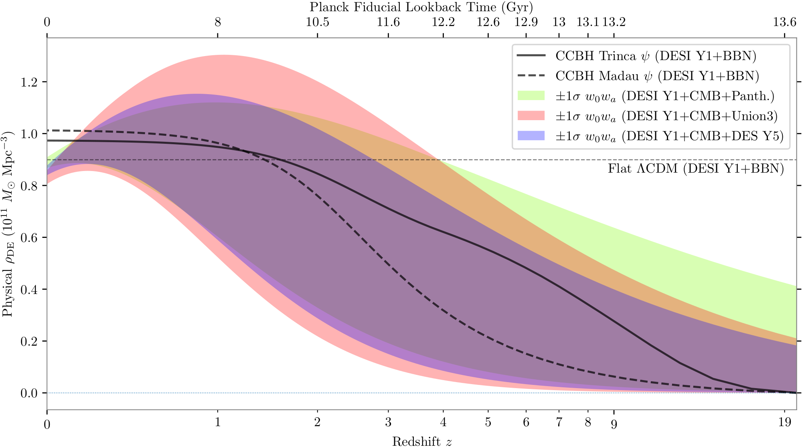
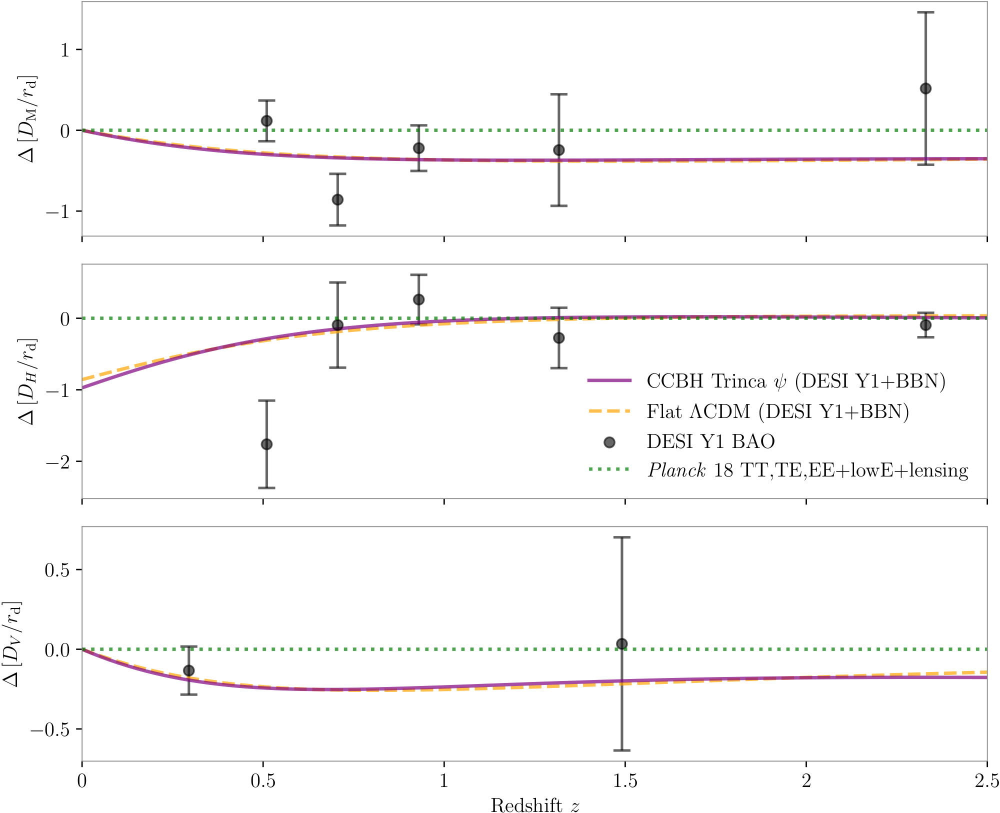
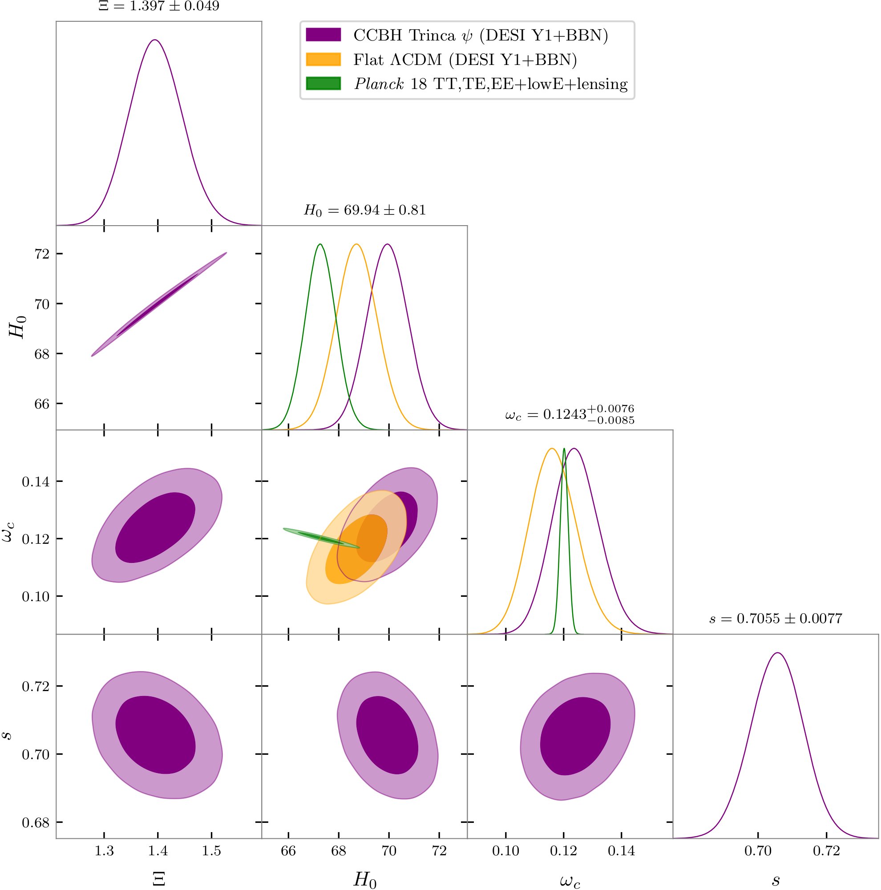

# Croker et al. 2024 — PageIndex Full-Text Extraction

Verbatim page-by-page text extraction of arXiv:2405.12282v3 ("DESI Dark Energy
Time Evolution is Recovered by Cosmologically Coupled Black Holes") via [PageIndex](https://github.com/VectifyAI/PageIndex)
MCP `get_page_content`. Quality: `source_text_parse` — faithful text and
LaTeX-equation transcription of the main body (pages 1–13) including Table 1 (fit
results) and Eqs. (1)–(10), higher fidelity than the prior [MarkItDown](https://github.com/microsoft/markitdown) pass, but
machine-extracted and not line-for-line verified. Pages 14–20 are the
bibliography (~128 references); the captured leading entries are reproduced and
the remainder is noted (full list in the source PDF).

Figure image links resolve to the repo PNG mirrors under `../figures/extracted/`.
Mapping: Fig.1→`pidgeon-crop.png`, Fig.2→`best_fit_vs_data-crop.png`,
Fig.3→`combined.corner-crop.png`.

---

## Page 1

# DESI Dark Energy Time Evolution is Recovered by Cosmologically Coupled Black Holes

Kevin S. Croker, Gregory Tarlé, Steve P. Ahlen, Brian G. Cartwright, Duncan Farrah, Nicolas Fernandez, Rogier A. Windhorst. (Affiliations: School of Earth and Space Exploration, Arizona State University; Department of Physics and Astronomy, University of Hawai‘i at Mānoa; University of Michigan; Boston University; Healthpeak Properties; Institute for Astronomy, University of Hawai‘i; NHETC, Rutgers University.)

###### Abstract

Recent baryon acoustic oscillation (BAO) measurements by the Dark Energy Spectroscopic Instrument (DESI) provide evidence that dark energy (DE) evolves with time, as parameterized by a $w_{0}w_{a}$ equation of state. Cosmologically coupled black holes (BHs) provide a DE source that naturally evolves with time, because BH production tracks cosmic star-formation. Using DESI BAO measurements and priors informed by Big Bang Nucleosynthesis, we measure the fraction of baryonic density converted into BHs, assuming that all DE is sourced by BH production. We find that the best-fit DE density tracks each DESI best-fit $w_{0}w_{a}$ model within $1\sigma$, except at redshifts $z\lesssim 0.2$, highlighting limitations of the $w_{0}w_{a}$ parameterization. Cosmologically coupled BHs produce $H_{0}=(69.94\pm 0.81)\;\rm km\,s^{-1}\,Mpc^{-1}$, with the same $\chi^{2}$ as $\Lambda$CDM, and with two fewer parameters than $w_{0}w_{a}$. This value reduces tension with SH0ES to $2.7\sigma$ and is in excellent agreement with recent measurements from the Chicago-Carnegie Hubble Program. Because cosmologically coupled BH production depletes the baryon density established by primordial nucleosynthesis, these BHs provide a physical explanation for the "missing baryon problem" and the anomalously low sum of neutrino masses preferred by DESI. The global evolution of DE is an orthogonal probe of cosmological coupling, complementing constraints on BH mass-growth from elliptical galaxies, stellar binaries, globular clusters, the LIGO-Virgo-KAGRA merging population, and X-ray binaries.

ArXiv ePrint: 2405.12282

## Page 2

## 1 Introduction

It has been nearly a quarter century since two pioneering experiments, the Supernova Cosmology Project [1] and the High-Z Supernovae Search Team [2], independently discovered the accelerated expansion of the universe using type Ia supernovae as standard candles. The acceleration was attributed to a pervasive form of energy, known as dark energy (DE) [3], whose nature has remained elusive.

In 2006, the Dark Energy Task Force (DETF) [4] proposed a comprehensive four-stage experimental program. For dynamic models of DE, the DETF adopted a simple linear parameterization of the equation of state of DE, known as the $w_{0}w_{a}$ parameterization:

$w=w_{0}+w_{a}(1-a)\,,$ (1)

where $a$ is the cosmological scale factor. The results from Stage III experiments [5; 6; 7] have shown consistency with a cosmological constant but exhibit small ($\lesssim 2.5\sigma$) deviations from $\Lambda$CDM in the $w_{0}>-1$, $w_{a}<0$ direction.

Recently, the Dark Energy Spectroscopic Instrument (DESI), the first Stage IV spectroscopic survey, reported significantly enhanced cosmology constraints from Baryon Acoustic Oscillation (BAO) measurements using its first year of data [8]. The DESI collaboration finds that adopting a $w_{0}w_{a}$ DE equation of state and combining DESI-1YR BAO data; CMB lensing data [9]; and Type Ia SNe data from Pantheon+ [7], Union3 [5] and DES-5YR [6] leads to deviations from $\Lambda$CDM by $2.5\sigma$, $3.5\sigma$ and $3.9\sigma$, respectively. These results can be understood by examining the DE density implied by Eq. (1):

$\rho_{\rm DE}\propto\frac{e^{3aw_{a}}}{a^{3(1+w_{0}+w_{a})}}\,.$ (2)

If $1+w_{0}+w_{a}>0$, the denominator would diverge in the early universe as $a\to 0$. Thus $1+w_{0}+w_{a}\leqslant 0$ must always be true, and the DE density initially increases from zero at $a=0$. The exponential in the numerator then guarantees a "hump" for $w_{a}<0$.

## Page 3

Figure 1. Dark energy (DE) density as a function of redshift predicted from cosmologically coupled, stellar-collapse BHs (black). Because stellar collapse BH production tracks star-formation, the impact of two empirically determined models is shown. The Trinca $\psi$ model (solid) features ample star-formation at high $z$, consistent with recent JWST observations. The Madau $\psi$ model (dashed) is a fiducial rate determined from numerous IR and UV luminosity measurements primarily from $z<4$. DESI parameterizes DE time-evolution via $w_{0}$ and $w_{a}$. Regions (shaded) reflect $\pm 1\sigma$ uncertainties in DE density, as determined by SNe datasets from Pantheon (green), Union3 (red), and DES Y5 (blue). The time-evolution of DE density, when sourced by stellar-collapse BHs, remains within $<1\sigma$ of the $w_{0}w_{a}$ model for each dataset until $z \lesssim 0.2$. No combination of $w_{0}$ and $w_{a}$ can lead to a DE density that approaches a constant value from below.

The community has established that both of these theoretical obstacles (causality violation and energy from nothing) can be removed if DE actually does receive energy from another species. Models have been proposed where dark matter (DM) couples to DE [31-37]. Another possibility involves models where baryons couple to DE.

## Page 4

The conversion of baryons into DE was proposed by Gliner to occur during the gravitational collapse of dead stars in the paper that theoretically anticipated DE's discovery [45]. A diverse community has developed exact GR solutions of BHs with DE interiors [46-50]. These BH solutions often mimic the familiar Schwarzschild and Kerr BH models for times $\ll$ the Hubble time, but are singularity-free and need not have horizons. There are known GR solutions for BHs [e.g. 54, 55] that expand in lockstep with their embedding cosmology, gaining mass independently of accretion or merger.

Recently, observational evidence for cosmological mass growth has been reported in the SMBHs of massive early-type galaxies [67, 68]. The preferred rate of mass growth, $m \propto a^3$ [68], is consistent with the local SMBH mass density proposed by NANOGrav [69] and low-mass X-ray binaries [70]. Because cosmological number densities decrease $\propto 1/a^3$, if all BHs gain mass $\propto a^3$, then (in the absence of production) their physical density is constant. Conservation of stress energy then requires that they enter Friedmann's equations as DE (i.e. with pressure $P = -\rho$). However, BH growth $\propto a^3$ exceeds upper bounds $\propto a$ determined from known coupled GR solutions and recent measurements in stellar-mass BH populations of LIGO-Virgo-KAGRA [71-74], globular clusters [75], Gaia binaries [76], and high-mass XRBs [77].

If BHs contribute as a DE species, then DE time-evolution will track BH production and growth. In particular, star-formation peaks at $z \sim 2$ and then drops by a factor of $\sim 10\times$ by today. This causes the DE density from CCBHs to asymptote toward a constant value at $z \lesssim 1$.

## Page 5

In this paper, we present the first search for significant DE production at "cosmic noon."

## 2 Theory

We adopt the position that BHs are non-singular vacuum energy objects, cosmologically coupled, and produced solely by stellar collapse. We focus on "little $\omega$'s," defined through $\omega_{b}:=\Omega_{b}h^{2}$:

$\left.\rho_{i}\right|_{a=1}=\rho_{\rm cr}\Omega_{i}=\left(\frac{3H_{0}^{2}}{8\pi G}\right)\Omega_{i}=\left(\frac{3\times 10^{4}}{8\pi G}\right)\omega_{i}:=C\omega_{i}.$ (1)

We define baryon consumption phenomenologically via the physical baryon density:

$$\rho_{b}:=\begin{cases}\frac{C\omega_{b}^{\rm proj}}{a^{3}}&a<a_{i}\\ \frac{C\omega_{b}^{\rm proj}}{a^{3}}-\frac{\Xi}{a^{3}}\int_{a_{i}}^{a}\psi\frac{\mathrm{d}a^{\prime}}{Ha^{\prime}}&a\geqslant a_{i}\end{cases}. \tag{2}$$

Here, $\psi$ is the observed comoving star-formation rate density (SFRD). We define $\Xi$ as the fraction of baryons depleted in synchrony with the assembly of stellar mass. We generically define the DE contribution through its pressure as $P_{\rm DE}:=w\rho_{\rm DE}$ (3). Combining covariant conservation of stress energy with Eqs. (2) and (3):

$\frac{\mathrm{d}\rho_{\rm DE}}{\mathrm{d}a}+\frac{3}{a}\rho_{\rm DE}(1+w)=\frac{\Xi}{Ha^{4}}\psi\,.$ (4)

## Page 6

The BH DE model is characterized by $w:=-1$ and $\Xi\neq 0$, so Eq. (4) becomes:

$\frac{\mathrm{d}\rho_{\mathrm{DE}}}{\mathrm{d}a}=\frac{\Xi}{Ha^{4}}\psi\,.$ (5)

The Hubble expansion rate $H$ is determined via the Friedmann energy equation:

$H^{2}=\left(\frac{8\pi G}{3}\right)\left[\rho_{b}(a)+\rho_{\gamma}(a)+\rho_{\nu}(a)+\rho_{\mathrm{DE}}(a)+\rho_{c}(a)\right],$ (6)

giving a closed system of differential equations for $a\geqslant a_{i}$:

$\frac{\mathrm{d}\rho_{\mathrm{DE}}}{\mathrm{d}a}=\frac{\Xi}{Ha^{4}}\psi; \quad \frac{\mathrm{d}\rho_{b}}{\mathrm{d}a}=-\left(\frac{3\rho_{b}}{a}+\frac{\mathrm{d}\rho_{\mathrm{DE}}}{\mathrm{d}a}\right); \quad \frac{\mathrm{d}D_{\mathrm{M}}}{\mathrm{d}a}=\frac{1}{Ha^{2}}.$ (7)

We adopt $N_{\mathrm{eff}}:=3.044$, a single massive neutrino species with $m_{\nu}:=0.06$ eV.

## 3 Methods

Our goal is to determine the DESI BAO best-fit background-only CCBH and $\Lambda$CDM cosmologies. For CCBH, we fit for the collapse fraction $\Xi$. For our primary analysis, we adopt a redshift $z>4$ SFRD that includes contributions from intrinsically faint objects. For $z\leqslant 4$, we adopt the standard Madau & Dickinson SFRD ("Trinca $\psi$"). We additionally compute with the standard Madau & Dickinson SFRD ("Madau $\psi$").

## Page 7

**Table 1.** Fit configuration and results for primary dynesty analysis of DESI Year 1 BAO data. Best-fit parameter values, with $\chi^2$, and posteriors at $68\%$ confidence.

| Model / Parameter | dynesty Prior | dynesty Best-Fit | dynesty Posterior | Deviation |
| --- | --- | --- | --- | --- |
| **CCBH Trinca ψ** | | ($\chi^2=12.66$) | | |
| $\Xi$ | $U[0,10]$ | 1.403 | $1.396^{+0.050}_{-0.048}$ | $0.15\sigma$ |
| $\omega_c$ | $U[0.01,0.4]$ | 0.1237 | $0.1240^{+0.0083}_{-0.0078}$ | $-0.04\sigma$ |
| $100\omega_b^{\rm proj}$ | $N(2.218,0.055)$ | 2.238 | $2.219 \pm 0.054$ | $0.35\sigma$ |
| **Flat ΛCDM** | | ($\chi^2=12.74$) | | |
| $H_0$ [km s⁻¹Mpc⁻¹] | $U[20,100]$ | 67.72 | $68.71^{+0.81}_{-0.80}$ | $-1.23\sigma$ |
| $\omega_c$ | $U[0.01,0.4]$ | 0.1129 | $0.1163^{+0.0082}_{-0.0081}$ | $-0.42\sigma$ |
| $100\omega_b^{\rm proj}$ | $N(2.218,0.055)$ | 2.101 | $2.219 \pm 0.055$ | $-2.16\sigma$ |

We adopt [97, Eqn. (16)] to compute the baryon drag scale $r_{\mathrm{d}}$ to better than $0.06\%$:

$$r_{\mathrm{d}} = 55.154 \frac{\exp\left[-72.3\left(\omega_{\nu} + 0.0006\right)^{2}\right]}{\left(\omega_{c} + \omega_{b}^{\text{proj}}\right)^{0.25351}\left(\omega_{b}^{\text{proj}}\right)^{0.12807}}\,\mathrm{Mpc}, \tag{3.1}$$

$$D_{H}(z) := \frac{c}{H(z)}; \quad D_{V}(z) := \left[zD_{\mathrm{M}}(z)^{2}D_{H}(z)\right]^{1/3}. \tag{3.2}$$

The DESI-1YR BAO data include five distinct measurements each of $D_{\mathrm{M}}/r_{\mathrm{d}}$, $D_{H}/r_{\mathrm{d}}$, and two of $D_V/r_{\mathrm{d}}$. The likelihood:

$$\log \mathcal{L}_{\mathrm{DESI}}(\mathbf{X}) := -\frac{1}{2}(\mathbf{X} - \mu)^{\top}\Sigma^{-1}(\mathbf{X} - \mu). \tag{3.3}$$

## Page 8

Figure 2. Deviations of best-fit models, relative to Planck $\Lambda$CDM, in comoving distance $D_{\mathrm{M}}$ (top), Hubble distance $D_H$ (middle), and a volume-averaged combination $D_V$ (bottom). DESI BAO datapoints, relative to Planck $\Lambda$CDM, are displayed with $68\%$ confidence (black dots). When CCBHs provide the physical source of DE (solid, purple), the resulting expansion history closely tracks a $\Lambda$CDM model (dashed, orange) for $z < 2.5$, but this model is not equal to the $\Lambda$CDM model inferred from early-universe experiments like Planck (dotted, green). DESI reports that these two $\Lambda$CDM models are discrepant at $1.9\sigma$.

We additionally enforce a hard cutoff in late-time baryon density based on confirmed baryon census in the local universe [98]:

$$\log \mathcal{L}_{b}(s) := \begin{cases} 0 & s > 0.25 \\ -\infty & s \leqslant 0.25 \end{cases}, \tag{3.4}$$

where $s$ is the baryon survival fraction: $s := \frac{\rho_{b}(1)}{\rho_{b}(a_{i})a_{i}^{3}}$ (3.5).

## Page 9

Figure 3. Posterior distributions for DESI BAO+BBN fits to DE sourced by cosmologically coupled BHs (purple), and $\Lambda$CDM (orange). Planck posteriors are shown (green) for comparison. For CCBH, we draw $\Xi$: the amount of baryonic matter becoming BHs, per unit stellar material; while for $\Lambda$CDM, we draw $H_{0}$. For CCBH, the baryon survival fraction $s$ is also displayed. The posterior for $s$ implies that $\sim 30\%$ of baryons are genuinely lost, having been converted into DE inside BHs.

## Page 10

The combined log likelihood: $\log \mathcal{L} := \log \mathcal{L}_{\text{DESI}} + \log \mathcal{L}_{b}$ (3.6).

We use the dynamic nested sampling framework dynesty [102-106]. We find $s_{\Lambda \mathrm{CDM}} = 1.00015$, in agreement with expectations.

### 4 Results

Figure 1 shows the evolution of DE density $\rho_{\mathrm{DE}}$ for CCBH cosmologies. For CCBH Trinca $\psi$, the best-fit parameters all lie within $\pm 1\sigma$ of their posterior means. For flat $\Lambda$CDM, the best-fit $H_0$ and $\omega_b$ pull away from the posterior mean at $<-1\sigma$ and $<-2\sigma$, respectively, indicating that the data prefer a lower comoving baryon density than Flat $\Lambda$CDM can accommodate.

It is not yet possible to distinguish late-time Flat $\Lambda$CDM (DESI 1YR+BBN) from CCBH Trinca $\psi$ (DESI 1YR+BBN) at background-order. DESI reports that their (late-time) $\Lambda$CDM is distinct from Planck (early-time) $\Lambda$CDM at $1.9\sigma$.

## Page 11

The present-day expansion rate $H_{0}=(69.94\pm 0.81)\>\mathrm{km\,s^{-1}\,Mpc^{-1}}$ is notably higher than both Flat $\Lambda$CDM (DESI 1YR+BBN) and the Planck value, because the consumption of baryons allows earlier transition to DE domination. CCBH reduces gaussian tension in $H_{0}$ from $5.6\sigma$ to $2.7\sigma$ when compared to the SH0ES measurement [107]. This value agrees to $0.5\%$ with $H_{0}=(69.59\pm 1.58)\>\mathrm{km\,s^{-1}\,Mpc^{-1}}$ reported by the Chicago-Carnegie Hubble Program [108].

## 5 Discussion

We have reproduced the BAO data measured by DESI with a model that does not require adjustments to early-universe physics. This is the only known model that explains the coincidence problem of why DE has become relevant now: because it didn't exist until stars formed. Physically, $\Xi=1.39$ implies that, on average, $1.39M_{\odot}$ of baryons convert into BH DE for every $1M_{\odot}$ of stellar material produced. This value of $\Xi$ is recovered when $s=70\%$, implying that approximately $30\%$ of baryons are missing at late times.

There has been a well-known "missing baryons problem" for over a decade, with measurements indicating a shortfall of about $30\%$ [109]. DESI-1YR results find a most probable summed neutrino mass $\sum m_{\nu}$ equal to zero, contradicting $\sum m_{\nu}>0.059$ eV from neutrino oscillation measurements. We suspect that the baryon consumption required in the BH DE scenario will allow $\sum m_{\nu}$ to increase towards physically reasonable values.

## Page 12

To place the measured value of $\Xi$ into context, we assume a Chabrier [114] distribution of stellar masses at birth $\mathrm{d}N/\mathrm{d}m\propto m^{-2.3}$. Then the fraction of stellar mass in stars large enough to form BHs ($m\gtrsim 20M_{\odot}$) is $f=0.4$. A $\Xi=1.4$ implies approximately $3.45\times$ additional baryonic consumption. If the IMF at $z\gtrsim 1$ were 'top-heavy', the required factor decreases (e.g. an IMF $\propto m^{-2.1}$ gives $f=0.74$, reducing the factor to $1.86\times$).

We have focused on a "cosmic noon" scenario, but production of DE near "cosmic dawn" $z\sim 20$ establishes an effective DE "floor." Adopting $z_{\rm III}=15$:

$\frac{5\omega_{c}}{2}=\omega_{b}\left(1-s_{\rm III}\right)\left(1+z_{\rm III}\right)^{3}.$ (10)

gives a baryon survival of $s_{\rm III}=99.67\%$, so consumption of $0.4\%$ of baryons is sufficient to produce all required DE.

In summary, if DE is produced from the conversion of baryonic matter into cosmologically coupled BHs, the DE density will increase as massive stars form and collapse into BHs, rising from zero toward a plateau as star-formation quenches at $z\lesssim 2$. Cosmologically coupled BHs produce $H_{0}=(69.94\pm 0.81)\,{\rm km\,s^{-1}\,Mpc^{-1}}$, reducing tension with SH0ES.

## Page 13

In addition to reducing tensions between early and late-time observations, the scenario provides an astrophysically motivated explanation for a known $\sim 30\%$ deficit in the present-day baryon density. Furthermore, the conversion of baryons into DE decreases the present-day matter density, allowing the sum of neutrino masses to increase away from zero. No other current DE model is both astrophysically motivated and capable of reconciling early and late universe measurements of the expansion rate.

## Acknowledgments

The authors thank the anonymous referee. GT acknowledges support through DoE Award DE-SC009193. RAW acknowledges support from NASA JWST Interdisciplinary Scientist grants NAG5-12460, NNX14AN10G and 80NSSC18K0200. The work of NF is supported by DOE grant DOE-SC0010008.

## References (pages 13–20)

Leading entries (captured):

- [1] S. Perlmutter, et al., *Measurements of Ω and Λ from 42 high-redshift supernovae*, ApJ 517 (1999) 565.
- [2] A.G. Riess, et al., *Observational evidence from supernovae for an accelerating universe and a cosmological constant*, AJ 116 (1998) 1009.
- [3] M.S. Turner, *Dark Matter and Dark Energy in the Universe*, Third Stromlo Symposium, ASP Conf. Ser. 165 (1999) 431.
- [4] A. Albrecht, *Report from the Dark Energy Task Force*, APS April Meeting (2006).
- [5] D. Rubin, et al., *Union Through UNITY*, arXiv:2311.12098.
- [6] DES Collaboration, *The Dark Energy Survey: Cosmology results with 1500 new high-redshift type Ia supernovae using the full 5-year dataset* (2024).
- [7] D. Brout, et al., *The Pantheon+ Analysis: Cosmological constraints*, ApJ 938 (2022) 110.
- [8] DESI Collaboration, *DESI 2024 VI: Cosmological constraints from the measurements of baryon acoustic oscillations* (2024).

The full reference list (~128 entries, [1]–[128]) continues on pages 14–20 of the
source PDF (`../source/paper_arxiv_2405.12282.pdf`); only the leading entries were
captured in this extraction pass. Re-run [PageIndex](https://github.com/VectifyAI/PageIndex) `get_page_content` on pages
14–20 if the complete bibliography is needed verbatim.
