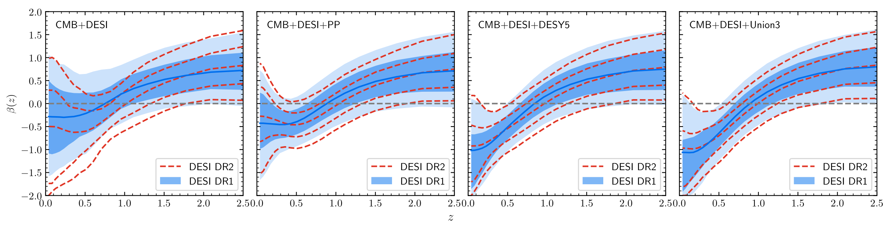
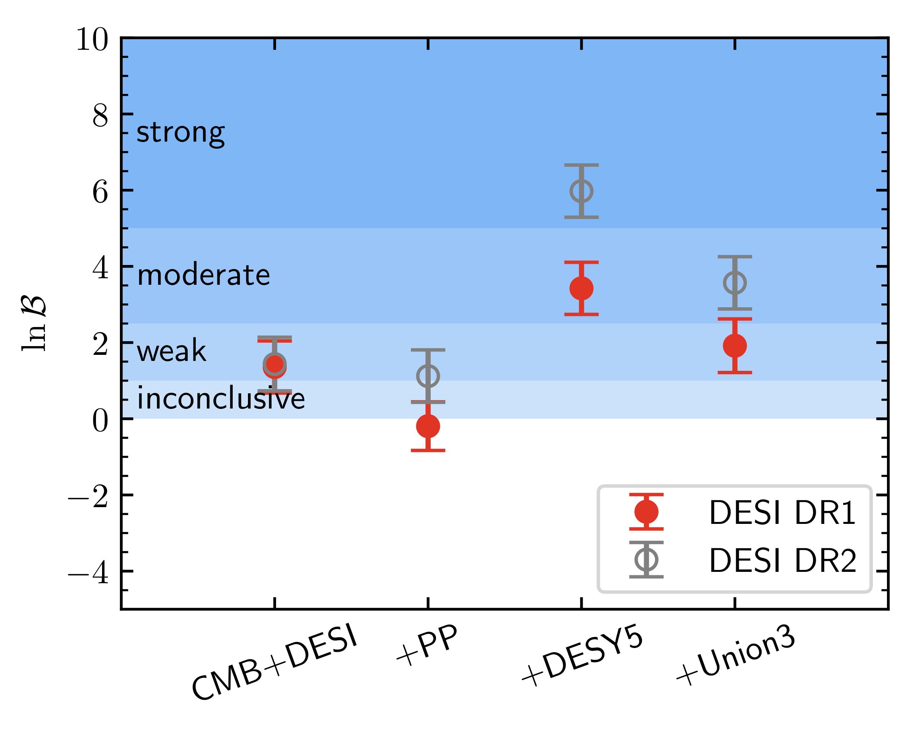
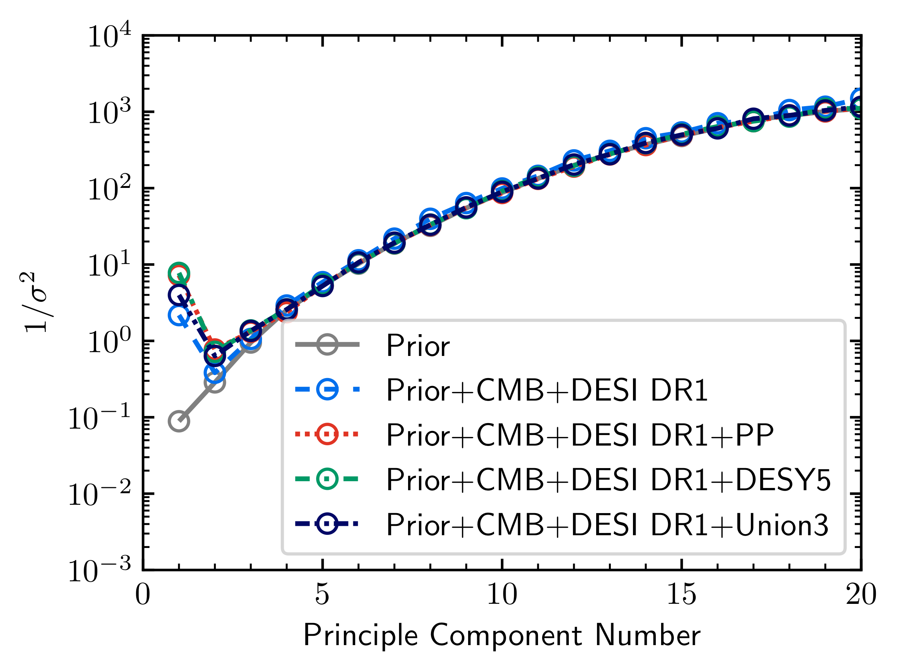
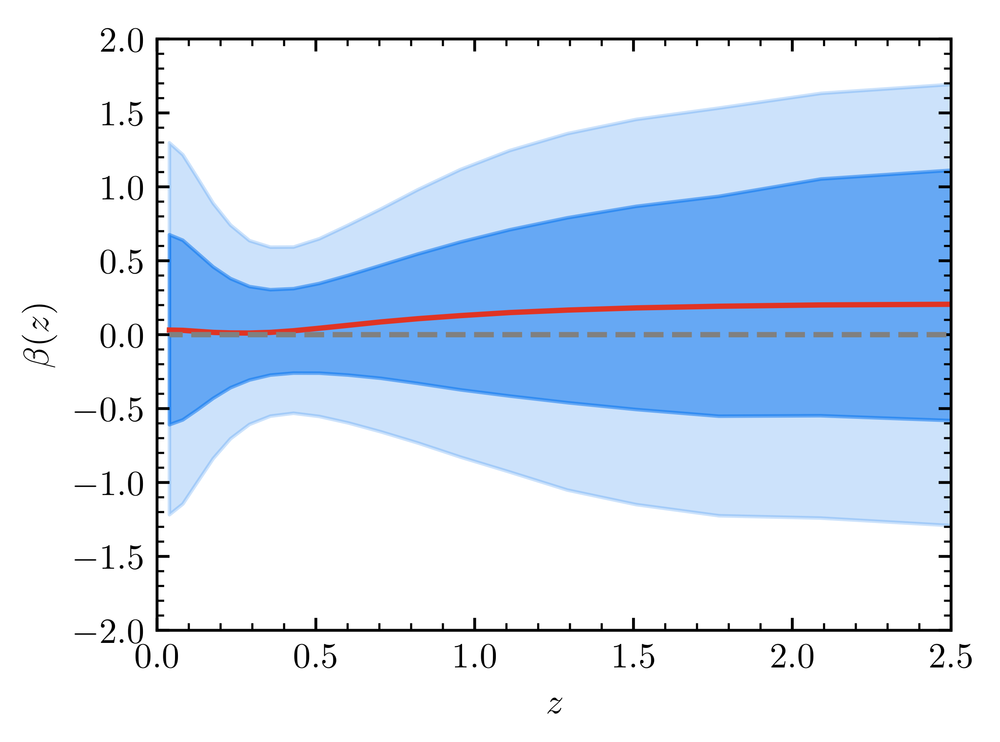
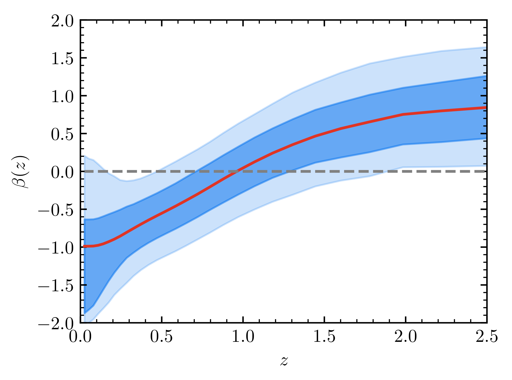

# Cosmic sign-reversal: non-parametric reconstruction of interacting dark energy with DESI DR2

**Yun-He Li**$^{a}$ and **Xin Zhang**$^{a,b,c}$

$^{a}$ Liaoning Key Laboratory of Cosmology and Astrophysics, College of Sciences,
Northeastern University, Shenyang 110819, China

$^{b}$ MOE Key Laboratory of Data Analytics and Optimization for Smart Industry,
Northeastern University, Shenyang 110819, China

$^{c}$ National Frontiers Science Center for Industrial Intelligence and Systems Optimization,
Northeastern University, Shenyang 110819, China

E-mail: liyunhe@neu.edu.cn, zhangxin@neu.edu.cn

---

## Abstract

A direct interaction between dark energy and dark matter provides a natural and important
extension to the standard $\Lambda$CDM cosmology. We perform a non-parametric reconstruction
of the vacuum energy ($w = -1$) interacting with cold dark matter using the cosmological data
from DESI DR2, Planck CMB, and three SNIa samples (PP, DESY5, and Union3). By discretizing
the coupling function $\beta(z)$ into 20 redshift bins and assuming a Gaussian smoothness prior,
we reconstruct $\beta(z)$ without assuming any specific parameterization. The mean reconstructed
$\beta(z)$ changes sign during cosmic evolution, indicating an energy transfer from cold dark
matter to dark energy at early times and a reverse flow at late times. At high redshifts,
$\beta(z)$ shows a $\sim 2\sigma$ deviation from $\Lambda$CDM. At low redshifts, the results
depend on the SNIa sample: CMB+DESI and CMB+DESI+PP yield $\beta(z)$ consistent with zero
within $2\sigma$, while CMB+DESI+DESY5 and CMB+DESI+Union3 prefer negative $\beta$ at
$\sim 2\sigma$. Both $\chi^{2}$ tests and Bayesian analyses favor the $\beta(z)$ model, with
CMB+DESI DR2+DESY5 showing the most significant support through the largest improvement in
goodness of fit ($\Delta\chi^{2}_{\rm MAP} = -17.76$) and strongest Bayesian evidence
($\ln\mathcal{B} = 5.98 \pm 0.69$). Principal component analysis reveals that the data
effectively constrain three additional degrees of freedom in the $\beta(z)$ model, accounting
for most of the improvement in goodness of fit. Our results demonstrate that the dynamical dark
energy preference in current data can be equally well explained by such a sign-reversal
interacting dark energy, highlighting the need for future observations to break this degeneracy.

---

## 1 Introduction

Recent measurements of baryon acoustic oscillations (BAO) from the Dark Energy Spectroscopic
Instrument (DESI) [1, 2], when combined with cosmic microwave background (CMB) and type Ia
supernovae (SNIa) data, suggest a hint of new physics in the nature of dark energy. The DESI
Data Release 1 (DR1) results favor a time-varying equation of state (EoS) of dark energy at a
significance of approximately $2.5\sigma$ to $3.9\sigma$, depending on the SNIa dataset used
[3]. This preference strengthens to $2.8\sigma$ to $4.2\sigma$ in the DESI DR2 analysis [4],
presenting a notable challenge to the standard $\Lambda$CDM paradigm where dark energy is
described by a cosmological constant $\Lambda$ with a fixed EoS of $w = -1$. The DESI data
have been widely used in recent cosmological analyses; see, e.g., Refs.
[5, 6, 7, 8, 9, 10, 11, 12, 13, 14, 15, 16, 17, 18, 19, 20, 21, 22, 23, 24, 25, 26, 27, 28, 29].

While $\Lambda$CDM remains highly successful in fitting CMB data and explaining cosmic
acceleration, it faces growing tensions with precision observations. A key discrepancy lies in
the Hubble constant $H_{0}$: local distance ladder measurements yield
$H_{0} = 73.04 \pm 1.04$ km/s/Mpc [30], whereas $\Lambda$CDM-based CMB analyses infer
$H_{0} = 67.36 \pm 0.54$ km/s/Mpc [31], revealing a tension exceeding $5\sigma$. Theoretically,
the cosmological constant faces long-standing fine-tuning and coincidence problems
[32, 33, 34, 35, 36, 37, 38, 39, 40]. This situation motivates modifications to the $\Lambda$CDM
framework, such as replacing the cosmological constant with dynamical dark energy (with an EoS
not exactly equal to $-1$), or adopting modified gravity theories that avoid introducing dark
energy (see Ref. [41] for a recent review).

Cosmological models, where dark energy directly interacts with cold dark matter by exchanging
energy and momentum, have attracted significant attention in recent years
[42, 43, 44, 45, 46, 47, 48, 49, 50, 51, 52, 53, 54, 55, 56, 57, 58, 59, 60, 61, 62, 63, 64,
65, 66, 67, 68, 69, 70, 71, 72, 73, 74, 75, 76, 77, 78]
(see Ref. [79] for a recent review). In such interacting dark energy (IDE) scenario, the
conservation laws for the energy-momentum tensor ($T_{\mu\nu}$) of dark energy ($de$) and cold
dark matter ($c$) are modified as

$$\nabla_{\nu} T^{\nu}_{\ \mu,de} = -\nabla_{\nu} T^{\nu}_{\ \mu,c} = Q_{\mu}, \tag{1}$$

where $Q_{\mu}$ denotes the energy-momentum transfer vector. A specific $Q_{\mu}$ determines
the energy transfer rate $Q$, its perturbation $\delta Q$ and the momentum transfer rate $f$.
These modifications alter both the background evolution and perturbations of the dark sectors,
offering a potential resolution to the coincidence problem [80, 81, 82, 83], and introducing
new features to the structure formation [84, 85, 86].

Actually, the expansion history of the Universe in IDE and dynamical dark energy models can
mimic each other by adjusting the model's parameters, which means that in this situation a dark
energy model with EoS $w \neq -1$ is observationally degenerate with an IDE model with $w = -1$
but $Q \neq 0$. Given that current cosmological data show a preference for dynamical dark energy,
it is natural to explore whether this deviation from $\Lambda$CDM could instead be explained by
a non-zero dark sector interaction. Indeed, recent studies have explored this possibility. For
instance, the authors in Ref. [87] combined DESI DR1 BAO, Planck CMB, and PantheonPlus SNIa to
constrain an IDE model with $Q$ proportional to the density of dark energy, finding a non-zero
coupling constant exceeding the 95% confidence level (CL). Ref. [5] analyzed four IDE models,
using similar cosmological data, reporting a non-zero coupling exceeding the 68% CL for three
cases (note that $3\sigma$ can be reached in the case of $Q = \beta H_{0} \rho_{de}$). In our
recent work [6], we further examined whether current data support a sign-changed interaction.

While these studies provide valuable insights, their conclusions remain inherently
model-dependent. In this work, we present a model-independent reconstruction of the vacuum
energy ($w = -1$) interacting with cold dark matter, following the non-parametric framework of
Refs. [88, 89]. By discretizing the coupling function and assuming a Gaussian smoothness prior,
we reconstruct the coupling without assuming any specific parameterization. We utilize the most
recent cosmological observations, including DESI DR1/DR2 BAO measurements, Planck CMB data, and
three distinct SNIa samples. This comprehensive analysis enables us to probe the possible dark
sector interaction without theoretical bias. We will show that the dynamical dark energy
preference in current data can be equally well explained by IDE scenario.

The structure of this paper is organized as follows. In Section 2, we briefly introduce the IDE
model. In Section 3, we outline how we implement the non-parametric reconstruction. In Section 4,
we show the cosmological data used in this work, and report the reconstruction results. The
conclusion is given in Section 5.

---

## 2 The model

The conservation laws in the background level for the densities of dark energy ($\rho_{de}$) and
cold dark matter ($\rho_{c}$) satisfy

$$\rho'_{de} + 3\mathcal{H}(1+w)\rho_{de} = aQ, \tag{1}$$

$$\rho'_{c} + 3\mathcal{H}\rho_{c} = -aQ, \tag{2}$$

where $a$ is the scale factor of the Universe, $w = p_{de}/\rho_{de}$ is the EoS of dark energy,
$\mathcal{H} = a'/a$ is the conformal Hubble parameter, and a prime denotes the derivative with
respect to the conformal time. In this paper, we set the EoS of dark energy $w = -1$. Namely,
we consider the case of vacuum energy interacting with cold dark matter. We assume the energy
transfer rate $Q$ to be of the following form

$$Q = \beta(a) H \rho_{de}, \tag{3}$$

where $\beta(a)$ is the dimensionless coupling parameter (that is evolutionary) and $H$ is the
Hubble parameter. The specific form of $Q$ is chosen for mathematical convenience without loss
of generality, as any arbitrariness in this choice is fully absorbed into the time-dependent
coupling function $\beta(a)$. We have verified that alternative forms (e.g., $Q \propto \rho_c$)
yield equivalent reconstruction results. For clarity in subsequent discussion, we refer to this
framework as the $\beta(a)$ model (or equivalently, the $\beta(z)$ model when expressed in terms
of cosmological redshift).

In this study, we avoid imposing any ad hoc parameterization on the coupling function $\beta(a)$.
Instead, we reconstruct it from cosmological data using non-parametric approach. Specifically, we
discretize the evolution of $\beta$ by dividing the scale factor interval $[a_{\rm min}, 1]$ into
$N$ bins, treating $\beta$ as piecewise constant within each bin, i.e.,

$$\beta(a) = \sum_{i=1}^{N} \beta_i T_i(a), \qquad T_i(a) = \begin{cases} 1, & a_i \leq a < a_{i+1} \\ 0, & \text{otherwise} \end{cases} \tag{4}$$

where $\beta_i$ for $i = 1, 2, \ldots, N$ denotes the amplitude of each bin. We set
$a_1 = a_{\rm min} = 0.0001$ (corresponding to $z \sim 10^4$), $a_{N+1} = 1$ and
$\beta(a) = 0$ at $a < a_1$. This choice, which serves as an initial condition at a very early
epoch, implies no interaction between dark energy and dark matter in the primordial Universe. It
is a physically reasonable assumption, as the energy densities of both dark energy and dark matter
are subdominant in the extreme early Universe, making any interaction between them negligible.
Then the model's background can be solved, and the energy densities of the dark sectors evolve as

$$\rho_{de} = \rho_{de0} \prod_{k=i+1}^{N} a_k^{\beta_k - \beta_{k-1}} a^{\beta_i}, \tag{5}$$

and

$$
\begin{aligned}
\rho_{c} &= \rho_{de0} a^{-3} \sum_{j=i}^{N-1} \prod_{k=j+1}^{N} a_k^{\beta_k - \beta_{k-1}} \frac{\beta_j}{\beta_j + 3} \left(a_{j+1}^{\beta_j+3} - a_j^{\beta_j+3}\right) \\
&\quad + \rho_{de0} a^{-3} \prod_{k=i+1}^{N} a_k^{\beta_k - \beta_{k-1}} \frac{\beta_i}{\beta_i + 3} \left(a_i^{\beta_i+3} - a^{\beta_i+3}\right) \\
&\quad + \rho_{c0} a^{-3} + \rho_{de0} a^{-3} \frac{\beta_N}{\beta_N + 3}(1 - a_N^{\beta_N+3}),
\end{aligned} \tag{6}
$$

at $a_i \leq a < a_{i+1}$ for $i = 1, 2, \ldots, N$. Here we set $\sum_{j=N}^{N-1} = 0$ and
$\prod_{k=N+1}^{N} = 1$ for $i = N$ ($a_N \leq a < 1$).

For the model's perturbation, we assume the energy-momentum transfer $Q_\mu$ to be parallel to
the four-velocity of dark matter, i.e., $Q_\mu = Q u_{\mu,c}$. In this choice, the momentum
transfer rate $f$ vanishes in the dark matter rest frame, and hence the dark matter particles
follow geodesics. For dark energy, we handle its perturbation using the extended parameterized
post-Friedmann (ePPF) approach [90], which is the PPF framework [91, 92] applied to IDE theory.
The ePPF approach can help avoid the possible large-scale instability [67, 93, 94] that may occur
in standard linear perturbation theory at specific parameter values. In previous works [90, 95],
we established the ePPF approach for different IDE models. More recently, we further developed an
ePPF approach for a general parametrization IDE model with five free functions $C_1$, $C_2$,
$C_3$, $D_1$ and $D_2$ [96]. This model-independent formulation allows different IDE scenarios to
be mapped onto the parametrization by specifying these functions. For our specific $\beta(a)$
model, the corresponding forms of the five functions are $C_1 = D_2 = Q$ and
$C_2 = C_3 = D_1 = 0$. Further details on the parametrization and the ePPF implementation can
be found in Ref. [96].

---

## 3 The reconstruction method

To reconstruct the coupling history, $\beta(a)$, we can constrain the amplitude of each bin,
$\beta_i$, using the data. However, if the neighboring bins are treated as independent, fitting a
large number of uncorrelated bins could result in excessively large uncertainties. To avoid this
issue, we adopt the non-parametric approach developed in Refs. [88, 89], in which the variable to
be reconstructed is assumed to be a smooth function, and hence its values at neighboring points
are not entirely independent. This feature for $\beta(a)$ can be described by a correlation
function between its values at $a$ and $a'$,

$$\xi(|a - a'|) \equiv \left\langle [\beta(a) - \beta^{\rm fid}(a)][\beta(a') - \beta^{\rm fid}(a')] \right\rangle, \tag{7}$$

with $\beta^{\rm fid}$ a reference fiducial model. Here $\beta(a)$ is assumed to be a Gaussian
random variable with a covariance matrix among a large number of bins given by

$$C_{ij} = \frac{1}{\Delta^2} \int_{a_i}^{a_i+\Delta} da \int_{a_j}^{a_j+\Delta} da'\ \xi(|a - a'|), \tag{8}$$

where $\Delta$ is the bin width. This covariance matrix defines a Gaussian prior probability
distribution for $\beta_i$, i.e.,

$$\mathcal{P}_{\rm prior}(\boldsymbol{\beta}) \propto \exp\!\left(-\frac{1}{2}(\boldsymbol{\beta} - \boldsymbol{\beta}^{\rm fid})\mathbf{C}^{-1}(\boldsymbol{\beta} - \boldsymbol{\beta}^{\rm fid})\right). \tag{9}$$

According to Bayes' theorem, the desired posterior probability is proportional to the likelihood
of the data times the prior probability,

$$\mathcal{P}(\boldsymbol{\beta}|\mathbf{D}) \propto \mathcal{P}(\mathbf{D}|\boldsymbol{\beta}) \times \mathcal{P}_{\rm prior}(\boldsymbol{\beta}), \tag{10}$$

which penalizes those models that are less smooth.

The calculation of the covariance matrix depends on a specific $\xi(|a - a'|)$. Following
Ref. [97], we assume the correlation function to have the form proposed by Crittenden, Pogosian
and Zhao (CPZ) [88],

$$\xi_{\rm CPZ}(\delta a) = \frac{\xi(0)}{1 + (\delta a / a_c)^2}, \tag{11}$$

where $\delta a \equiv |a - a'|$, $a_c$ describes the typical smoothing scale, and $\xi(0)$ is
the normalization factor determined by the expected variance of the mean of $\beta$, i.e.,
$\sigma_\beta^2 \simeq \pi \xi(0) a_c / (1 - a_{\rm min})$. One can adjust the prior strength by
tuning the values of $a_c$ and $\sigma_\beta^2$. A weak prior (i.e., small $a_c$ or large
$\sigma_\beta^2$) can match the true model on average, but will result in a noisy reconstruction,
while a stronger prior reduces the variance but pulls the reconstructed results towards the peak
of the prior. In this paper, we set $a_c = 0.06$ and $\sigma_\beta = 0.04$, representing a
moderate prior, which was also adopted in Ref. [98]. To avoid the explicit dependence on the
fiducial model, one can marginalize over the value of $\boldsymbol{\beta}^{\rm fid}$ with several
ways [97]. In this paper, we use the 'floating' average method [97], which takes the fiducial
model to be a local average,

$$\beta_i^{\rm fid} = \sum_{|a_j - a_i| \leq a_c} \beta_j^{\rm true} / N_j, \tag{12}$$

where $N_j$ is the number of neighboring bins around the $i$-th bin within the smoothing scale.

To validate our reconstruction framework and ensure that the inferred features of $\beta(z)$ are
driven by the data rather than artefacts of the non-parametric method, we performed a test using
a noiseless synthetic dataset. We generated simulated BAO and SNIa data based on the $\Lambda$CDM
cosmology (i.e., with $\beta(z) = 0$). Applying our full reconstruction pipeline to this
synthetic dataset, we recovered a $\beta(z)$ function consistent with zero within $1\sigma$
across all redshifts, as expected. The details of this validation test are presented in
Appendix A.

---

## 4 Data and results

In this work, we constrain the amplitudes of 20 bins, i.e., $N = 20$, with the first bin
covering the wide range of $a \in [0.0001, 0.286]$, and the last 19 bins uniform in
$a \in [0.286, 1]$, corresponding to $z \in [0, 2.5]$. We have verified that our central
conclusions are robust against increasing the number of bins (e.g., $N = 30$), or extending the
redshift range of the uniform bins to higher redshifts (e.g., from $z = 2.5$ to $z = 4.5$). The
results of these tests are detailed in Appendix B. We sample the parameter space using the public
package Cobaya [99] with the nested sampler PolyChord [100, 101]. The obtained samples are
analyzed using the public package Getdist [102]. The Gaussian prior defined in Eq. (9) is
computed as an external prior in Cobaya. The theoretical model is solved using the IDECAMB code
[96], which is an implementation of IDE theory in the public Einstein-Boltzmann solver CAMB
[103, 104]. To ensure compatibility with the Cobaya package, we have rewritten the IDECAMB code
based on the new version of CAMB. To ensure numerical stability in nested sampling, we adopt
conservative priors on the cosmological parameters: the physical baryon density
$\Omega_b h^2 \in [0.01, 0.05]$, the physical cold dark matter density
$\Omega_c h^2 \in [0.02, 0.3]$, the Hubble constant $H_0 \in [40, 100]$, the reionization
optical depth $\tau_{\rm reio} \in [0.01, 0.05]$, the amplitude and spectral index of the
primordial scalar spectrum $\ln(10^{10} A_s) \in [2.5, 3.5]$ and $n_s \in [0.85, 1.1]$, and
the coupling constants $\beta_i \in [-2, 2]$ for $i = 1, 2, \ldots, 20$. We take $H_0$ as a
free parameter instead of the commonly used $\theta_{\rm MC}$, because $\theta_{\rm MC}$ is
dependent on a standard non-interacting background evolution.

We adopt the following datasets:

- **CMB:** For the CMB data, we use the temperature (TT), polarization (EE), cross (TE), and
  lensing power spectra measurements. The specific likelihoods are:
  (i) the Commander likelihood using the temperature spectrum at large scales ($2 \leq \ell \leq 30$), from the Planck 2018 [31, 105];
  (ii) the SimAll likelihood using the spectrum of E-mode polarization at large scales ($2 \leq \ell \leq 30$) from the Planck 2018 [31, 105];
  (iii) the high-$\ell$ CamSpec ($\ell \geq 30$) likelihood using dust-cleaned TT, TE, and EE power spectra computed from the Planck 2020 (PR4/NPIPE) maps [106];
  (iv) the CMB lensing likelihood from the NPIPE PR4 Planck [107].
  We label the combination of these likelihoods as "CMB".

- **BAO:** We utilize the BAO measurements from the DESI DR2 [4], which includes tracers from
  the bright galaxy sample (BGS), luminous red galaxies (LRG), emission line galaxies (ELG),
  quasars (QSO), and the Ly$\alpha$ forest in a redshift range $0.1 \leq z \leq 4.2$. These
  tracers are described through the transverse comoving distance $D_{\rm M}/r_{\rm d}$, the
  angle-averaged distance $D_{\rm V}/r_{\rm d}$, and the Hubble horizon $D_{\rm H}/r_{\rm d}$,
  where $r_{\rm d}$ is the comoving sound horizon at the drag epoch. We also compare with the
  results from DR1 [3].

- **SNIa:** We adopt SNIa data from three compilations:
  (i) the PantheonPlus (PP) dataset, which comprises 1550 spectroscopically confirmed SNIa in the
  redshift range of $0.001 < z < 2.26$ [108] (The public likelihood imposes a bound of $z > 0.01$
  in order to mitigate the impact of peculiar velocities in the Hubble diagram);
  (ii) the Dark Energy Survey Year 5 (DESY5) data release, which includes 194 low-redshift SNIa
  ($0.025 < z < 0.1$) and 1635 SNIa classified photometrically, covering the range
  $0.1 < z < 1.3$ [109];
  (iii) the more recent Union3 compilation, presented in Ref. [110], including 2087 SNIa, with
  many (1363 SNIa) overlapping with those in PantheonPlus.
  These SNIa datasets are not independent of each other. Therefore, we do not combine them but
  instead present results from CMB+DESI plus each SNIa dataset independently.

**Figure 1.** Reconstructed evolution history of $\beta(z)$ with the mean value and $68\%$ and
$95\%$ CL errors for the baseline CMB+DESI and its individual combinations with each SNIa
dataset (PP, DESY5, and Union3). The blue solid lines and filled regions represent the DESI
DR1-based reconstructions, while the red dashed lines show the DR2-based results. The black
dashed lines denote the $\Lambda$CDM prediction ($\beta = 0$).

Convergence in PolyChord is achieved when the fraction of the total evidence contained in the
live points falls below 0.001. In Fig. 1, we plot the reconstructed $\beta(z)$ with the mean
value and $68\%$ and $95\%$ CL errors for the baseline CMB+DESI and its individual combinations
with each SNIa dataset (PP, DESY5, and Union3). The blue solid lines and filled regions represent
the DESI DR1-based reconstructions, while the red dashed lines show the DR2-based results. A key
feature across all reconstructions is that the mean value of $\beta(z)$ changes sign during its
evolution. Specifically, it is positive at early times, suggesting an energy transfer from cold
dark matter to dark energy, but turns negative at late times, implying an energy flow in the
reverse direction. This behavior is consistent with the findings of Ref. [6], in which the
coupling is reconstructed with a parametric model.

When reconstruction uncertainties are taken into account, all data combinations yield a positive
$\beta(z)$ that deviates from the $\Lambda$CDM prediction ($\beta = 0$) at approximately
$2\sigma$ at high redshifts. At low redshifts, however, the results vary depending on whether
and which SNIa dataset is used. The CMB+DESI and the CMB+DESI+PP data get a $\beta(z)$
consistent with a zero coupling within $2\sigma$, whereas CMB+DESI+DESY5 and CMB+DESI+Union3
show a preference for negative $\beta$ at about $2\sigma$ level. The DESI DR2-based results are
consistent with those from DR1, but show lower reconstruction uncertainties in the redshift range
$0.3 < z < 2.5$. This improvement aligns with the primary redshift coverage of DESI observations
and reflects the enhanced precision achieved in DR2.

The reconstruction of the coupling function $\beta(z)$ directly impacts the evolution of the
Universe's expansion history and matter clustering. It is therefore crucial to examine the
constraints on other key cosmological parameters derived within this interacting scenario. In
Table 1, we present the marginalized mean values and $68\%$ CL intervals for the Hubble constant
$H_0$, the matter density parameter $\Omega_m$, the amplitude of matter fluctuations $\sigma_8$
and $S_8 \equiv \sigma_8(\Omega_m / 0.3)^{0.5}$, focusing on the data combinations with DESI
DR2. The derived $H_0$ values, ranging from 66.45 to $67.59\ \mathrm{km/s/Mpc}$, show no
significant deviation from the Planck $\Lambda$CDM expectation, indicating that the Hubble
tension is not alleviated in the $\beta(z)$ model. In contrast, the $S_8$ values, ranging from
0.715 to 0.770, are systematically lower than the typical Planck $\Lambda$CDM value
($S_8 \approx 0.832$). This suppression of structure growth represents a moderate alleviation of
the $S_8$ tension.

**Table 1.** Marginalized mean values and $68\%$ CL intervals for the parameters of interest.

| Parameter  | CMB+DESI DR2              | +PP                       | +DESY5                    | +Union3                   |
| ---------- | ------------------------- | ------------------------- | ------------------------- | ------------------------- |
| $H_0$      | $67.2^{+1.2}_{-1.8}$      | $67.59 \pm 0.58$          | $66.84 \pm 0.55$          | $66.45^{+0.68}_{-0.84}$   |
| $\Omega_m$ | $0.393^{+0.150}_{-0.095}$ | $0.363 \pm 0.049$         | $0.437^{+0.058}_{-0.032}$ | $0.456^{+0.073}_{-0.030}$ |
| $\sigma_8$ | $0.716^{+0.030}_{-0.220}$ | $0.706^{+0.063}_{-0.110}$ | $0.602^{+0.028}_{-0.075}$ | $0.587^{+0.016}_{-0.082}$ |
| $S_8$      | $0.770^{+0.022}_{-0.100}$ | $0.769^{+0.037}_{-0.051}$ | $0.721^{+0.018}_{-0.042}$ | $0.715^{+0.012}_{-0.040}$ |

To assess the improvements in goodness of fit, we compute $\Delta\chi^2_{\rm MAP}$, the
difference of $\chi^2$ in the maximum a posteriori (MAP) between the $\beta(z)$ model and the
$\Lambda$CDM model, using the minimizer sampler [111–113] in Cobaya. In Table 2, we summarize
the $\Delta\chi^2_{\rm MAP}$ values for the different data combinations. Across all dataset
combinations, the $\beta(z)$ model yields a better fit than $\Lambda$CDM, with the most notable
improvement occurring for CMB+DESI DR2+DESY5. For the baseline CMB+DESI analysis, we observe
$\Delta\chi^2_{\rm MAP} = -5.46$ (DR1) and $-4.37$ (DR2). The inclusion of SNIa data
consistently enhances the preference for the $\beta(z)$ model over $\Lambda$CDM, though the
degree of improvement varies across datasets. For the CMB+DESI+PP data combination, we find
moderate improvements in fit quality, with $\Delta\chi^2_{\rm MAP} = -5.49$ for DR1 and $-7.88$
for DR2. In contrast, DESY5 demonstrates the most pronounced preference, yielding
$\Delta\chi^2_{\rm MAP} = -13.45$ (DR1) and $-17.76$ (DR2). Similarly, Union3 shows strong but
slightly weaker improvements, with $\Delta\chi^2_{\rm MAP} = -10.94$ (DR1) and $-9.78$ (DR2).

However, the $\chi^2$ test does not account for model complexity or the number of parameters
involved. To address this limitation, we further compute the Bayes factor in logarithmic space,
$\ln\mathcal{B} = \ln Z_{\beta(z)} - \ln Z_{\Lambda\mathrm{CDM}}$, where $\ln Z_{\beta(z)}$ and
$\ln Z_{\Lambda\mathrm{CDM}}$ represent the Bayesian evidence of the $\beta(z)$ model and
$\Lambda$CDM, respectively. The Bayesian evidence is directly obtained from the PolyChord sampler
output, though we note that the external prior defined in Eq. (9) is unnormalized by default.
Thus, the raw evidence $Z_u$ must be corrected by the prior volume $Z_\pi$ as
$\ln Z_{\beta(z)} = \ln Z_u - \ln Z_\pi$. The $\ln\mathcal{B}$ results with $68\%$ CL errors are
summarized in Table 2 and shown in Fig. 2. For visual reference, Fig. 2 includes shaded regions
corresponding to the Jeffreys' scale thresholds [114, 115] for evidence interpretation. Our
analysis demonstrates a consistent trend of stronger evidence for the $\beta(z)$ model in DESI
DR2 compared to DR1 across all data combinations. For CMB+DESI DR1/DR2, we find
$\ln\mathcal{B} = 1.36 \pm 0.68 / 1.44 \pm 0.70$, indicating weak evidence in both cases, with
DR2 showing slightly stronger (but statistically consistent) preference. The inclusion of PP SNIa
yields $\ln\mathcal{B} = -0.19 \pm 0.64$ (DR1) and $1.12 \pm 0.69$ (DR2) — while DR1 remains
inconclusive, DR2 crosses the threshold into weak evidence territory. Most significantly,
CMB+DESI+DESY5 shows $\ln\mathcal{B} = 3.42 \pm 0.68$ (DR1) and $5.98 \pm 0.69$ (DR2). Here,
DR1 provides moderate evidence while DR2 reaches strong evidence. Similarly, CMB+DESI+Union3
transitions from weak ($1.92 \pm 0.70$) to moderate ($3.57 \pm 0.69$) evidence from DR1 to DR2.

**Table 2.** Summary of the $\Delta\chi^2_{\rm MAP}$ values and Bayes factor $\ln\mathcal{B}$ for
different dataset combinations.

| Datasets            | $\Delta\chi^2_{\rm MAP}$ | $\ln\mathcal{B}$ |
| ------------------- | ------------------------ | ---------------- |
| CMB+DESI DR1        | −5.46                    | $1.36 \pm 0.68$  |
| CMB+DESI DR2        | −4.37                    | $1.44 \pm 0.70$  |
| CMB+DESI DR1+PP     | −5.49                    | $-0.19 \pm 0.64$ |
| CMB+DESI DR2+PP     | −7.88                    | $1.12 \pm 0.69$  |
| CMB+DESI DR1+DESY5  | −13.45                   | $3.42 \pm 0.68$  |
| CMB+DESI DR2+DESY5  | −17.76                   | $5.98 \pm 0.69$  |
| CMB+DESI DR1+Union3 | −10.94                   | $1.92 \pm 0.70$  |
| CMB+DESI DR2+Union3 | −9.78                    | $3.57 \pm 0.69$  |

**Figure 2.** The Bayes factor $\ln\mathcal{B}$ results with $68\%$ CL errors for different data
combinations. The shaded regions correspond to the Jeffreys' scale thresholds for evidence
interpretation: $|\ln\mathcal{B}| < 1$ (inconclusive), $1 \leq |\ln\mathcal{B}| < 2.5$ (weak),
$2.5 \leq |\ln\mathcal{B}| < 5$ (moderate), and $|\ln\mathcal{B}| \geq 5$ (strong).

The positive values of $\ln\mathcal{B}$ imply that the improved goodness of fit in the $\beta(z)$
model outweighs the Occam's razor penalty arising from parameter space integration. This implies
that only a subset of the additional parameters is effectively constrained by the data. To
quantify this, we assess the number of effective degrees of freedom introduced by the $\beta(z)$
model relative to $\Lambda$CDM. We perform a principal component analysis (PCA) on the posterior
distribution by diagonalizing the covariance matrix of the $\beta$ bins after marginalizing over
other cosmological parameters. The eigenvectors $e_i(z)$ form a basis for expanding $\beta(z)$
as $\beta(z) = \sum_{i=1}^{N} \alpha_i e_i(z)$, while the eigenvalues $\lambda_i$ determine the
measurement precision of each mode, with $\sigma(\alpha_i) = \sqrt{\lambda_i}$ [116].

As a representative example, Fig. 3 displays the inverse eigenvalues of the posterior covariance
matrices for the four DESI DR1-based data combinations, ordered by the number of nodes in the
eigenvectors $e_i(z)$. For comparison, we also plot the inverse eigenvalues derived from the
prior-only covariance matrix. The results reveal a clear distinction: while the first three
posterior inverse eigenvalues significantly exceed their prior counterparts, the fourth and higher
eigenvalues show close agreement with the prior values. This demonstrates that only the first
three principal components are data-constrained, whereas the higher-order modes remain
prior-dominated. We therefore conclude that the $\beta(z)$ model effectively introduces three
additional degrees of freedom compared to $\Lambda$CDM. These three data-dominated eigenvectors
$e_i(z)$ are presented in Fig. 4. By projecting the mean $\beta(z)$ onto these three
data-dominated eigenvectors, i.e., $\beta(z) = \sum_{i=1}^{3} \alpha_i e_i(z)$, we derive the
constraints on the coefficients $\alpha_i$ (mean values and 68% CL errors), as summarized in
Table 3. The improvement in fit $\Delta\chi^2_{\rm MAP}$ is well approximated by
$\sum_{i=1}^{3} [\alpha_i / \sigma(\alpha_i)]^2$, confirming that these three principal
components account for nearly all the enhanced model performance.

**Figure 3.** The inverse eigenvalues of both the prior and the four posterior covariance
matrices, ordered by the number of nodes in $e_i(z)$.

**Figure 4.** The first three data-dominated eigenvectors $e_i(z)$ for the four DESI DR1-based
data combinations.

**Table 3.** The coefficients $\alpha_i$ (mean values and $68\%$ CL errors) of the first three
data-dominated modes for the four DESI DR1-based data combinations.

|            | CMB+DESI         | +PP              | +DESY5           | +Union3          |
| ---------- | ---------------- | ---------------- | ---------------- | ---------------- |
| $\alpha_1$ | $-1.16 \pm 0.68$ | $-0.35 \pm 0.37$ | $-0.65 \pm 0.36$ | $0.44 \pm 0.50$  |
| $\alpha_2$ | $-1.05 \pm 1.62$ | $-1.08 \pm 1.16$ | $-2.67 \pm 1.18$ | $-2.99 \pm 1.25$ |
| $\alpha_3$ | $0.92 \pm 0.97$  | $1.80 \pm 0.87$  | $1.42 \pm 0.85$  | $1.53 \pm 0.86$  |

---

## 5 Conclusion

In this study, we conduct a model-independent reconstruction of the vacuum energy ($w = -1$)
interacting with cold dark matter, using the latest cosmological data, including DESI DR1/DR2 BAO
measurements, Planck CMB data, and three distinct SNIa datasets (PP, DESY5, and Union3). By
employing a non-parametric approach with a Gaussian smoothness prior, we reconstruct the coupling
function $\beta(z)$ without assuming any specific parameterization. The results consistently show
a sign change in the mean value of $\beta(z)$ during cosmic evolution, transitioning from
positive values at early times (indicating energy transfer from dark matter to dark energy) to
negative values at late times (suggesting a reversed energy flow). When considering reconstruction
uncertainties, all data combinations yield a positive $\beta$ that deviates from the $\Lambda$CDM
prediction ($\beta = 0$) at approximately $2\sigma$ at high redshifts. At low redshifts, the
CMB+DESI and the CMB+DESI+PP data get a $\beta$ consistent with a zero coupling within $2\sigma$,
whereas CMB+DESI+DESY5 and CMB+DESI+Union3 show a preference for negative $\beta$ at about
$2\sigma$ level. The DESI DR2-based results are consistent with those from DR1, but show slightly
reduced uncertainties. The $\beta(z)$ model provides a better fit to the data compared to
$\Lambda$CDM, as evidenced by improvements in $\Delta\chi^2_{\rm MAP}$ and Bayesian evidence
($\ln\mathcal{B}$). Notably, the CMB+DESI DR2+DESY5 data yield the strongest evidence for the
sign-reversal IDE scenario, reaching the "strong" threshold on the Jeffreys' scale. Principal
component analysis reveals that the data effectively constrain three additional degrees of freedom
in the $\beta(z)$ model, accounting for most of the improvement in goodness of fit.

While current observations show intriguing hints of dynamical dark energy, our analysis
demonstrates that these signatures could equally originate from dark sector interactions. For the
most deviating data combination (CMB+DESI DR2+DESY5), both the CPL model
($\Delta\chi^2_{\rm MAP} = -19.43$, $\ln\mathcal{B} = 6.17 \pm 0.61$) and our $\beta(z)$ model
($\Delta\chi^2_{\rm MAP} = -17.76$, $\ln\mathcal{B} = 5.98 \pm 0.69$) provide significant
improvements over $\Lambda$CDM, with the CPL model offering a marginally better fit to the data.
This degeneracy in background evolution presents a fundamental challenge in understanding the true
nature of cosmic acceleration, as the expansion histories from both models can mimic each other
through parameter adjustments. However, the distinct nature of these models becomes apparent in
their predictions for structure formation. This is clearly reflected in the $S_8$ values from the
CMB+DESI DR2+DESY5 combination: our reconstructed IDE model predicts a substantially lower $S_8$
value of $\sim 0.721$, while the corresponding CPL constraint gives $S_8 = 0.8267 \pm 0.0086$,
much closer to the Planck $\Lambda$CDM value. Although $S_8$ provides an integrated measure of
matter clustering at a specific scale, this stark contrast indicates fundamentally different
structure growth histories between the two models. Future observations that probe the growth
history across wider ranges of scales and redshifts (e.g., with weak lensing and redshift-space
distortions) will therefore be crucial to distinguish between these two compelling explanations
for the observed cosmic acceleration.

---

## Acknowledgments

We thank Tian-Nuo Li and Guo-Hong Du for their helpful discussions. This work was supported by
the National SKA Program of China (Grants Nos. 2022SKA0110200 and 2022SKA0110203), the National
Natural Science Foundation of China (Grants Nos. 12473001, 11975072, 11835009, and 11805031),
and the China Manned Space Program (Grant No. CMS-CSST-2025-A02).

---

## Appendix A — Validation with Synthetic Data

Non-parametric approaches are very powerful, but the lack of explicit modelling may introduce
degeneracies and reconstruction artefacts. To address this concern, we perform a validation test
using a noiseless synthetic dataset. The importance of validating such reconstructions with
synthetic data has been highlighted in the literature (see, e.g., Appendix E of Ref. [117]).
This appendix presents the test and its results, demonstrating the robustness of our
reconstruction pipeline.

We generated simulated BAO and SNIa data by assuming a fiducial $\Lambda$CDM cosmology (Planck
2018 parameters [31]), where by definition the interaction is absent
($\beta^{\rm fid}(z) \equiv 0$). We then applied our full reconstruction methodology, as
described in Section 3, to this ideal dataset. Figure 5 shows the reconstruction result. The
reconstructed $\beta(z)$ is consistent with zero across the entire redshift range, with the
$68\%$ and $95\%$ CL encompassing the true model. This successful recovery of the null signal
validates our reconstruction framework.

**Figure 5.** Reconstruction of $\beta(z)$ with the mean value (red line) and $68\%$ and $95\%$
CL errors (blue band) from a noiseless synthetic dataset generated assuming a $\Lambda$CDM
cosmology ($\beta(z) = 0$). The black dashed line indicates the true underlying model
($\beta = 0$). The reconstruction is fully consistent with the null hypothesis, demonstrating the
absence of significant biases or artefacts in our method.

---

## Appendix B — Robustness of the Reconstruction

This appendix presents robustness tests for our non-parametric reconstruction. Inspired by the
validation of redshift range sensitivity in Ref. [118], we systematically examine the impact of
both the reconstruction range and the number of redshift bins, confirming our results are robust
to these analysis choices.

Figure 6 presents robustness tests of our $\beta(z)$ reconstruction for the CMB+DESI DR2+DESY5
combination. The left panel shows the reconstruction using 30 bins, which exhibits the same
sign-reversal pattern and similar amplitude of deviations from $\Lambda$CDM as the 20-bin
baseline results presented in Fig. 1. The close agreement between the two demonstrates that our
key findings are robust against the specific choice of bin number. The right panel extends the
uniform binning range from $z = 2.5$ to $z = 4.5$. The reconstructed $\beta(z)$ for $z < 2.5$
remains fully consistent with our main results, while the positive coupling trend persists to
higher redshifts with increasing uncertainties, reflecting the diminishing constraining power of
the data. Collectively, these tests validate that the sign-reversal feature and deviations from
$\Lambda$CDM reported in our analysis are genuine signals rather than artefacts of specific
analysis choices.

|  |  |
| ------------------------------------------------------ | ------------------------------------------------ |

**Figure 6.** Robustness tests of the $\beta(z)$ reconstruction using the CMB+DESI DR2+DESY5
dataset. _(left)_ Reconstruction with 30 bins, showing the same sign-reversal pattern as the
20-bin baseline. _(right)_ Reconstruction with uniform binning extended to $z = 4.5$,
maintaining consistency at $z < 2.5$ with the baseline while showing the persistence of positive
coupling to higher redshifts. The black dashed line indicates $\Lambda$CDM ($\beta = 0$). Both
tests confirm the stability of our results against analysis choices.

---

## References

[1] DESI collaboration, _DESI 2024 III: baryon acoustic oscillations from galaxies and quasars_, JCAP 04 (2025) 012 [2404.03000].

[2] DESI collaboration, _DESI 2024 IV: Baryon Acoustic Oscillations from the Lyman alpha forest_, JCAP 01 (2025) 124 [2404.03001].

[3] DESI collaboration, _DESI 2024 VI: cosmological constraints from the measurements of baryon acoustic oscillations_, JCAP 02 (2025) 021 [2404.03002].

[4] DESI collaboration, _DESI DR2 Results II: Measurements of Baryon Acoustic Oscillations and Cosmological Constraints_, 2503.14738.

[5] T.-N. Li, P.-J. Wu, G.-H. Du, S.-J. Jin, H.-L. Li, J.-F. Zhang et al., _Constraints on Interacting Dark Energy Models from the DESI Baryon Acoustic Oscillation and DES Supernovae Data_, Astrophys. J. 976 (2024) 1 [2407.14934].

[6] T.-N. Li, G.-H. Du, Y.-H. Li, P.-J. Wu, S.-J. Jin, J.-F. Zhang et al., _Probing the sign-changeable interaction between dark energy and dark matter with DESI baryon acoustic oscillations and DES supernovae data_, 2501.07361.

[7] T.-N. Li, Y.-H. Li, G.-H. Du, P.-J. Wu, L. Feng, J.-F. Zhang et al., _Revisiting holographic dark energy after DESI 2024_, Eur. Phys. J. C 85 (2025) 608 [2411.08639].

[8] T.-N. Li, Y.-M. Zhang, Y.-H. Yao, P.-J. Wu, J.-F. Zhang and X. Zhang, _Is non-zero equation of state of dark matter favored by DESI DR2?_, 2506.09819.

[9] G.-H. Du, P.-J. Wu, T.-N. Li and X. Zhang, _Impacts of dark energy on weighing neutrinos after DESI BAO_, Eur. Phys. J. C 85 (2025) 392 [2407.15640].

[10] G.-H. Du, T.-N. Li, P.-J. Wu, L. Feng, S.-H. Zhou, J.-F. Zhang et al., _Cosmological search for sterile neutrinos after DESI 2024_, 2501.10785.

[11] P.-J. Wu and X. Zhang, _Measuring cosmic curvature with non-CMB observations_, 2411.06356.

[12] J.-L. Ling, G.-H. Du, T.-N. Li, J.-F. Zhang, S.-J. Wang and X. Zhang, _Model-independent cosmological inference after the DESI DR2 data with improved inverse distance ladder_, 2505.22369.

[13] Y. Yang, X. Ren, Q. Wang, Z. Lu, D. Zhang, Y.-F. Cai et al., _Quintom cosmology and modified gravity after DESI 2024_, Sci. Bull. 69 (2024) 2698 [2404.19437].

[14] Y. Yang, Q. Wang, X. Ren, E.N. Saridakis and Y.-F. Cai, _Modified gravity realizations of quintom dark energy after DESI DR2_, 2504.06784.

[15] C. Li, J. Wang, D. Zhang, E.N. Saridakis and Y.-F. Cai, _Quantum Gravity Meets DESI: Dynamical Dark Energy in Light of the Trans-Planckian Censorship Conjecture_, 2504.07791.

[16] Y. Cai, X. Ren, T. Qiu, M. Li and X. Zhang, _The Quintom theory of dark energy after DESI DR2_, 2505.24732.

[17] G. Ye, M. Martinelli, B. Hu and A. Silvestri, _Hints of Nonminimally Coupled Gravity in DESI 2024 Baryon Acoustic Oscillation Measurements_, Phys. Rev. Lett. 134 (2025) 181002 [2407.15832].

[18] Z. Wang, S. Lin, Z. Ding and B. Hu, _The role of LRG1 and LRG2's monopole in inferring the DESI 2024 BAO cosmology_, Mon. Not. Roy. Astron. Soc. 534 (2024) 3869 [2405.02168].

[19] Y.-H. Pang, X. Zhang and Q.-G. Huang, _Reevaluating $H_0$ tension with non-Planck CMB and DESI BAO joint analysis_, JCAP 04 (2025) 057 [2411.14189].

[20] Y.-H. Pang, X. Zhang and Q.-G. Huang, _The Impact of the Hubble Tension on the Evidence for Dynamical Dark Energy_, 2503.21600.

[21] Y.-H. Pang, X. Zhang and Q.-G. Huang, _Constraints on redshift-binned dark energy using DESI BAO data_, Phys. Rev. D 111 (2025) 123504 [2408.14787].

[22] L. Huang, R.-G. Cai and S.-J. Wang, _The DESI DR1/DR2 evidence for dynamical dark energy is biased by low-redshift supernovae_, 2502.04212.

[23] H. Wang and Y.-S. Piao, _Dark energy in light of recent DESI BAO and Hubble tension_, 2404.18579.

[24] H. Wang, Z.-Y. Peng and Y.-S. Piao, _Can recent DESI BAO measurements accommodate a negative cosmological constant?_, Phys. Rev. D 111 (2025) L061306 [2406.03395].

[25] W. Giarè, M. Najafi, S. Pan, E. Di Valentino and J.T. Firouzjaee, _Robust preference for Dynamical Dark Energy in DESI BAO and SN measurements_, JCAP 10 (2024) 035 [2407.16689].

[26] J.-Q. Jiang, W. Giarè, S. Gariazzo, M.G. Dainotti, E. Di Valentino, O. Mena et al., _Neutrino cosmology after DESI: tightest mass upper limits, preference for the normal ordering, and tension with terrestrial observations_, JCAP 01 (2025) 153 [2407.18047].

[27] M. Abedin, L.A. Escamilla, S. Pan, E. Di Valentino and W. Yang, _When Dark Matter Heats Up: A Model-Independent Search for Non-Cold Behavior_, 2505.09470.

[28] J.-Q. Jiang, D. Pedrotti, S.S. da Costa and S. Vagnozzi, _Nonparametric late-time expansion history reconstruction and implications for the Hubble tension in light of recent DESI and type Ia supernovae data_, Phys. Rev. D 110 (2024) 123519 [2408.02365].

[29] D. Wang, _Constraining Cosmological Physics with DESI BAO Observations_, 2404.06796.

[30] A.G. Riess, W.-L. Yuan, L.M. Macri et al., _A Comprehensive Measurement of the Local Value of the Hubble Constant with 1 km s$^{-1}$ Mpc$^{-1}$ Uncertainty from the Hubble Space Telescope and the SH0ES Team_, Astrophys. J. Lett. 934 (2022) L7 [2112.04510].

[31] Planck collaboration, _Planck 2018 results. VI. Cosmological parameters_, Astron. Astrophys. 641 (2020) A6 [1807.06209].

[32] S. Weinberg, _The Cosmological Constant Problem_, Rev. Mod. Phys. 61 (1989) 1.

[33] V. Sahni and A.A. Starobinsky, _The Case for a positive cosmological Lambda term_, Int. J. Mod. Phys. D 9 (2000) 373 [astro-ph/9904398].

[34] P.J.E. Peebles and B. Ratra, _The Cosmological Constant and Dark Energy_, Rev. Mod. Phys. 75 (2003) 559 [astro-ph/0207347].

[35] R. Bean, S.M. Carroll and M. Trodden, _Insights into dark energy: interplay between theory and observation_, astro-ph/0510059.

[36] E.J. Copeland, M. Sami and S. Tsujikawa, _Dynamics of dark energy_, Int. J. Mod. Phys. D 15 (2006) 1753 [hep-th/0603057].

[37] V. Sahni and A. Starobinsky, _Reconstructing Dark Energy_, Int. J. Mod. Phys. D 15 (2006) 2105 [astro-ph/0610026].

[38] M. Kamionkowski, _Dark Matter and Dark Energy_, 2007 [0706.2986].

[39] J. Frieman, M. Turner and D. Huterer, _Dark Energy and the Accelerating Universe_, Ann. Rev. Astron. Astrophys. 46 (2008) 385 [0803.0982].

[40] M. Li, X.-D. Li, S. Wang and Y. Wang, _Dark Energy_, Commun. Theor. Phys. 56 (2011) 525 [1103.5870].

[41] D.H. Weinberg, M.J. Mortonson, D.J. Eisenstein, C. Hirata, A.G. Riess and E. Rozo, _Observational Probes of Cosmic Acceleration_, Phys. Rept. 530 (2013) 87 [1201.2434].

[42] J.-H. He and B. Wang, _Effects of the interaction between dark energy and dark matter on cosmological parameters_, JCAP 06 (2008) 010 [0801.4233].

[43] J.-H. He, B. Wang and Y.P. Jing, _Effects of dark sectors' mutual interaction on the growth of structures_, JCAP 07 (2009) 030 [0902.0660].

[44] J.-H. He, B. Wang and P. Zhang, _The Imprint of the interaction between dark sectors in large scale cosmic microwave background anisotropies_, Phys. Rev. D 80 (2009) 063530 [0906.0677].

[45] Z.-K. Guo, R.-G. Cai and Y.-Z. Zhang, _Cosmological evolution of interacting phantom energy with dark matter_, JCAP 05 (2005) 002 [astro-ph/0412624].

[46] H. Wei and R.-G. Cai, _Interacting Agegraphic Dark Energy_, Eur. Phys. J. C 59 (2009) 99 [0707.4052].

[47] R.-G. Cai and Q. Su, _On the Dark Sector Interactions_, Phys. Rev. D 81 (2010) 103514 [0912.1943].

[48] J.-H. He, B. Wang and E. Abdalla, _Testing the interaction between dark energy and dark matter via latest observations_, Phys. Rev. D 83 (2011) 063515 [1012.3904].

[49] C.G. Boehmer, G. Caldera-Cabral, R. Lazkoz and R. Maartens, _Dynamics of dark energy with a coupling to dark matter_, Phys. Rev. D 78 (2008) 023505 [0801.1565].

[50] Z.-K. Guo, N. Ohta and S. Tsujikawa, _Probing the Coupling between Dark Components of the Universe_, Phys. Rev. D 76 (2007) 023508 [astro-ph/0702015].

[51] J.-Q. Xia, _Constraint on coupled dark energy models from observations_, Phys. Rev. D 80 (2009) 103514 [0911.4820].

[52] H. Wei, _Cosmological Constraints on the Sign-Changeable Interactions_, Commun. Theor. Phys. 56 (2011) 972 [1010.1074].

[53] Y.-H. Li and X. Zhang, _Running coupling: Does the coupling between dark energy and dark matter change sign during the cosmological evolution?_, Eur. Phys. J. C 71 (2011) 1700 [1103.3185].

[54] X. Zhang, F.-Q. Wu and J. Zhang, _A New generalized Chaplygin gas as a scheme for unification of dark energy and dark matter_, JCAP 01 (2006) 003 [astro-ph/0411221].

[55] Y.-H. Li and X. Zhang, _Large-scale stable interacting dark energy model: Cosmological perturbations and observational constraints_, Phys. Rev. D 89 (2014) 083009 [1312.6328].

[56] Y. Wang, D. Wands, L. Xu, J. De-Santiago and A. Hojjati, _Cosmological constraints on a decomposed Chaplygin gas_, Phys. Rev. D 87 (2013) 083503 [1301.5315].

[57] A. Pourtsidou, C. Skordis and E.J. Copeland, _Models of dark matter coupled to dark energy_, Phys. Rev. D 88 (2013) 083505 [1307.0458].

[58] T. Yang, Z.-K. Guo and R.-G. Cai, _Reconstructing the interaction between dark energy and dark matter using Gaussian Processes_, Phys. Rev. D 91 (2015) 123533 [1505.04443].

[59] W. Yang, S. Pan and D.F. Mota, _Novel approach toward the large-scale stable interacting dark-energy models and their astronomical bounds_, Phys. Rev. D 96 (2017) 123508 [1709.00006].

[60] R.-G. Cai, N. Tamanini and T. Yang, _Reconstructing the dark sector interaction with LISA_, JCAP 05 (2017) 031 [1703.07323].

[61] W. Yang, S. Pan, E. Di Valentino, R.C. Nunes, S. Vagnozzi and D.F. Mota, _Tale of stable interacting dark energy, observational signatures, and the $H_0$ tension_, JCAP 09 (2018) 019 [1805.08252].

[62] R. Kase and S. Tsujikawa, _General formulation of cosmological perturbations in scalar-tensor dark energy coupled to dark matter_, JCAP 11 (2020) 032 [2005.13809].

[63] M.S. Linton, R. Crittenden and A. Pourtsidou, _Momentum transfer models of interacting dark energy_, JCAP 08 (2022) 075 [2107.03235].

[64] V. Faraoni, J.B. Dent and E.N. Saridakis, _Covariantizing the interaction between dark energy and dark matter_, Phys. Rev. D 90 (2014) 063510 [1405.7288].

[65] Z. Zhang, S. Li, X.-D. Li, X. Zhang and M. Li, _Revisit of the Interaction between Holographic Dark Energy and Dark Matter_, JCAP 06 (2012) 009 [1204.6135].

[66] J. Zhang, L. Zhao and X. Zhang, _Revisiting the interacting model of new agegraphic dark energy_, Sci. China Phys. Mech. Astron. 57 (2014) 387 [1306.1289].

[67] J. Valiviita, E. Majerotto and R. Maartens, _Instability in interacting dark energy and dark matter fluids_, JCAP 07 (2008) 020 [0804.0232].

[68] Y.-F. Cai, A. Marciano, D.-G. Wang and E. Wilson-Ewing, _Bouncing cosmologies with dark matter and dark energy_, Universe 3 (2016) 1 [1610.00938].

[69] M. Abedin, G.-J. Wang, Y.-Z. Ma and S. Pan, _In search of an interaction in the dark sector through Gaussian Process and ANN approaches_, 2505.04336.

[70] L.A. Escamilla, O. Akarsu, E. Di Valentino and J.A. Vazquez, _Model-independent reconstruction of the interacting dark energy kernel: Binned and Gaussian process_, JCAP 11 (2023) 051 [2305.16290].

[71] S. Pan, S. Paul, E.N. Saridakis and W. Yang, _Interacting dark energy after DESI DR2: a challenge for $\Lambda$CDM paradigm?_, 2504.00994.

[72] A. Aboubrahim and P. Nath, _Upper limits on dark energy-dark matter interaction from DESI DR2 in a field-theoretic analysis_, 2411.11177.

[73] E. Di Valentino, O. Mena, S. Pan, L. Visinelli, W. Yang, A. Melchiorri et al., _In the realm of the Hubble tension—a review of solutions_, Class. Quant. Grav. 38 (2021) 153001 [2103.01183].

[74] E. Di Valentino, A. Melchiorri, O. Mena, S. Pan and W. Yang, _Interacting Dark Energy in a closed universe_, Mon. Not. Roy. Astron. Soc. 502 (2021) L23 [2011.00283].

[75] E. Silva, M.A. Sabogal, M. Scherer, R.C. Nunes, E. Di Valentino and S. Kumar, _New constraints on interacting dark energy from DESI DR2 BAO observations_, Phys. Rev. D 111 (2025) 123511 [2503.23225].

[76] M. Forconi, W. Giarè, O. Mena, Ruchika, E. Di Valentino, A. Melchiorri et al., _A double take on early and interacting dark energy from JWST_, JCAP 05 (2024) 097 [2312.11074].

[77] R.C. Nunes, S. Vagnozzi, S. Kumar, E. Di Valentino and O. Mena, _New tests of dark sector interactions from the full-shape galaxy power spectrum_, Phys. Rev. D 105 (2022) 123506 [2203.08093].

[78] B. Wang, E. Abdalla, F. Atrio-Barandela and D. Pavon, _Dark Matter and Dark Energy Interactions: Theoretical Challenges, Cosmological Implications and Observational Signatures_, Rept. Prog. Phys. 79 (2016) 096901 [1603.08299].

[79] B. Wang, E. Abdalla, F. Atrio-Barandela and D. Pavón, _Further understanding the interaction between dark energy and dark matter: current status and future directions_, Rept. Prog. Phys. 87 (2024) 036901 [2402.00819].

[80] L. Amendola, _Coupled quintessence_, Phys. Rev. D 62 (2000) 043511 [astro-ph/9908023].

[81] D. Comelli, M. Pietroni and A. Riotto, _Dark energy and dark matter_, Phys. Lett. B 571 (2003) 115 [hep-ph/0302080].

[82] X. Zhang, _Coupled quintessence in a power-law case and the cosmic coincidence problem_, Mod. Phys. Lett. A 20 (2005) 2575 [astro-ph/0503072].

[83] R.-G. Cai and A. Wang, _Cosmology with interaction between phantom dark energy and dark matter and the coincidence problem_, JCAP 03 (2005) 002 [hep-th/0411025].

[84] L. Amendola and D. Tocchini-Valentini, _Baryon bias and structure formation in an accelerating universe_, Phys. Rev. D 66 (2002) 043528 [astro-ph/0111535].

[85] O. Bertolami, F. Gil Pedro and M. Le Delliou, _Dark Energy-Dark Matter Interaction and the Violation of the Equivalence Principle from the Abell Cluster A586_, Phys. Lett. B 654 (2007) 165 [astro-ph/0703462].

[86] K. Koyama, R. Maartens and Y.-S. Song, _Velocities as a probe of dark sector interactions_, JCAP 10 (2009) 017 [0907.2126].

[87] W. Giarè, M.A. Sabogal, R.C. Nunes and E. Di Valentino, _Interacting Dark Energy after DESI Baryon Acoustic Oscillation Measurements_, Phys. Rev. Lett. 133 (2024) 251003 [2404.15232].

[88] R.G. Crittenden, L. Pogosian and G.-B. Zhao, _Investigating dark energy experiments with principal components_, JCAP 12 (2009) 025 [astro-ph/0510293].

[89] G.-B. Zhao, R.G. Crittenden, L. Pogosian and X. Zhang, _Examining the evidence for dynamical dark energy_, Phys. Rev. Lett. 109 (2012) 171301 [1207.3804].

[90] Y.-H. Li, J.-F. Zhang and X. Zhang, _Parametrized Post-Friedmann Framework for Interacting Dark Energy_, Phys. Rev. D 90 (2014) 063005 [1404.5220].

[91] W. Hu, _Parametrized Post-Friedmann Signatures of Acceleration in the CMB_, Phys. Rev. D 77 (2008) 103524 [0801.2433].

[92] W. Fang, W. Hu and A. Lewis, _Crossing the Phantom Divide with Parameterized Post-Friedmann Dark Energy_, Phys. Rev. D 78 (2008) 087303 [0808.3125].

[93] J.-H. He, B. Wang and E. Abdalla, _Stability of the curvature perturbation in dark sectors' mutual interacting models_, Phys. Lett. B 671 (2009) 139 [0807.3471].

[94] T. Clemson, K. Koyama, G.-B. Zhao, R. Maartens and J. Valiviita, _Interacting Dark Energy – constraints and degeneracies_, Phys. Rev. D 85 (2012) 043007 [1109.6234].

[95] Y.-H. Li, J.-F. Zhang and X. Zhang, _Exploring the full parameter space for an interacting dark energy model with recent observations including redshift-space distortions: Application of the parametrized post-Friedmann approach_, Phys. Rev. D 90 (2014) 123007 [1409.7205].

[96] Y.-H. Li and X. Zhang, _IDECAMB: an implementation of interacting dark energy cosmology in CAMB_, JCAP 09 (2023) 046 [2306.01593].

[97] R.G. Crittenden, G.-B. Zhao, L. Pogosian, L. Samushia and X. Zhang, _Fables of reconstruction: controlling bias in the dark energy equation of state_, JCAP 02 (2012) 048 [1112.1693].

[98] Y. Wang, G.-B. Zhao, D. Wands, L. Pogosian and R.G. Crittenden, _Reconstruction of the dark matter–vacuum energy interaction_, Phys. Rev. D 92 (2015) 103005 [1505.01373].

[99] J. Torrado and A. Lewis, _Cobaya: Code for Bayesian Analysis of hierarchical physical models_, JCAP 05 (2021) 057 [2005.05290].

[100] W.J. Handley, M.P. Hobson and A.N. Lasenby, _PolyChord: nested sampling for cosmology_, Mon. Not. Roy. Astron. Soc. 450 (2015) L61 [1502.01856].

[101] W.J. Handley, M.P. Hobson and A.N. Lasenby, _polychord: next-generation nested sampling_, Mon. Not. Roy. Astron. Soc. 453 (2015) 4385 [1506.00171].

[102] A. Lewis, _GetDist: a Python package for analysing Monte Carlo samples_, 1910.13970.

[103] A. Lewis, A. Challinor and A. Lasenby, _Efficient computation of CMB anisotropies in closed FRW models_, Astrophys. J. 538 (2000) 473 [astro-ph/9911177].

[104] C. Howlett, A. Lewis, A. Hall and A. Challinor, _CMB power spectrum parameter degeneracies in the era of precision cosmology_, JCAP 04 (2012) 027 [1201.3654].

[105] Planck collaboration, _Planck 2018 results. V. CMB power spectra and likelihoods_, Astron. Astrophys. 641 (2020) A5 [1907.12875].

[106] E. Rosenberg, S. Gratton and G. Efstathiou, _CMB power spectra and cosmological parameters from Planck PR4 with CamSpec_, Mon. Not. Roy. Astron. Soc. 517 (2022) 4620 [2205.10869].

[107] J. Carron, M. Mirmelstein and A. Lewis, _CMB lensing from Planck PR4 maps_, JCAP 09 (2022) 039 [2206.07773].

[108] D. Brout et al., _The Pantheon+ Analysis: Cosmological Constraints_, Astrophys. J. 938 (2022) 110 [2202.04077].

[109] DES collaboration, _The Dark Energy Survey: Cosmology Results With ~1500 New High-redshift Type Ia Supernovae Using The Full 5-year Dataset_, 2401.02929.

[110] D. Rubin et al., _Union Through UNITY: Cosmology with 2,000 SNe Using a Unified Bayesian Framework_, 2311.12098.

[111] M.J.D. Powell, _The bobyqa algorithm for bound constrained optimization without derivatives_, Technical Report, Department of Applied Mathematics and Theoretical Physics (2009).

[112] C. Cartis, J. Fiala, B. Marteau and L. Roberts, _Improving the Flexibility and Robustness of Model-Based Derivative-Free Optimization Solvers_, 1804.00154.

[113] C. Cartis, L. Roberts and O. Sheridan-Methven, _Escaping local minima with local derivative-free methods: a numerical investigation_, Optimization 71 (2021) 2343 [1812.11343].

[114] R.E. Kass and A.E. Raftery, _Bayes Factors_, J. Am. Statist. Assoc. 90 (1995) 773.

[115] R. Trotta, _Bayes in the sky: Bayesian inference and model selection in cosmology_, Contemp. Phys. 49 (2008) 71 [0803.4089].

[116] D. Huterer and G. Starkman, _Parameterization of dark-energy properties: A Principal-component approach_, Phys. Rev. Lett. 90 (2003) 031301 [astro-ph/0207517].

[117] DESI collaboration, _Extended Dark Energy analysis using DESI DR2 BAO measurements_, 2503.14743.

[118] DESI collaboration, _DESI 2024: reconstructing dark energy using crossing statistics with DESI DR1 BAO data_, JCAP 10 (2024) 048 [2405.04216].
