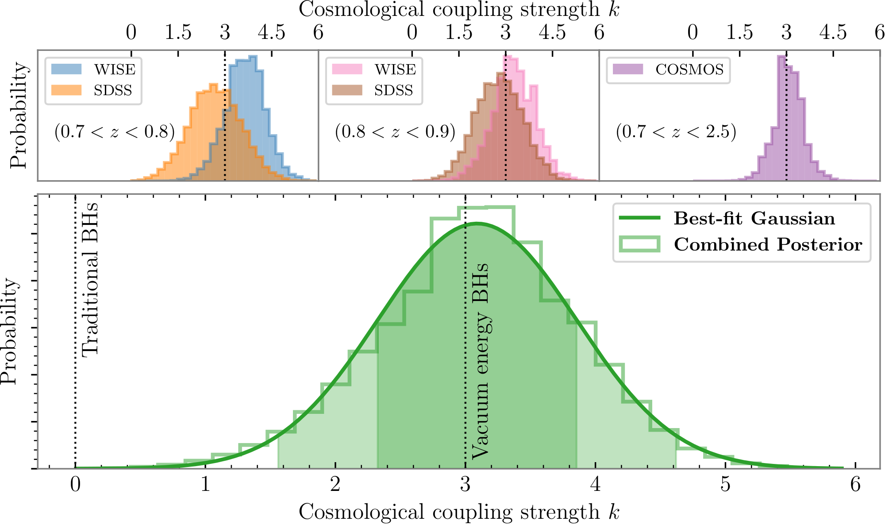
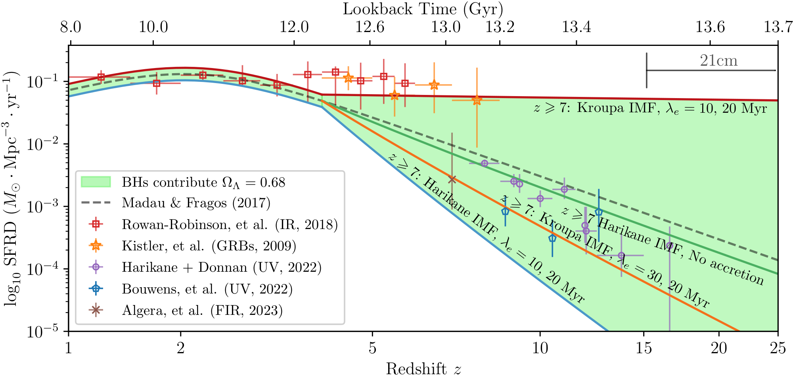
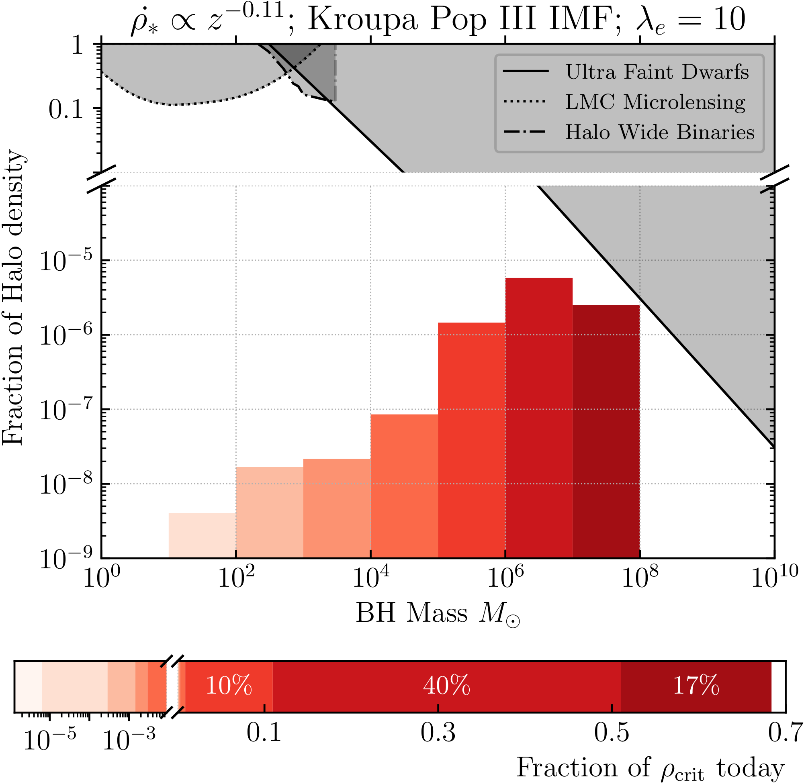
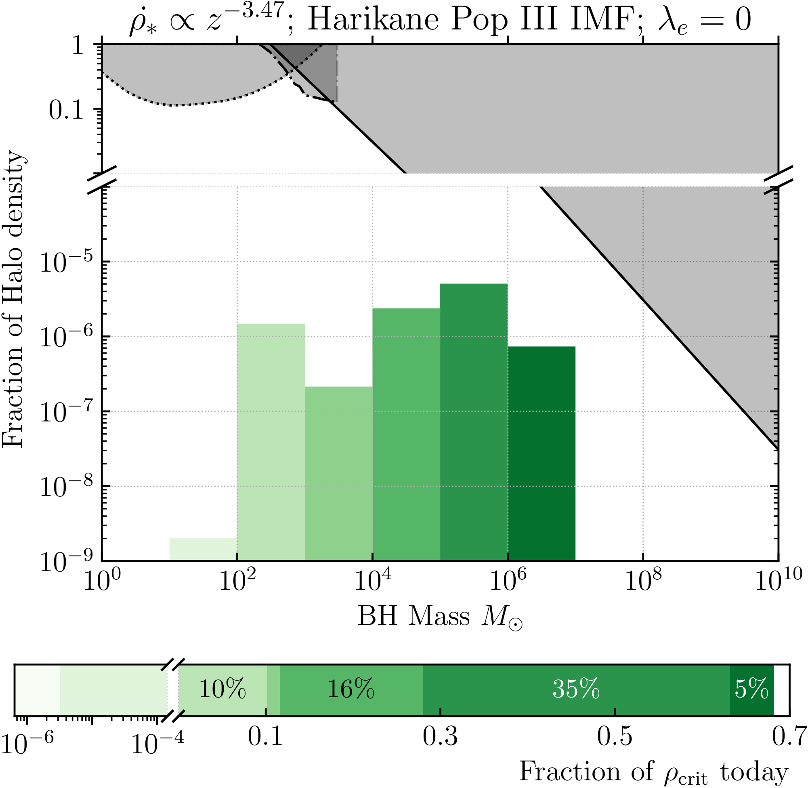
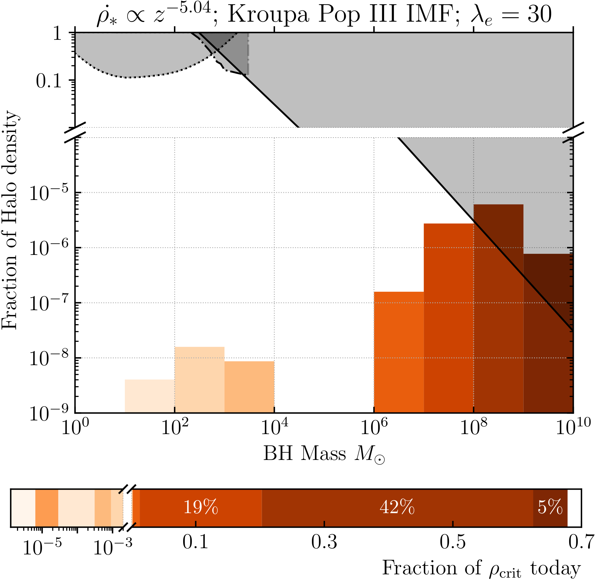
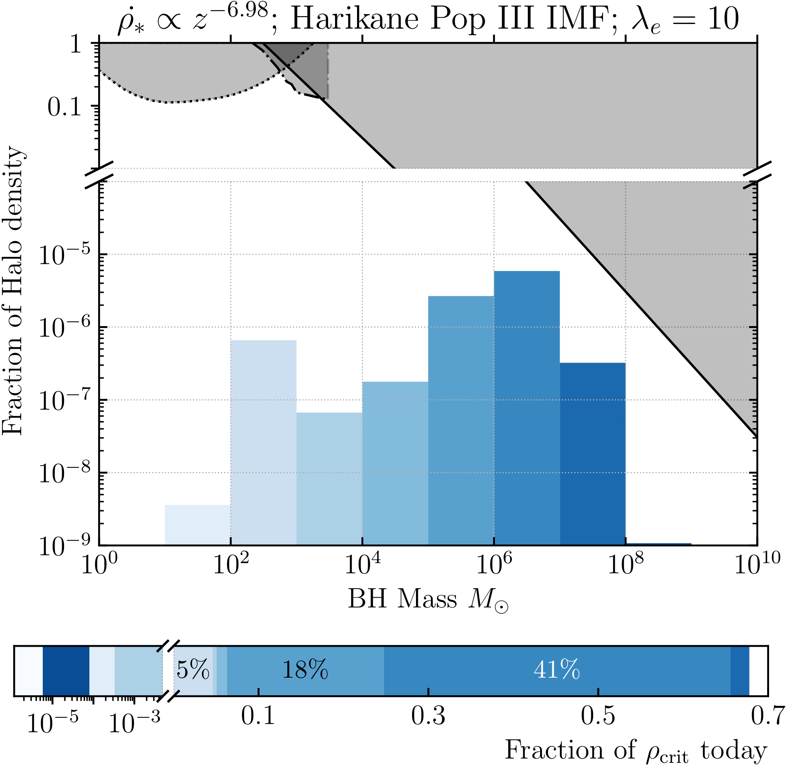

# Farrah et al. 2023 — PageIndex Full-Text Extraction

Verbatim page-by-page text extraction of arXiv:2302.07878v1 via PageIndex MCP
`get_page_content` (13 pages). Quality: `source_text_parse` — faithful text and
LaTeX-equation extraction, higher fidelity than the prior MarkItDown pass, but
machine-extracted and not line-for-line verified.

Figure image links resolve to the repo's rendered PNG mirrors under
`../figures/extracted/`. Mapping is taken from the arXiv LaTeX source
(`\includegraphics` in each figure environment of `paper_couple_rev.tex`), so it
is authoritative: Figure 1 → `coupling-crop.png`; Figure 2 →
`coupling_sfr-crop.png`; Figure 3 is a four-panel figure built from
`kroupa_topline-crop.png`, `harikane_no_accretion-crop.png`,
`kroupa_bottomline-crop.png`, and `harikane_bottom_line-crop.png`.

---

## Page 1

# Observational evidence for cosmological coupling of black holes and its implications for an astrophysical source of dark energy

Duncan Farrah, Kevin S. Croker, Gregory Tarlé, Valerio Faraoni, Sara Petty, Jose Afonso, Nicolas Fernandez, Kurtis A. Nishimura, Chris Pearson, Lingyu Wang, Michael Zevin, David L Clements, Andreas Efstathiou, Evanthia Hatziminaoglou, Mark Lacy, Conor McPartland, Lura K Pitchford, Nobuyuki Sakai, and Joel Weiner. (Affiliations: Institute for Astronomy, University of Hawai‘i; Department of Physics and Astronomy, University of Hawai‘i at Mānoa; University of Michigan; Bishop's University; NorthWest Research Associates; Convent & Stuart Hall Schools of the Sacred Heart; Universidade de Lisboa; Instituto de Astrofísica e Ciências do Espaço; Rutgers University; RAL Space / STFC Rutherford Appleton Laboratory; University of Oxford; The Open University; Kapteyn Astronomical Institute, University of Groningen; SRON Netherlands Institute for Space Research; Enrico Fermi Institute and Kavli Institute for Cosmological Physics, University of Chicago; Imperial College London; European University Cyprus; ESO; National Radio Astronomy Observatory; Cosmic Dawn Center (DAWN) / Niels Bohr Institute, University of Copenhagen; Texas A&M University; Yamaguchi University; University of Hawai‘i at Mānoa, Department of Mathematics.)

###### Abstract

Observations have found black holes spanning ten orders of magnitude in mass across most of cosmic history. The Kerr black hole solution is however provisional as its behavior at infinity is incompatible with an expanding universe. Black hole models with realistic behavior at infinity predict that the gravitating mass of a black hole can increase with the expansion of the universe independently of accretion or mergers, in a manner that depends on the black hole's interior solution. We test this prediction by considering the growth of supermassive black holes in elliptical galaxies over $0<z\lesssim 2.5$. We find evidence for cosmologically coupled mass growth among these black holes, with zero cosmological coupling excluded at 99.98% confidence. The redshift dependence of the mass growth implies that, at $z\lesssim 7$, black holes contribute an effectively constant cosmological energy density to Friedmann's equations. The continuity equation then requires that black holes contribute cosmologically as vacuum energy. We further show that black hole production from the cosmic star formation history gives the value of $\Omega_{\Lambda}$ measured by Planck while being consistent with constraints from massive compact halo

## Page 2

objects. We thus propose that stellar remnant black holes are the astrophysical origin of dark energy, explaining the onset of accelerating expansion at $z\sim 0.7$.

Supermassive black holes (1663) — Astrophysical black holes (98) — Dark energy (351)

## 1 Introduction

Astrophysical black holes (BHs), with masses spanning a few to several billion solar masses, are found in systems ranging from stellar binaries to supermassive BHs in the centers of galaxies. Observations of gravitational waves from binary BH mergers (Abbott et al., 2019, 2021) and of supermassive BHs by the Event Horizon Telescope Collaboration et al. (2019) and Akiyama et al. (2022), have shown excellent consistency with the Kerr (1963) solution on timescales from milliseconds to hours, and spatial scales of up to milliparsecs. BHs are thus established as a universal phenomenon, across at least ten orders of magnitude in mass.

Existing models for astrophysical BHs are necessarily provisional. They feature singularities, horizons, and unrealistic boundary conditions (e.g. Wiltshire et al., 2009). Though singularities and horizons are of theoretical interest (e.g. Harlow, 2016), the Kerr solution reduces to flat spacetime at spatial infinity. This is incompatible with our universe, which is in concordance with a perturbed Robertson–Walker (RW) cosmology to sub-percent precision (e.g. Aghanim et al., 2020; Dodelson and Schmidt, 2020). Thus, regardless of singularities and horizons, Kerr is only appropriate for intervals of time short compared to the reciprocal expansion rate of the universe, and can only be consistently interpreted as an approximation to some more general solution.

Efforts to construct a BH model in General Relativity (GR) with realistic RW boundary conditions have been ongoing for nearly a century, but have met with limited success. Early work by McVittie (1933) generalized the Schwarzschild solution to arbitrary RW spacetimes. Nolan (1993) constructed a non-singular interior for this solution, and progress has been made in understanding its horizon/causal structure (e.g. Kaloper et al., 2010; Lake and Abdelqader, 2011; Faraoni et al., 2012; da Silva et al., 2013). Faraoni and Jacques (2007) constructed solutions featuring dynamical phenomena such as horizons that comove with the universe's expansion, evolution of interior energy densities and pressures, and time-varying mass. These solutions are significant, because they show how heuristic application of Birkhoff's theorem in cosmological settings can fail in the presence of strong gravity (c.f. Lemaître, 1931; Einstein and Straus, 1945; Callan et al., 1965; Peebles, 1993). Time-varying mass in particular has been studied by Guariento et al. (2012) and Maciel et al. (2015), but its interpretation remains largely unexplored. All of these solutions, however, are incompatible with Kerr on short time-scales because they do not spin. A BH solution that satisfies observational constraints at small and large scales simultaneously has yet to be found.

Progress on these problems in GR has become possible with advances that resolve a long-standing ambiguity in Friedmann's equations (e.g. Ellis and Stoeger, 1987). In RW cosmology, the metric is position-independent and has no preferred directions in space. In order for Einstein's equations to be consistent, the stress-energy must share these properties. Einstein's equations, however, give no prescription for converting the actual, position-dependent, distribution of stress-energy observed at late-times into a position-independent source. Croker and Weiner (2019) resolved this averaging ambiguity, showing how the Einstein-Hilbert action gives the necessary relation between the actual distribution of stress-energy and the source for the RW model.

A consequence of this result is that relativistic material, located anywhere, can become cosmologically coupled to the expansion rate. This has implications for singularity-free BH models, such as those with vacuum energy interiors (e.g. Gliner, 1966; Dymnikova, 1992; Chapline et al., 2002; Mazur and Mottola, 2004; Lobo, 2006; Mazur and Mottola, 2015; Dymnikova and Galaktionov, 2016; Posada, 2017; Posada and Chirenti, 2019; Beltracchi and Gondolo, 2019). The stress-energy within BHs like these, and therefore their gravitating mass, can vary in time with the expansion rate. The effect is analogous to cosmological photon redshift, but generalized to timelike trajectories.

The presence or absence of cosmologically coupled mass in BHs strongly constrains observationally viable BH solutions. In general, the way in which a BH's mass $M$ changes in time depends on the BH model. Cro-

## Page 3

COSMOLOGICAL COUPLING OF BLACK HOLES: FIRST OBSERVATION AND IMPLICATIONS

Figure 1. (Top) Posterior distributions of cosmological coupling strength $k$, inferred by comparing SMBHs in local elliptical galaxies to those in five samples of elliptical galaxies at $z>0.7$. (Bottom) Combining these posterior samples with equal weighting gives a distribution with $k = 3.11_{-1.33}^{+1.19}$ at $90\%$ confidence. If fit to a Gaussian, the fit has a mean of $k = 3.09$ with a standard deviation of 0.76 (shading). Vertical lines indicate: $k = 0$ coupling, as expected for traditional BHs like Kerr and the decoupled solution by Nolan (1993); and $k = 3$ coupling, as predicted for vacuum energy interior BHs. The measurement disfavors zero coupling at $99.98\%$ confidence and is consistent with BHs possessing vacuum energy interiors, as first suggested by Gliner (1966).

ker et al. (2021) give a parameterization of the effect in terms of the RW scale factor $a$,

$$M (a) = M \left(a _ {i}\right) \left(\frac {a}{a _ {i}}\right) ^ {k} \quad a \geqslant a _ {i}, \tag{1}$$

where $a_{i}$ is the scale factor at which the object becomes cosmologically coupled and $k \geqslant 0$ is the cosmological coupling strength. The Nolan (1993) solution can be regarded as cosmologically coupled with $k = 0$ because its stress-energy evolves such that the mass remains fixed throughout the cosmological expansion. Vacuum energy interior solutions with cosmological boundaries have been predicted to produce $k \sim 3$, which is the maximum value for causal material with positive energy density (Croker & Weiner 2019).

Cosmologically coupled mass change allows for experimental distinction between singular and non-singular BHs, complementing constraints from short time-scale data (e.g. Sakai et al. 2014; Uchikata et al. 2016; Yunes et al. 2016; Cardoso et al. 2016; Cardoso & Pani 2017; Chirenti 2018; Konoplya et al. 2019; Maggio et al. 2020). Observing cosmologically coupled mass change, however, is challenging. Between an initial scale factor $a_{i}$ and a final one $a_{f}$, mass evolution only becomes apparent when $(a_{f} / a_{i})^{k} \gg 1$. For example, an observational test of cosmological mass change at $z \lesssim 3$ requires a population of BHs whose masses can be tracked across at least a Gyr, and in which accretion or merging can be independently estimated.

In this paper, we perform a direct test of BH mass growth due to cosmological coupling. A recent study by Farrah et al. (2023) compares the BH masses $M_{BH}$ and host galaxy stellar masses $M_*$ of 'red-sequence' elliptical galaxies over 6 - 9 Gyr, from the current epoch back to $z \sim 2.7$. The study finds that the BHs increase in mass over this time period by a factor of $8 - 20 \times$ relative to the stellar mass. The growth factor depends on redshift, with a higher factor at higher redshifts. Because SMBH growth via accretion is expected to be insignif-

## Page 4

icant in red-sequence ellipticals, and because galaxy-galaxy mergers should not on average increase SMBH mass relative to stellar mass, this preferential increase in SMBH mass is challenging to explain via standard galaxy assembly pathways (Farrah et al., 2023, §5). We here determine if this mass increase is consistent with cosmological coupling, and, if so, the constraints on the coupling strength $k$.

## 2 Methods

We consider five high-redshift samples, and one local sample, of elliptical galaxies given by Farrah et al. (2023). For the high-redshift samples we use: two from the WISE survey (one at $\widetilde{z}=0.75$ measured with the H$\beta$ line, and one at $\widetilde{z}=0.85$ measured with the Mg II line), two from the SDSS (one at $\widetilde{z}=0.75$ and one at $\widetilde{z}=0.85$, with H$\beta$ and Mg II, respectively) and one from the COSMOS field (at $\widetilde{z}=1.6$). We then determine the value of $k$ needed to align each high redshift sample with the local sample in the $M_{BH}-M_{*}$ plane. If the growth in BH mass is due to cosmological coupling alone, regardless of sample redshift, the same value of $k$ will be recovered.

To compute the posterior distributions in $k$ for each combination, we apply the pipeline developed by Farrah et al. (2023), which we briefly summarize. Realizations of each galaxy sample are drawn from the sample with its reported uncertainties. The likelihood function applies the expected measurement and selection bias corrections to the realizations, as appropriate for each sample. The de-biased, and so best actual estimate, BH mass of each galaxy is then shifted to its mass at $z=0$ according to Equation 1 with some value of $k$. Using the Epps-Singleton test, an entire high-redshift realization is then compared against a realization of the local ellipticals, where BH masses are shifted to $z=0$ in the same way. The result is a probability that can be used to reject the hypothesis that the samples are drawn from the same distribution in the $M_{BH}-M_{*}$ plane, i.e. that they are cosmologically coupled at this $k$.

## 3 Results & Discussion

We present posterior distributions in $k$, for each high-redshift to local comparison, in the top row of Figure 1. The redshift dependence of mass growth translates to the same value $k\sim 3$ across all five comparisons, as predicted by growth due to cosmological coupling alone. As further verification, we compute $k$ from a comparison between high-redshift WISE and COSMOS samples. This comparison requires no BH bias corrections. We find a consistent value of $k=2.96^{+1.65}_{-1.46}$. Combining the results from each local comparison gives,

$k=3.11^{+1.19}_{-1.33}\qquad(90\%\ \mathrm{confidence}),$ (2)

which excludes $k=0$ at $99.98\%$ confidence, equivalent to $>3.9\sigma$ observational exclusion of the singular Kerr interior solution.

### 3.1 Implications

Our result provides a single-channel explanation for the disparity in SMBH masses between local ellipticals and their 7-10 Gyr antecedents (Farrah et al., 2023). Furthermore, the recovered value of $k\sim 3$ is consistent with SMBHs having vacuum energy interiors. Our study thus makes the existence argument for a cosmologically realistic BH solution in GR with a non-singular vacuum energy interior.

Equation (1) implies that a population of $k\sim 3$ BHs will gain mass proportional to $a^{3}$. Within a RW cosmology, however, all objects dilute in number density proportional to $a^{-3}$. When accretion becomes subdominant to growth by cosmological coupling, this population of BHs will contribute in aggregate as a nearly cosmologically constant energy density. From conservation of stress-energy, this is only possible if the BHs also contribute cosmological pressure equal to the negative of their energy density, making $k\sim 3$ BHs a cosmological dark energy species.

### 3.2 $\Omega_{\Lambda}$ from the cosmic star formation history

If $k\sim 3$ BHs contribute as a cosmological dark energy species, a natural question is whether they can contribute all of the observed $\Omega_{\Lambda}$. We test this by assuming that: (1) BHs couple with $k=3$, consistent with our measured value; (2) BHs are the only source for $\Omega_{\Lambda}$, and (3) BHs are made solely from the deaths of massive stars. Under these assumptions, the total BH mass from the cosmic history of star formation (and subsequent cosmological mass growth) should be consistent with $\Omega_{\Lambda}=0.68$.

In Appendix A we construct a simple model of the cosmic star formation rate density (SFRD) that allows exploring combinations of stellar production rate, stellar IMF, and accretion history. Figure 2 displays models that produce the Planck measured value of $\Omega_{\Lambda}=0.68$ (Aghanim et al., 2020) with the indicated IMF and Eddington ratio $\lambda_{e}$. Any monotonically decreasing path inside the filled region produces $\Omega_{\Lambda}=0.68$ for some observationally viable IMF and accretion history, consuming at most $3\%$ of baryons. This baryon consumption is compatible with the results of Macquart et al. (2020), who find that $\Omega_{b}$ at low redshift agrees with $\Omega_{b}$ inferred from the Big Bang to within $50\%$.

## Page 5

COSMOLOGICAL COUPLING OF BLACK HOLES: FIRST OBSERVATION AND IMPLICATIONS

Figure 2. Cosmic star formation rate densities (SFRDs) capable of producing the necessary $k = 3$ BH density to give $\Omega_{\Lambda} = 0.68$ (green, solid). The details of the model are given in Appendix A. The upper bound of the viable region adopts a Kroupa (2002) IMF at all redshifts with the least amount of remnant accretion required to produce $\Omega_{\Lambda}$ with a decreasing power-law SFRD model (red, solid). The lower bound adopts the top-heavy IMF of Harikane et al. (2022a) at $z>7$ (blue, solid). Two middle lines show the impact of a top-heavy IMF at $z>7$, but no remnant accretion (green, solid); and higher accretion, but with a Kroupa IMF (orange, solid). Existing measurements of the SFRD via IR (Rowan-Robinson et al. 2018, red, squares), $\gamma$-ray bursts (Kistler et al. 2009, orange, stars), FIR (Algera et al. 2023, brown, xs), and rest-frame UV via JWST (Donnan et al. 2022; Harikane et al. 2022a, purple, dots), (Bouwens et al. 2022, blue, dots) are over-plotted. The UV points can vary $\sim -1$ dex depending upon IMF assumptions and UV luminosity integration bounds. Consistency occurs with consumption of $< 3\%$ of the baryon fraction $\Omega_{b}$ after cosmic dawn. The results assume stellar first light at $z_{\star} = 25$ (Harikane et al. 2022b, Fig 25) but are typical of the scenario for $15 < z_{\star} < 35$. Also indicated are the redshifts probed by $21\mathrm{cm}$ experiments.

It follows from Equation (1) that cosmological coupling in BHs with $k = 3$ will produce a BH population with masses $> 10^{2}M_{\odot}$. If these BHs are distributed in galactic halos, they will form a population of MAssive Compact Halo Objects (MACHOs). In Appendix B, we consider the consistency of SFRDs in Figure 2 with MACHO constraints from wide halo binaries, microlensing of objects in the Large Magellanic Cloud (LMC), and the existence of ultra-faint dwarfs (UFDs). We conclude that non-singular $k = 3$ BHs are in harmony with MACHO constraints while producing $\Omega_{\Lambda} = 0.68$, driving late-time accelerating expansion.

# 4. FUTURE TESTS

Further tests of cosmological coupling in BHs are essential to confirm or refute our proposal. We list some examples below, highlighting possible tensions.

# 4.1. Signatures in the cosmic microwave background

A population of $k \sim 3$ BHs are a dark energy species. Thus, their distribution in space need not trace baryons or dark matter at all times. For example, Croker et al. (2020b) study the spatial distribution of $k \sim 3$ BHs with anisotropic stress (e.g. Cattoen et al. 2005) at first order in cosmological perturbation theory. Anisotropic stress within individual BHs leads to an effective fluid at first-order that resists clustering and can even drive the spatial distribution to uniformity. Resistance to clustering is computed from the non-singular BH model, of which there is currently none preferred (§4.6). Some amount of anisotropic stress is, however, necessary to satisfy constraints on the galaxy two-point correlation function (Croker et al. 2020b).

Anisotropic stress from cosmologically coupled BHs at $z_{\star} = 25$ would maximally impact the CMB via the Integrated Sachs-Wolfe effect at $\ell = 5$, with lesser impacts at $\ell \gtrsim 5$ (e.g. Koivisto & Mota 2006; Dodelson & Schmidt 2020). The low $\ell \lesssim 30$ of the CMB $TT$ anisotropy spectrum are anomalous in several respects (e.g. Schwarz et al. 2016) and with amplitude in excess of cosmic variance at $\ell = 5$ (e.g. Planck Collaboration

## Page 6

et al., 2020). Any imprint of BH production at cosmic dawn on the CMB low $\ell$'s provides a precision test of non-singular BH models, and could enable independent constraint of the high-$z$ SFRD.

### 4.2 Strong lensing of $\gamma$-ray bursts

The prevalence of strong gravitationally lensed GRBs has been used to estimate the comoving density of Intermediate Mass Black Holes (IMBHs) (Paynter et al., 2021, see also e.g. [Wang et al. 2021; Yang et al. 2021; Chen et al. 2022; Lin et al. 2022; Kalantari et al. 2022; Liao et al. 2022]). GRBs probe IMBHs at scales much greater than the non-linearity scale of $\sim 6$ Mpc, complementing $\sim 50$ kpc MACHO constraints (Appendix B). At these larger scales, the prediction of uniform spatial distribution from anisotropic stress (§4.1) is directly applicable.

Xiao and Schaefer (2011) report GRBs with spectroscopic redshifts and find that 90% of GRBs have redshifts $z>0.25$, with 50% occurring at $z>1.5$. Across these distances, $k\sim 3$ cosmological coupling of BHs strongly impacts the comoving mass density of lenses along the line-of-sight, reducing it by factors of at least $2-16\times$. Existing analyses do not incorporate this impact of cosmological coupling on the optical depth. Thus, a direct comparison of measured $\Omega_{\rm IMBH}$ against the simulated BH populations in Appendix B is not yet possible. A promising future test is to incorporate cosmological coupling into the optical depth calculation. In general, a spectroscopic redshift is not available for candidate lensed GRBs, significantly weakening measurement of $\Omega_{\rm IMBH}$ (e.g. Paynter et al., 2021). Consistency with our population predictions, when evaluated at the lens redshift, could help to constrain such measurements.

### 4.3 Stellar mass BH-BH merger rates

The population properties of observable binary BH mergers probe cosmological coupling because their inspiral time can be a significant fraction of the age of the universe. If $k>0$, then the component masses of binary BH systems observed by gravitational-wave detectors are not representative of the birth masses. This impacts the interpretation of merging populations of BHs (The LIGO Scientific Collaboration et al., 2021) and the stochastic background (Arzoumanian et al., 2020; Christensen, 2019). Coupled mass growth further leads to accelerated orbital decay, though the rate of this decay may be model dependent (c.f. Croker et al., 2020a; Hadjidemetriou, 1963). This aspect affects both the observed mass spectrum and rate of binary BH mergers. For example, in the absence of cosmological coupling, stellar-mass binary BH systems with semi-major axis $\gtrsim 0.3$ AU can only merge within a Hubble time when highly eccentric. Conversely, with $k\gtrsim 0.2$, systems with initial semi-major axes $0.1<R<10^{4}$ AU can merge within less than a Hubble time. This can lead to significant increases in merger rate. Competing with this effect, however, is that mergers can happen so quickly after remnant formation that they merge at a redshift beyond the detection limit of current generation observatories.

### 4.4 Direct measurement from orbital period decay

Direct measurement of altered orbital decay rate in binary BH systems with proposed space-based observatories like LISA (Armano et al., 2018), DECIGO (Sato et al., 2017), and Taiji (Gong et al., 2021) is likely not possible because these observatories can only track orbital decay in the final few months. Decade-scale electromagnetic observations of a pulsar-BH orbit, however, would provide sufficient precision to measure cosmological coupling directly (e.g. Croker and Weiner, 2019; Weisberg et al., 2010).

### 4.5 Stellar mass BHs and stellar evolution

Mass shifts consistent with cosmological coupling have been proposed to exist in the merging binary BH population, explaining both the observed BH mass spectrum and the existence of BHs in the pair-instability mass gap, though with a smaller coupling strength of $k\sim 0.5$ (Croker et al., 2021). A coupling of $k=3$ and adopting contemporary stellar population synthesis estimates can lead to an overabundance of BHs with masses $>120M_{\odot}$. While uncertainties in binary BH formation channels (Mandel and Farmer, 2022; Zevin et al., 2021), massive binary star evolutionary physical processes (Broekgaarden et al., 2022), nuclear reaction rates (Farmer et al., 2020), supernova core collapse physics (Patton and Sukhbold, 2020), and SFRD and metallicity evolution (Chruślińska, 2022) leave population model flexibility, there are known young BHs within X-ray binaries with mass $\sim 20M_{\odot}$ (e.g. Miller-Jones et al., 2021). If this BH mass is typical of young stellar remnants at $z\lesssim 5$, then the distribution of remnant binary semi-major axes and eccentricities becomes constrained so as not to produce overly massive BH-BH mergers. An important test for $k=3$ BHs is whether such constraints are plausible.

### 4.6 Theoretical considerations

As described in §1, there are known exact solutions with each of the following properties: strong spin, arbitrary RW asymptotics, dynamical mass, and interior vacuum energy equation of state. Our result implies the existence, within GR, of an exact solution with all of

## Page 7

these properties. Currently, there is no known solution that possesses all four, though there are known solutions with various combinations of two (e.g. Guariento et al., 2012; Dymnikova and Galaktionov, 2016). Finding solutions that feature all four properties is an important theoretical step forward.

It is also interesting that a link between BHs and late-time accelerating expansion has been independently suggested within frameworks distinct from GR. Afshordi (2008) and Prescod-Weinstein et al. (2009) adopt a gravitational æther framework in which an effective cosmological constant emerges from quantum gravity effects at BH horizons. Notably, this yields a reduction of the quantum field theory tuning required, from over one hundred decimal places to only two. Their scenario is however distinct from ours; it has a different theoretical basis and does not, to our knowledge, predict that BHs gain mass as the scale factor increases.

### 4.7 Validation of preferential growth of SMBHs

Further validation of the measured preferential growth of SMBHs by Farrah et al. (2023) is an essential test of our proposal. This can be done by: deepening understanding of the relevant biases, improving morphological determinations of the high redshift samples, testing combinations of traditional assembly pathways in simulations, and improving the accuracy of SMBH and stellar mass measures. An important future test is to improve the statistics and reliability of the high redshift sample. Doing so requires assembling a sample of $\geqslant 10^{3}$ AGN in elliptical hosts with low SFRs and reddenings over $0.7<z<2.5$. The sample should have reliable measures of host stellar mass and consistent measures of SMBH mass with a subset that includes multi-epoch reverberation mapped measures. Such a study would enable narrower redshift intervals to be used at $z>0.7$, giving finer discrimination between cosmological coupling and other processes.

### 4.8 Quasars at $z>6$ and the SMBH mass function

The existence of SMBHs at $z\gtrsim 6$ (e.g. Trakhtenbrot et al., 2015) with masses $>10^{9}\mathrm{M}_{\odot}$ is challenging to explain via accretion and direct collapse models (e.g. Inayoshi et al., 2020; Volonteri et al., 2021). Cosmological coupling with $k=3$, starting at $z=25$, provides a mass increase of a factor of 51 by $z=6$ (Equation 1). This would ease tensions between BH growth models and observations of $z>6$ quasars, but it has not been shown that cosmological coupling is required to do so. BH masses must also increase between $z\sim 6$ and $z=0$ by a factor of 343. Comparison of the BH mass function in quasars at $z\sim 6$ with the BH mass function at $z=0$ must be compatible with this minimum increase. Generalization of the Sołtan (1982) argument to $k=3$ coupling is a first step, though comparison of the high-end mass cutoff is not sufficient, because SMBHs may cease to accrete luminously above $\sim 10^{11}M_{\odot}$ (e.g. King, 2015; Inayoshi and Haiman, 2016; Carr et al., 2021).

## 5 Conclusions

Realistic astrophysical BH models must become cosmological at large distance from the BH. Non-singular cosmological BH models can couple to the expansion of the universe, gaining mass proportional to the scale factor raised to some power $k$. A recent study of supermassive BHs within elliptical galaxies across $\sim 7$ Gyr finds redshift-dependent $8-20\times$ preferential BH growth, relative to galaxy stellar mass. We show that this growth excludes decoupled ($k=0$) BH models at 99.98% confidence. Our measured value of $k=3.11^{+1.19}_{-1.33}$ at 90% confidence is consistent with vacuum energy interior BH models that have been studied for over half a century. Cosmological conservation of stress-energy implies that $k=3$ BHs contribute as a dark energy species. We show that $k=3$ stellar remnant BHs produce the measured value of $\Omega_{\Lambda}$ within a wide range of observationally viable cosmic star formation histories, stellar IMFs, and remnant accretion. They remain consistent with constraints on halo compact objects and they naturally explain the "coincidence problem," because dark energy domination can only occur after cosmic dawn. Taken together, we propose that stellar remnant $k=3$ BHs are the astrophysical origin for the late-time accelerating expansion of the universe.

## Page 8

(Acknowledgments) We thank the referees for very helpful reports. We thank M. Valluri (U. Michigan) for suggesting the bias-free high redshift crosscheck. We thank the David C. and Marzia C. Schainker Family for their financial support of required computations. M. Zevin is supported by NASA through the NASA Hubble Fellowship grant HST-HF2-51474.001-A awarded by the Space Telescope Science Institute, which is operated by the Association of Universities for Research in Astronomy, Inc., for NASA, under contract NAS5-26555. G. Tarlé acknowledges support through DoE Award DE-SC009193. V. Faraoni is supported by the Natural Sciences & Engineering Research Council of Canada (grant 2016-03803). J. Afonso acknowledges financial support from the Science and Technology Foundation (FCT, Portugal) through research grants PTDC/FIS-AST/29245/2017, UIDB/04434/2020 and UIDP/04434/2020. The National Radio Astronomy Observatory is a facility of the National Science Foundation operated under cooperative agreement by Associated Universities, Inc.

## Appendix A SFRD bounding model

Here we construct a simple model to establish whether plausible SFRDs lead to $\Omega_{\Lambda}\simeq 0.7$, if massive stellar collapse produces $k=3$ BHs. For the overall form of the SFRD, we adopt the model of Madau & Fragos (2017) at $z\leqslant 4$. Between $z=4$ and cosmic dawn at $z=25$ we adopt a power-law for the SFRD with exponent $\alpha<0$, matched continuously to the $z\leqslant 4$ SFRD. In units of $M_{\odot}\cdot{\rm Mpc}^{-3}\cdot{\rm yr}^{-1}$,

$$\dot{\rho}_{*}(z,\alpha):=\begin{cases}0.01\frac{(1+z)^{2.6}}{1+[(1+z)/3.2]^{0.2}}&z\leqslant 4\\ (z/4)^{\alpha}\dot{\rho}_{*}(\alpha)&4<z\leqslant 25\,.\\ 0&z>25\end{cases}$$ (A1)

where $\dot{\rho}_{*}$ is the time rate of production of stellar mass. The choice of varying the power law slope at $z>4$ is motivated by the disparities in observed $\dot{\rho}_{*}$ over $4<z<10$. Estimates from infrared (Rowan-Robinson et al., 2018) and $\gamma$-ray bursts (Kistler et al., 2009) can be 1-2 dex higher than estimates from UV-dropouts (Donnan et al., 2022; Harikane et al., 2022a; Bouwens et al., 2022). Varying $\alpha$ at $z>4$ allows us to encompass SFRDs consistent with all extant data.

To account for variation in the stellar IMF with redshift, we divide the SFRD into a Population III (Pop III) epoch at $z>7$ (e.g. Inoue et al. (2014) but c.f. Liu & Bromm (2020)) and a standard epoch, characterized by a Kroupa IMF at $z\leqslant 7$. We consider scenarios where the Pop III epoch is characterized by either a Kroupa IMF or the top-heavy Harikane et al. (2022a) IMF $\propto M^{-2.35}$ for $50\leqslant M\leqslant 500$, and zero elsewhere. Finally, we use the redshift-dependent, mean-metallicity model of Madau & Fragos (2017), truncated at $Z_{\odot}$, to enable use of standard metallicity-dependent zero-age main sequence (ZAMS) mass to remnant mass, delayed, core-collapse supernovae prescriptions by Fryer et al. (2012).

For simplicity, we apply post-remnant formation accretion, with a fixed Eddington ratio $\lambda_{e}$, to all Pop III BHs over a duration $t_{e}$,

$M(t_{i}+t_{e})\propto M(t_{i})\exp\left(\lambda_{e}t_{e}/\epsilon\right),$ (A2)

brief enough that the impact on instantaneous rate from cosmological coupling of accreted mass can be neglected. Because $t_{e}$, $\lambda_{e}$, and $\epsilon$ are degenerate in Equation (A2), there is effectively only one parameter. Farrah et al. (2022) use simulation studies of galaxy mergers to estimate $t_{e}=44\pm 22$ Myr at $\lambda_{e}>1$ from observations of 21 infrared-luminous galaxy mergers at $z<0.3$. This value is consistent with $\sim 10$ Myr estimates by Madau et al. (2014) for high $z$ BH seeds, so we adopt $t_{e}=20$ Myr. The uncertainty in $t_{e}$ is large, e.g. Safarzadeh & Haiman (2020) find Pop III stellar BH accretion across timescales $\sim 0.5$ Myr. Tortosa et al. (2022) measure $\lambda_{e}\simeq 472$ for

## Page 9

a Seyfert 1 galaxy, while simulations by Inayoshi et al. (2016) find stable accretion onto isolated Pop III BHs at $\lambda_{e}\simeq 5000$. As we apply this accretion to all Pop III BHs in our model, we consider models within a more conservative $\lambda_{e}\leq 30$. Given the large range of plausible $t_{e}$ and $\lambda_{e}$, we fix the efficiency $\epsilon=0.16$, roughly 30% of the Kerr BH limit (e.g. Bardeen, 1970).

To compute viable SFRDs, we use a Monte Carlo approach. Because high-mass remnants formed at high redshift can easily dominate $\Omega_{\Lambda}$, care must be taken to sufficiently sample these tails of the distributions. We divide the domains for IMF and SFRD distributions into distinct windows such that, in these windows, the distributions are guaranteed to give Poisson errors $\leq 1\%$ in the lowest probability bin. The total collection of draws is eventually re-weighted by relative areas under the windowed IMFs and Equation A1. In each window, we draw $10^{6}$ ZAMS stellar masses from the appropriate IMFs and $10^{6}$ redshift-dependent metallicities. Given the birth masses and redshifts, we approximate a redshift of stellar death using $t_{\rm life}\sim 10^{10}(M/M_{\odot})^{-\tau}$ yr, where $\tau=2.5$ (e.g. Harwit, 2006). We discard draws that live beyond $z=0$, and then determine collapsed remnant masses. The ZAMS mass to remnant mass model we adopt assumes that all stars drawn are single stars. Consistent with Kalogera & Baym (1996), we regard any remnants with mass $>2.7M_{\odot}$ as BHs. To convert the resulting population of BHs into a cosmological density, we regard this drawn population as residing within one co-moving Mpc^3. We first reweight all draws by the probability of having come from their respective windows. We then convert from this reweighted mass to a predicted mass by rescaling $\dot{\rho}_{*}(z=0)$ by the total mass in long-lived stars, neutron stars, and initial BH remnant mass, as described by Madau & Fragos (2017). We compute $\dot{\rho}_{*}(z=0)$ by integrating Equation A1 in time, and scaling by an IMF-appropriate gas return fraction $1-R$ (e.g. $R=0.39$ given by Madau & Fragos (2017) for Kroupa, and 1 for Harikane). We then divide the summed predicted mass in BHs at $z=0$ by the critical density today $3H_{0}^{2}/8\pi G$ to get $\Omega_{\Lambda}$.

## Appendix B Massive Compact Halo Object Constraints

Here we establish that a $k\sim 3$ BH population sufficient to produce $\Omega_{\Lambda}$ is consistent with constraints on massive compact halo objects (MACHOs). In Figure 3, we display the contribution to halo density from $k=3$ BH masses at $z=0$ computed in the explicit SFRD models shown in Figure 2. Consistent with the discussion in §4.1, we have assumed a uniformly dispersed population in the computation of Figure 3. We adopt a uniform Milky Way (MW) halo density equal to the median DM density at the Solar System $8.8\pm 0.5\times 10^{-3}$ $M_{\odot}/{\rm pc}^{3}$ as measured by Cautun et al. (2020). This is conservative relative to a mean halo density $1.7\times 10^{-2}$ $M_{\odot}/{\rm pc}^{3}$, inferred from $1.37\times 10^{11}$ $M_{\odot}$ within the MW at $<20$ kpc as measured by Posti & Helmi (2019).

We display limits on MACHOs from microlensing (e.g. Blaineau et al., 2022), wide halo binary disruption (e.g. Tyler et al., 2022; Monroy-Rodríguez & Allen, 2014), and UFD disruption (e.g. Brandt, 2016). We approximate the UFD constraint from Brandt (2016) as $\propto 1/m$ following Binney & Tremaine (2011, Eqn. (7.104)) and convert from the UFD halo density assumed by Brandt (2016, Figure 4) to our MW halo density scale by a multiplicative factor $0.3/0.0088$.

All BH density contributions lie below the microlensing and wide binary limits by several orders of magnitude. High accretion models with a Kroupa IMF show some tension with UFD constraints, which begin to have discriminatory power in our scenario. Comparing the two top-heavy IMF models, the effect of accretion is to redistribute mass density from the IMBH range into the SMBH range. The top-heavy IMF with no accretion model shows how a top-heavy IMF acts to populate the IMBH region.

The aforementioned constraints do not account for co-moving BH mass density decrease with increasing redshift (Equation (1)) for $k>0$. The constraints as presented are thus overly stringent because the probability of compact object interactions is reduced at earlier times. The UFD galaxy and wide halo binary constraints are most impacted, as they consider the stability of astrophysical phenomena over Gyr timescales. A thorough analysis that incorporates decreasing comoving density of compact objects further back in time is the subject of future work.

## Page 10

FARRAH, CROKER, ET AL.

Figure 3 is a four-panel figure (per `paper_couple_rev.tex`); its panels are the
SFRD/IMF-variant crops mirrored in the repo:

Figure 3. (Vertical bars) Fraction of $z = 0$ halo density contributed by $k = 3$ BHs, as produced by the indicated SFRDs in Figure 2. Models are ordered by increasing SFRD power-law slope, with colors set to agree with the model lines in Figure 2. Also displayed (grey, shaded) are current constraints on MACHOs from microlensing (Blaineau et al. 2022), wide halo binary disruption (Tyler et al. 2022; Monroy-Rodriguez & Allen 2014), and ultra-faint dwarf (UFD) galaxy disruption (Brandt 2016). Noting the broken vertical axis, the microlensing and halo binary constraints are easily satisfied. Dwarf galaxy constraints may discriminate candidate SFRD and IMF combinations. As shown, UFD constraints are overly conservative because they do not account for the decrease in comoving BH mass density at earlier times, as will be present in the $k > 0$ coupled scenario. The effects of accretion at $z > 7$, as well as adopting a top-heavy IMF (Appendix A), are visible as decreased fraction in the IMBH range. (Horizontal bars) Fraction of present-day $\Omega_{\Lambda}$ contributed by each mass bin. Mass bins that contribute $< 5\%$ of $\Omega_{\Lambda}$ are unlabeled for clarity. Color gradients indicate mass binning and are common to both vertical and horizontal bars. Contributions less than $1\%$ are also shown in log scaling. Here, contributions are ordered by density fraction. (Model annotation on this page: $\dot{\rho}_{*}\propto z^{-0.11}$; Kroupa Pop III IMF; $\lambda_{e} = 10$.)

## Page 11

(References, part 1)

- Aghanim, N., Akrami, Y., Ashdown, M., et al. 2020, A&A, 641, A6
- Akiyama, K., Alberdi, A., Alef, W., et al. 2022, ApJL, 930, L12
- Algera, H. S. B., Inami, H., Oesch, P. A., et al. 2023, MNRAS, 518, 6142
- Armano, M., Audley, H., Baird, J., et al. 2018, PRL, 120, 061101
- Arzoumanian, Z., Baker, P. T., Blumer, H., et al. 2020, ApJL, 905, L34
- Bardeen, J. M. 1970, Nature, 226, 64
- Beltracchi, P., & Gondolo, P. 2019, PRD, 99, 044037
- Binney, J., & Tremaine, S. 2011, Galactic dynamics, Vol. 13 (Princeton)
- Blaineau, T., Moniez, M., Afonso, C., et al. 2022, A&A, 664, A106
- Bouwens, R. J., Stefanon, M., Brammer, G., et al. 2022, arXiv:2211.02607
- Brandt, T. D. 2016, ApJL, 824, L31
- Broekgaarden, F. S., Berger, E., Stevenson, S., et al. 2022, MNRAS, 516, 5737
- Callan, C., Dicke, R. H., & Peebles, P. J. E. 1965, AJP, 33, 105
- Cardoso, V., Franzin, E., & Pani, P. 2016, PRL, 116, 171101
- Cardoso, V., & Pani, P. 2017, Nature Astronomy, 1, 586
- Carr, B., Kühnel, F., & Visinelli, L. 2021, MNRAS, 501, 2029
- Cattoen, C., Faber, T., & Visser, M. 2005, CQG, 22, 4189
- Cautun, M., Benítez-Llambay, A., Deason, A. J., et al. 2020, MNRAS, 494, 4291
- Chapline, G., Laughlin, R. B., & Santiago, D. I. 2002, in Artificial Black Holes, 179–198
- Chen, S., Wen, X., Gao, H., et al. 2022, ApJ, 924, 49
- Chirenti, C. 2018, Brazilian Journal of Physics, 48, 102
- Christensen, N. 2019, Reports on Progress in Physics, 82, 016903
- Chruślińska, M. 2022, arXiv:2206.10622
- Croker, K. S., Nishimura, K. A., & Farrah, D. 2020a, ApJ, 889, 115
- Croker, K. S., Runburg, J., & Farrah, D. 2020b, ApJ, 900, 57
- Croker, K. S., & Weiner, J. L. 2019, ApJ, 882, 19
- Croker, K. S., Weiner, J. L., & Farrah, D. 2022, PhRvD, 105, 084042
- Croker, K. S., Zevin, M., Farrah, D., Nishimura, K. A., & Tarlé, G. 2021, ApJL, 921, L22
- da Silva, A. M., Fontanini, M., & Guariento, D. C. 2013, PRD, 87, 064030
- Dodelson, S., & Schmidt, F. 2020, Modern Cosmology
- Donnan, C. T., McLeod, D. J., Dunlop, J. S., et al. 2022, arXiv:2207.12356
- Dymnikova, I. 1992, General Relativity and Gravitation, 24, 235
- Dymnikova, I., & Galaktionov, E. 2016, CQG, 33, 145010
- Einstein, A., & Straus, E. G. 1945, RMP, 17, 120
- Ellis, G. F., & Stoeger, W. 1987, CQG, 4, 1697
- Event Horizon Telescope Collaboration, Akiyama, K., Alberdi, A., et al. 2019, ApJL, 875, L6
- Faraoni, V., & Jacques, A. 2007, PhRvD, 76, 063510
- Faraoni, V., Zambrano Moreno, A. F., & Nandra, R. 2012, PhRvD, 85, 083526
- Farmer, R., Renzo, M., de Mink, S. E., Fishbach, M., & Justham, S. 2020, ApJL, 902, L36
- Farrah, D., Efstathiou, A., Afonso, J., et al. 2022, MNRAS, doi:10.1093/mnras/stac980
- Farrah, D., Petty, S., Croker, K. S., et al. 2023, ApJ, 943, 133
- Fryer, C. L., Belczynski, K., Wiktorowicz, G., et al. 2012, ApJ, 749, 91
- Gliner, E. B. 1966, Soviet Journal of Experimental and Theoretical Physics, 22, 378
- Gong, Y., Luo, J., & Wang, B. 2021, Nature Astronomy, 5, 881
- Guariento, D. C., Fontanini, M., da Silva, A. M., & Abdalla, E. 2012, PRD, 86, 124020
- Hadjidemetriou, J. D. 1963, Icarus, 2, 440

## Page 12

(References, part 2)

- Harikane, Y., Ouchi, M., Oguri, M., et al. 2022a, arXiv:2208.01612
- Harikane, Y., Ono, Y., Ouchi, M., et al. 2022b, ApJS, 259, 20
- Harlow, D. 2016, Reviews of Modern Physics, 88, 015002
- Harwit, M. 2006, Astrophysical Concepts (Springer)
- Inayoshi, K., & Haiman, Z. 2016, ApJ, 828, 110
- Inayoshi, K., Haiman, Z., & Ostriker, J. P. 2016, MNRAS, 459, 3738
- Inayoshi, K., Visbal, E., & Haiman, Z. 2020, ARA&A, 58, 27
- Inoue, Y., Tanaka, Y. T., Madejski, G. M., & Domínguez, A. 2014, ApJL, 781, L35
- Kalantari, Z., Rahvar, S., & Ibrahim, A. 2022, ApJ, 934, 106
- Kalogera, V., & Baym, G. 1996, ApJ, 470, L61
- Kaloper, N., Kleban, M., & Martin, D. 2010, PRD, 81, 104044
- Kerr, R. P. 1963, Physical Review Letters, 11, 237
- King, A. 2015, MNRAS Letters, 456, L109
- Kistler, M. D., Yüksel, H., Beacom, J. F., Hopkins, A. M., & Wyithe, J. S. B. 2009, ApJL, 705, L104
- Koivisto, T., & Mota, D. F. 2006, PRD, 73, 083502
- Konoplya, R. A., Posada, C., Stuchlík, Z., & Zhidenko, A. 2019, PRD, 100, 044027
- Kroupa, P. 2002, Science, 295, 82
- Lake, K., & Abdelqader, M. 2011, PRD, 84, 044045
- Lemaître, G. 1931, MNRAS, 91, 490
- Liao, K., Biesiada, M., & Zhu, Z.-H. 2022, Chinese Physics Letters, 39, 119801
- Lin, S.-J., Li, A., Gao, H., et al. 2022, ApJ, 931, 4
- Liu, B., & Bromm, V. 2020, MNRAS, 497, 2839
- Lobo, F. S. 2006, CQG, 23, 1525
- Maciel, A., Guariento, D. C., & Molina, C. 2015, PhRvD, 91, 084043
- Macquart, J. P., Prochaska, J. X., McQuinn, M., et al. 2020, Nature, 581, 391
- Madau, P., & Fragos, T. 2017, ApJ, 840, 39
- Madau, P., Haardt, F., & Dotti, M. 2014, ApJL, 784, L38
- Maggio, E., Buoninfante, L., Mazumdar, A., & Pani, P. 2020, PRD, 102, 064053
- Mandel, I., & Farmer, A. 2022, Physics Reports, 955, 1
- Mazur, P. O., & Mottola, E. 2004, PNAS, 101, 9545
- Mazur, P. O., & Mottola, E. 2015, CQG, 32, 215024
- McVittie, G. C. 1933, MNRAS, 93, 325
- Miller-Jones, J. C. A., Bahramian, A., Orosz, J. A., et al. 2021, Science, 371, 1046
- Monroy-Rodríguez, M. A., & Allen, C. 2014, ApJ, 790, 159
- Nolan, B. 1993, Journal of Mathematical Physics, 34, 178
- Patton, R. A., & Sukhbold, T. 2020, MNRAS, 499, 2803
- Paynter, J., Webster, R., & Thrane, E. 2021, Nature Astronomy, 5, 560
- Peebles, P. J. E. 1993, Principles of Physical Cosmology (Princeton)
- Planck Collaboration, Aghanim, N., Akrami, Y., et al. 2020, A&A, 641, A5
- Posada, C. 2017, MNRAS, 468, 2128
- Posada, C., & Chirenti, C. 2019, CQG, 36, 065004
- Posti, L., & Helmi, A. 2019, A&A, 621, A56
- Prescod-Weinstein, C., Afshordi, N., & Balogh, M. L. 2009, PhRvD, 80, 043513
- Rowan-Robinson, M., Wang, L., Farrah, D., et al. 2018, A&A, 619, A169
- Safarzadeh, M., & Haiman, Z. 2020, ApJL, 903, L21
- Sakai, N., Saida, H., & Tamaki, T. 2014, PRD, 90, 104013
- Sato, S., Kawamura, S., Ando, M., et al. 2017, J. Phys. Conf. Ser., 840, 012010
- Schwarz, D. J., Copi, C. J., Huterer, D., & Starkman, G. D. 2016, CQG, 33, 184001

## Page 13

COSMOLOGICAL COUPLING OF BLACK HOLES: FIRST OBSERVATION AND IMPLICATIONS

(References, part 3)

- Soltan, A. 1982, MNRAS, 200, 115
- The LIGO Scientific Collaboration, The Virgo Collaboration, The KAGRA Collaboration, et al. 2021, arXiv:2111.03634 (GWTC-3 population)
- Tortosa, A., Ricci, C., Tombesi, F., et al. 2022, MNRAS, 509, 3599
- Trakhtenbrot, B., Urry, C. M., Civano, F., et al. 2015, Science, 349, 168
- Tyler, E., Green, A. M., & Goodwin, S. P. 2022, arXiv:2207.08668
- Uchikata, N., Yoshida, S., & Pani, P. 2016, PRD, 94, 064015
- Volonteri, M., Habouzit, M., & Colpi, M. 2021, Nature Reviews Physics, 3, 732
- Wang, Y., Jiang, L.-Y., Li, C.-K., et al. 2021, ApJL, 918, L34
- Weinberg, S. 2008, Cosmology (Oxford University Press)
- Weisberg, J. M., Nice, D. J., & Taylor, J. H. 2010, ApJ, 722, 1030
- Wiltshire, D. L., Visser, M., & Scott, S. M. 2009, The Kerr Spacetime
- Xiao, L., & Schaefer, B. E. 2011, ApJ, 731, 103
- Yang, X., Lü, H.-J., Yuan, H.-Y., et al. 2021, ApJL, 921, L29
- Yunes, N., Yagi, K., & Pretorius, F. 2016, PRD, 94, 084002
- Zevin, M., Bavera, S. S., Berry, C. P. L., et al. 2021, ApJ, 910, 152
