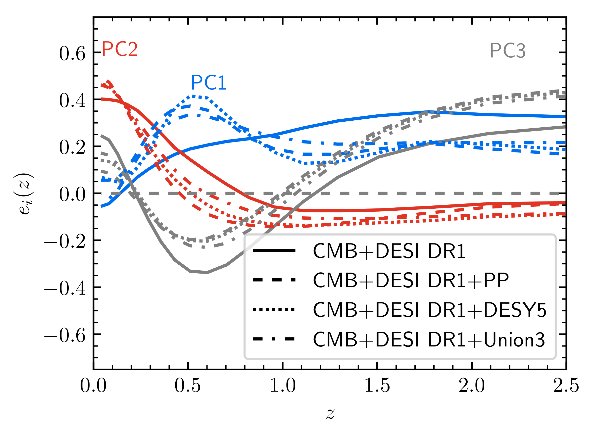
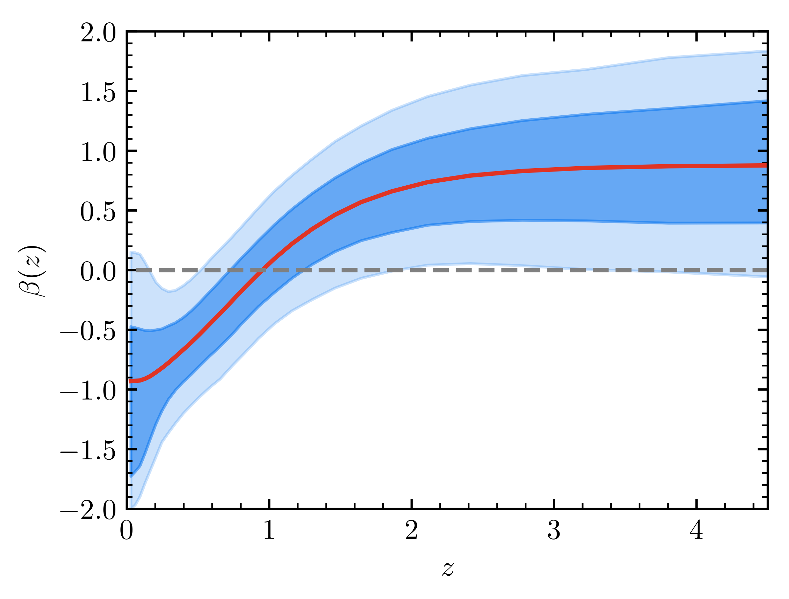

# Li and Zhang 2025 — PageIndex Full-Text Extraction

Verbatim page-by-page text extraction of arXiv:2506.18477v2 ("Cosmic
sign-reversal: non-parametric reconstruction of interacting dark energy with DESI
DR2") via PageIndex MCP `get_page_content`. Quality: `source_text_parse` —
faithful text and LaTeX-equation transcription of the main body and appendices
(pages 1–14) including Tables 1–3 and Eqs. (1)–(10), higher fidelity than the
prior MarkItDown pass, but machine-extracted and not line-for-line verified.
Pages 14–20 are the bibliography (118 references); the captured leading entries
are reproduced and the remainder is noted.

Figure image links resolve to the repo PNG mirrors under `../figures/extracted/`.
Mapping: Fig.1→`fig_reconstruct.png`, Fig.2→`fig_bayes_data.png`,
Fig.3→`fig_evals.png`, Fig.4→`fig_pc.png`, Fig.5→`fig_mock_lcdm.png`,
Fig.6(left)→`fig_bin30.png`, Fig.6(right)→`fig_zmax.png`.

---

## Page 1

# Cosmic sign-reversal: non-parametric reconstruction of interacting dark energy with DESI DR2

Yun-He Li and Xin Zhang (Liaoning Key Laboratory of Cosmology and Astrophysics, College of Sciences, Northeastern University, Shenyang 110819, China; MOE Key Laboratory of Data Analytics and Optimization for Smart Industry; National Frontiers Science Center for Industrial Intelligence and Systems Optimization, Northeastern University.) E-mail: liyunhe@neu.edu.cn, zhangxin@neu.edu.cn

###### Abstract

A direct interaction between dark energy and dark matter provides a natural and important extension to the standard $\Lambda$CDM cosmology. We perform a non-parametric reconstruction of the vacuum energy ($w=-1$) interacting with cold dark matter using the cosmological data from DESI DR2, Planck CMB, and three SNIa samples (PP, DESY5, and Union3). By discretizing the coupling function $\beta(z)$ into 20 redshift bins and assuming a Gaussian smoothness prior, we reconstruct $\beta(z)$ without assuming any specific parameterization. The mean reconstructed $\beta(z)$ changes sign during cosmic evolution, indicating an energy transfer from cold dark matter to dark energy at early times and a reverse flow at late times. At high redshifts, $\beta(z)$ shows a $\sim 2\sigma$ deviation from $\Lambda$CDM. At low redshifts, the results depend on the SNIa sample: CMB+DESI and CMB+DESI+PP yield $\beta(z)$ consistent with zero within $2\sigma$, while CMB+DESI+DESY5 and CMB+DESI+Union3 prefer negative $\beta$ at $\sim 2\sigma$. Both $\chi^{2}$ tests and Bayesian analyses favor the $\beta(z)$ model, with CMB+DESI DR2+DESY5 showing the most significant support through the largest improvement in goodness of fit ($\Delta\chi^{2}_{\rm MAP}=-17.76$) and strongest Bayesian evidence ($\ln\mathcal{B}=5.98\pm 0.69$). Principal component analysis reveals that the data effectively constrain three additional degrees of freedom in the $\beta(z)$ model, accounting for most of the improvement in goodness of fit. Our results demonstrate that the dynamical dark energy preference in current data can be equally well explained by such a sign-reversal interacting dark energy, highlighting the need for future observations to break this degeneracy.

## Page 2

## 1 Introduction

Recent measurements of baryon acoustic oscillations (BAO) from the Dark Energy Spectroscopic Instrument (DESI) [1; 2], when combined with cosmic microwave background (CMB) and type Ia supernovae (SNIa) data, suggest a hint of new physics in the nature of dark energy. The DESI Data Release 1 (DR1) results favor a time-varying equation of state (EoS) of dark energy at a significance of approximately $2.5\sigma$ to $3.9\sigma$, depending on the SNIa dataset used [3]. This preference strengthens to $2.8\sigma$ to $4.2\sigma$ in the DESI DR2 analysis [4], presenting a notable challenge to the standard $\Lambda$CDM paradigm.

A key discrepancy lies in the Hubble constant $H_{0}$: local distance ladder measurements yield $H_{0}=73.04\pm 1.04$ km/s/Mpc [30], whereas $\Lambda$CDM-based CMB analyses infer $H_{0}=67.36\pm 0.54$ km/s/Mpc [31], revealing a tension exceeding $5\sigma$. This situation motivates modifications to the $\Lambda$CDM framework, such as replacing the cosmological constant with dynamical dark energy, or adopting modified gravity theories.

In interacting dark energy (IDE) scenario, the conservation laws for the energy-momentum tensor ($T_{\mu\nu}$) of dark energy ($de$) and cold dark matter ($c$) are modified as

$\nabla_{\nu}T^{\nu}_{\ \mu,de}=-\nabla_{\nu}T^{\nu}_{\ \mu,c}=Q_{\mu},$ (1)

where $Q_{\mu}$ denotes the energy-momentum transfer vector.

## Page 3

The expansion history of the Universe in IDE and dynamical dark energy models can mimic each other by adjusting the model's parameters, which means that a dark energy model with EoS $w\neq-1$ is observationally degenerate with an IDE model with $w=-1$ but $Q\neq 0$. Given that current cosmological data show a preference for dynamical dark energy, it is natural to explore whether this deviation from $\Lambda$CDM could instead be explained by a non-zero dark sector interaction.

In this work, we present a model-independent reconstruction of the vacuum energy ($w=-1$) interacting with cold dark matter, following the non-parametric framework of Refs. [88, 89].

## 2 The model

The conservation laws in the background level for the densities of dark energy ($\rho_{de}$) and cold dark matter ($\rho_{c}$) satisfy

$\rho_{de}^{\prime}+3\mathcal{H}(1+w)\rho_{de}=aQ,$ (1)
$\rho_{c}^{\prime}+3\mathcal{H}\rho_{c}=-aQ,$ (2)

We set the EoS of dark energy $w=-1$ (vacuum energy interacting with cold dark matter). We assume the energy transfer rate $Q$:

$Q=\beta(a)H\rho_{de},$ (3)

where $\beta(a)$ is the dimensionless (evolutionary) coupling parameter.

## Page 4

We discretize the evolution of $\beta$ by dividing the scale factor interval $[a_{\rm min},1]$ into $N$ bins, treating $\beta$ as piecewise constant within each bin:

$$\beta(a)=\sum_{i=1}^{N}\beta_{i}T_{i}(a),\quad T_{i}(a)=\begin{cases}1,&a_{i}\leq a<a_{i+1},\\ 0,&\text{otherwise},\end{cases} \tag{4}$$

We set $a_{1}=a_{\rm min}=0.0001$ ($z\sim 10^{4}$), $a_{N+1}=1$ and $\beta(a)=0$ at $a<a_{1}$. The energy densities of the dark sectors evolve as

$\rho_{de}=\rho_{de0}\prod_{k=i+1}^{N}a_{k}^{\beta_{k}-\beta_{k-1}}a^{\beta_{i}},$ (5)

and (for $\rho_c$, see Eq. 6 in source; multi-term expression). For the model's perturbation, we assume $Q_{\mu}=Qu_{\mu,c}$ (momentum transfer rate $f$ vanishes in the dark matter rest frame). For dark energy, we handle its perturbation using the extended parameterized post-Friedmann (ePPF) approach [90], which avoids the possible large-scale instability.

## Page 5

For our specific $\beta(a)$ model, the corresponding forms of the five ePPF functions are $C_{1}=D_{2}=Q$ and $C_{2}=C_{3}=D_{1}=0$.

## 3 The reconstruction method

We adopt the non-parametric approach of Refs. [88; 89], in which the variable to be reconstructed is assumed to be a smooth function. This is described by a correlation function:

$\xi(|a-a^{\prime}|)\equiv\left\langle[\beta(a)-\beta^{\text{fid}}(a)][\beta(a^{\prime})-\beta^{\text{fid}}(a^{\prime})]\right\rangle,$ (1)

with covariance matrix $C_{ij}=\frac{1}{\Delta^{2}}\int_{a_{i}}^{a_{i}+\Delta}da\int_{a_{j}}^{a_{j}+\Delta}da^{\prime}\ \xi(|a-a^{\prime}|)$ (2), defining a Gaussian prior:

$\mathcal{P}_{\text{prior}}(\bm{\beta})\propto\exp\left(-\frac{1}{2}(\bm{\beta}-\bm{\beta}^{\text{fid}})\mathbf{C^{-1}}(\bm{\beta}-\bm{\beta}^{\text{fid}})\right).$ (3)

We assume the CPZ correlation function:

$\xi_{\text{CPZ}}(\delta a)=\frac{\xi(0)}{1+(\delta a/a_{c})^{2}},$ (5)

with $\sigma_{\beta}^{2}\simeq\pi\xi(0)a_{c}/(1-a_{\text{min}})$. We set $a_{c}=0.06$ and $\sigma_{\beta}=0.04$ (moderate prior).

## Page 6

We use the 'floating' average method [97], which takes the fiducial model to be a local average. To validate our reconstruction framework, we performed a test using a noiseless synthetic dataset based on $\Lambda$CDM ($\beta(z)=0$), and recovered a $\beta(z)$ consistent with zero within $1\sigma$ (Appendix A).

## 4 Data and results

We constrain the amplitudes of 20 bins ($N=20$), with the first bin covering $a\in[0.0001,0.286]$, and the last 19 bins uniform in $a\in[0.286,1]$ ($z\in[0,2.5]$). We sample the parameter space using Cobaya [99] with PolyChord [100; 101]. The theoretical model is solved using the IDECAMB code [96]. Conservative priors: $\Omega_{b}h^{2}\in[0.01,0.05]$, $\Omega_{c}h^{2}\in[0.02,0.3]$, $H_{0}\in[40,100]$, $\tau_{\text{reio}}\in[0.01,0.05]$, $\ln(10^{10}A_{s})\in[2.5,3.5]$, $n_{s}\in[0.85,1.1]$, and $\beta_{i}\in[-2,2]$.

Datasets: CMB (Planck 2018 Commander + SimAll + high-$\ell$ CamSpec PR4/NPIPE + CMB lensing NPIPE PR4); BAO (DESI DR2 [4], BGS/LRG/ELG/QSO/Ly$\alpha$, $0.1\leq z\leq 4.2$; compared with DR1 [3]);

## Page 7

SNIa (three compilations: PantheonPlus (PP), 1550 SNIa, $0.001<z<2.26$ [108]; DESY5, 1829 SNIa [109]; Union3, 2087 SNIa [110]). These are not combined; we present CMB+DESI plus each SNIa dataset independently.

Figure 1. Reconstructed evolution history of $\beta(z)$ with the mean value and $68\%$ and $95\%$ CL errors for the baseline CMB+DESI and its individual combinations with each SNIa dataset (PP, DESY5, and Union3). The blue solid lines and filled regions represent the DESI DR1-based reconstructions, while the red dashed lines show the DR2-based results. The black dashed lines denote the $\Lambda$CDM prediction ($\beta = 0$).

A key feature across all reconstructions is that the mean value of $\beta(z)$ changes sign during its evolution: positive at early times (energy transfer from cold dark matter to dark energy), but turns negative at late times (reverse direction). When uncertainties are taken into account, all data combinations yield a positive $\beta(z)$ that deviates from $\Lambda$CDM at $\sim 2\sigma$ at high redshifts. CMB+DESI and CMB+DESI+PP get a $\beta(z)$ consistent with zero coupling within $2\sigma$, whereas CMB+DESI+DESY5 and CMB+DESI+Union3 show a preference for negative $\beta$ at $\sim 2\sigma$.

## Page 8

**Table 1.** Marginalized mean values and $68\%$ CL intervals for the parameters of interest.

| Parameter | CMB+DESI DR2 | +PP | +DESY5 | +Union3 |
| --- | --- | --- | --- | --- |
| $H_0$ | $67.2^{+1.2}_{-1.8}$ | $67.59 \pm 0.58$ | $66.84 \pm 0.55$ | $66.45^{+0.68}_{-0.84}$ |
| $\Omega_m$ | $0.393^{+0.150}_{-0.095}$ | $0.363 \pm 0.049$ | $0.437^{+0.058}_{-0.032}$ | $0.456^{+0.073}_{-0.030}$ |
| $\sigma_8$ | $0.716^{+0.030}_{-0.220}$ | $0.706^{+0.063}_{-0.110}$ | $0.602^{+0.028}_{-0.075}$ | $0.587^{+0.016}_{-0.082}$ |
| $S_8$ | $0.770^{+0.022}_{-0.100}$ | $0.769^{+0.037}_{-0.051}$ | $0.721^{+0.018}_{-0.042}$ | $0.715^{+0.012}_{-0.04}$ |

The derived $H_0$ values (66.45–67.59 km/s/Mpc) show no significant deviation from the Planck $\Lambda$CDM expectation, indicating that the Hubble tension is not alleviated in the $\beta(z)$ model. In contrast, the $S_8$ values (0.715–0.770) are systematically lower than the typical Planck $\Lambda$CDM value ($S_8 \approx 0.832$), a moderate alleviation of the $S_8$ tension.

We compute $\Delta\chi^2_{\mathrm{MAP}}$, the difference of $\chi^2$ in the maximum a posteriori between the $\beta(z)$ model and $\Lambda$CDM. Across all dataset combinations, the $\beta(z)$ model yields a better fit, with the most notable improvement for CMB+DESI DR2+DESY5 ($\Delta\chi^2_{\mathrm{MAP}}=-17.76$). We further compute the Bayes factor $\ln\mathcal{B}=\ln Z_{\beta(z)}-\ln Z_{\Lambda\mathrm{CDM}}$.

## Page 9

**Table 2.** Summary of $\Delta\chi^2_{\mathrm{MAP}}$ and the Bayes factor $\ln\mathcal{B}$ for different dataset combinations.

| Datasets | $\Delta\chi^2_{\mathrm{MAP}}$ | $\ln\mathcal{B}$ |
| --- | --- | --- |
| CMB+DESI DR1 | -5.46 | $1.36 \pm 0.68$ |
| CMB+DESI DR2 | -4.37 | $1.44 \pm 0.70$ |
| CMB+DESI DR1+PP | -5.49 | $-0.19 \pm 0.64$ |
| CMB+DESI DR2+PP | -7.88 | $1.12 \pm 0.69$ |
| CMB+DESI DR1+DESY5 | -13.45 | $3.42 \pm 0.68$ |
| CMB+DESI DR2+DESY5 | -17.76 | $5.98 \pm 0.69$ |
| CMB+DESI DR1+Union3 | -10.94 | $1.92 \pm 0.70$ |
| CMB+DESI DR2+Union3 | -9.78 | $3.57 \pm 0.69$ |

Figure 2. The Bayes factor $\ln\mathcal{B}$ results with $68\%$ CL errors for different data combinations. The shaded regions correspond to the Jeffreys' scale thresholds: $|\ln\mathcal{B}| < 1$ (inconclusive), $1 \leq |\ln\mathcal{B}| < 2.5$ (weak), $2.5 \leq |\ln\mathcal{B}| < 5$ (moderate), and $|\ln\mathcal{B}| \geq 5$ (strong).

## Page 10

The positive values of $\ln\mathcal{B}$ imply that the improved goodness of fit in the $\beta(z)$ model outweighs the Occam's razor penalty. We perform a principal component analysis (PCA) on the posterior distribution by diagonalizing the covariance matrix of the $\beta$ bins. The eigenvectors $e_i(z)$ form a basis for expanding $\beta(z) = \sum_{i=1}^{N}\alpha_{i}e_{i}(z)$, while the eigenvalues $\lambda_{i}$ determine the measurement precision, with $\sigma(\alpha_{i}) = \sqrt{\lambda_{i}}$. Only the first three principal components are data-constrained; the higher-order modes remain prior-dominated. We conclude that the $\beta(z)$ model effectively introduces three additional degrees of freedom compared to $\Lambda$CDM.

**Table 3.** The coefficients $\alpha_{i}$ (mean values and $68\%$ CL errors) of the first three data-dominated modes for the four DESI DR1-based data combinations.

| | CMB+DESI | +PP | +DESY5 | +Union3 |
| --- | --- | --- | --- | --- |
| $\alpha_1$ | $-1.16 \pm 0.68$ | $-0.35 \pm 0.37$ | $-0.65 \pm 0.36$ | $0.44 \pm 0.50$ |
| $\alpha_2$ | $-1.05 \pm 1.62$ | $-1.08 \pm 1.16$ | $-2.67 \pm 1.18$ | $-2.99 \pm 1.25$ |
| $\alpha_3$ | $0.92 \pm 0.97$ | $1.80 \pm 0.87$ | $1.42 \pm 0.85$ | $1.53 \pm 0.86$ |

The improvement in fit $\Delta\chi^2_{\mathrm{MAP}}$ is well approximated by $\sum_{i=1}^{3}[\alpha_i/\sigma(\alpha_i)]^2$.

## 5 Conclusion

We conduct a model-independent reconstruction of the vacuum energy ($w=-1$) interacting with cold dark matter. The results consistently show a sign change in the mean value of $\beta(z)$ during cosmic evolution.

## Page 11

Figure 3. The inverse eigenvalues of both the prior and the four posterior covariance matrices, ordered by the number of nodes in $e_i(z)$.

Figure 4. The first three data-dominated eigenvectors $e_i(z)$ for the four DESI DR1-based data combinations.

## Page 12

(Conclusion, continued.) When considering reconstruction uncertainties, all data combinations yield a positive $\beta$ that deviates from $\Lambda$CDM at $\sim 2\sigma$ at high redshifts. The $\beta(z)$ model provides a better fit than $\Lambda$CDM (improvements in $\Delta\chi^2_{\rm MAP}$ and $\ln\mathcal{B}$). Notably, CMB+DESI DR2+DESY5 yields the strongest evidence for the sign-reversal IDE scenario, reaching the "strong" threshold. PCA reveals the data effectively constrain three additional degrees of freedom.

For the most deviating data combination (CMB+DESI DR2+DESY5), both the CPL model ($\Delta\chi^2_{\rm MAP}=-19.43$, $\ln\mathcal{B}=6.17\pm 0.61$) and our $\beta(z)$ model ($\Delta\chi^2_{\rm MAP}=-17.76$, $\ln\mathcal{B}=5.98\pm 0.69$) provide significant improvements over $\Lambda$CDM, with the CPL model offering a marginally better fit. However, the distinct nature of these models becomes apparent in their predictions for structure formation: our reconstructed IDE model predicts a substantially lower $S_{8}\sim 0.721$, while the corresponding CPL constraint gives $S_{8}=0.8267\pm 0.0086$. Future observations probing growth history (weak lensing, redshift-space distortions) will be crucial to distinguish these explanations.

## Acknowledgments

We thank Tian-Nuo Li and Guo-Hong Du for their helpful discussions. This work was supported by the National SKA Program of China (2022SKA0110200, 2022SKA0110203), the National Natural Science Foundation of China (12473001, 11975072, 11835009, 11805031), and the China Manned Space Program (CMS-CSST-2025-A02).

## Appendix A Validation with Synthetic Data

We perform a validation test using a noiseless synthetic dataset. We generated simulated BAO and SNIa data assuming a fiducial $\Lambda$CDM cosmology (Planck 2018 parameters [31]), where $\beta^{\mathrm{fid}}(z) \equiv 0$. The reconstructed $\beta(z)$ is consistent with zero across the entire redshift range, with the $68\%$ and $95\%$ CL encompassing the true model.

## Page 13

Figure 5. Reconstruction of $\beta(z)$ with the mean value (red line) and $68\%$ and $95\%$ CL errors (blue band) from a noiseless synthetic dataset generated assuming a $\Lambda$CDM cosmology ($\beta(z) = 0$). The black dashed line indicates the true underlying model ($\beta = 0$). The reconstruction is fully consistent with the null hypothesis.

## Appendix B Robustness of the Reconstruction

We systematically examine the impact of both the reconstruction range and the number of redshift bins. Figure 6 presents robustness tests for the CMB+DESI DR2+DESY5 combination. The left panel shows the reconstruction using 30 bins, which exhibits the same sign-reversal pattern and similar amplitude as the 20-bin baseline. The right panel extends the uniform binning range from $z = 2.5$ to $z = 4.5$; the reconstructed $\beta(z)$ for $z<2.5$ remains fully consistent with the main results, while the positive coupling trend persists to higher redshifts with increasing uncertainties.

## Page 14

Figure 6. Robustness tests of the $\beta(z)$ reconstruction using the CMB+DESI DR2+DESY5 dataset. (left) Reconstruction with 30 bins, showing the same sign-reversal pattern as the 20-bin baseline. (right) Reconstruction with uniform binning extended to $z = 4.5$, maintaining consistency at $z < 2.5$ with the baseline while showing the persistence of positive coupling to higher redshifts. The black dashed line indicates $\Lambda$CDM ($\beta = 0$). Both tests confirm the stability of our results against analysis choices.

## References (pages 14–20)

Leading entries (captured):

- [1] DESI collaboration, DESI 2024 III: baryon acoustic oscillations from galaxies and quasars, JCAP 04 (2025) 012 [2404.03000].
- [2] DESI collaboration, DESI 2024 IV: Baryon Acoustic Oscillations from the Lyman alpha forest, JCAP 01 (2025) 124 [2404.03001].
- [3] DESI collaboration, DESI 2024 VI: cosmological constraints from the measurements of baryon acoustic oscillations, JCAP 02 (2025) 021 [2404.03002].
- [4] DESI collaboration, DESI DR2 Results II: Measurements of Baryon Acoustic Oscillations and Cosmological Constraints, 2503.14738.
- [5] T.-N. Li, et al., Constraints on Interacting Dark Energy Models from the DESI BAO and DES Supernovae Data, ApJ 976 (2024) 1 [2407.14934].
- [6] T.-N. Li, et al., Probing the sign-changeable interaction between dark energy and dark matter with DESI BAO and DES supernovae data, 2501.07361.
- [7] T.-N. Li, et al., Revisiting holographic dark energy after DESI 2024, EPJC 85 (2025) 608 [2411.08639].
- [8] T.-N. Li, et al., Is non-zero equation of state of dark matter favored by DESI DR2?, 2506.09819.
- [9] G.-H. Du, et al., Impacts of dark energy on weighing neutrinos after DESI BAO, EPJC 85 (2025) 392 [2407.15640].
- [10] G.-H. Du, et al., Cosmological search for sterile neutrinos after DESI 2024, 2501.10785.

The full reference list (118 entries, [1]–[118]) continues on pages 14–20 of the
source PDF (`../source/paper_arxiv_2506.18477v2.pdf`); only the leading entries
were captured in this extraction pass. Re-run PageIndex `get_page_content` on
pages 14–20 if the complete bibliography is needed verbatim.
