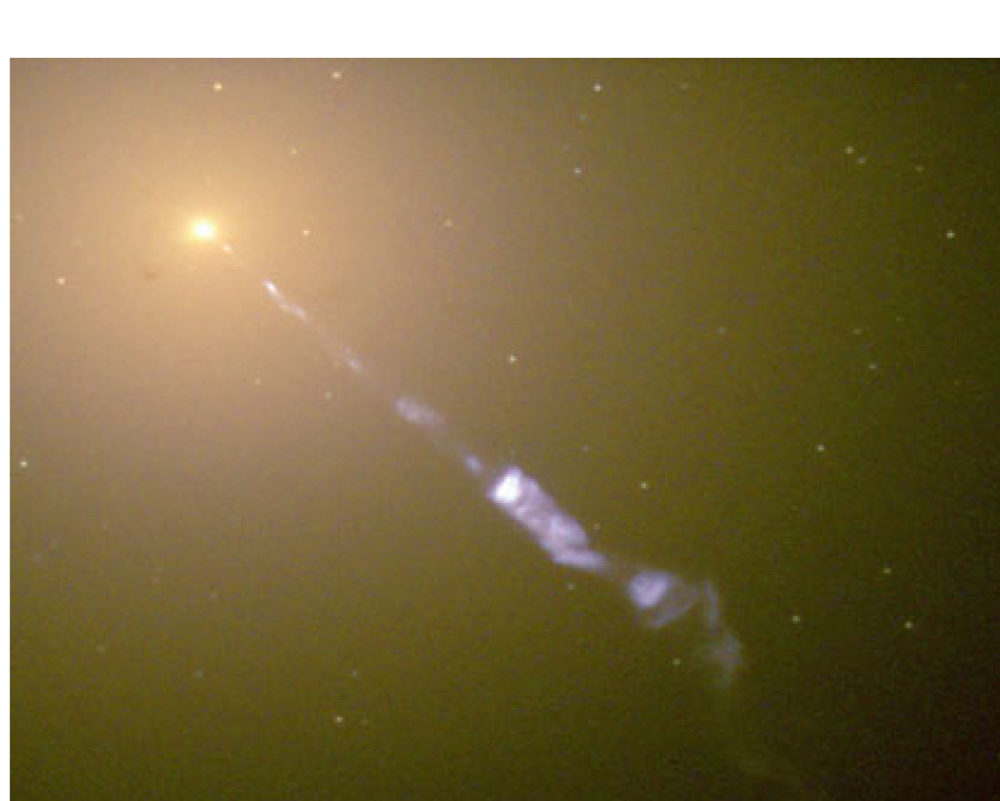
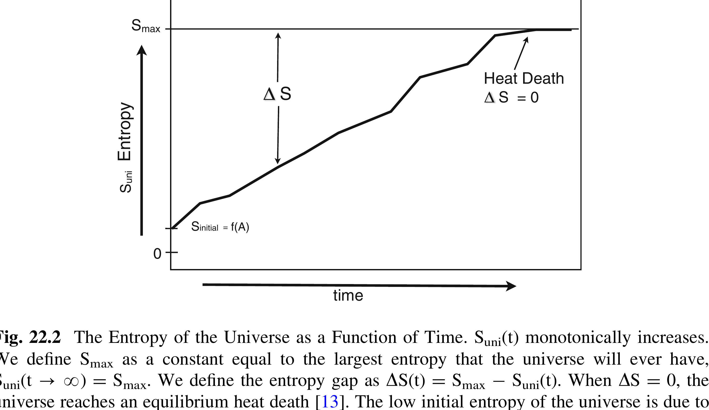
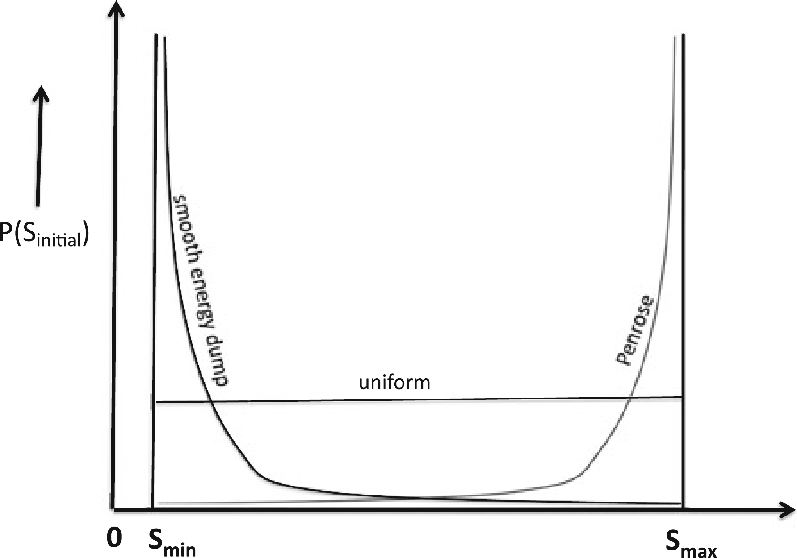
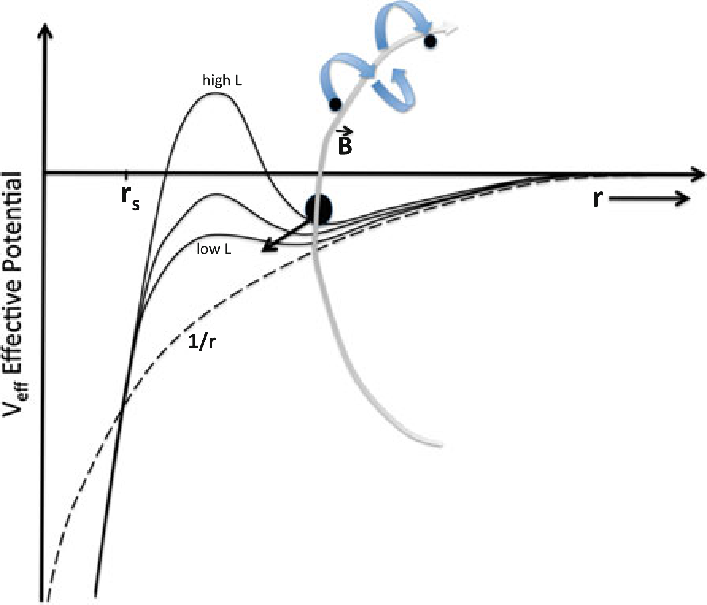

# Lineweaver Entropy-Budget Chapter — PageIndex Full-Text Extraction

Verbatim page-by-page text extraction of "Chapter 22: The Entropy of the Universe
and the Maximum Entropy Production Principle" (Charles H. Lineweaver, in *Beyond
the Second Law*, Springer 2014) via [PageIndex](https://github.com/VectifyAI/PageIndex) MCP `get_page_content` (13 pages).
Quality: `source_text_parse` — faithful text and LaTeX-equation transcription
including Table 22.1, higher fidelity than the prior [MarkItDown](https://github.com/microsoft/markitdown) pass, but
machine-extracted and not line-for-line verified.

Figure note: the four in-text figures were extracted directly from the chapter
PDF and mirrored under `../figures/extracted/` — Fig. 22.1 (M87) and Fig. 22.3 /
22.4 as embedded raster images via `pdfimages`, and the vector Fig. 22.2 by
cropping a 150-dpi page render via `pdftoppm`/`convert`. Mapping:
Fig. 22.1 → `fig_22_1_m87.png`; Fig. 22.2 → `fig_22_2_entropy_vs_time.png`;
Fig. 22.3 → `fig_22_3_initial_entropy_distributions.png`;
Fig. 22.4 → `fig_22_4_accretion_disk_potential.png`.

---

## Page 1

# Chapter 22 — The Entropy of the Universe and the Maximum Entropy Production Principle

Charles H. Lineweaver

**Abstract** If the universe had been born in a high entropy, equilibrium state, there would be no stars, no planets and no life. Thus, the initial low entropy of the universe is the fundamental reason why we are here. However, we have a poor understanding of why the initial entropy was low and of the relationship between gravity and entropy. We are also struggling with how to meaningfully define the maximum entropy of the universe. This is important because the entropy gap between the maximum entropy of the universe and the actual entropy of the universe is a measure of the free energy left in the universe to drive all processes. I review these entropic issues and the entropy budget of the universe. I argue that the low initial entropy of the universe could be the result of the inflationary origin of matter from unclumpable false vacuum energy. The entropy of massive black holes dominates the entropy budget of the universe. The entropy of a black hole is proportional to the square of its mass. Therefore, determining whether the Maximum Entropy Production Principle (MaxEP) applies to the entropy of the universe is equivalent to determining whether the accretion disks around black holes are maximally efficient at dumping mass onto the central black hole. In an attempt to make this question more precise, I review the magnetic angular momentum transport mechanisms of accretion disks that are responsible for increasing the masses of black holes.

## 22.1 The Entropy of the Observable Universe

Stars are shining, supernovae are exploding, black holes are forming, winds on planetary surfaces are blowing dust around, and hot things like coffee mugs are cooling down. Thus, the entropy of the universe $S_{\mathrm{uni}}$, is increasing, and has been

(C. H. Lineweaver, Planetary Science Institute, Research School of Astronomy and Astrophysics and the Research School of Earth Sciences, Australian National University, Canberra, ACT 0200, Australia. e-mail: charley.lineweaver@anu.edu.au. In: R. C. Dewar et al. (eds.), *Beyond the Second Law*, Understanding Complex Systems, DOI: 10.1007/978-3-642-40154-1_22, © Springer-Verlag Berlin Heidelberg 2014.)

## Page 2

increasing since the hot big bang 13.8 billion years ago [1]. The universe obeys the second law of thermodynamics:

$$\mathrm{d}S_{\text{uni}}\geq 0. \tag{22.1}$$

In the entropy literature there is often confusion about both the boundary of "the system" and the distinction between the rate of increase of the entropy of the system dS/dt, and the rate entropy is produced by the system σ [2]. For example, in the Earth system, many processes are producing entropy (therefore, naively, the entropy of the Earth should be increasing), but the entropy produced is being exported into the interstellar radiation field (therefore the entropy of the Earth could be constant). Assuming a steady state for the Earth means that the amount of entropy exported is equal to the amount of entropy produced, thus dS/dt = 0 but $\sigma>0$ [3]. Such an entropy-producing steady state can only happen when the system, or control volume, is different from (e.g. hotter than) the environment. This difference allows the system to export the entropy it produces, to the environment.

The entropy of the universe is more simple to deal with because the boundaries of the system are not an issue. We have much evidence that the universe is homogeneous on scales above ∼100 million light years [4]. This homogeneity makes the distinction between a very large control volume (100 million light years)³ and its environment, meaningless. Volumes of the universe that are at least that big are essentially identical. That is, they are so large that their average density of black holes, supernovae, stars and planets, accurately represents the average density of these objects everywhere in the universe. Thus, the amount of entropy being produced by these structures in any large control volume, is the same as the entropy being produced in the neighbouring control volumes. Thus, in cosmology we can ignore the system boundary problem. Without an environment into which to dump entropy, we have:

$$\mathrm{d}S_{\text{uni}}/\mathrm{dt} = \sigma_{\text{uni}}>0. \tag{22.2}$$

Thus, we can ignore the distinction between dS_{uni}/dt and σ_{uni}. We can consider a representative sample volume of the universe (say the current observable universe) without worrying about the net import or net export of heat or mass or entropy across any boundary, because there is no net import or export. For smaller, unrepresentative volumes of the universe, V < (million light years)³, this simplicity does not exist because there can be local inhomogeneities: an over-density of matter such as a galaxy cluster or a giant wall of galaxies, or an under-density of matter such as a cosmic void. In our analysis of cosmic entropy [5] the control volume is the observable universe—the sphere around us with a radius equal to the distance light has traveled since the big bang.

## Page 3

### 22.1.1 Expansion of the Universe is Isentropic

Since 1929, we have known that the universe is expanding. This expansion is isentropic [1, 6]. That is, the entropy of relativistic particles such as photons, gravitons and neutrinos does not increase or decrease with the expansion. This is because the entropy of a gas of relativistic particles is proportional to the number of particles N, which does not change as the universe expands. If we follow the entropy of a comoving volume of the universe, forward or backward in time, the number of photons in that volume does not change.

Another way to understand that the expansion of the universe is isentropic is to use the fact that the entropy density s of photons (or any relativistic particle) is proportional to the temperature cubed: $s\propto T^{3}$. Also, the temperature of relativistic particles is inversely proportional to the size of the universe (represented by the scale factor a): $T\propto 1/a$ (the particles lose energy since their wavelengths expand with the universe, $\lambda\propto a$). Also, the volume under consideration is proportional to the cube of the size of the universe: $V\propto a^{3}$. Combining these facts lets us derive that the entropy S of the photons in any volume expanding with the expansion of the universe, is $S = sV\propto a^{-3}a^{3} = \text{constant}$. In addition, the expansion of the universe does not increase the rate at which mass accretes into black holes. Thus, expansion does not increase the entropy of the universe. The adiabatic expansion of an ideal gas into empty space is irreversible and thus the entropy, which is proportional to volume, increases. This is not the case in cosmology because the CMB photons are not expanding into empty space.

### 22.1.2 The Entropy Budget of the Universe

The entropy of a black hole of mass $M_{\mathrm{BH}}$ is proportional to the square of the mass [7–9]:

$$S_{\mathrm{BH}} = k(4\pi G/c\hbar) M_{\mathrm{BH}}^{2} \tag{22.3}$$

where k is Boltzmann's constant, G is Newton's constant, c is the speed of light and ħ is Planck's constant divided by 2π. To obtain the entropy of black holes in the universe, we multiplied Eq. (22.3) by the mass function of black holes and then integrated over mass and volume [5]. The result is: $S_{\mathrm{BHs}}\sim 3.1\times 10^{104} k$. The $M_{\mathrm{BH}}^{2}$-weighted black hole mass function peaks in the range $\sim 10^{9}$ – $10^{10}$ solar masses. Therefore, such supermassive black holes at the cores of the most massive elliptical galaxies (which are in the central regions of the most massive clusters of galaxies), are the source of most of the entropy in the universe (Fig. 22.1).

The entropy density of non-relativistic particles can be computed from the Sakur-Tetrode equation [10] which gives the entropy per baryon, which we then multiplied by the density of baryons. The second largest contribution to the entropy comes from the photons of the cosmic microwave background and a close

## Page 4

*Fig. 22.1* — M87 is the closest giant elliptical galaxy at the core of the Virgo Cluster of galaxies, of which our galaxy is an outlying member. The black hole at the center of M87 has a mass $\sim 7\times 10^{9}M_{\mathrm{Sun}}$. Black holes of this mass are called supermassive black holes and dominate the entropy budget of the universe. The central black hole is larger than the radius of Pluto's orbit. The accretion disk which feeds the central black hole is $\sim 0.4$ light years in diameter and is rotating at velocities of up to $\sim 1{,}000~\mathrm{km/s}$. The accretion rate onto the black hole is $0.1M_{\mathrm{Sun}}/$year. Magnetic fields in the accretion disk collimate the ejected material forming the prominent relativistic jet coming out of the black hole in the upper left of the image. Image: Hubble Space Telescope/STScI/AURA.
third is from cosmic neutrinos. Both of these are a quadrillion $(= 10^{15})$ times smaller than the entropic contribution from black holes. An important distinction to make is between the entropy content of various components of the universe (Table 22.1) and entropy production. The dominant sources of entropy production are the accretion disks around black holes (Sect. 22.3).

## 22.2 The Entropy Gap and the Initial Entropy of the Universe

The early universe was close to thermal equilibrium. Direct evidence for this comes from the high level of isotropy of the temperature maps of the cosmic microwave background (CMB) [11, 12]. CMB photons give us a direct view of the universe as it was $\sim 380{,}000$ years after the big bang when the entire universe had a temperature of $\sim 3{,}000\mathrm{K}$. Tiny temperature fluctuations in the CMB maps have a $\Delta T / T\sim 10^{-5}$. That is, the anisotropies seen in the maps (hot spots and cold spots) are deviations of amplitude $\Delta T\sim 30~\mu\mathrm{K}$ around the current average temperature $T = 3\mathrm{K}$. If CMB photons were its only component, the universe would

## Page 5

### Table 22.1 — Entropy [k] of the various components of the observable universe

| Component | Entropy [k] |
| --- | --- |
| Black holes | $S_{\mathrm{BHs}}\sim 3.1\times 10^{104}$ |
| Cosmic microwave background photons | $S_{\mathrm{photons}}\sim 5.4\times 10^{89}$ |
| Cosmic neutrinos | $S_{\mathrm{neutrinos}}\sim 5.2\times 10^{89}$ |
| Dark matter | $S_{\mathrm{DM}}\sim 2\times 10^{88}$ |
| Cosmic graviton background | $S_{\mathrm{gravitons}}\sim 6.2\times 10^{87}$ |
| Interstellar medium and intergalactic medium | $S_{\mathrm{ISM,IGM}}\sim 7.1\times 10^{81}$ |
| Stars | $S_{\mathrm{stars}}\sim 9.5\times 10^{80}$ |

*Fig. 22.2* — The Entropy of the Universe as a Function of Time. $S_{\mathrm{uni}}(t)$ monotonically increases. We define $S_{\mathrm{max}}$ as a constant equal to the largest entropy that the universe will ever have, $S_{\mathrm{uni}}(t \to \infty) = S_{\mathrm{max}}$. We define the entropy gap as $\Delta S(t) = S_{\mathrm{max}} - S_{\mathrm{uni}}(t)$. When $\Delta S = 0$, the universe reaches an equilibrium heat death [13]. The low initial entropy of the universe is due to the low gravitational entropy [1, 14, 16], which, one day, should be parametrized by the large scale structure normalization A (a parameter used by cosmologists to quantify the initial clumping of matter). If the universe were born with a high entropy, we would have $S_{\mathrm{initial}} \sim S_{\mathrm{max}}$, and $\Delta S \sim 0$, and a lifeless universe. Figure from [1].
have started out in equilibrium, at maximum entropy $(\Delta S = 0)$ and would have stayed there. Nothing would have happened and no life would be possible. Such a universe is unobservable by life forms of any kind. The second law of thermodynamics (Eq. 22.1) tells us that as long as life or any other irreversible dissipative process exists in the universe, the entropy of the universe $S_{\mathrm{uni}}$ will increase. Thus the entropy of the very early universe had to have some initially low value $S_{\mathrm{initial}}$, where "low" means low enough compared to the maximum possible entropy $S_{\mathrm{max}}$ so that the entropy gap $\Delta S$ $(= S_{\mathrm{max}} - S_{\mathrm{uni}}(t))$ was large and could produce and support irreversible processes, such as stars and life forms [1] (Fig. 22.2).

Trying to understand the low initial entropy of the universe is an important unresolved issue of cosmology [13-16]. Figure 22.3 summarizes a few hypotheses. The "uniform" distribution in Fig. 22.3 is just a toy model without physical justification. However, physically plausible arguments can be made for both the "Penrose" and the "smooth energy dump" distributions. In standard

## Page 6

*Fig. 22.3* — Three conflicting expectations about the origin of the initial entropy of the universe. $\mathrm{P}(\mathrm{S}_{\mathrm{initial}})$ is the probability distribution from which the initial entropy of our universe $\mathrm{S}_{\mathrm{initial}}$ (or of other universes) could have been drawn. One could imagine a uniform distribution in which all values between $\mathrm{S}_{\mathrm{min}}$ and $\mathrm{S}_{\mathrm{max}}$ are equally likely (horizontal line). Penrose's idea ([14], Chap. 27) is that there are many more ways to have high initial entropy than low initial entropy. In inflationary models, a "smooth energy dump" of the non-clumpable false vacuum energy constrains the resulting matter to a smooth homogeneous distribution with low gravitational entropy [15].
thermodynamics there are many more ways to be at high entropy than at low entropy. Motivated by this idea and applying it to the early universe, Penrose makes the assumption that there are many more ways for the universe to have had high initial entropy than low initial entropy. Thus he refers to "our extraordinarily special big bang" ([14], p 726, Chap 27 and Fig. 27.4) because contrary to his assumption and expectation, our universe started out at low entropy.

If there are many more ways to be at $S_{\mathrm{max}}$ (in the absence of other constraints) Penrose would be correct that it is much more likely that the universe should have been born at or near maximum entropy (and our expectations should be that $S_{\mathrm{initial}} \sim S_{\mathrm{max}}$). However, at the beginning, did the universe have access to all those ways? Or were there constraints associated with the origin of matter that restrict the universe to having a smooth matter distribution and therefore low gravitational entropy?

It is possible that there were physical constraints associated with the physics of inflation. Inflation starts from an initially smooth distribution of false vacuum energy (quantum fluctuations of false vacuum, this can also be understood as a higher zero-point energy than the current zero-point energy of the vacuum state of the universe). See [15]. Part of the definition of vacuum energy is that it does not, and cannot clump. This false vacuum energy is homogeneously distributed (subject to quantum fluctuations). When the false vacuum decays during reheating creating all the energy and matter in the universe, it may only be possible for this to happen as a smooth energy dump, resulting in a universe with a relatively

## Page 7

smooth distribution of matter (and therefore low initial gravitational entropy). Thus inflation provides a natural initial condition that could explain why the initial entropy of our universe ($S_{\text{initial}}$ in Fig. 22.2) is so low. Homogeneously distributed matter (i.e. with low gravitational entropy) could well be an initial constraint (boundary condition) associated with the origin of matter from false vacuum energy.

The low gravitational entropy of the homogeneously distributed matter is what gives the universe its low initial entropy [1, 16]. Penrose ([14], p 706) explains: "A uniformly spread system of gravitating bodies would represent relatively low entropy (unless the velocities of the bodies are enormously high and/or the bodies are very small and/or greatly spread out, so that the gravitational contributions become insignificant), whereas high entropy is achieved when the gravitating bodies clump together."

For an elaboration of this view see [17–19].

### 22.2.1 Anthropic Reasoning Cannot Rescue Penrose's Model

In Penrose's model, if the initial entropy is too close to $S_{\text{max}}$, the entropy gap $\Delta S$ will not be large enough to produce stars and life. Thus, in Penrose's model, an anthropic argument (in the context of a multiverse scenario in which the probability distribution of $S_{\text{initial}}$, P($S_{\text{initial}}$) is exhaustively sampled) has to be invoked to explain why $S_{\text{initial}}\ll S_{\text{max}}$ [20]. That is, although universes with $S_{\text{initial}}\sim S_{\text{max}}$ greatly outnumber universes with low initial entropy, life (and observers like us) are only possible in universes with low initial entropy.

Sagan [21] has poetically described the low entropy requirements for life: "If you wish to make an apple pie from scratch, you must first invent the universe." However, the entire universe did not have to be at low entropy in order for our part of the universe to have low entropy. Feynman [22] discussed the idea of whether our low entropy part of the universe could be a low entropy fluctuation, i.e. a low entropy sub-set of a larger universe that is much closer to maximum entropy: "[F]rom the prediction that the world is a fluctuation, all of the predictions are that if we look at a part of the world we have never seen before, we will find it mixed up, and not like the piece we just looked at. If our order were due to a fluctuation, we would not expect order anywhere but where we have just noticed it...Every day [astronomers] turn their telescopes to other stars, and the new stars are doing the same thing as the other stars. We therefore conclude that the universe is not a fluctuation, and that the order is a memory of conditions when things started. This is not to say that we understand the logic of it. For some reason, the universe at one time had a very low entropy for its energy content, and since then the entropy has increased."

Feynman's argument, based on new stars coming into view, can be made more rigorous by basing it on the increasing particle horizon. If we are living in a rare low entropy fluctuation that has enabled us to be here, then when we view

## Page 8

previously unobserved parts of the universe (more specifically when we observe parts of the universe that we had not been in causal contact with), we should find them to be close to maximum entropy. The entropy fluctuation that made us should be of minimal extent. As the size of the observable universe increases, new parts of the universe that were out of causal contact, come into causal contact—new regions of the universe appear over the horizon [23]. If our part of the universe were a low entropy fluctuation, then the new parts coming over the horizon would tend to be of higher entropy. This does not seem to be the case. The distant universe seems to be at low gravitational entropy. Our observations that the distant universe is in a state of low entropy is inconsistent with the expected rarity of such low entropy states. This rarity can be quantified by the ratio of the probability of the high entropy state (with $W_{\mathrm{hi}}$ microstates) to the probability of the low entropy state (with fewer $W_{\mathrm{lo}}$ microstates) [24]:

$$\mathrm{P}(S_{\text{hi}})/\mathrm{P}(S_{\text{lo}}) = W_{\text{hi}}/W_{\text{lo}} = \exp[(S_{\text{hi}} - S_{\text{lo}})/k] \tag{22.4}$$

Low entropy regions of the universe are not only rare, they are also much more likely to fluctuate to higher entropy than to fluctuate to lower entropy. How much more likely is given by the fluctuation theorem [25]:

$$\mathrm{P}(\mathrm{d}S_{\text{i}}/\mathrm{dt} = \sigma)/\mathrm{P}(\mathrm{d}S_{\text{i}}/\mathrm{dt} = -\sigma) = \exp(\sigma t/k) \tag{22.5}$$

which can be cosmologically interpreted as follows: If some part of the universe (indexed by the subscript i) is not at equilibrium ($S_{\text{i}} < S_{\text{i,max}}$), then during a subsequent time t, this part of the universe is much more likely to increase its entropy at a positive rate $\sigma$ and fluctuate toward equilibrium ($S_{\text{i,max}}$) than it is to fluctuate further from equilibrium at a rate $-\sigma$. How much more likely is given by the expression exp($\sigma t/k$).

The Feynman quote ends with an unresolved issue: "For some reason, the universe at one time had a very low entropy for its energy content..." To resolve the issue of the initial entropy of the universe, Carroll [16] has suggested that either we just accept the initial condition without asking why, or that the big bang is not the beginning. The first is the abandonment of scientific cosmology and the second is a very poorly supported speculation. Penrose and Tegmark [14, 20] use anthropic reasoning, but it seems like overkill since it should only apply to the minimal sized local patch needed to create us. However, as mentioned earlier, the inflationary origin of matter from unclumped false vacuum energy may produce a low gravitational entropy universe everywhere it has produced matter. This could be the reason for the initial low entropy of the universe.

## Page 9

## 22.3 Maximum Entropy Production Principle in Cosmology

### 22.3.1 Entropy Production Around Supermassive Blackholes

Mass spiralling around a black hole in an accretion disk, can only fall into the black hole if there are mechanisms to remove its angular momentum and load it onto other mass that is then ejected from the system. How efficient those mechanisms are is the main issue. Since the largest component of the current entropy of the universe is the entropy of supermassive black holes, their growth by accretion of mass is the largest source of entropy in the universe. Since the entropy of a black hole is proportional to the square of the mass, $S_{\mathrm{BH}} \sim M_{\mathrm{BH}}^{2}$ (Eq. 22.3), the entropy produced during the formation and growth of a black hole is $\mathrm{d}S_{\mathrm{BH}}/\mathrm{dt} \sim M_{\mathrm{BH}}\mathrm{d}M_{\mathrm{BH}}/\mathrm{dt}$. Thus, $\mathrm{d}S_{\mathrm{BH}}/\mathrm{dt}$ is a maximum when $M_{\mathrm{BH}}\mathrm{d}M_{\mathrm{BH}}/\mathrm{dt}$ is a maximum. Therefore, to evaluate the Maximum Entropy Production Principle (MaxEP), we need to ask if the structure of accretion disks around black holes of a given mass, maximizes $\mathrm{d}M_{\mathrm{BH}}/\mathrm{dt}$. Less ambitiously, we can try to use MaxEP predictions to identify new constraints that need to be included in accretion disk models.

How can we determine whether the structure of an accretion disk arranges itself such that $\mathrm{d}M_{\mathrm{BH}}/\mathrm{dt} = (\mathrm{d}M_{\mathrm{BH}}/\mathrm{dt})_{\mathrm{max}}$? We need to understand the details of the angular momentum transfer and to evaluate if, under the constraints given, the material around a black hole arranges itself optimally to transport angular momentum and concentrate it into a relatively small amount of mass that gets ejected from the system.

For mass to accrete onto a black hole, the angular momentum and energy of the mass has to be gotten rid of. Energy from accretion can easily be radiated away through the high luminosity of the inner edge of accretion disks. So the rate limiting step controlling mass infall is the transfer of angular momentum. The angular momentum $L$, of the mass that is going to fall in, has to be transferred to mass that will be ejected (Figs. 22.1, 22.4). Therefore, to evaluate MaxEP, we need to ask if black hole accretion disks are structured in such a way that they are maximally efficient at exporting angular momentum. The efficiency of an accretion disk can be quantified by how much $L$ it can concentrate in the smallest amount of ejected mass.

Accretion discs are ubiquitous structures in the astrophysics of black holes (i.e. quasars, active galactic nuclei, binary X-ray sources), star formation and even massive planet formation. When an accretion disk around a star runs out of mass to accrete and is no longer able to transport angular momentum, the skeleton it leaves behind is a angular-momentum dominated disk of material, also known as a planetary system. Jupiter and Saturn have been stranded with $\sim 85$% of the angular momentum of our solar system.

Accretion disks are differentially rotating Keplerian disks. That is, the velocity of material at a distance r from the central mass M is $\mathrm{v}(\mathrm{r}) \sim \sqrt{(GM/r)}$. Since

## Page 10

*Fig. 22.4* — Effective potential (Eq. 22.6) of material in an accretion disk for three values of angular momentum L. The Newtonian $1/\mathrm{r}$ gravitational potential is shown for comparison (dashed line). The grey representative magnetic field line ("B") is anchored to the partially ionized material of the accretion disk (large black circle, also "m" in Eq. 22.6). Mass m is whipping around the black hole at Keplerian velocities $\mathrm{v(r)}\sim \mathrm{r}^{-1/2}$ carrying the magnetic field line with it. Partially ionized particles above and below the accretion disk spiral around the magnetic field lines. Since the magnetic field line is rotating, centrifugal forces accelerate and eject these ionized particles like beads on a bullwhip. The acceleration of these particles comes at the expense of the deceleration of the particles anchoring the field lines in the disk. Thus, the transfer of angular momentum from material in the accretion disk to material ejected above and below the disk, occurs through rotating magnetic field lines.
velocity is not a constant but depends on radius, we have the frictional sheer of molecular viscosity in the disk. This dissipation has been parametrized in the earliest accretion disk models as the dimensionless parameter alpha [26]. However, ordinary molecular viscosity is not sufficient to explain the amount of angular momentum transport needed to account for the observed accretion rate in accretion disks [27]. Blandford and Payne [28] showed that magnetic stresses are more efficient at transporting angular momentum as they convert centrifugal outflow into the oft-observed collimated jets (see Figs. 22.1, 22.4).

The role of angular momentum in preventing accretion can be seen in the effective potential (Fig. 22.4) of a mass $m$, with angular momentum $L$ in the accretion disk at a distance $r$ from a black hole of mass $M_{\mathrm{BH}}$, located at $r = 0$, with an event horizon radius (= Schwarzschild radius) $r_s$ [29]:

$$V_{\text{eff}} = - G M_{\mathrm{BH}} m / r + L^{2}/\left(2 m r^{2}\right)\left[1 - r_{\mathrm{s}}/r\right] \tag{22.6}$$

For the mass $m$ to sink into the potential well of the black hole, we need to reduce the angular momentum $L$ that $m$ has. This reduction lowers the hill of high angular momentum associated with the centrifugal force felt by the orbiting mass.

## Page 11

The "high L" curve drops down to become the "low L" curve. In Fig. 22.4, a representative magnetic field line, is threaded through the large black circle (mass "m"). As m circles around the black hole, it carries the B-field with it. Ionized particles (represented by the small black circles) above (and below) the plane of the accretion disk spiral around the B-field line and get accelerated out and up, like beads on a whip. This transfers some of the angular momentum of m to the bead, lowering the L of m. In this way, magnetic braking of m allows it to accrete onto the central black hole [28].

The efficiency with which partially ionized material can be magnetically whipped to high velocities and thus simultaneously loaded with angular momentum is difficult to quantify because it depends on the complex profiles of ionization, magnetic field strength, density, pressure and temperature above, below and in the disk. It depends on an impedance matching between the magnetic braking of material near the black hole and the magnetic acceleration of material further away. For example, if the ionization fraction is too low, there will not be much material to spiral around the field lines and get ejected. If the density of neutral particles is too high in the region of acceleration, collisions with neutral particles produces an 'atmospheric friction' that will slow down the acceleration (it is difficult to crack a bullwhip underwater in order to accelerate a bead on it). The high density impedes the transport of angular momentum. Magnetohydrodynamics (MHD) is needed to model the system and feedback is important since magnetic fields accelerate the spiraling particles, while at the same time, the spiraling particles maintain the magnetic fields.

Since the amount of matter that could fall into a black hole is limited to how much matter is nearby, the most "efficiently structured" accretion disks (the ones that MaxEP would predict) are the ones that can concentrate angular momentum into the smallest amount of mass and then eject only the smallest fraction of the mass available. This allows a larger fraction of the mass to lose enough angular momentum to fall into the hole and contribute to entropy production (Fig. 22.4). One way to quantify the efficiency of L-transport in an accretion disk is to estimate its ratio of mass accretion to mass ejection. In protostellar accretion disks (e.g. around T-Tauri stars) this ratio is ~5–10 [30]. In the accretion disks of SMBHs, it may be comparable, but high angular resolution observations and modeling of these systems are not good enough to say more. The efficiency cannot be infinite. All the angular momentum cannot be concentrated in one ejected proton. The constraints of the MHD angular momentum transfer, combined with MaxEP would predict that there will be a maximum value to the mass accretion/mass ejection ratio (somewhat analogous to the Carnot efficiency of a reversible heat engine).

Angular momentum is also transported magnetically within the disk. Modeling by Balbus and Hawley [31, 32] showed that the magneto-rotational instability (MRI) produces turbulent viscosity and accounts for additional outward angular momentum transport [33]. The cause of MRI is the tendency of a weak magnetic field to try to enforce corotation on displaced fluid elements. This results in excess centrifugal force at large radii, and a deficiency of centrifugal force at smaller radii. This drives fluid elements away from their equilibrium positions and

## Page 12

produces interpenetrating fingers of high and low angular momentum fluid—leading to angular momentum transport [31].

Can we arrange the magnetic field and all the other characteristics of an accretion disk (in the context of the given specific environments around supermassive black holes) to maximize $\mathrm{d}M_{\mathrm{BH}}/\mathrm{dt}$? Or does Nature do that by herself as MaxEP would predict? As we obtain higher angular resolution images of a significant sample of nearby supermassive blackholes, and as we make more accurate and detailed computer MHD models of their mass accretion, we will get closer to answering this question.

## References

1. Lineweaver, C.H., Egan, C.: Life, gravity and the second law of thermodynamics. Phys. Life Rev. 5, 225–242 (2008)
2. Niven, R.K.: Minimization of a free-energy-like potential for non-equilibrium flow systems at steady state. Phil. Trans. R. Soc. B. 365, 1323–1331 (2010). (Chap. 7, this volume)
3. Kleidon, A.: Life, hierarchy and the thermodynamics machinery of planet Earth. Phys. Life Rev. (2010). doi:10.1016/j.plrev.2010.10.002
4. Hogg, D.W., et al.: Cosmic homogeneity demonstrated with luminous red galaxies. ApJ 624, 54–58 (2005)
5. Egan, C., Lineweaver, C.H.: A larger entropy of the universe. Astrophys. J. 710, 1825–1834 (2010)
6. Kolb, E.W., Turner, M.S.: The early universe. Addison-Wesley, New York (1990)
7. Bekenstein, J.S.: Generalized second law of thermodynamics in black-hole physics. Phys. Rev. D 9, 3292 (1974)
8. Hawking, S.W.: Black holes and thermodynamics. Phys. Rev. D 13, 191 (1976)
9. Strominger, A., Vafa, C.: Microscopic origin of the Bekenstein-Hawking entropy. Phys. Lett. B. 379, 99 (1996)
10. Basu, B., Lynden-Bell, D.: A survey of entropy in the universe. QJRAS. 31, 359 (1990)
11. Smoot, G.F., et al.: Structure in the COBE differential microwave radiometer first-year maps. Astrophys. J. 396, L1–L5 (1992)
12. Jarosik, N., et al.: Seven-year Wilkinson microwave anisotropy probe (WMAP) observations: sky maps, systematic errors, and basic results. ApJS 192, 14 (2011)
13. Lineweaver, C.H.: A simple treatment of complexity: cosmological entropic boundary conditions on increasing complexity. In: Lineweaver, C.H., Davies, P.C.W., Ruse, M. (eds.) Complexity and the Arrow of Time, Cambridge University Press, pp. 42–67 (2013)
14. Penrose R.: The big bang and its thermodynamic legacy. In: Road to Reality: A Complete Guide to the Laws of the Universe, pp. 686–734 [Chapter 27]. Vintage Books, London (2004). Plot used in Fig. 1, panel c, from Thomas, A. (2009). http://www.ipod.org.uk/reality/reality_arrow_of_time.asp
15. Guth, A.H.: The Inflationary Universe. Jonathan Cape, London (1997)
16. Carroll, S.M.: From Eternity to Here: The Quest for the Ultimate Theory of Time. Dutton, Penguin, New York (2010)
17. Gron, O., Hervik, S.: Gravitational entropy and quantum cosmology. Class. Quantum Grav. 18, 601–618 (2001)
18. Gron, O., Hervik, S.: The Weyl Curvature Conjecture, arXiv:gr-qc/0205026v1. (2002)
19. Amarzguioui, M., Gron, O.: Entropy of gravitationally collapsing matter in FRW universe models. Phys. Rev. D 71, 083011 (2005)

## Page 13

20. Tegmark, M.: The Second Law and Cosmology, arXiv 0904.3931v1. (2009)
21. Sagan, C.: Cosmos (1980)
22. Feynman, R.: Feynman Lectures, vol. I (46-8, -9) (1969)
23. Davis, T.M., Lineweaver, C.H.: Expanding Confusion: Common Misconceptions of Cosmological Horizons and the Superluminal Expansion of the Universe. Pub. Astron. Soc. Aust. 21, 97–109 (2004). See Fig. 1
24. Jaynes, E.T.: Macroscopic prediction. In: Haken, H. (ed.) Neurobiology, Physics and Computers, pp. 254–269. Springer, Berlin (1985), Eq. 5
25. Evans, D.J., Searles, D.J.: Equilibrium microstates which generate second law violating steady states. Phys. Rev. E 50(2), 1645–1648 (1994)
26. Shakura, N.I., Sunyaev, R.A.: Astron. Astrophys. 24, 337 (1973)
27. Pringle, J.E.: Accretion discs in astrophysics. Ann. Rev. Astron. Astrophys. 19, 137–162 (1981)
28. Blandford, R.D., Payne, D.G.: Hydrodynamic flows from accretion discs and the production of radio jets. MNRAS 199, 883–903 (1982)
29. Taylor, E.R., Wheeler, J.A.: Exploring Black Holes: Introduction to General Relativity. Addison Wesley Longman, San Francisco (2000). (Chaps. 4 and 5)
30. Cabrit, S.: The accretion-ejection connexion in T Tauri stars: jets models vs. observations. In: Bouvier, J., Appenzeller, I. (eds.) Star-Disk Interaction in Young Stars, Proceedings of the IAU Symposium No. 243 (2007)
31. Balbus, S.A., Hawley, J.F.: A powerful local shear instability in weakly magnetized disks. I linear analysis. ApJ. 376, 214–222 (1991)
32. Balbus, S.A., Hawley, J.F.: Instability, turbulence, and enhanced transport in accretion disks. Rev. Mod. Phys. 70(1), 1–53 (1998)
33. http://en.wikipedia.org/wiki/Magnetorotational_instability
