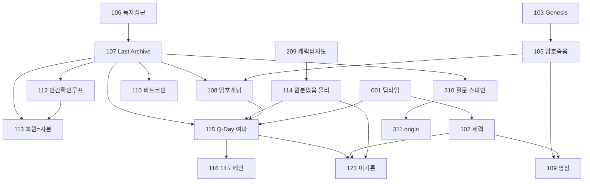

# QFUDS Verse 월드빌딩 아키텍처 지도 (문서 인덱스·권위 트리·의존/영향 그래프)

## 무엇인가

`qfuds-verse`의 in-scope 문서 80개를 하나의 지도로 묶는 **읽기 전용 감사 산출물**이다.
"어느 문서가 권위인가", "어느 선반이 무엇을 소유하나", "이 문서 하나 고치면 무엇이
영향받나"를 즉시 답한다. 드리프트·기술부채·리팩터 우선순위는 자매 문서
[901 Canon Drift·Tech Debt 리포트](901_canon_drift_and_tech_debt_report_ko.md)가 보유한다.

이 문서는 새 고유명·캐논·인물을 만들지 않는다. 기존 문서 본문도 고치지 않는다. 실존
종교·민족·집단을 가해자/피해자로 고정하지 않는다.

```text
fiction/provenance only
research evidence: no
external source claim: no
```

## 범위 (고정)

- INCLUDE: `qfuds-verse/README.md`, `00_continuity/**`, `10_world/**`,
  `20_series/qfuds-saga/{00_bible, 00_workroom, 10_story_design, 40_release, README}`.
- EXCLUDE: `20_drafts/**`, `30_revisions/**`, `90_archive/**` (원고·개정·아카이브).
- 감사 기준 **80개 문서** (연속성 5, 세계 24, bible 11, workroom 13, story_design 23,
  release 2, universe/series 루트 2). 감사 기준일 2026-07-01, 프론트매터 `depends_on`
  그래프 직접 산출. 이후 정합 작업으로 [124 원어 층](../10_world/124_far_future_native_lexicon_return_death_ko.md)이
  추가돼 현재 세계 선반 25, 총 81.
- 2026-07-10 기준: story_design·drafts·revisions·release·대부분의 workroom 선반은
  SAGA 프로젝트 종료로 active tree에서 제거됐다. 아래 인덱스에서 링크가 없는 문서
  제목은 감사 당시 기록이며 Git 이력(`git show bbbcb970:<path>`)으로만 열람한다.

## 1. 문서 인덱스 (선반별)

### 1.1 `00_continuity` · 캐논 권위·연표 SSOT (5)

| 문서 | 역할 | status |
| --- | --- | --- |
| [000 권위·SSOT 지도](000_canon_authority_and_ssot_map_ko.md) | 충돌 시 어느 문서가 이기나(제작 권위 루트) | draft |
| [001 장기 복원 문명사 타임라인](001_deep_time_restoration_timeline_ko.md) | 0-9기 딥타임 연대기(연표 SSOT) | draft |
| [002 연표·복원 행정·블랙홀 본거지](002_chronology_restoration_admin_black_hole_seat_ko.md) | 연표·기술곡선·복원 행정 구조 | draft |
| [003 먼 미래 심층시간 연대기](003_far_future_deep_time_chronicle_ko.md) | 001 5-9기를 물리 시계에 건 심층시간 확장 | draft |
| [README 연속성 인덱스](README.md) | 선반 정책·SSOT 안내 | draft |

### 1.2 `10_world` · 공유 세계 캐논 (25, 124 포함)

물리·암호 축:

| 문서 | 역할 | status |
| --- | --- | --- |
| [101 세계 기준점·핍진성](../10_world/101_world_anchor_and_verisimilitude_ko.md) | 현실 앵커와 그럴듯함의 경계 | draft |
| [103 Genesis Chain·복원 신화](../10_world/103_bitcoin_genesis_chain_and_restoration_myth_ko.md) | 비트코인 위상·복원 신화 기원 | draft |
| [105 암호학적 죽음·해시 계약](../10_world/105_cryptographic_death_and_hash_covenant_ko.md) | Q-Day 위에 선 약속들 | draft |
| [108 Cryptographic Death·암호 개념](../10_world/108_cryptographic_death_era_and_crypto_concepts_ko.md) | 암호 개념 상세 설정 | draft |
| [107 Last Archive 기원·역연산 인과](../10_world/107_last_archive_origin_and_reversal_causality_ko.md) | **키스톤.** Last Archive 기원·인과 구조 | draft |
| [113 복원 메커니즘 정정](../10_world/113_restoration_mechanism_correction_ko.md) | 복원=손실 사본(부활 아님) | draft |
| [114 in-world 물리(정보·유니터리)](../10_world/114_in_world_physics_information_unitarity_restoration_ko.md) | 원본 없음·복원 물리 근거(최상위 우선) | draft |
| [110 비트코인 위상·이념전쟁·심층시간](../10_world/110_bitcoin_stature_ideology_deeptime_ko.md) | 장기시간 유효성·이념전쟁 | draft |
| [111 세계관 컴펜디움](../10_world/111_world_compendium_codex_ko.md) | 세계 설정 종합 코덱스 | draft |

세력·문명사·제도 축:

| 문서 | 역할 | status |
| --- | --- | --- |
| [102 세력·문화·권력·생태계](../10_world/102_factions_cultures_power_ecology_ko.md) | 세력 생활권·이념·생태계 장부 | draft |
| [123 이기(理氣) 이념 축](../10_world/123_yi_gi_ideology_axis_ko.md) | 원본 실재 vs 부재 형이상학 축(candidate) | draft |
| [124 먼 미래 원어 층](../10_world/124_far_future_native_lexicon_return_death_ko.md) | 부활·복원 현대 gloss를 in-world 원어로 분리(candidate) | draft |
| [109 세력 명칭 Canon 확정](../10_world/109_factions_canon_naming_ko.md) | 세력 이름 canon(명칭 SSOT) | draft |
| [104 Post-AGI 문명사·이중언어 규약](../10_world/104_post_agi_civilization_history_bilingual_protocol_ko.md) | AGI 이후 문명사·한국어 우선 | draft |
| [112 AI·자동화·인간 확인 루프](../10_world/112_ai_automation_human_in_the_loop_ssot_ko.md) | 왜 사람이 도장을 찍나(제도 근거) | draft |
| [115 Q-Day 여파 타임라인과 세계](../10_world/115_qday_aftermath_timeline_and_world_ko.md) | Q-Day 여파(7인 패널 종합) | draft |
| [116 Q-Day 14도메인 매트릭스](../10_world/116_qday_world_system_14domain_matrix_ko.md) | 115 부속 14도메인 인과 매트릭스 | draft |
| [106 메타포 토대·독자 접근성](../10_world/106_reader_accessibility_and_real_world_anchors_ko.md) | 메인 메타포·검증 대장 | draft |

세계 확장 웨이브(candidate 대사전):

| 문서 | 역할 | status |
| --- | --- | --- |
| [117 웨이브 1](../10_world/117_world_expansion_wave1_names_places_events_ko.md) | 고유명사·지명·세력·인물·사건·어휘 | draft |
| [118 웨이브 2](../10_world/118_world_expansion_wave2_factions_relationships_ko.md) | 세력 내부 심화·관계망 | draft |
| [119 웨이브 3](../10_world/119_world_expansion_wave3_geography_event_chains_ko.md) | 지리·궤도·사건 연쇄 | draft |
| [120 웨이브 4](../10_world/120_world_expansion_wave4_economy_rites_calendar_ko.md) | 경제·통화·의례·달력 | draft |
| [121 웨이브 5](../10_world/121_world_expansion_wave5_language_tech_infra_ko.md) | 언어·기술 인프라 | draft |
| [122 웨이브 6 capstone](../10_world/122_world_expansion_wave6_ecology_education_media_index_ko.md) | 생태·교육·미디어·크로스 인덱스 | draft |
| [README 세계 인덱스](README.md) | 선반 규칙·확장 register | draft |

### 1.3 `00_bible` · series SSOT (11)

| 문서 | 역할 | status |
| --- | --- | --- |
| [201 시점·주제·고유명사 규칙](../20_series/qfuds-saga/00_bible/201_narrative_pov_theme_naming_ko.md) | 서사 규칙 SSOT | draft |
| [202 첫 Arc Canon 정리](../20_series/qfuds-saga/00_bible/202_first_arc_canon_consolidation_ko.md) | 1부 원고에서 굳은 세계 사실 | draft |
| [203 주인공 시트 Liora Sen](../20_series/qfuds-saga/00_bible/203_character_liora_sen_ko.md) | 주인공 캐릭터 SSOT | draft |
| [204 작가 사유 렌즈·압축·SSOT](../20_series/qfuds-saga/00_bible/204_authorial_lenses_compression_ssot_soft_editing_ko.md) | 작가 렌즈(리쾨르·루만 구조 차용) | draft |
| [205 앙상블 보이스·관계 바이블](../20_series/qfuds-saga/00_bible/205_character_ensemble_voices_relationships_ko.md) | 앙상블 인물 보이스·관계 | draft |
| [206 입체 캐릭터 시트](../20_series/qfuds-saga/00_bible/206_character_depth_sheets_ko.md) | 인물 심층 시트 | draft |
| [207 기준 작성권 사상축](../20_series/qfuds-saga/00_bible/207_authorship_of_the_standard_theme_axis_ko.md) | 무엇이 진짜였는지 정하는 권력 | draft |
| [208 이념 비일관 삼각](../20_series/qfuds-saga/00_bible/208_ideological_incoherence_triad_ko.md) | 세 양립 불가 신앙 | draft |
| [209 캐릭터 지도·타임라인 좌표](../20_series/qfuds-saga/00_bible/209_character_map_and_timeline_coordinates_ko.md) | 인물별 시대 좌표 SSOT | draft |
| [210 기계 화자 관통선(AI 발전사)](../20_series/qfuds-saga/00_bible/210_machine_childhood_ai_history_narrator_throughline_ko.md) | 실제 AI사 관통선 | draft |
| [README bible 인덱스](README.md) | 선반 지도 | draft |

### 1.4 `00_workroom` · 생산 도구 (13)

| 문서 | 역할 | status |
| --- | --- | --- |
| 401 창작 시스템 | 에이전트 창작 시스템 | draft |
| 402 이중언어 용어규율 글로서리 | 용어 정규화 글로서리 | draft |
| 403 2부 GSD Phase Brief | 2부 제작 브리프 | draft |
| 404 시리즈 제작 하네스 | 제작 하네스 | draft |
| 405 작가 아이디어 추적 원장 | 창작 입력 추적 | draft |
| 406 1부 Book1 GSD Brief | 1부 제작 브리프 | draft |
| 407 외부 AI 글쓰기 갭 감사 | 외부 시스템 갭 감사 | draft |
| 408 Production Board | 진행 보드·게이트 | draft |
| 409 Chapter Intent Card 템플릿 | 챕터 의도 카드 | draft |
| 410 전문가 패널 세계-체계 인계 | 패널 확장 인계 | draft |
| [411 근미래 예측 패널 방법](../20_series/qfuds-saga/00_workroom/411_near_future_forecast_panel_method_ko.md) | 근미래 예측 방법 | draft |
| [412 실세계·물리 리서치 앵커](../20_series/qfuds-saga/00_workroom/412_real_world_and_physics_research_anchors_ko.md) | 핍진성 리서치 앵커 대장 | draft |
| [README workroom 인덱스](README.md) | 선반 지도 | draft |

### 1.5 `10_story_design` · 아웃라인·리빌 (23)

| 문서 | 역할 | status |
| --- | --- | --- |
| 301 시각 전시물 설계 | 작중 전시물 설계 | draft |
| 302 2부 한국어 우선 계획 | 2부 집필 계획 | draft |
| 303 Last Archive 반전 설계 | 반전·복선 배치 | draft |
| 304 형식·throughline·진행 | 형식·관통선·진행 | draft |
| 305 2부 에피소드 맵 | 2부 에피소드 단위 | draft |
| 306 다부작 아크 지도 | 부 구조·번호 SSOT | draft |
| 307 1부 Book1 재설계 아웃라인 | 1부 reboot 아웃라인 | completed |
| 308 1부 Book1 씬 카드 | 1부 reboot 씬 카드 | completed |
| 309 소버린 AI·오픈/봉쇄 축 | 이념 축 발상 | draft |
| 310 5대 극적 질문 스파인 | **서사 축 키스톤.** 관통 질문 | draft |
| 311 1부 origin 아웃라인 | origin 전체 아웃라인 | draft |
| 312 1부 origin 씬 카드 | 장면 카드 | draft |
| 313 암호 개념 독자 온보딩 | 암호 개념 전달 점검 | draft |
| 314 사엘 원고 실행 시트 | 집필 실행 시트 | draft |
| 315 Q-Day 사건 사슬 bridge | B1↔B2 연결 | draft |
| 316 1부 독자 공개 사다리 | 정보 공개 순서 | draft |
| 317 1부 causal master outline | 인과 마스터 아웃라인 | draft |
| 318 세계관·인물 한눈에 | 독자·작가 오리엔테이션 | draft |
| 319 새 1부 오르페우스 설계 | 사별·복원 사본 축 1부 설계 | draft |
| 320 근미래 리센터 방향 | 근미래 grounded SF 무게중심 | draft |
| 321 기계 화자 트리트먼트 | 기계 화자 보이스·구조 | draft |
| 322 근미래 프렐류드 대사전 | 2020s-2090s 예측(candidate) | draft |
| [README story_design 인덱스](README.md) | 선반 지도 | draft |

### 1.6 `40_release` + 루트 (4)

| 문서 | 역할 | status |
| --- | --- | --- |
| 900 Pre-Reboot 릴리스 매니페스트 | provenance manifest | provenance |
| 40_release README | 릴리스 선반 | draft |
| [qfuds-verse README](../README.md) | universe 루트 인덱스 | draft |
| qfuds-saga README | series 루트 인덱스 | draft |

## 2. Canon Authority Tree (충돌 시 무엇이 이기나)

`depends_on` in-scope 피의존도(in-degree)로 본 권위 서열. 피의존이 높을수록 아래에서
많은 문서가 그 문서를 근거로 선다.

| 순위 | 문서 | 피의존 | 자리 |
| --- | --- | --- | --- |
| 1 | 107 Last Archive 기원·역연산 인과 | **18** | 세계 캐논의 키스톤 |
| 2 | 001 딥타임 연표 / 110 비트코인 이념·심층시간 / 310 5대 질문 스파인 | 10 | 연표·이념·서사의 척추 |
| 3 | 115 Q-Day 여파 | 8 | 여파 착지 노드 |
| 4 | 102 세력 / 105 암호죽음 / 108 암호개념 / 209 캐릭터 지도 / 106 독자접근성 / 311 origin 아웃라인 | 7 | 세력·암호·캐릭터·서사 허브 |
| 5 | 112 인간 확인 루프 / 116 14도메인 | 6 | 제도·인과 매트릭스 |

**충돌 우선순위 규칙**(000 권위 지도·123 경계에서 확정): 물리·의미가 부딪히면
**114(원본 없음 물리) > 113(복원=손실 사본) > 115(여파) > 102(세력) > 109(명칭)**
순으로 이긴다. 즉 기술어(검증·복원=사본·유니터리)는 이념 별칭으로 숨기지 않고 114가 최상위다.

series bible SSOT 승격 타깃(world README): **109·209·102·115·116**. 시대 좌표(인물별)
SSOT는 [209 캐릭터 지도](../20_series/qfuds-saga/00_bible/209_character_map_and_timeline_coordinates_ko.md)가 유지한다.

## 3. Domain Ownership Map (선반별 소유)

| 선반 | 소유 도메인 | 대표 문서 |
| --- | --- | --- |
| `00_continuity` | 캐논 권위·연표 SSOT | 000 권위, 001 딥타임, 002 복원행정, 003 먼미래 |
| `10_world` (물리·암호) | 정보·유니터리·복원·암호 붕괴 | 114·113·107·108·105·103·110·101·111 |
| `10_world` (세력·제도) | 세력·문명사·이념·제도 | 102·123·109·104·112·115·116·106 |
| `10_world` (확장) | universe 공유 대사전(candidate) | 117-122 웨이브 |
| `00_bible` (캐릭터) | 인물 SSOT | 203·205·206·209 |
| `00_bible` (주제) | 사상·주제·화자 축 | 201·204·207·208·210 |
| `00_workroom` | 생산 도구·방법·게이트 | 408 보드·404 하네스·410·411·412 |
| `10_story_design` | 아웃라인·리빌·씬 카드 | 306 아크지도·310 질문·205-207 origin |
| `40_release` | 릴리스 매니페스트 | 900 |

원칙: 세계 사실은 `10_world`/`00_bible`, 브레인스토밍은 `10_story_design`, 생산 절차는
`00_workroom`, 산문은 `20_drafts`(범위 밖). 공유 세계 대사전은 universe 레벨(`10_world`),
시리즈는 플롯·캐스트만 보유한다.

### 3.1 Canon 3층 모델 (재레벨링 후 확정)

정독 감사로 드러난 가장 선명한 구조. `00_bible`은 더 이상 "세계관 설정집"이 아니라
**스토리 캐논**(인물·주제·시점·Arc·AI 서사·작가 철학)만 소유하고, 세계 사실은 전부
`10_world`/`00_continuity`로 이동했다.

| 층 | 소유 선반 | 담는 것 |
| --- | --- | --- |
| **World Canon** | `10_world` | 물리·암호·세력·제도·확장 대사전 |
| **Continuity Canon** | `00_continuity` | 캐논 권위·연표·복원 행정·심층시간 |
| **Story Canon** | `00_bible` | 인물·주제·시점·Arc·AI 관통선·작가 철학 |

### 3.2 캐릭터 Layered Architecture (의도된 층 분리)

중복처럼 보이던 4문서는 각자 다른 층을 소유한다(병합 대상 아님, 참조로 정리).

```text
209  →  시대 좌표 SSOT (인물별 부·기 좌표, 원본/사본 상태)
203  →  Liora 단일 시트 (주인공 개인 SSOT)
205  →  앙상블 Voice·관계 (대사 식별성 SSOT)
206  →  Arc 변화 (시간에 따른 입체화)
```

서사 구조 정정(114·115): 114가 **단일 주인공 결정을 철회**하고 "앤솔로지 유지 + 기계
We-화자 관통선"으로 정정했다. 백본은 인물이 아니라 **기계 We-화자**이며, 부가 바뀌어도
화자는 같다(115). 부 계단 = 0부 캐스 도입 → 1부 오르페우스(씨앗) → 1.5부 사엘(제도) →
2부 마라(신) → 3부 author-loss. 화자 지식 상태·후렴 궤적은
workroom 413 Truth-State Ledger가 추적한다.

### 3.3 생산·집행 층 (canon이 아니라 작가실 운영)

캐논 3층(§3.1) 밑에 캐논이 아닌 **운영 선반**이 깔린다. `00_workroom`은 GSD brief·production
board·traceability·하네스를 두고, 안정 세계 사실은 `00_bible`로 올린다. 핵심 진단(404·407):
실패 원인은 도구 부재가 아니라 **미집행**이며, 202이 필요 집행 모듈 6개(Production Board·
Chapter Intent Card·Chronicler Pass·Review Wave Protocol·QFUDS Style Packet·Truth-State
Ledger)를 지정한다. 모듈별 상태는 [901 §5](901_canon_drift_and_tech_debt_report_ko.md)가 보유
(마지막 빈 모듈 Truth-State Ledger는 workroom 413로 초안 착수).

| 운영 선반 | 소유 | 성격 |
| --- | --- | --- |
| `00_workroom` | 방법·게이트·provenance | 집행층(canon 아님) |
| `10_story_design` | 아웃라인·리빌·씬 카드 | 설계층 |
| `40_release` | 릴리스 매니페스트 | 릴리스층 |
| `20_drafts`·`30_revisions`·`90_archive` | 산문·개정·아카이브 | **감사 범위 밖** |

## 4. Dependency & Impact Graph (수정 시 영향)

핵심 캐논 척추의 의존 관계(화살표 = "A는 B를 근거로 선다", 즉 B를 고치면 A가 흔들린다).
가독성을 위해 상위 허브와 그 직접 연결만 도식한다.



"이 문서 수정 시 직접 영향" 블라스트 표(회귀 점검 필수 순위):

| 고치는 문서 | 직접 영향(피의존) | 회귀 점검 강도 |
| --- | --- | --- |
| 107 Last Archive | 18 | 최상 (거의 전 세계 캐논) |
| 001 딥타임 / 110 비트코인 / 109 질문 | 10 | 상 |
| 115 Q-Day 여파 | 8 | 상 |
| 102·105·108·209·106·205 | 7 | 중상 |
| 112·116 | 6 | 중 |

## 5. 서사·캐논 레이어 순서 (읽는/짓는 순서)

1. **연표 골격:** 001 딥타임 → 002 복원 행정 → 003 먼미래(물리 시계 확장).
2. **물리·암호 바닥:** 114(원본 없음·유니터리) → 113(복원=사본) → 105·108(암호 붕괴) →
   103·110(비트코인 위상).
3. **세력·제도:** 102 세력 → 109 명칭 → 112 인간 확인 루프 → 115·116 Q-Day 여파 →
   123 이기 형이상학 축.
4. **series bible:** 201 규칙 → 203·205·206·209 캐릭터 → 207·208·204·210 주제·화자.
5. **story_design:** 306 아크 지도 → 310 질문 스파인 → 205-207 origin → 209-210 근미래 축.

## 6. 용어 글로서리 정규화 포인터

용어 표기·이중언어 규율은 아래가 SSOT다. 새 용어는 여기에 먼저 물린다.

- 00_workroom/102 이중언어 용어규율 글로서리
- [10_world/104 이중언어 프로토콜](../10_world/104_post_agi_civilization_history_bilingual_protocol_ko.md) (한국어 우선 규약)
- 기술어(hash·KDF·entropy·Page curve 등) 보존 규칙: [10_world/README](../10_world/README.md) Technical Rule 표.

핵심 개념 축약: 검증경제(Aletheia), 복원=손실 사본, 인간 확인 루프(112), 필드마크 사슬,
보존주의(므네모시네)/망각주의(레테) 진자, 이/기(원본 실재 vs 부재).

## 7. 교차참조 클러스터

- **캐릭터:** 203 Liora(주인공) · 205 앙상블 · 206 입체 시트 · 209 지도·좌표. (중복 검토는 901 §3.)
- **세력·이념:** 102 세력 · 109 명칭 · 208 삼각 · 207 기준 작성권 · 123 이기 · 204 작가 렌즈.
- **Q-Day 사건:** 105·108 암호 붕괴 → 115·116 여파 → 112 인간 확인 루프 → story_design 112 bridge.
- **근미래 축:** 114 리센터 · 209 오르페우스 · 321 기계 화자 · 322 프렐류드 · workroom 411·013.
- **딥타임:** 001 → 002 → 003 · 110 심층시간.

연속성·상위 참조: [000 권위 지도](000_canon_authority_and_ssot_map_ko.md) ·
[10_world README](../10_world/README.md) · [00_bible README](../20_series/qfuds-saga/00_bible/README.md) ·
10_story_design README ·
[901 드리프트·부채 리포트](901_canon_drift_and_tech_debt_report_ko.md).

```text
fiction/provenance only
research evidence: no
external source claim: no
```
